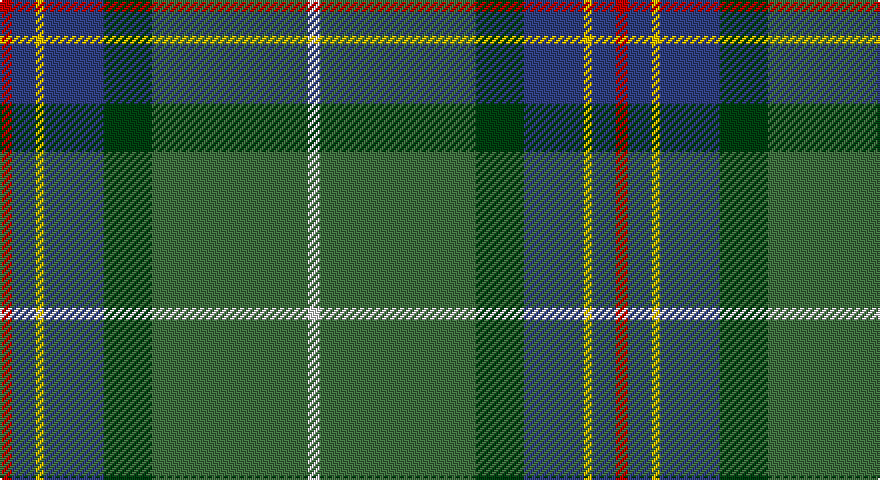

This page is one **sett** — a single exact thread-count. It belongs to the [tartan](/setts/r3db6ly2db15dg12g39w3/)
(the same proportion at any scale), whose colour order is pattern [RBYBGGW](/stripes/rbybggw/).

Part of the [Wagland](/tartans/wagland/) tartan — the named design grouping this sett with its other cloths.

Sourced from weddslist.  It is a [7 stripe tartan](/stripes/stripes7/).

Original link http://www.weddslist.com/cgi-bin/tartans/pg.pl?source=sts

## Thread count
R/6 B12 Y4 B30 DG24 G78 LN/6

One full sett is **308 threads**.

## Palette

Palette: <strong>Tartan Dictionary</strong> <small style="color:#888">(1 of 6 colours)</small>
<table><thead><tr><th>Colour</th><th>Threads</th><th>Shade</th><th>Base</th><th>OKLCh</th></tr></thead><tbody><tr><td>R/</td><td style="text-align:right;font-variant-numeric:tabular-nums">6</td><td><code style="background-color:#C00000;">#C00000</code> <small style="color:#888">#C00000</small></td><td>R <code style="background-color:#CC0000;">#CC0000</code></td><td><small style="color:#888">oklch(50.7% 0.208 29.2)</small></td></tr><tr><td>B</td><td style="text-align:right;font-variant-numeric:tabular-nums">12</td><td><code style="background-color:#304080;">#304080</code> <small style="color:#888">#304080</small></td><td>B <code style="background-color:#2A418A;">#2A418A</code></td><td><small style="color:#888">oklch(39.4% 0.109 270.2)</small></td></tr><tr><td>Y</td><td style="text-align:right;font-variant-numeric:tabular-nums">4</td><td><code style="background-color:#F0C000;">#F0C000</code> <small style="color:#888">#F0C000</small></td><td>Y <code style="background-color:#F2BF00;">#F2BF00</code></td><td><small style="color:#888">oklch(82.7% 0.169 90.5)</small></td></tr><tr><td>B</td><td style="text-align:right;font-variant-numeric:tabular-nums">30</td><td><code style="background-color:#304080;">#304080</code> <small style="color:#888">#304080</small></td><td>B <code style="background-color:#2A418A;">#2A418A</code></td><td><small style="color:#888">oklch(39.4% 0.109 270.2)</small></td></tr><tr><td>DG</td><td style="text-align:right;font-variant-numeric:tabular-nums">24</td><td><code style="background-color:#004010;">#004010</code> <small style="color:#888">#004010</small></td><td>G <code style="background-color:#006100;">#006100</code></td><td><small style="color:#888">oklch(32.3% 0.098 146.3)</small></td></tr><tr><td>G</td><td style="text-align:right;font-variant-numeric:tabular-nums">78</td><td><code style="background-color:#407040;">#407040</code> <small style="color:#888">#407040</small></td><td>G <code style="background-color:#006100;">#006100</code></td><td><small style="color:#888">oklch(49.8% 0.091 144.1)</small></td></tr><tr><td>LN/</td><td style="text-align:right;font-variant-numeric:tabular-nums">6</td><td><code style="background-color:#E0E0E0;">#E0E0E0</code> <small style="color:#888">#E0E0E0</small></td><td>W <code style="background-color:#F7F7F7;">#F7F7F7</code></td><td><small style="color:#888">oklch(90.7% 0.000 89.9)</small></td></tr></tbody></table>

# Sample pattern

## Compared to the master

This cloth is one sett of its design; the master sett (the exemplar the design is anchored on) is below for comparison.

<figure style="margin:0"><figcaption style="color:#888;font-size:smaller">this sett</figcaption></figure>
<figure style="margin:0"><figcaption style="color:#888;font-size:smaller"><a href="/setts/db6ly2db15g12dg39w3dg39g12db15ly2db6r3/">master sett →</a></figcaption></figure>

## Nearest tartans

The nearest existing variants by ΔTartan distance, with this tartan at the top so the swatches line up against it.

ΔTartan

Tartan

Sett

—

<a href="/ttd/edit/#slug=r3db6ly2db15dg12g39w3~x2">Wagland</a> <a class="nn-out" href="/variants/s7/r3db6ly2db15dg12g39w3~x2/" title="open its dictionary page">↗</a>

0.55

<a href="/ttd/edit/#slug=r3db6ly2db15g12dg39w3~x2&amp;base=r3db6ly2db15dg12g39w3~x2">Wagland (Name)</a> <a class="nn-out" href="/variants/s7/r3db6ly2db15g12dg39w3~x2/" title="open its dictionary page">↗</a>

0.88

<a href="/ttd/edit/#slug=r4g14k3m3g12n36w4~x2&amp;base=r3db6ly2db15dg12g39w3~x2">Vipont (White line)</a> <a class="nn-out" href="/variants/s7/r4g14k3m3g12n36w4~x2/" title="open its dictionary page">↗</a>

0.89

<a href="/ttd/edit/#slug=dt40r4dt10g10y22lo3y4ly3y4~x2&amp;base=r3db6ly2db15dg12g39w3~x2">Keith Stanhope Society (Commem.)</a> <a class="nn-out" href="/variants/s9/dt40r4dt10g10y22lo3y4ly3y4~x2/" title="open its dictionary page">↗</a>

0.91

<a href="/ttd/edit/#slug=db30r2db4w1o11g4ly2g22~x2&amp;base=r3db6ly2db15dg12g39w3~x2">Yorkland</a> <a class="nn-out" href="/variants/s8/db30r2db4w1o11g4ly2g22~x2/" title="open its dictionary page">↗</a>

1.11

<a href="/ttd/edit/#slug=r3y13db13ly2dg34w3~x2&amp;base=r3db6ly2db15dg12g39w3~x2">Glencross, Tynron (Name)</a> <a class="nn-out" href="/variants/s6/r3y13db13ly2dg34w3~x2/" title="open its dictionary page">↗</a>

1.22

<a href="/variants/s8/g22r3k1g2r3t16ki3ly2~x4/">Stirling, University of Corporate Univ Tartan</a>

1.23

<a href="/ttd/edit/#slug=r4db15w2n15g30r2g4~x2&amp;base=r3db6ly2db15dg12g39w3~x2">Sinclair Green (Personal)</a> <a class="nn-out" href="/variants/s7/r4db15w2n15g30r2g4~x2/" title="open its dictionary page">↗</a>

1.23

<a href="/ttd/edit/#slug=y2dg9ri16r2b30y3dg6lb1~x2&amp;base=r3db6ly2db15dg12g39w3~x2">The Climb (Fashion)</a> <a class="nn-out" href="/variants/s8/y2dg9ri16r2b30y3dg6lb1~x2/" title="open its dictionary page">↗</a>

1.24

<a href="/ttd/edit/#slug=g22r3w1g2r3t16k3ly2~x4&amp;base=r3db6ly2db15dg12g39w3~x2">Stirling University (Corporate)</a> <a class="nn-out" href="/variants/s8/g22r3w1g2r3t16k3ly2~x4/" title="open its dictionary page">↗</a>

1.27

<a href="/ttd/edit/#slug=lo9g18t9r1w1db1~x4&amp;base=r3db6ly2db15dg12g39w3~x2">T.H.E. C.O.G. USA (Corporate)</a> <a class="nn-out" href="/variants/s6/lo9g18t9r1w1db1~x4/" title="open its dictionary page">↗</a>

## Neighbour map

Every grey dot is one of 14360 variants placed by the first two principal components of the ΔTartan feature space (44% of its variance). Red is this tartan; blue dots are its nearest — click one to open its page.

<svg viewBox="0 0 640 380" role="img" style="max-width:100%;height:auto;border:1px solid #e0e0e0;border-radius:4px;display:block" xmlns="http://www.w3.org/2000/svg"><image href="/nn/cloud.v1.png" width="640" height="380"/><a href="/variants/s7/r3db6ly2db15g12dg39w3~x2/"><circle cx="271.6" cy="154.6" r="4" fill="#3465a4"><title>Wagland (Name)</title></circle></a><a href="/variants/s7/r4g14k3m3g12n36w4~x2/"><circle cx="255.4" cy="177.2" r="4" fill="#3465a4"><title>Vipont (White line)</title></circle></a><a href="/variants/s9/dt40r4dt10g10y22lo3y4ly3y4~x2/"><circle cx="278.3" cy="164.3" r="4" fill="#3465a4"><title>Keith Stanhope Society (Commem.)</title></circle></a><a href="/variants/s8/db30r2db4w1o11g4ly2g22~x2/"><circle cx="276.1" cy="130.8" r="4" fill="#3465a4"><title>Yorkland</title></circle></a><a href="/variants/s6/r3y13db13ly2dg34w3~x2/"><circle cx="259.2" cy="165.3" r="4" fill="#3465a4"><title>Glencross, Tynron (Name)</title></circle></a><a href="/variants/s8/g22r3k1g2r3t16ki3ly2~x4/"><circle cx="249.9" cy="125.0" r="4" fill="#3465a4"><title>Stirling, University of Corporate Univ Tartan</title></circle></a><a href="/variants/s7/r4db15w2n15g30r2g4~x2/"><circle cx="254.8" cy="183.5" r="4" fill="#3465a4"><title>Sinclair Green (Personal)</title></circle></a><a href="/variants/s8/y2dg9ri16r2b30y3dg6lb1~x2/"><circle cx="266.5" cy="128.0" r="4" fill="#3465a4"><title>The Climb (Fashion)</title></circle></a><a href="/variants/s8/g22r3w1g2r3t16k3ly2~x4/"><circle cx="249.9" cy="124.2" r="4" fill="#3465a4"><title>Stirling University (Corporate)</title></circle></a><a href="/variants/s6/lo9g18t9r1w1db1~x4/"><circle cx="268.5" cy="172.2" r="4" fill="#3465a4"><title>T.H.E. C.O.G. USA (Corporate)</title></circle></a><circle cx="281.3" cy="156.9" r="5" fill="#c00000"/></svg>

ID: /variants/s7/r3db6ly2db15dg12g39w3~x2/
