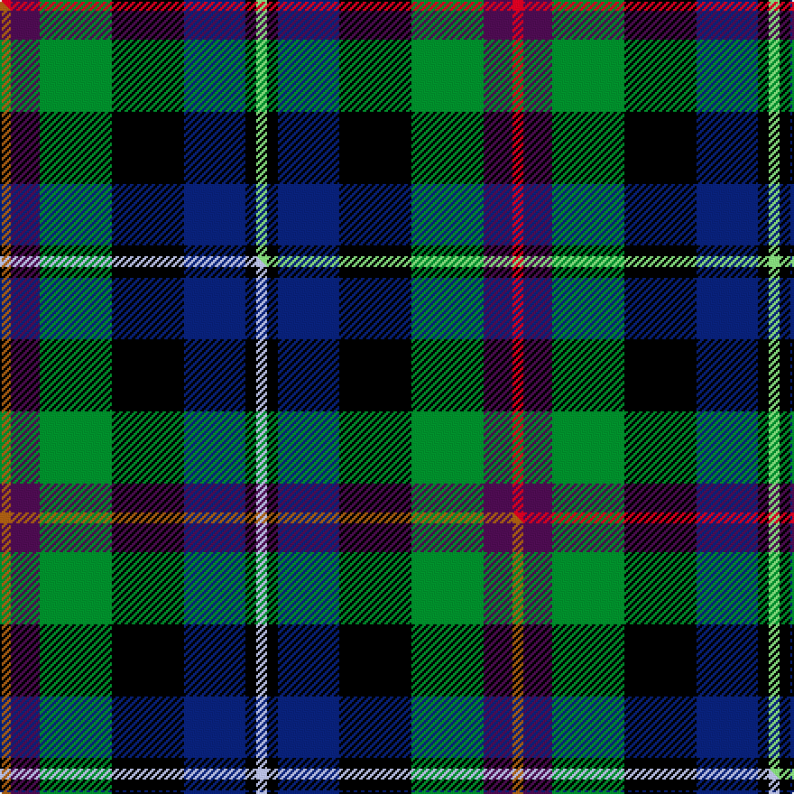

This page is one **sett** — a single exact thread-count. It belongs to the [tartan](/setts/r3dp8g20k20db17k3lg3/)
(the same proportion at any scale), whose colour order is pattern [RBGKBKY](/stripes/rbgkbky/).

Part of the [Gracey](/tartans/gracey/) tartan — the named design grouping this sett with its other cloths.

Sourced from tartans-authority.  It is a [7 stripe tartan](/stripes/stripes7/).

Original link http://www.tartansauthority.com/tartan-ferret/display/10874/

## Register references

External register numbers recorded for this tartan.

- Scottish Register of Tartans: [10874](https://www.tartanregister.gov.uk/tartanDetails?ref=10874)
- Scottish Tartans Authority (ITI): 10874

## Thread count
R/6 DP16 G40 K40 DB34 K6 LG/6

One full sett is **284 threads**.

## Palette
<table><thead><tr><th>Colour</th><th>Shade</th><th>OKLCh</th></tr></thead><tbody><tr><td>LG</td><td><code style="background-color:#82D67A;">#82D67A</code> <small style="color:#888">#82D67A</small></td><td><small style="color:#888">oklch(80.1% 0.150 142.2)</small></td></tr><tr><td>DB</td><td><code style="background-color:#082077;">#082077</code> <small style="color:#888">#082077</small></td><td><small style="color:#888">oklch(30.0% 0.149 265.1)</small></td></tr><tr><td>G</td><td><code style="background-color:#008B2A;">#008B2A</code> <small style="color:#888">#008B2A</small></td><td><small style="color:#888">oklch(55.4% 0.170 145.9)</small></td></tr><tr><td>K</td><td><code style="background-color:#000000;">#000000</code> <small style="color:#888">#000000</small></td><td><small style="color:#888">oklch(0.0% 0.000 0.0)</small></td></tr><tr><td>DP</td><td><code style="background-color:#4B0B4F;">#4B0B4F</code> <small style="color:#888">#4B0B4F</small></td><td><small style="color:#888">oklch(30.1% 0.125 325.4)</small></td></tr><tr><td>R</td><td><code style="background-color:#D60020;">#D60020</code> <small style="color:#888">#D60020</small></td><td><small style="color:#888">oklch(55.2% 0.224 25.5)</small></td></tr></tbody></table>

# Sample pattern

## Compared to the master

This cloth is one sett of its design; the master sett (the exemplar the design is anchored on) is below for comparison.

Its **ΔTartan distance** from the master is **0.12** — the same measure the nearest-tartans table ranks by (0 is identical; a re-scale of the same cloth is near 0, a recolour or a different proportion further).

<figure class="master-compare" style="margin:0">

this sett
master sett ★

<figcaption style="color:#888;font-size:smaller">One weave of this sett against the <a href="/setts/o3dp8g20k20db17k3lb3/">master sett ★</a>, split on the diagonal: a shared proportion runs seamlessly across it with only the shades shifting; a different proportion breaks on it.</figcaption>
</figure>

## Nearest tartan variants

The nearest existing variants by ΔTartan distance, with this cloth at the top so the swatches line up against it.

ΔTartan

Threads

Variant

Sett

—

284

<a href="/variants/s7/r3dp8g20k20db17k3lg3~x2/">Gracey (2013)</a>

<a href="/ttd/edit/#slug=o3dp8g20k20db17k3lb3~x2&amp;base=r3dp8g20k20db17k3lg3~x2" title="compare in the TTD">0.60</a>

284

<a href="/variants/s7/o3dp8g20k20db17k3lb3~x2/">Gracey (2013)</a>

<a href="/ttd/edit/#slug=dr1k1g6k6db6lr1~x4&amp;base=r3dp8g20k20db17k3lg3~x2" title="compare in the TTD">1.62</a>

160

<a href="/variants/s6/dr1k1g6k6db6lr1~x4/">Gaines Center for the Humanities</a>

<a href="/ttd/edit/#slug=y3k2g12k12db14w3~x2&amp;base=r3dp8g20k20db17k3lg3~x2" title="compare in the TTD">1.67</a>

172

<a href="/variants/s6/y3k2g12k12db14w3~x2/">MacNeil 6</a>

<a href="/ttd/edit/#slug=r2db8k8w1g8k1&amp;base=r3dp8g20k20db17k3lg3~x2" title="compare in the TTD">1.75</a>

53

<a href="/variants/s6/r2db8k8w1g8k1/">Leslie Hunting</a>

<a href="/ttd/edit/#slug=r2db8k8w1g8k1~x2&amp;base=r3dp8g20k20db17k3lg3~x2" title="compare in the TTD">1.75</a>

106

<a href="/variants/s6/r2db8k8w1g8k1~x2/">Leslie, hunting</a>

<a href="/ttd/edit/#slug=k4g16k14y3db16r4~x2&amp;base=r3dp8g20k20db17k3lg3~x2" title="compare in the TTD">1.77</a>

212

<a href="/variants/s6/k4g16k14y3db16r4~x2/">Birse</a>

<a href="/ttd/edit/#slug=r2b3n12k11dg11y2~x2~n2003284-dg1304144&amp;base=r3dp8g20k20db17k3lg3~x2" title="compare in the TTD">1.85</a>

156

<a href="/variants/s6/r2b3n12k11dg11y2~x2~n2003284-dg1304144/">Huntly Gordon</a>

<a href="/ttd/edit/#slug=r3g16w2k16db16k2db2~x2&amp;base=r3dp8g20k20db17k3lg3~x2" title="compare in the TTD">1.87</a>

218

<a href="/variants/s7/r3g16w2k16db16k2db2~x2/">Colquhoun Clan Tartan</a>

<a href="/ttd/edit/#slug=r2g8w1k8db8k1db1~x2&amp;base=r3dp8g20k20db17k3lg3~x2" title="compare in the TTD">1.88</a>

110

<a href="/variants/s7/r2g8w1k8db8k1db1~x2/">Colquhoun</a>

<a href="/ttd/edit/#slug=r2g8w1k8db8k1db1~x4&amp;base=r3dp8g20k20db17k3lg3~x2" title="compare in the TTD">1.88</a>

220

<a href="/variants/s7/r2g8w1k8db8k1db1~x4/">Colquhoun</a>

## Neighbour map

Every grey dot is one of 13620 variants placed by the first two principal components of the ΔTartan feature space (42% of its variance). Red is this tartan; blue dots are its nearest — click one to open its page.

<svg viewBox="0 0 640 380" role="img" style="max-width:100%;height:auto;border:1px solid #e0e0e0;border-radius:4px;display:block" xmlns="http://www.w3.org/2000/svg"><image href="/nn/cloud.v1.png" width="640" height="380"/><a href="/variants/s7/o3dp8g20k20db17k3lb3~x2/"><circle cx="66.5" cy="191.6" r="4" fill="#3465a4"><title>Gracey (2013)</title></circle></a><a href="/variants/s6/dr1k1g6k6db6lr1~x4/"><circle cx="99.9" cy="212.9" r="4" fill="#3465a4"><title>Gaines Center for the Humanities</title></circle></a><a href="/variants/s6/y3k2g12k12db14w3~x2/"><circle cx="76.9" cy="211.9" r="4" fill="#3465a4"><title>MacNeil 6</title></circle></a><a href="/variants/s6/r2db8k8w1g8k1/"><circle cx="95.6" cy="198.7" r="4" fill="#3465a4"><title>Leslie Hunting</title></circle></a><a href="/variants/s6/r2db8k8w1g8k1~x2/"><circle cx="95.6" cy="198.7" r="4" fill="#3465a4"><title>Leslie, hunting</title></circle></a><a href="/variants/s6/k4g16k14y3db16r4~x2/"><circle cx="78.8" cy="226.5" r="4" fill="#3465a4"><title>Birse</title></circle></a><a href="/variants/s6/r2b3n12k11dg11y2~x2~n2003284-dg1304144/"><circle cx="76.2" cy="210.9" r="4" fill="#3465a4"><title>Huntly Gordon</title></circle></a><a href="/variants/s7/r3g16w2k16db16k2db2~x2/"><circle cx="108.8" cy="186.3" r="4" fill="#3465a4"><title>Colquhoun Clan Tartan</title></circle></a><a href="/variants/s7/r2g8w1k8db8k1db1~x2/"><circle cx="102.7" cy="188.3" r="4" fill="#3465a4"><title>Colquhoun</title></circle></a><a href="/variants/s7/r2g8w1k8db8k1db1~x4/"><circle cx="102.7" cy="188.3" r="4" fill="#3465a4"><title>Colquhoun</title></circle></a><circle cx="64.7" cy="190.9" r="5" fill="#c00000"/><text x="320" y="376" text-anchor="middle" font-size="11" fill="#999">ground</text><text x="11" y="190" text-anchor="middle" font-size="11" fill="#999" transform="rotate(-90 11 190)">complexity</text></svg>

ID: /variants/s7/r3dp8g20k20db17k3lg3~x2/
