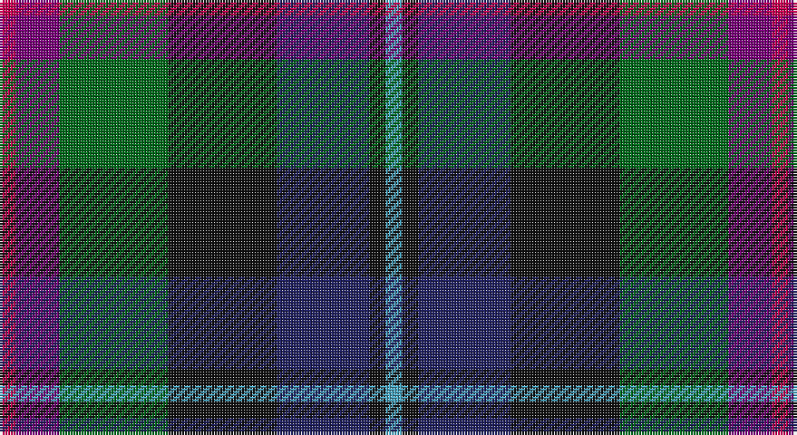

This page is one **sett** — a single exact thread-count. It belongs to the [tartan](/setts/r3dp8g20k20db17k3lg3/)
(the same proportion at any scale), whose colour order is pattern [RBGKBKY](/stripes/rbgkbky/).

Part of the [Gracey](/tartans/gracey/) tartan — the named design grouping this sett with its other cloths.

Sourced from tartans-authority.  It is a [7 stripe tartan](/stripes/stripes7/).

Original link http://www.tartansauthority.com/tartan-ferret/display/10874/

## Register references

External register numbers recorded for this tartan.

- Scottish Register of Tartans: [10874](https://www.tartanregister.gov.uk/tartanDetails?ref=10874)
- Scottish Tartans Authority (ITI): 10874

## Thread count
R/6 P16 G40 K40 DB34 K6 B/6

One full sett is **284 threads**.

## Palette

Palette: <strong>Tartan Register</strong> <small style="color:#888">(5 of 6 colours)</small>
<table><thead><tr><th>Colour</th><th>Threads</th><th>Shade</th><th>Base</th><th>OKLCh</th></tr></thead><tbody><tr><td>R/</td><td style="text-align:right;font-variant-numeric:tabular-nums">6</td><td><code style="background-color:#C80050;">#C80050</code> <small style="color:#888">#C80050</small></td><td>R <code style="background-color:#CC0000;">#CC0000</code></td><td><small style="color:#888">oklch(53.2% 0.213 9.9)</small></td></tr><tr><td>P</td><td style="text-align:right;font-variant-numeric:tabular-nums">16</td><td><code style="background-color:#780078;">#780078</code> <small style="color:#888">#780078</small></td><td>B <code style="background-color:#2A418A;">#2A418A</code></td><td><small style="color:#888">oklch(40.2% 0.185 328.4)</small></td></tr><tr><td>G</td><td style="text-align:right;font-variant-numeric:tabular-nums">40</td><td><code style="background-color:#006818;">#006818</code> <small style="color:#888">#006818</small></td><td>G <code style="background-color:#006100;">#006100</code></td><td><small style="color:#888">oklch(45.0% 0.142 145.0)</small></td></tr><tr><td>K</td><td style="text-align:right;font-variant-numeric:tabular-nums">40</td><td><code style="background-color:#101010;">#101010</code> <small style="color:#888">#101010</small></td><td>K <code style="background-color:#000000;">#000000</code></td><td><small style="color:#888">oklch(17.3% 0.000 89.9)</small></td></tr><tr><td>DB</td><td style="text-align:right;font-variant-numeric:tabular-nums">34</td><td><code style="background-color:#202060;">#202060</code> <small style="color:#888">#202060</small></td><td>B <code style="background-color:#2A418A;">#2A418A</code></td><td><small style="color:#888">oklch(28.9% 0.111 276.9)</small></td></tr><tr><td>K</td><td style="text-align:right;font-variant-numeric:tabular-nums">6</td><td><code style="background-color:#101010;">#101010</code> <small style="color:#888">#101010</small></td><td>K <code style="background-color:#000000;">#000000</code></td><td><small style="color:#888">oklch(17.3% 0.000 89.9)</small></td></tr><tr><td>B/</td><td style="text-align:right;font-variant-numeric:tabular-nums">6</td><td><code style="background-color:#48A4C0;">#48A4C0</code> <small style="color:#888">#48A4C0</small></td><td>Y <code style="background-color:#F2BF00;">#F2BF00</code></td><td><small style="color:#888">oklch(67.5% 0.096 221.0)</small></td></tr></tbody></table>

# Sample pattern

## Compared to the master

This cloth is one sett of its design; the master sett (the exemplar the design is anchored on) is below for comparison.

<figure style="margin:0"><figcaption style="color:#888;font-size:smaller">this sett</figcaption></figure>
<figure style="margin:0"><figcaption style="color:#888;font-size:smaller"><a href="/setts/t3k3db17k20g20dp8p3/">master sett →</a></figcaption></figure>

## Nearest tartans

The nearest existing variants by ΔTartan distance, with this tartan at the top so the swatches line up against it.

ΔTartan

Tartan

Sett

—

<a href="/ttd/edit/#slug=r3dp8g20k20db17k3lg3~x2">Gracey (2013)</a> <a class="nn-out" href="/variants/s7/r3dp8g20k20db17k3lg3~x2/" title="open its dictionary page">↗</a>

0.79

<a href="/ttd/edit/#slug=lb3db17do16dt2dg17lo2~x2&amp;base=r3dp8g20k20db17k3lg3~x2">Ancient Atlantic (Fashion)</a> <a class="nn-out" href="/variants/s6/lb3db17do16dt2dg17lo2~x2/" title="open its dictionary page">↗</a>

0.84

<a href="/ttd/edit/#slug=w3dbi17dy16db2dg17ly2~x2&amp;base=r3dp8g20k20db17k3lg3~x2">Atlantic Ancient Trade Tartan</a> <a class="nn-out" href="/variants/s6/w3dbi17dy16db2dg17ly2~x2/" title="open its dictionary page">↗</a>

0.99

<a href="/ttd/edit/#slug=dp11db2t4db21k16dg19ly4~x2&amp;base=r3dp8g20k20db17k3lg3~x2">Ayrshire (International Tartans)</a> <a class="nn-out" href="/variants/s7/dp11db2t4db21k16dg19ly4~x2/" title="open its dictionary page">↗</a>

1.00

<a href="/ttd/edit/#slug=r2k1db8k8g8k1t2~x2&amp;base=r3dp8g20k20db17k3lg3~x2">Argyll</a> <a class="nn-out" href="/variants/s7/r2k1db8k8g8k1t2~x2/" title="open its dictionary page">↗</a>

1.00

<a href="/ttd/edit/#slug=r2k1db8k8g8k1t2~x4&amp;base=r3dp8g20k20db17k3lg3~x2">Campbell of Cawdor</a> <a class="nn-out" href="/variants/s7/r2k1db8k8g8k1t2~x4/" title="open its dictionary page">↗</a>

1.02

<a href="/ttd/edit/#slug=r2k1db8k8g8k1y2~x2&amp;base=r3dp8g20k20db17k3lg3~x2">Campbell of Cawdor Clan Tartan</a> <a class="nn-out" href="/variants/s7/r2k1db8k8g8k1y2~x2/" title="open its dictionary page">↗</a>

1.03

<a href="/ttd/edit/#slug=r2k1db6k2g6m2~x4&amp;base=r3dp8g20k20db17k3lg3~x2">MacEachain (Clan)</a> <a class="nn-out" href="/variants/s6/r2k1db6k2g6m2~x4/" title="open its dictionary page">↗</a>

1.03

<a href="/ttd/edit/#slug=r4dg16k16db4dg3db12lo2~x2&amp;base=r3dp8g20k20db17k3lg3~x2">Junior Chamber International (Corp)</a> <a class="nn-out" href="/variants/s7/r4dg16k16db4dg3db12lo2~x2/" title="open its dictionary page">↗</a>

1.04

<a href="/ttd/edit/#slug=k6t2db12g8r5k2g3~x4&amp;base=r3dp8g20k20db17k3lg3~x2">Cooke (Personal)</a> <a class="nn-out" href="/variants/s7/k6t2db12g8r5k2g3~x4/" title="open its dictionary page">↗</a>

1.04

<a href="/ttd/edit/#slug=b8k25g13m5lo5r5m8~x2&amp;base=r3dp8g20k20db17k3lg3~x2">Bro-Menez Are (Corporate)</a> <a class="nn-out" href="/variants/s7/b8k25g13m5lo5r5m8~x2/" title="open its dictionary page">↗</a>

## Neighbour map

Every grey dot is one of 14360 variants placed by the first two principal components of the ΔTartan feature space (44% of its variance). Red is this tartan; blue dots are its nearest — click one to open its page.

<svg viewBox="0 0 640 380" role="img" style="max-width:100%;height:auto;border:1px solid #e0e0e0;border-radius:4px;display:block" xmlns="http://www.w3.org/2000/svg"><image href="/nn/cloud.v1.png" width="640" height="380"/><a href="/variants/s6/lb3db17do16dt2dg17lo2~x2/"><circle cx="143.4" cy="214.7" r="4" fill="#3465a4"><title>Ancient Atlantic (Fashion)</title></circle></a><a href="/variants/s6/w3dbi17dy16db2dg17ly2~x2/"><circle cx="132.5" cy="207.4" r="4" fill="#3465a4"><title>Atlantic Ancient Trade Tartan</title></circle></a><a href="/variants/s7/dp11db2t4db21k16dg19ly4~x2/"><circle cx="111.3" cy="203.1" r="4" fill="#3465a4"><title>Ayrshire (International Tartans)</title></circle></a><a href="/variants/s7/r2k1db8k8g8k1t2~x2/"><circle cx="151.0" cy="217.9" r="4" fill="#3465a4"><title>Argyll</title></circle></a><a href="/variants/s7/r2k1db8k8g8k1t2~x4/"><circle cx="151.0" cy="217.9" r="4" fill="#3465a4"><title>Campbell of Cawdor</title></circle></a><a href="/variants/s7/r2k1db8k8g8k1y2~x2/"><circle cx="149.5" cy="216.9" r="4" fill="#3465a4"><title>Campbell of Cawdor Clan Tartan</title></circle></a><a href="/variants/s6/r2k1db6k2g6m2~x4/"><circle cx="118.6" cy="242.0" r="4" fill="#3465a4"><title>MacEachain (Clan)</title></circle></a><a href="/variants/s7/r4dg16k16db4dg3db12lo2~x2/"><circle cx="161.7" cy="228.1" r="4" fill="#3465a4"><title>Junior Chamber International (Corp)</title></circle></a><a href="/variants/s7/k6t2db12g8r5k2g3~x4/"><circle cx="114.2" cy="236.5" r="4" fill="#3465a4"><title>Cooke (Personal)</title></circle></a><a href="/variants/s7/b8k25g13m5lo5r5m8~x2/"><circle cx="98.1" cy="213.9" r="4" fill="#3465a4"><title>Bro-Menez Are (Corporate)</title></circle></a><circle cx="111.4" cy="213.5" r="5" fill="#c00000"/></svg>

ID: /variants/s7/r3dp8g20k20db17k3lg3~x2/
