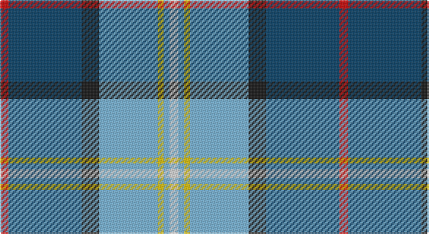

This page is one **sett** — a single exact thread-count. It belongs to the [tartan](/setts/r3dt25k6lb20ly2lb2w3/)
(the same proportion at any scale), whose colour order is pattern [RBKWYWW](/stripes/rbkwyww/).

Sourced from tartans-authority.  It is a [7 stripe tartan](/stripes/stripes7/).

Original link http://www.tartansauthority.com/tartan-ferret/display/7757/

2 attestations — the source records this cloth was collapsed from (oldest owns this page)

<ul>
<li>September 2008 — Madras College (Corporate) (tartans-authority, <a href="http://www.tartansauthority.com/tartan-ferret/display/7757/">record</a>)</li>
<li>undated — Madras College (register-of-tartans, <a href="https://www.tartanregister.gov.uk/tartanDetails.aspx?ref=5737">record</a>)</li>
</ul>

## Register references

External register numbers recorded for this tartan.

- Scottish Register of Tartans: [5737](https://www.tartanregister.gov.uk/tartanDetails.aspx?ref=5737)
- Scottish Tartans Authority (ITI): 7757
- Scottish Tartans World Register: 3259

## Thread count
R/6 DB50 K12 LB40 Y4 LB4 LN/6

One full sett is **232 threads**.

## Palette

Palette: <strong>Tartan Register</strong> <small style="color:#888">(5 of 6 colours)</small>
<table><thead><tr><th>Colour</th><th>Threads</th><th>Shade</th><th>Base</th><th>OKLCh</th></tr></thead><tbody><tr><td>R/</td><td style="text-align:right;font-variant-numeric:tabular-nums">6</td><td><code style="background-color:#C80000;">#C80000</code> <small style="color:#888">#C80000</small></td><td>R <code style="background-color:#CC0000;">#CC0000</code></td><td><small style="color:#888">oklch(52.3% 0.215 29.2)</small></td></tr><tr><td>DB</td><td style="text-align:right;font-variant-numeric:tabular-nums">50</td><td><code style="background-color:#003C64;">#003C64</code> <small style="color:#888">#003C64</small></td><td>B <code style="background-color:#2A418A;">#2A418A</code></td><td><small style="color:#888">oklch(34.5% 0.089 246.0)</small></td></tr><tr><td>K</td><td style="text-align:right;font-variant-numeric:tabular-nums">12</td><td><code style="background-color:#101010;">#101010</code> <small style="color:#888">#101010</small></td><td>K <code style="background-color:#000000;">#000000</code></td><td><small style="color:#888">oklch(17.3% 0.000 89.9)</small></td></tr><tr><td>LB</td><td style="text-align:right;font-variant-numeric:tabular-nums">40</td><td><code style="background-color:#74B4E0;">#74B4E0</code> <small style="color:#888">#74B4E0</small></td><td>W <code style="background-color:#F7F7F7;">#F7F7F7</code></td><td><small style="color:#888">oklch(74.4% 0.092 239.7)</small></td></tr><tr><td>Y</td><td style="text-align:right;font-variant-numeric:tabular-nums">4</td><td><code style="background-color:#E8C000;">#E8C000</code> <small style="color:#888">#E8C000</small></td><td>Y <code style="background-color:#F2BF00;">#F2BF00</code></td><td><small style="color:#888">oklch(81.9% 0.168 93.7)</small></td></tr><tr><td>LB</td><td style="text-align:right;font-variant-numeric:tabular-nums">4</td><td><code style="background-color:#74B4E0;">#74B4E0</code> <small style="color:#888">#74B4E0</small></td><td>W <code style="background-color:#F7F7F7;">#F7F7F7</code></td><td><small style="color:#888">oklch(74.4% 0.092 239.7)</small></td></tr><tr><td>LN/</td><td style="text-align:right;font-variant-numeric:tabular-nums">6</td><td><code style="background-color:#E0E0E0;">#E0E0E0</code> <small style="color:#888">#E0E0E0</small></td><td>W <code style="background-color:#F7F7F7;">#F7F7F7</code></td><td><small style="color:#888">oklch(90.7% 0.000 89.9)</small></td></tr></tbody></table>

# Sample pattern

## Nearest tartans

The nearest existing variants by ΔTartan distance, with this tartan at the top so the swatches line up against it.

ΔTartan

Tartan

Sett

—

<a href="/ttd/edit/#slug=r3dt25k6lb20ly2lb2w3~x2">Madras College (Corporate)</a> <a class="nn-out" href="/variants/s7/r3dt25k6lb20ly2lb2w3~x2/" title="open its dictionary page">↗</a>

0.94

<a href="/ttd/edit/#slug=t5ly5db12g1db1r1db1w2~x4&amp;base=r3dt25k6lb20ly2lb2w3~x2">Hodgkinson</a> <a class="nn-out" href="/variants/s8/t5ly5db12g1db1r1db1w2~x4/" title="open its dictionary page">↗</a>

0.96

<a href="/ttd/edit/#slug=db1t9w3ly3db9ly1g1r1~x4&amp;base=r3dt25k6lb20ly2lb2w3~x2">Curd (2013)</a> <a class="nn-out" href="/variants/s8/db1t9w3ly3db9ly1g1r1~x4/" title="open its dictionary page">↗</a>

0.98

<a href="/ttd/edit/#slug=lo4r2b32k10dp4lb21dp2~x2&amp;base=r3dt25k6lb20ly2lb2w3~x2">Dignan School of Dancing</a> <a class="nn-out" href="/variants/s7/lo4r2b32k10dp4lb21dp2~x2/" title="open its dictionary page">↗</a>

1.01

<a href="/ttd/edit/#slug=r2t2r2t21lg11k17lb2~x2&amp;base=r3dt25k6lb20ly2lb2w3~x2">Loch Ness (Fashion)</a> <a class="nn-out" href="/variants/s7/r2t2r2t21lg11k17lb2~x2/" title="open its dictionary page">↗</a>

1.02

<a href="/ttd/edit/#slug=t5ly5db12g1db1r1db1w2~x2&amp;base=r3dt25k6lb20ly2lb2w3~x2">Yorkshire, C.C.C.</a> <a class="nn-out" href="/variants/s8/t5ly5db12g1db1r1db1w2~x2/" title="open its dictionary page">↗</a>

1.03

<a href="/ttd/edit/#slug=t12k1t1k1t1db8w9y2~x4&amp;base=r3dt25k6lb20ly2lb2w3~x2">Arran (Pendleton)</a> <a class="nn-out" href="/variants/s8/t12k1t1k1t1db8w9y2~x4/" title="open its dictionary page">↗</a>

1.03

<a href="/ttd/edit/#slug=k16w6k4b64m19k8g42ly6&amp;base=r3dt25k6lb20ly2lb2w3~x2">Unidentified (Woven sample)</a> <a class="nn-out" href="/variants/s8/k16w6k4b64m19k8g42ly6/" title="open its dictionary page">↗</a>

1.03

<a href="/ttd/edit/#slug=dp4k2w3k2db30g9k4w20ly3~x2&amp;base=r3dt25k6lb20ly2lb2w3~x2">Minnesota Dress</a> <a class="nn-out" href="/variants/s9/dp4k2w3k2db30g9k4w20ly3~x2/" title="open its dictionary page">↗</a>

1.08

<a href="/ttd/edit/#slug=db4w3db17lb10k1dp5k1lb6dg3~x2&amp;base=r3dt25k6lb20ly2lb2w3~x2">Queen Margaret University</a> <a class="nn-out" href="/variants/s9/db4w3db17lb10k1dp5k1lb6dg3~x2/" title="open its dictionary page">↗</a>

1.08

<a href="/ttd/edit/#slug=r3lr25dbi6db3r2t5db18w3~x2&amp;base=r3dt25k6lb20ly2lb2w3~x2">Fulbright Foundation</a> <a class="nn-out" href="/variants/s8/r3lr25dbi6db3r2t5db18w3~x2/" title="open its dictionary page">↗</a>

## Neighbour map

Every grey dot is one of 14360 variants placed by the first two principal components of the ΔTartan feature space (44% of its variance). Red is this tartan; blue dots are its nearest — click one to open its page.

<svg viewBox="0 0 640 380" role="img" style="max-width:100%;height:auto;border:1px solid #e0e0e0;border-radius:4px;display:block" xmlns="http://www.w3.org/2000/svg"><image href="/nn/cloud.v1.png" width="640" height="380"/><a href="/variants/s8/t5ly5db12g1db1r1db1w2~x4/"><circle cx="202.5" cy="132.5" r="4" fill="#3465a4"><title>Hodgkinson</title></circle></a><a href="/variants/s8/db1t9w3ly3db9ly1g1r1~x4/"><circle cx="108.8" cy="144.5" r="4" fill="#3465a4"><title>Curd (2013)</title></circle></a><a href="/variants/s7/lo4r2b32k10dp4lb21dp2~x2/"><circle cx="177.7" cy="129.2" r="4" fill="#3465a4"><title>Dignan School of Dancing</title></circle></a><a href="/variants/s7/r2t2r2t21lg11k17lb2~x2/"><circle cx="169.2" cy="171.4" r="4" fill="#3465a4"><title>Loch Ness (Fashion)</title></circle></a><a href="/variants/s8/t5ly5db12g1db1r1db1w2~x2/"><circle cx="210.0" cy="136.0" r="4" fill="#3465a4"><title>Yorkshire, C.C.C.</title></circle></a><a href="/variants/s8/t12k1t1k1t1db8w9y2~x4/"><circle cx="157.8" cy="148.9" r="4" fill="#3465a4"><title>Arran (Pendleton)</title></circle></a><a href="/variants/s8/k16w6k4b64m19k8g42ly6/"><circle cx="161.5" cy="136.3" r="4" fill="#3465a4"><title>Unidentified (Woven sample)</title></circle></a><a href="/variants/s9/dp4k2w3k2db30g9k4w20ly3~x2/"><circle cx="142.1" cy="106.5" r="4" fill="#3465a4"><title>Minnesota Dress</title></circle></a><a href="/variants/s9/db4w3db17lb10k1dp5k1lb6dg3~x2/"><circle cx="169.2" cy="128.3" r="4" fill="#3465a4"><title>Queen Margaret University</title></circle></a><a href="/variants/s8/r3lr25dbi6db3r2t5db18w3~x2/"><circle cx="152.7" cy="134.4" r="4" fill="#3465a4"><title>Fulbright Foundation</title></circle></a><circle cx="171.5" cy="140.8" r="5" fill="#c00000"/></svg>

ID: /variants/s7/r3dt25k6lb20ly2lb2w3~x2/
