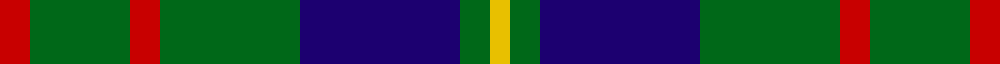
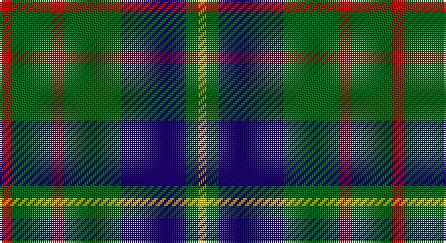

This page is one **sett** — a single exact thread-count. It belongs to the [tartan](/setts/r3g10r3g14db16g3ly2/)
(the same proportion at any scale), whose colour order is pattern [RGRGBGY](/stripes/rgrgbgy/).

Part of the [Cameron Hunting](/tartans/cameron-hunting/) tartan — the named design grouping this sett with its other cloths.

Sourced from register-of-tartans.  It is a [7 stripe tartan](/stripes/stripes7/).

Original link https://www.tartanregister.gov.uk/tartanDetails.aspx?ref=501

## Provenance

Earliest known date: 1956 A document written in Latin of 1689 descibes the Cameron men from Lochaber as being clad in blue and yellow when they followed their great Chief, Sir Ewan Cameron, to battle and victory at Killiecrankie. This new design was evolved in the 1940s by J G MacKay of Portree and first put on show at the Cameron Gathering at Achnacarry in 1956. The original Cameron first appeared in the Vestiarium Scoticum (1842).

## Also known as

This cloth is also recorded under:

- Cameron Hunting Brown
- Cameron of Locheil Htg
- Cameron of Lochiel
- Cameron, hunting

4 attestations — the source records this cloth was collapsed from (oldest owns this page)

<ul>
<li>01/01/1940 — Cameron of Lochiel (Hunting) (register-of-tartans, <a href="https://www.tartanregister.gov.uk/tartanDetails.aspx?ref=501">record</a>)</li>
<li>1956 — Cameron of Locheil Htg (1952) (Clan) (tartans-authority, <a href="http://www.tartansauthority.com/tartan-ferret/display/1535/">record</a>)</li>
<li>undated — Cameron, hunting (weddslist, <a href="http://www.weddslist.com/cgi-bin/tartans/pg.pl?source=sts">record</a>)</li>
<li>undated — Cameron Hunting Clan Tartan (house-of-tartan, <a href="http://www.house-of-tartan.scotland.net/house/TartanViewjs.asp?colr=Def&tnam=1535">record</a>)</li>
</ul>

## Register references

External register numbers recorded for this tartan.

- Scottish Register of Tartans: [501](https://www.tartanregister.gov.uk/tartanDetails.aspx?ref=501)
- Scottish Tartans Authority (ITI): 1535
- Scottish Tartans World Register: 1535

## Thread count
R/6 G20 R6 G28 DB32 G6 Y/4

One full sett is **194 threads**.

## Palette

Palette: <strong>Tartan Register</strong>
<table><thead><tr><th>Colour</th><th>Threads</th><th>Shade</th><th>Base</th><th>OKLCh</th></tr></thead><tbody><tr><td>R/</td><td style="text-align:right;font-variant-numeric:tabular-nums">6</td><td><code style="background-color:#C80000;">#C80000</code> <small style="color:#888">#C80000</small></td><td>R <code style="background-color:#CC0000;">#CC0000</code></td><td><small style="color:#888">oklch(52.3% 0.215 29.2)</small></td></tr><tr><td>G</td><td style="text-align:right;font-variant-numeric:tabular-nums">20</td><td><code style="background-color:#006818;">#006818</code> <small style="color:#888">#006818</small></td><td>G <code style="background-color:#006100;">#006100</code></td><td><small style="color:#888">oklch(45.0% 0.142 145.0)</small></td></tr><tr><td>R</td><td style="text-align:right;font-variant-numeric:tabular-nums">6</td><td><code style="background-color:#C80000;">#C80000</code> <small style="color:#888">#C80000</small></td><td>R <code style="background-color:#CC0000;">#CC0000</code></td><td><small style="color:#888">oklch(52.3% 0.215 29.2)</small></td></tr><tr><td>G</td><td style="text-align:right;font-variant-numeric:tabular-nums">28</td><td><code style="background-color:#006818;">#006818</code> <small style="color:#888">#006818</small></td><td>G <code style="background-color:#006100;">#006100</code></td><td><small style="color:#888">oklch(45.0% 0.142 145.0)</small></td></tr><tr><td>DB</td><td style="text-align:right;font-variant-numeric:tabular-nums">32</td><td><code style="background-color:#1C0070;">#1C0070</code> <small style="color:#888">#1C0070</small></td><td>B <code style="background-color:#2A418A;">#2A418A</code></td><td><small style="color:#888">oklch(26.3% 0.162 277.1)</small></td></tr><tr><td>G</td><td style="text-align:right;font-variant-numeric:tabular-nums">6</td><td><code style="background-color:#006818;">#006818</code> <small style="color:#888">#006818</small></td><td>G <code style="background-color:#006100;">#006100</code></td><td><small style="color:#888">oklch(45.0% 0.142 145.0)</small></td></tr><tr><td>Y/</td><td style="text-align:right;font-variant-numeric:tabular-nums">4</td><td><code style="background-color:#E8C000;">#E8C000</code> <small style="color:#888">#E8C000</small></td><td>Y <code style="background-color:#F2BF00;">#F2BF00</code></td><td><small style="color:#888">oklch(81.9% 0.168 93.7)</small></td></tr></tbody></table>

# Sample pattern

## Compared to the master

This cloth is one sett of its design; the master sett (the exemplar the design is anchored on) is below for comparison.

<figure style="margin:0"><figcaption style="color:#888;font-size:smaller">this sett</figcaption></figure>
<figure style="margin:0"><figcaption style="color:#888;font-size:smaller"><a href="/setts/do15r5do30b32do4lo3/">master sett →</a></figcaption></figure>

## Nearest tartans

The nearest existing variants by ΔTartan distance, with this tartan at the top so the swatches line up against it.

ΔTartan

Tartan

Sett

—

<a href="/ttd/edit/#slug=r3g10r3g14db16g3ly2~x2">Cameron of Lochiel (Hunting)</a> <a class="nn-out" href="/variants/s7/r3g10r3g14db16g3ly2~x2/" title="open its dictionary page">↗</a>

0.49

<a href="/ttd/edit/#slug=r3dg10r3dg14db16dg3ly2&amp;base=r3g10r3g14db16g3ly2~x2">Cameron Hunting</a> <a class="nn-out" href="/variants/s7/r3dg10r3dg14db16dg3ly2/" title="open its dictionary page">↗</a>

0.86

<a href="/ttd/edit/#slug=g4db12r3db12g32w4~x2&amp;base=r3g10r3g14db16g3ly2~x2">MacIntyre Hunting (VS)</a> <a class="nn-out" href="/variants/s6/g4db12r3db12g32w4~x2/" title="open its dictionary page">↗</a>

0.86

<a href="/ttd/edit/#slug=db8r4db24g35lb4g8&amp;base=r3g10r3g14db16g3ly2~x2">Heritage Tartan, The</a> <a class="nn-out" href="/variants/s6/db8r4db24g35lb4g8/" title="open its dictionary page">↗</a>

0.87

<a href="/ttd/edit/#slug=r5g20r5g20db24g6ly4&amp;base=r3g10r3g14db16g3ly2~x2">Cameron of Lochiel (Hunting) Clan/Family Tartan</a> <a class="nn-out" href="/variants/s7/r5g20r5g20db24g6ly4/" title="open its dictionary page">↗</a>

0.98

<a href="/ttd/edit/#slug=g3db1g8db7k3ly1~x2&amp;base=r3g10r3g14db16g3ly2~x2">Trafalgar (Fashion)</a> <a class="nn-out" href="/variants/s6/g3db1g8db7k3ly1~x2/" title="open its dictionary page">↗</a>

1.01

<a href="/ttd/edit/#slug=k3b4g20k20g3lo3~x4&amp;base=r3g10r3g14db16g3ly2~x2">Michaluk (Personal)</a> <a class="nn-out" href="/variants/s6/k3b4g20k20g3lo3~x4/" title="open its dictionary page">↗</a>

1.06

<a href="/ttd/edit/#slug=r3dg10r3dg14db16dg3ly2~x2&amp;base=r3g10r3g14db16g3ly2~x2">Cameron Hunting</a> <a class="nn-out" href="/variants/s7/r3dg10r3dg14db16dg3ly2~x2/" title="open its dictionary page">↗</a>

1.07

<a href="/ttd/edit/#slug=r1g8k8r1k8t8r1~x4&amp;base=r3g10r3g14db16g3ly2~x2">Triad Highland Games Proposed</a> <a class="nn-out" href="/variants/s7/r1g8k8r1k8t8r1~x4/" title="open its dictionary page">↗</a>

1.12

<a href="/ttd/edit/#slug=dg4db12r3db12dg32lb4&amp;base=r3g10r3g14db16g3ly2~x2">MacIntyre L</a> <a class="nn-out" href="/variants/s6/dg4db12r3db12dg32lb4/" title="open its dictionary page">↗</a>

1.12

<a href="/ttd/edit/#slug=r5db25w5db3dg25db3~x2&amp;base=r3g10r3g14db16g3ly2~x2">Thayer USA</a> <a class="nn-out" href="/variants/s6/r5db25w5db3dg25db3~x2/" title="open its dictionary page">↗</a>

## Neighbour map

Every grey dot is one of 14360 variants placed by the first two principal components of the ΔTartan feature space (44% of its variance). Red is this tartan; blue dots are its nearest — click one to open its page.

<svg viewBox="0 0 640 380" role="img" style="max-width:100%;height:auto;border:1px solid #e0e0e0;border-radius:4px;display:block" xmlns="http://www.w3.org/2000/svg"><image href="/nn/cloud.v1.png" width="640" height="380"/><a href="/variants/s7/r3dg10r3dg14db16dg3ly2/"><circle cx="263.4" cy="230.7" r="4" fill="#3465a4"><title>Cameron Hunting</title></circle></a><a href="/variants/s6/g4db12r3db12g32w4~x2/"><circle cx="294.7" cy="211.8" r="4" fill="#3465a4"><title>MacIntyre Hunting (VS)</title></circle></a><a href="/variants/s6/db8r4db24g35lb4g8/"><circle cx="284.6" cy="229.3" r="4" fill="#3465a4"><title>Heritage Tartan, The</title></circle></a><a href="/variants/s7/r5g20r5g20db24g6ly4/"><circle cx="263.7" cy="248.8" r="4" fill="#3465a4"><title>Cameron of Lochiel (Hunting) Clan/Family Tartan</title></circle></a><a href="/variants/s6/g3db1g8db7k3ly1~x2/"><circle cx="248.7" cy="248.4" r="4" fill="#3465a4"><title>Trafalgar (Fashion)</title></circle></a><a href="/variants/s6/k3b4g20k20g3lo3~x4/"><circle cx="233.7" cy="228.3" r="4" fill="#3465a4"><title>Michaluk (Personal)</title></circle></a><a href="/variants/s7/r3dg10r3dg14db16dg3ly2~x2/"><circle cx="285.2" cy="242.4" r="4" fill="#3465a4"><title>Cameron Hunting</title></circle></a><a href="/variants/s7/r1g8k8r1k8t8r1~x4/"><circle cx="194.7" cy="226.6" r="4" fill="#3465a4"><title>Triad Highland Games Proposed</title></circle></a><a href="/variants/s6/dg4db12r3db12dg32lb4/"><circle cx="301.0" cy="219.4" r="4" fill="#3465a4"><title>MacIntyre L</title></circle></a><a href="/variants/s6/r5db25w5db3dg25db3~x2/"><circle cx="250.0" cy="216.6" r="4" fill="#3465a4"><title>Thayer USA</title></circle></a><circle cx="259.6" cy="225.9" r="5" fill="#c00000"/></svg>

ID: /variants/s7/r3g10r3g14db16g3ly2~x2/
