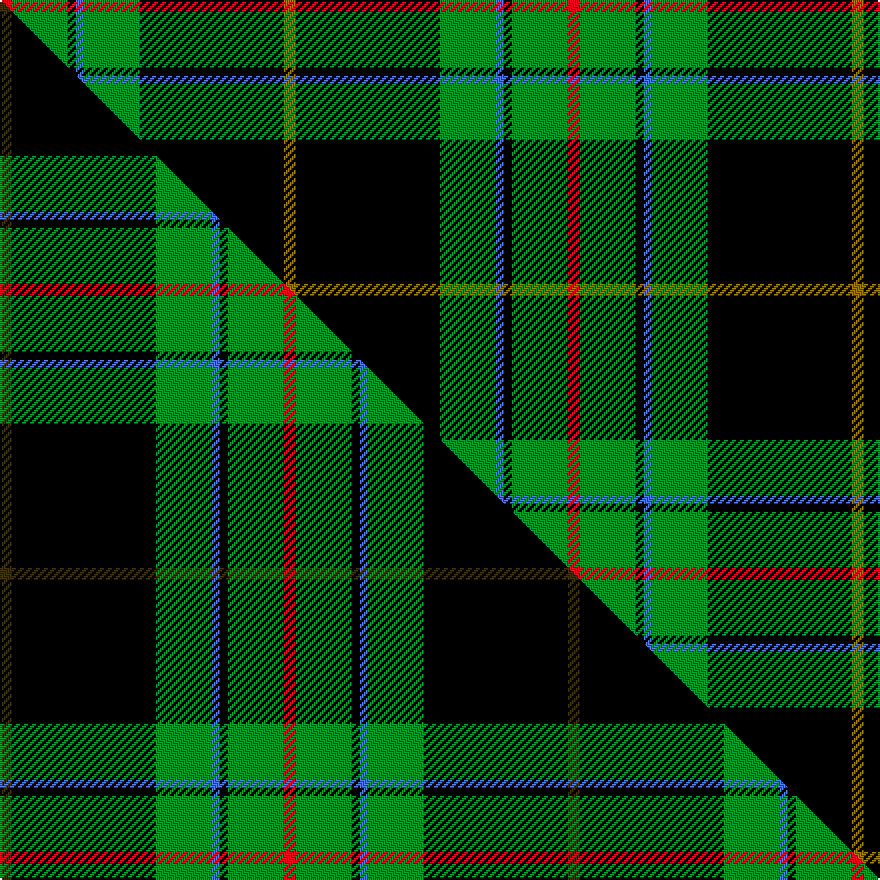

This page is one **sett** — a single exact thread-count. It belongs to the [tartan](/setts/r3g14k2b2g14k36y3/)
(the same proportion at any scale), whose colour order is pattern [GKGBKGR](/stripes/gkgbkgr/).

Part of the [Vipont](/tartans/vipont/) tartan — the named design grouping this sett with its other cloths.

Sourced from weddslist.  It is a [7 stripe tartan](/stripes/stripes7/).

Original link http://www.weddslist.com/cgi-bin/tartans/pg.pl?source=sts

## Thread count
R/6 G28 K4 B4 G28 K72 Y/6

One full sett is **284 threads**.

## Palette
<table><thead><tr><th>Colour</th><th>Shade</th><th>OKLCh</th></tr></thead><tbody><tr><td>G</td><td><code style="background-color:#008B2A;">#008B2A</code> <small style="color:#888">#008B2A</small></td><td><small style="color:#888">oklch(55.4% 0.170 145.9)</small></td></tr><tr><td>K</td><td><code style="background-color:#000000;">#000000</code> <small style="color:#888">#000000</small></td><td><small style="color:#888">oklch(0.0% 0.000 0.0)</small></td></tr><tr><td>B</td><td><code style="background-color:#466CC8;">#466CC8</code> <small style="color:#888">#466CC8</small></td><td><small style="color:#888">oklch(55.1% 0.149 265.0)</small></td></tr><tr><td>R</td><td><code style="background-color:#D60020;">#D60020</code> <small style="color:#888">#D60020</small></td><td><small style="color:#888">oklch(55.2% 0.224 25.5)</small></td></tr><tr><td>Y</td><td><code style="background-color:#8B6E00;">#8B6E00</code> <small style="color:#888">#8B6E00</small></td><td><small style="color:#888">oklch(55.1% 0.113 90.4)</small></td></tr></tbody></table>

# Sample pattern

## Compared to the master

This cloth is one sett of its design; the master sett (the exemplar the design is anchored on) is below for comparison.

Its **ΔTartan distance** from the master is **0.10** — the same measure the nearest-tartans table ranks by (0 is identical; a re-scale of the same cloth is near 0, a recolour or a different proportion further).

<figure class="master-compare" style="margin:0">

this sett
master sett ★

<figcaption style="color:#888;font-size:smaller">One weave of this sett against the <a href="/setts/dy3k36g14b2k2g14r3/">master sett ★</a>, split on the diagonal: a shared proportion runs seamlessly across it with only the shades shifting; a different proportion breaks on it.</figcaption>
</figure>

## Nearest variants

The nearest existing variants by ΔTartan distance, with this cloth at the top so the swatches line up against it.

ΔTartan

Threads

Variant

Sett

—

284

<a href="/variants/s7/r3g14k2b2g14k36y3~x2/">Vipont</a>

<a href="/ttd/edit/#slug=dy3k36g14b2k2g14r3~x2&amp;base=r3g14k2b2g14k36y3~x2" title="compare in the TTD">0.00</a>

284

<a href="/variants/s7/dy3k36g14b2k2g14r3~x2/">Vipont (Yellow line)</a>

<a href="/ttd/edit/#slug=r3g30k12g6k16y2~x2&amp;base=r3g14k2b2g14k36y3~x2" title="compare in the TTD">1.09</a>

266

<a href="/variants/s6/r3g30k12g6k16y2~x2/">MacArthur (Variant)</a>

<a href="/ttd/edit/#slug=dr3g30k12g1k16lo2~x2&amp;base=r3g14k2b2g14k36y3~x2" title="compare in the TTD">1.33</a>

246

<a href="/variants/s6/dr3g30k12g1k16lo2~x2/">MacArthur-Fox Htg (Personal)</a>

<a href="/ttd/edit/#slug=k2r1y1g8k15g2dp1~x2&amp;base=r3g14k2b2g14k36y3~x2" title="compare in the TTD">1.90</a>

114

<a href="/variants/s7/k2r1y1g8k15g2dp1~x2/">Coalfields Regeneration Trust, The</a>

1.90

—

<a href="/variants/s7/k2r1ly1y8k15y2dp1~x4~ly3307090-y2602166/">Coalfields Regeneration Trust, The</a>

<a href="/ttd/edit/#slug=g28r3k28db8lb1g8r2k3~x2&amp;base=r3g14k2b2g14k36y3~x2" title="compare in the TTD">2.01</a>

262

<a href="/variants/s8/g28r3k28db8lb1g8r2k3~x2/">Stansbury (2014)</a>

<a href="/ttd/edit/#slug=dr4g4k1w2k1g18k32r4~x2&amp;base=r3g14k2b2g14k36y3~x2" title="compare in the TTD">2.15</a>

248

<a href="/variants/s8/dr4g4k1w2k1g18k32r4~x2/">Hot Boontjie</a>

<a href="/ttd/edit/#slug=k6db4g44k41w4~x2&amp;base=r3g14k2b2g14k36y3~x2" title="compare in the TTD">2.15</a>

376

<a href="/variants/s5/k6db4g44k41w4~x2/">Douglas (alternative threadcount)</a>

<a href="/ttd/edit/#slug=g3dr1k14g14lo1~x4&amp;base=r3g14k2b2g14k36y3~x2" title="compare in the TTD">2.27</a>

248

<a href="/variants/s5/g3dr1k14g14lo1~x4/">Wcwm 1255</a>

<a href="/ttd/edit/#slug=y4k1dg16k16r1w3~x2&amp;base=r3g14k2b2g14k36y3~x2" title="compare in the TTD">2.32</a>

150

<a href="/variants/s6/y4k1dg16k16r1w3~x2/">MacLamroc</a>

## Neighbour map

Every grey dot is one of 13620 variants placed by the first two principal components of the ΔTartan feature space (42% of its variance). Red is this tartan; blue dots are its nearest — click one to open its page.

<svg viewBox="0 0 640 380" role="img" style="max-width:100%;height:auto;border:1px solid #e0e0e0;border-radius:4px;display:block" xmlns="http://www.w3.org/2000/svg"><image href="/nn/cloud.v1.png" width="640" height="380"/><a href="/variants/s7/dy3k36g14b2k2g14r3~x2/"><circle cx="245.4" cy="130.0" r="4" fill="#3465a4"><title>Vipont (Yellow line)</title></circle></a><a href="/variants/s6/r3g30k12g6k16y2~x2/"><circle cx="253.9" cy="177.0" r="4" fill="#3465a4"><title>MacArthur (Variant)</title></circle></a><a href="/variants/s6/dr3g30k12g1k16lo2~x2/"><circle cx="268.0" cy="141.8" r="4" fill="#3465a4"><title>MacArthur-Fox Htg (Personal)</title></circle></a><a href="/variants/s7/k2r1y1g8k15g2dp1~x2/"><circle cx="266.0" cy="128.6" r="4" fill="#3465a4"><title>Coalfields Regeneration Trust, The</title></circle></a><a href="/variants/s7/k2r1ly1y8k15y2dp1~x4~ly3307090-y2602166/"><circle cx="262.1" cy="124.3" r="4" fill="#3465a4"><title>Coalfields Regeneration Trust, The</title></circle></a><a href="/variants/s8/g28r3k28db8lb1g8r2k3~x2/"><circle cx="210.9" cy="112.6" r="4" fill="#3465a4"><title>Stansbury (2014)</title></circle></a><a href="/variants/s8/dr4g4k1w2k1g18k32r4~x2/"><circle cx="253.7" cy="89.3" r="4" fill="#3465a4"><title>Hot Boontjie</title></circle></a><a href="/variants/s5/k6db4g44k41w4~x2/"><circle cx="233.3" cy="187.4" r="4" fill="#3465a4"><title>Douglas (alternative threadcount)</title></circle></a><a href="/variants/s5/g3dr1k14g14lo1~x4/"><circle cx="263.4" cy="181.1" r="4" fill="#3465a4"><title>Wcwm 1255</title></circle></a><a href="/variants/s6/y4k1dg16k16r1w3~x2/"><circle cx="189.7" cy="150.6" r="4" fill="#3465a4"><title>MacLamroc</title></circle></a><circle cx="243.8" cy="129.7" r="5" fill="#c00000"/><text x="320" y="376" text-anchor="middle" font-size="11" fill="#999">ground</text><text x="11" y="190" text-anchor="middle" font-size="11" fill="#999" transform="rotate(-90 11 190)">complexity</text></svg>

ID: /variants/s7/r3g14k2b2g14k36y3~x2/
