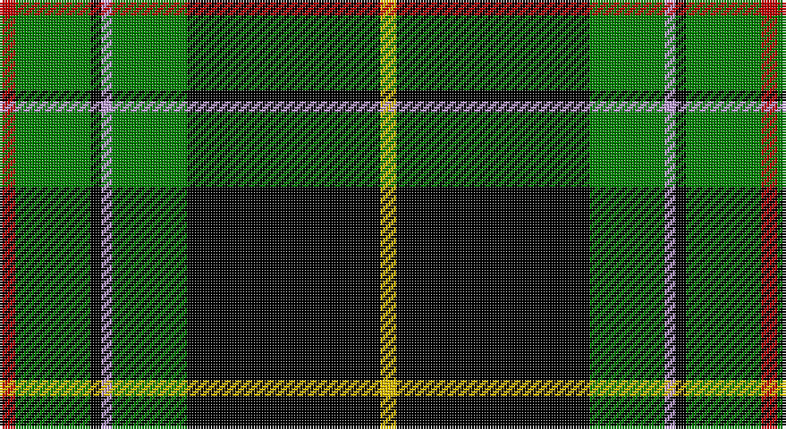

This page is one **sett** — a single exact thread-count. It belongs to the [tartan](/setts/r3g14k2lp2g14k36ly3/)
(the same proportion at any scale), whose colour order is pattern [RGKWGKY](/stripes/rgkwgky/).

Part of the [Vipont](/tartans/vipont/) tartan — the named design grouping this sett with its other cloths.

Sourced from weddslist.  It is a [7 stripe tartan](/stripes/stripes7/).

Original link http://www.weddslist.com/cgi-bin/tartans/pg.pl?source=sts

## Thread count
R/6 G28 K4 LP4 G28 K72 Y/6

One full sett is **284 threads**.

## Palette

Palette: <strong>Ingles Buchan</strong> <small style="color:#888">(1 of 5 colours)</small>
<table><thead><tr><th>Colour</th><th>Threads</th><th>Shade</th><th>Base</th><th>OKLCh</th></tr></thead><tbody><tr><td>R/</td><td style="text-align:right;font-variant-numeric:tabular-nums">6</td><td><code style="background-color:#C00000;">#C00000</code> <small style="color:#888">#C00000</small></td><td>R <code style="background-color:#CC0000;">#CC0000</code></td><td><small style="color:#888">oklch(50.7% 0.208 29.2)</small></td></tr><tr><td>G</td><td style="text-align:right;font-variant-numeric:tabular-nums">28</td><td><code style="background-color:#008000;">#008000</code> <small style="color:#888">#008000</small></td><td>G <code style="background-color:#006100;">#006100</code></td><td><small style="color:#888">oklch(52.0% 0.177 142.5)</small></td></tr><tr><td>K</td><td style="text-align:right;font-variant-numeric:tabular-nums">4</td><td><code style="background-color:#000000;">#000000</code> <small style="color:#888">#000000</small></td><td>K <code style="background-color:#000000;">#000000</code></td><td><small style="color:#888">oklch(0.0% 0.000 0.0)</small></td></tr><tr><td>LP</td><td style="text-align:right;font-variant-numeric:tabular-nums">4</td><td><code style="background-color:#C0A0E0;">#C0A0E0</code> <small style="color:#888">#C0A0E0</small></td><td>W <code style="background-color:#F7F7F7;">#F7F7F7</code></td><td><small style="color:#888">oklch(75.7% 0.096 307.0)</small></td></tr><tr><td>G</td><td style="text-align:right;font-variant-numeric:tabular-nums">28</td><td><code style="background-color:#008000;">#008000</code> <small style="color:#888">#008000</small></td><td>G <code style="background-color:#006100;">#006100</code></td><td><small style="color:#888">oklch(52.0% 0.177 142.5)</small></td></tr><tr><td>K</td><td style="text-align:right;font-variant-numeric:tabular-nums">72</td><td><code style="background-color:#000000;">#000000</code> <small style="color:#888">#000000</small></td><td>K <code style="background-color:#000000;">#000000</code></td><td><small style="color:#888">oklch(0.0% 0.000 0.0)</small></td></tr><tr><td>Y/</td><td style="text-align:right;font-variant-numeric:tabular-nums">6</td><td><code style="background-color:#F0C000;">#F0C000</code> <small style="color:#888">#F0C000</small></td><td>Y <code style="background-color:#F2BF00;">#F2BF00</code></td><td><small style="color:#888">oklch(82.7% 0.169 90.5)</small></td></tr></tbody></table>

# Sample pattern

## Compared to the master

This cloth is one sett of its design; the master sett (the exemplar the design is anchored on) is below for comparison.

<figure style="margin:0"><figcaption style="color:#888;font-size:smaller">this sett</figcaption></figure>
<figure style="margin:0"><figcaption style="color:#888;font-size:smaller"><a href="/setts/r3g14k2p2g14k36ly3/">master sett →</a></figcaption></figure>

## Nearest tartans

The nearest existing variants by ΔTartan distance, with this tartan at the top so the swatches line up against it.

ΔTartan

Tartan

Sett

—

<a href="/ttd/edit/#slug=r3g14k2lp2g14k36ly3~x2">Vipont</a> <a class="nn-out" href="/variants/s7/r3g14k2lp2g14k36ly3~x2/" title="open its dictionary page">↗</a>

1.35

<a href="/ttd/edit/#slug=r3g14k2p2g14k36ly3~x2&amp;base=r3g14k2lp2g14k36ly3~x2">Vipont (Yellow line)</a> <a class="nn-out" href="/variants/s7/r3g14k2p2g14k36ly3~x2/" title="open its dictionary page">↗</a>

1.35

<a href="/ttd/edit/#slug=g8r3g30k8w3k36w8~x2&amp;base=r3g14k2lp2g14k36ly3~x2">Cleghorn (Personal)</a> <a class="nn-out" href="/variants/s7/g8r3g30k8w3k36w8~x2/" title="open its dictionary page">↗</a>

1.40

<a href="/variants/s7/ly3dg24ki11dg3k10dg3w2~x2/">Cornish Brewery, Green</a>

1.46

<a href="/ttd/edit/#slug=lb4dg30k1dg1k1dg3k12db10r3&amp;base=r3g14k2lp2g14k36ly3~x2">MacDonnald of ye Ylis</a> <a class="nn-out" href="/variants/s9/lb4dg30k1dg1k1dg3k12db10r3/" title="open its dictionary page">↗</a>

1.47

<a href="/ttd/edit/#slug=r1dg16k8dg3k4ly1&amp;base=r3g14k2lp2g14k36ly3~x2">Forbes VS</a> <a class="nn-out" href="/variants/s6/r1dg16k8dg3k4ly1/" title="open its dictionary page">↗</a>

1.50

<a href="/ttd/edit/#slug=dr3dg32k4dg4k11db3k7dr4w3&amp;base=r3g14k2lp2g14k36ly3~x2">Derick Wardrope (Portobello) (Personal)</a> <a class="nn-out" href="/variants/s9/dr3dg32k4dg4k11db3k7dr4w3/" title="open its dictionary page">↗</a>

1.50

<a href="/ttd/edit/#slug=ly1k6dg4k1dg16db1dg4db6lb1~x2&amp;base=r3g14k2lp2g14k36ly3~x2">Henderson</a> <a class="nn-out" href="/variants/s9/ly1k6dg4k1dg16db1dg4db6lb1~x2/" title="open its dictionary page">↗</a>

1.50

<a href="/ttd/edit/#slug=k12r1g14w1g14k14r1db8k2~x2&amp;base=r3g14k2lp2g14k36ly3~x2">Abercrombie</a> <a class="nn-out" href="/variants/s9/k12r1g14w1g14k14r1db8k2~x2/" title="open its dictionary page">↗</a>

1.53

<a href="/ttd/edit/#slug=k37g27w2k4r6k4w2g27k37ly2~x2&amp;base=r3g14k2lp2g14k36ly3~x2">Highlands of Durham #2</a> <a class="nn-out" href="/variants/s10/k37g27w2k4r6k4w2g27k37ly2~x2/" title="open its dictionary page">↗</a>

1.54

<a href="/ttd/edit/#slug=k60g64gi5g8gi5g64k60ly8k8ly8&amp;base=r3g14k2lp2g14k36ly3~x2">Sin-Cos</a> <a class="nn-out" href="/variants/s10/k60g64gi5g8gi5g64k60ly8k8ly8/" title="open its dictionary page">↗</a>

## Neighbour map

Every grey dot is one of 14360 variants placed by the first two principal components of the ΔTartan feature space (44% of its variance). Red is this tartan; blue dots are its nearest — click one to open its page.

<svg viewBox="0 0 640 380" role="img" style="max-width:100%;height:auto;border:1px solid #e0e0e0;border-radius:4px;display:block" xmlns="http://www.w3.org/2000/svg"><image href="/nn/cloud.v1.png" width="640" height="380"/><a href="/variants/s7/r3g14k2p2g14k36ly3~x2/"><circle cx="303.4" cy="161.5" r="4" fill="#3465a4"><title>Vipont (Yellow line)</title></circle></a><a href="/variants/s7/g8r3g30k8w3k36w8~x2/"><circle cx="222.7" cy="185.7" r="4" fill="#3465a4"><title>Cleghorn (Personal)</title></circle></a><a href="/variants/s7/ly3dg24ki11dg3k10dg3w2~x2/"><circle cx="254.9" cy="187.7" r="4" fill="#3465a4"><title>Cornish Brewery, Green</title></circle></a><a href="/variants/s9/lb4dg30k1dg1k1dg3k12db10r3/"><circle cx="290.0" cy="119.2" r="4" fill="#3465a4"><title>MacDonnald of ye Ylis</title></circle></a><a href="/variants/s6/r1dg16k8dg3k4ly1/"><circle cx="340.1" cy="199.1" r="4" fill="#3465a4"><title>Forbes VS</title></circle></a><a href="/variants/s9/dr3dg32k4dg4k11db3k7dr4w3/"><circle cx="257.2" cy="167.8" r="4" fill="#3465a4"><title>Derick Wardrope (Portobello) (Personal)</title></circle></a><a href="/variants/s9/ly1k6dg4k1dg16db1dg4db6lb1~x2/"><circle cx="314.2" cy="163.7" r="4" fill="#3465a4"><title>Henderson</title></circle></a><a href="/variants/s9/k12r1g14w1g14k14r1db8k2~x2/"><circle cx="187.8" cy="172.2" r="4" fill="#3465a4"><title>Abercrombie</title></circle></a><a href="/variants/s10/k37g27w2k4r6k4w2g27k37ly2~x2/"><circle cx="312.0" cy="154.2" r="4" fill="#3465a4"><title>Highlands of Durham #2</title></circle></a><a href="/variants/s10/k60g64gi5g8gi5g64k60ly8k8ly8/"><circle cx="238.3" cy="171.2" r="4" fill="#3465a4"><title>Sin-Cos</title></circle></a><circle cx="269.5" cy="148.8" r="5" fill="#c00000"/></svg>

ID: /variants/s7/r3g14k2lp2g14k36ly3~x2/
