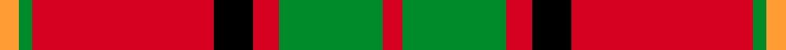

This is one **variant** — a specific cloth: this exact thread count and colourway, with its own
provenance below. It is one weaving of the [sett](/setts/r3g16r4k6r28g2lo3/) (the scale-free proportion — the
same cloth at any scale or shade), whose colour order is pattern [RGRKRGY](/stripes/rgrkrgy/).

Sourced from tartans-authority.  It is a [7 stripe tartan](/stripes/stripes7/).

Original link [https://www.tartanregister.gov.uk/tartanDetails.aspx?ref=3465](https://www.tartanregister.gov.uk/tartanDetails.aspx?ref=3465)

2 attestations — the source records this cloth was collapsed from (oldest owns this page)

<ul>
<li>2000 — McInally (Name) (tartans-authority, <a href="https://www.tartanregister.gov.uk/tartanDetails.aspx?ref=3465">record</a>)  <em>Designed by Dr. Phil Smith & Bruce N. McInally of the US who is happy for it to be used by all of this name. A forebear called McInally moved from Scotland to Ulster around 1760 and then emigrated to Grand Island, Quebec. Bruce McInally lives in Waterford, Michigan. Family insist on the spelling McInally. Woven by D.C. Dalgliesh. Threadcount when initially submitted in 2000 was DR/6 DG32 DR8 K12 DR48 DG4 Y/6.</em></li>
<li>undated — McInally (register-of-tartans, <a href="https://www.tartanregister.gov.uk/tartanDetails.aspx?ref=5154">record</a>)  <em>Designed by Dr. Phil Smith & Bruce N. McInally of the US who is happy for it to be used by all of this name. A forebear called McInally moved from Scotland to Ulster around 1760 and then emigrated to Grand Island, Quebec. Bruce McInally lives in Waterford, Michigan. Family insist on the spelling McInally. Woven by D.C. Dalgliesh. Threadcount when initially submitted in 2000 was DR/6 DG32 DR8 K12 DR48 DG4 Y/6. Colours changed by Phil Smith in August 2006 when the tartan was 'officially' recorded.</em></li>
</ul>

Dataset <small>— provenance for this record, inherited from the source manifest</small>

<dl class="dataset-prov">
<dt>source</dt><dd><a href="/sources/tartans-authority/">Scottish Tartans Authority</a></dd>
<dt>data captured from</dt><dd><a href="https://github.com/thetartan/tartan-database/blob/master/data/tartans-authority/data.csv">https://github.com/thetartan/tartan-database/blob/master/data/tartans-authority/data.csv</a></dd>
<dt>data date</dt><dd>2000 <small>(this record)</small></dd>
<dt>licence</dt><dd><a href="https://creativecommons.org/licenses/by-nc-nd/4.0/">CC BY-NC-ND 4.0</a></dd>
</dl>

Capture chain <small>— the hands this data passed through, oldest first; each capture carries its own licence</small>

<ol class="capture-chain">
<li><a href="https://www.tartansauthority.com/">Scottish Tartans Authority</a> <small>the heritage body's archive — its tartan-ferret record browser is retired (links repaired to the SRT, above)</small></li>
<li><a href="https://github.com/thetartan/tartan-database">thetartan/tartan-database</a> <small>2016-2017</small> · <a href="https://creativecommons.org/licenses/by-nc-nd/4.0/">CC BY-NC-ND 4.0</a> <small>Levko Kravets's frozen compilation — the capture we vendored, and where its CC licence text came from</small></li>
<li>this dictionary <small>captured 2026-06-10 · commit 5bf86c7566</small> <small>each re-capture is a git commit to data/sources</small></li>
</ol>

## Register references

External register numbers recorded for this tartan.

- Scottish Register of Tartans: [5154](https://www.tartanregister.gov.uk/tartanDetails.aspx?ref=5154)
- Scottish Tartans Authority (ITI): 3465

## Thread count
LO/6 G4 R56 K12 R8 G32 R/6

One full sett is **236 threads**.

## Palette
<table><thead><tr><th>Colour</th><th>Shade</th><th>OKLCh</th></tr></thead><tbody><tr><td>LO</td><td><code style="background-color:#FF9C34;">#FF9C34</code> <small style="color:#888">#FF9C34</small></td><td><small style="color:#888">oklch(77.9% 0.161 61.8)</small></td></tr><tr><td>G</td><td><code style="background-color:#008B2A;">#008B2A</code> <small style="color:#888">#008B2A</small></td><td><small style="color:#888">oklch(55.4% 0.170 145.9)</small></td></tr><tr><td>K</td><td><code style="background-color:#000000;">#000000</code> <small style="color:#888">#000000</small></td><td><small style="color:#888">oklch(0.0% 0.000 0.0)</small></td></tr><tr><td>R</td><td><code style="background-color:#D60020;">#D60020</code> <small style="color:#888">#D60020</small></td><td><small style="color:#888">oklch(55.2% 0.224 25.5)</small></td></tr></tbody></table>

# Sample pattern

## Nearest tartan variants

The nearest existing variants by ΔTartan distance, with this cloth at the top so the swatches line up against it.

ΔTartan

Threads

Variant

Sett

—

236

<a href="/variants/s7/r3g16r4k6r28g2lo3~x2/">McInally (Name)</a>

<a href="/ttd/edit/#slug=k1r18g12r2g12r18w1~x2&amp;base=r3g16r4k6r28g2lo3~x2" title="compare in the TTD">1.22</a>

252

<a href="/variants/s7/k1r18g12r2g12r18w1~x2/">MacKinnon #4</a>

<a href="/ttd/edit/#slug=r6g21k8r28g1r4~x2&amp;base=r3g16r4k6r28g2lo3~x2" title="compare in the TTD">1.25</a>

252

<a href="/variants/s6/r6g21k8r28g1r4~x2/">Dunbar</a>

<a href="/ttd/edit/#slug=r3g16r4k6r28g1r3~x2&amp;base=r3g16r4k6r28g2lo3~x2" title="compare in the TTD">1.66</a>

232

<a href="/variants/s7/r3g16r4k6r28g1r3~x2/">Maxwell</a>

<a href="/ttd/edit/#slug=r4g14r5k6r24g2r4~x2&amp;base=r3g16r4k6r28g2lo3~x2" title="compare in the TTD">1.67</a>

220

<a href="/variants/s7/r4g14r5k6r24g2r4~x2/">Auld Lang Syne (red) Tartan</a>

<a href="/ttd/edit/#slug=r35g16r5g5w2k3~x2&amp;base=r3g16r4k6r28g2lo3~x2" title="compare in the TTD">1.82</a>

188

<a href="/variants/s6/r35g16r5g5w2k3~x2/">MacGregor</a>

<a href="/ttd/edit/#slug=r60k2w3dg20r10dg20~x2&amp;base=r3g16r4k6r28g2lo3~x2" title="compare in the TTD">1.88</a>

300

<a href="/variants/s6/r60k2w3dg20r10dg20~x2/">Greig (Personal)</a>

<a href="/ttd/edit/#slug=k2r16g6r3g8w1~x4&amp;base=r3g16r4k6r28g2lo3~x2" title="compare in the TTD">2.02</a>

276

<a href="/variants/s6/k2r16g6r3g8w1~x4/">MacAulay (Clan)</a>

<a href="/ttd/edit/#slug=k2r16g6r3g8w1&amp;base=r3g16r4k6r28g2lo3~x2" title="compare in the TTD">2.02</a>

69

<a href="/variants/s6/k2r16g6r3g8w1/">MacAulay</a>

<a href="/ttd/edit/#slug=k2r16g6r3g8w1~x2&amp;base=r3g16r4k6r28g2lo3~x2" title="compare in the TTD">2.02</a>

138

<a href="/variants/s6/k2r16g6r3g8w1~x2/">MacAulay Tartan</a>

<a href="/ttd/edit/#slug=k2r16g6r3g8lb1~x2&amp;base=r3g16r4k6r28g2lo3~x2" title="compare in the TTD">2.02</a>

138

<a href="/variants/s6/k2r16g6r3g8lb1~x2/">MacAulay</a>

## Neighbour map

Every grey dot is one of 13621 variants placed by the first two principal components of the ΔTartan feature space (42% of its variance). Red is this tartan; blue dots are its nearest — click one to open its page.

<svg viewBox="0 0 640 380" role="img" style="max-width:100%;height:auto;border:1px solid #e0e0e0;border-radius:4px;display:block" xmlns="http://www.w3.org/2000/svg"><image href="/nn/cloud.v1.png" width="640" height="380"/><a href="/variants/s7/k1r18g12r2g12r18w1~x2/"><circle cx="352.1" cy="172.7" r="4" fill="#3465a4"><title>MacKinnon #4</title></circle></a><a href="/variants/s6/r6g21k8r28g1r4~x2/"><circle cx="326.8" cy="158.7" r="4" fill="#3465a4"><title>Dunbar</title></circle></a><a href="/variants/s7/r3g16r4k6r28g1r3~x2/"><circle cx="376.1" cy="137.3" r="4" fill="#3465a4"><title>Maxwell</title></circle></a><a href="/variants/s7/r4g14r5k6r24g2r4~x2/"><circle cx="340.7" cy="181.6" r="4" fill="#3465a4"><title>Auld Lang Syne (red) Tartan</title></circle></a><a href="/variants/s6/r35g16r5g5w2k3~x2/"><circle cx="351.7" cy="150.4" r="4" fill="#3465a4"><title>MacGregor</title></circle></a><a href="/variants/s6/r60k2w3dg20r10dg20~x2/"><circle cx="380.1" cy="131.7" r="4" fill="#3465a4"><title>Greig (Personal)</title></circle></a><a href="/variants/s6/k2r16g6r3g8w1~x4/"><circle cx="292.5" cy="173.1" r="4" fill="#3465a4"><title>MacAulay (Clan)</title></circle></a><a href="/variants/s6/k2r16g6r3g8w1/"><circle cx="292.5" cy="173.1" r="4" fill="#3465a4"><title>MacAulay</title></circle></a><a href="/variants/s6/k2r16g6r3g8w1~x2/"><circle cx="292.5" cy="173.1" r="4" fill="#3465a4"><title>MacAulay Tartan</title></circle></a><a href="/variants/s6/k2r16g6r3g8lb1~x2/"><circle cx="297.3" cy="174.6" r="4" fill="#3465a4"><title>MacAulay</title></circle></a><circle cx="295.7" cy="153.3" r="5" fill="#c00000"/><text x="320" y="376" text-anchor="middle" font-size="11" fill="#999">ground</text><text x="11" y="190" text-anchor="middle" font-size="11" fill="#999" transform="rotate(-90 11 190)">complexity</text></svg>

ID: /variants/s7/r3g16r4k6r28g2lo3~x2/
