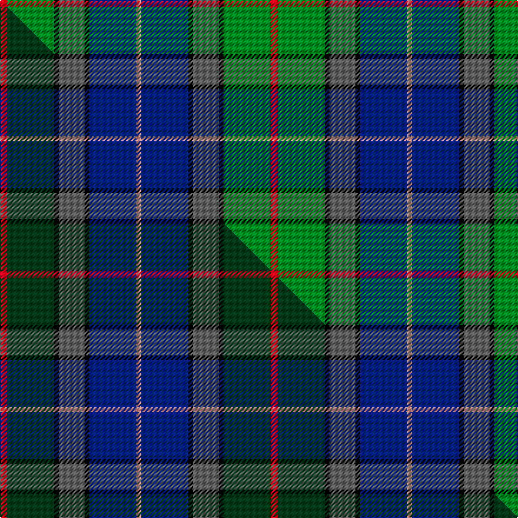

This page is one **sett** — a single exact thread-count. It belongs to the [tartan](/setts/r3g20k2n11k2db20lr2/)
(the same proportion at any scale), whose colour order is pattern [RGKBKBY](/stripes/rgkbkby/).

Part of the [Grandfather Mountain Games](/tartans/grandfather-mountain-games/) tartan — the named design grouping this sett with its other cloths.

Sourced from house-of-tartan.  It is a [7 stripe tartan](/stripes/stripes7/).

Original link http://www.house-of-tartan.scotland.net/house/TartanViewjs.asp?colr=Def&tnam=2198

## Provenance

Earliest known date: 1993 Designed by Marjorie Warren, Lake Junaluska, NC, in 1993. The following is an explanation of colours used in designing the tartan. Blue: for the saltire-St Andrews flag. White: for the diagonal cross in the saltire flag. Green: for MacRae meadows where the games take place. Grey: for the granite of Grandfather Mtn that overlooks the games and from which the games derives its name. Black: for the rock formation that is found in the granite of Grandfather Mtn. Red: for the "Fire on the Mountain" ceremony on the Thursday calling the clans together for the week-end's games. The copyright was donated to Grandfather Mtn. Highland Games Inc. who officially adopted the tartan 8 July 1993, endorsed by the Board of Scottish Heritage USA, Inc. , sponsors on 10 July 1993.

## Thread count
R/6 G40 K4 N22 K4 DB40 LR/4

One full sett is **230 threads**.

## Palette
<table><thead><tr><th>Colour</th><th>Shade</th><th>OKLCh</th></tr></thead><tbody><tr><td>DB</td><td><code style="background-color:#082077;">#082077</code> <small style="color:#888">#082077</small></td><td><small style="color:#888">oklch(30.0% 0.149 265.1)</small></td></tr><tr><td>G</td><td><code style="background-color:#008B2A;">#008B2A</code> <small style="color:#888">#008B2A</small></td><td><small style="color:#888">oklch(55.4% 0.170 145.9)</small></td></tr><tr><td>K</td><td><code style="background-color:#000000;">#000000</code> <small style="color:#888">#000000</small></td><td><small style="color:#888">oklch(0.0% 0.000 0.0)</small></td></tr><tr><td>LR</td><td><code style="background-color:#FF9C97;">#FF9C97</code> <small style="color:#888">#FF9C97</small></td><td><small style="color:#888">oklch(79.3% 0.119 23.2)</small></td></tr><tr><td>N</td><td><code style="background-color:#636363;">#636363</code> <small style="color:#888">#636363</small></td><td><small style="color:#888">oklch(50.0% 0.000 89.9)</small></td></tr><tr><td>R</td><td><code style="background-color:#D60020;">#D60020</code> <small style="color:#888">#D60020</small></td><td><small style="color:#888">oklch(55.2% 0.224 25.5)</small></td></tr></tbody></table>

# Sample pattern

## Compared to the master

This cloth is one sett of its design; the master sett (the exemplar the design is anchored on) is below for comparison.

Its **ΔTartan distance** from the master is **1.33** — the same measure the nearest-tartans table ranks by (0 is identical; a re-scale of the same cloth is near 0, a recolour or a different proportion further).

<figure class="master-compare" style="margin:0">

this sett
master sett ★

<figcaption style="color:#888;font-size:smaller">One weave of this sett against the <a href="/setts/r3dg20k2n11k2db20lr2/">master sett ★</a>, split on the diagonal: a shared proportion runs seamlessly across it with only the shades shifting; a different proportion breaks on it.</figcaption>
</figure>

## Nearest variants

The nearest existing variants by ΔTartan distance, with this cloth at the top so the swatches line up against it.

ΔTartan

Threads

Variant

Sett

—

230

<a href="/variants/s7/r3g20k2n11k2db20lr2~x2/">Grandfather Mountain Games American Corporate Tartan</a>

<a href="/ttd/edit/#slug=r3dg20k2n11k2db20lr2~x2&amp;base=r3g20k2n11k2db20lr2~x2" title="compare in the TTD">0.00</a>

230

<a href="/variants/s7/r3dg20k2n11k2db20lr2~x2/">Grandfather Mountain Games (District</a>

<a href="/ttd/edit/#slug=k6r3g30ly10db30w3~x2&amp;base=r3g20k2n11k2db20lr2~x2" title="compare in the TTD">1.57</a>

310

<a href="/variants/s6/k6r3g30ly10db30w3~x2/">Turnbull of Thornton (Personal)</a>

<a href="/ttd/edit/#slug=w2db20r3k10g20lo2~x2&amp;base=r3g20k2n11k2db20lr2~x2" title="compare in the TTD">2.00</a>

220

<a href="/variants/s6/w2db20r3k10g20lo2~x2/">Morris of Eddergoll (Personal)</a>

<a href="/ttd/edit/#slug=k6w3k2db30r9k4g20dy3~x2&amp;base=r3g20k2n11k2db20lr2~x2" title="compare in the TTD">2.22</a>

290

<a href="/variants/s8/k6w3k2db30r9k4g20dy3~x2/">Minnesota (District)</a>

<a href="/ttd/edit/#slug=w3b22r3k22g22y2~x2&amp;base=r3g20k2n11k2db20lr2~x2" title="compare in the TTD">2.24</a>

286

<a href="/variants/s6/w3b22r3k22g22y2~x2/">Morris of Balgonie</a>

<a href="/ttd/edit/#slug=r2k6y1dg12y1db6lr2~x4~db1305279-lr3200000&amp;base=r3g20k2n11k2db20lr2~x2" title="compare in the TTD">2.29</a>

224

<a href="/variants/s7/r2k6y1dg12y1db6lr2~x4~db1305279-lr3200000/">James (Personal)</a>

<a href="/ttd/edit/#slug=db20r2g9w6y4k2g8~x2&amp;base=r3g20k2n11k2db20lr2~x2" title="compare in the TTD">2.37</a>

148

<a href="/variants/s7/db20r2g9w6y4k2g8~x2/">Crofters (Personal)</a>

<a href="/ttd/edit/#slug=k1y1db8g10lb7w1~x2&amp;base=r3g20k2n11k2db20lr2~x2" title="compare in the TTD">2.41</a>

108

<a href="/variants/s6/k1y1db8g10lb7w1~x2/">Porteous</a>

<a href="/ttd/edit/#slug=k3ri3g21r8ri3r4k3db26w3~x2~ri2008029-r1707016&amp;base=r3g20k2n11k2db20lr2~x2" title="compare in the TTD">2.45</a>

284

<a href="/variants/s9/k3ri3g21r8ri3r4k3db26w3~x2~ri2008029-r1707016/">Dunedin</a>

<a href="/ttd/edit/#slug=k3y3db20g25lb18w3~x2&amp;base=r3g20k2n11k2db20lr2~x2" title="compare in the TTD">2.47</a>

276

<a href="/variants/s6/k3y3db20g25lb18w3~x2/">Porteous</a>

## Neighbour map

Every grey dot is one of 13620 variants placed by the first two principal components of the ΔTartan feature space (42% of its variance). Red is this tartan; blue dots are its nearest — click one to open its page.

<svg viewBox="0 0 640 380" role="img" style="max-width:100%;height:auto;border:1px solid #e0e0e0;border-radius:4px;display:block" xmlns="http://www.w3.org/2000/svg"><image href="/nn/cloud.v1.png" width="640" height="380"/><a href="/variants/s7/r3dg20k2n11k2db20lr2~x2/"><circle cx="169.2" cy="178.1" r="4" fill="#3465a4"><title>Grandfather Mountain Games (District</title></circle></a><a href="/variants/s6/k6r3g30ly10db30w3~x2/"><circle cx="120.1" cy="168.4" r="4" fill="#3465a4"><title>Turnbull of Thornton (Personal)</title></circle></a><a href="/variants/s6/w2db20r3k10g20lo2~x2/"><circle cx="109.7" cy="169.2" r="4" fill="#3465a4"><title>Morris of Eddergoll (Personal)</title></circle></a><a href="/variants/s8/k6w3k2db30r9k4g20dy3~x2/"><circle cx="134.4" cy="129.2" r="4" fill="#3465a4"><title>Minnesota (District)</title></circle></a><a href="/variants/s6/w3b22r3k22g22y2~x2/"><circle cx="81.9" cy="168.9" r="4" fill="#3465a4"><title>Morris of Balgonie</title></circle></a><a href="/variants/s7/r2k6y1dg12y1db6lr2~x4~db1305279-lr3200000/"><circle cx="148.1" cy="157.7" r="4" fill="#3465a4"><title>James (Personal)</title></circle></a><a href="/variants/s7/db20r2g9w6y4k2g8~x2/"><circle cx="123.6" cy="170.2" r="4" fill="#3465a4"><title>Crofters (Personal)</title></circle></a><a href="/variants/s6/k1y1db8g10lb7w1~x2/"><circle cx="118.6" cy="178.9" r="4" fill="#3465a4"><title>Porteous</title></circle></a><a href="/variants/s9/k3ri3g21r8ri3r4k3db26w3~x2~ri2008029-r1707016/"><circle cx="110.0" cy="144.4" r="4" fill="#3465a4"><title>Dunedin</title></circle></a><a href="/variants/s6/k3y3db20g25lb18w3~x2/"><circle cx="102.4" cy="188.7" r="4" fill="#3465a4"><title>Porteous</title></circle></a><circle cx="133.8" cy="169.4" r="5" fill="#c00000"/><text x="320" y="376" text-anchor="middle" font-size="11" fill="#999">ground</text><text x="11" y="190" text-anchor="middle" font-size="11" fill="#999" transform="rotate(-90 11 190)">complexity</text></svg>

ID: /variants/s7/r3g20k2n11k2db20lr2~x2/
