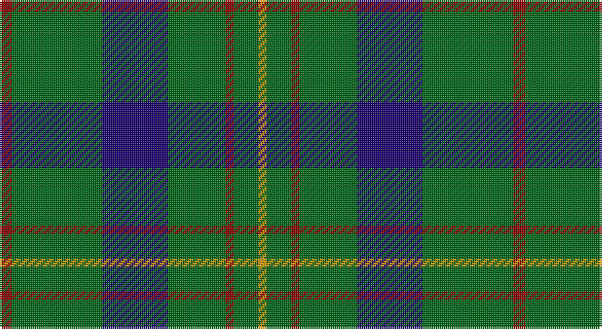

This page is one **sett** — a single exact thread-count. It belongs to the [tartan](/setts/r3g22db16g14r2g6lo2/)
(the same proportion at any scale), whose colour order is pattern [RGBGRGY](/stripes/rgbgrgy/).

Part of the [Scottish Scouts](/tartans/scottish-scouts/) tartan — the named design grouping this sett with its other cloths.

Sourced from tartans-authority.  It is a [7 stripe tartan](/stripes/stripes7/).

Original link http://www.tartansauthority.com/tartan-ferret/display/1463/

## Also known as

This cloth is also recorded under:

- Scottish Scouts #2

## Register references

External register numbers recorded for this tartan.

- Scottish Tartans Authority (ITI): 1463

## Thread count
DR/6 G44 DB32 G28 DR4 G12 DY/4

One full sett is **250 threads**.

## Palette

Palette: <strong>Tartan Register</strong> <small style="color:#888">(3 of 4 colours)</small>
<table><thead><tr><th>Colour</th><th>Threads</th><th>Shade</th><th>Base</th><th>OKLCh</th></tr></thead><tbody><tr><td>DR/</td><td style="text-align:right;font-variant-numeric:tabular-nums">6</td><td><code style="background-color:#880000;">#880000</code> <small style="color:#888">#880000</small></td><td>R <code style="background-color:#CC0000;">#CC0000</code></td><td><small style="color:#888">oklch(39.4% 0.162 29.2)</small></td></tr><tr><td>G</td><td style="text-align:right;font-variant-numeric:tabular-nums">44</td><td><code style="background-color:#006818;">#006818</code> <small style="color:#888">#006818</small></td><td>G <code style="background-color:#006100;">#006100</code></td><td><small style="color:#888">oklch(45.0% 0.142 145.0)</small></td></tr><tr><td>DB</td><td style="text-align:right;font-variant-numeric:tabular-nums">32</td><td><code style="background-color:#1C0070;">#1C0070</code> <small style="color:#888">#1C0070</small></td><td>B <code style="background-color:#2A418A;">#2A418A</code></td><td><small style="color:#888">oklch(26.3% 0.162 277.1)</small></td></tr><tr><td>G</td><td style="text-align:right;font-variant-numeric:tabular-nums">28</td><td><code style="background-color:#006818;">#006818</code> <small style="color:#888">#006818</small></td><td>G <code style="background-color:#006100;">#006100</code></td><td><small style="color:#888">oklch(45.0% 0.142 145.0)</small></td></tr><tr><td>DR</td><td style="text-align:right;font-variant-numeric:tabular-nums">4</td><td><code style="background-color:#880000;">#880000</code> <small style="color:#888">#880000</small></td><td>R <code style="background-color:#CC0000;">#CC0000</code></td><td><small style="color:#888">oklch(39.4% 0.162 29.2)</small></td></tr><tr><td>G</td><td style="text-align:right;font-variant-numeric:tabular-nums">12</td><td><code style="background-color:#006818;">#006818</code> <small style="color:#888">#006818</small></td><td>G <code style="background-color:#006100;">#006100</code></td><td><small style="color:#888">oklch(45.0% 0.142 145.0)</small></td></tr><tr><td>DY/</td><td style="text-align:right;font-variant-numeric:tabular-nums">4</td><td><code style="background-color:#D09800;">#D09800</code> <small style="color:#888">#D09800</small></td><td>Y <code style="background-color:#F2BF00;">#F2BF00</code></td><td><small style="color:#888">oklch(71.4% 0.147 82.1)</small></td></tr></tbody></table>

# Sample pattern

## Compared to the master

This cloth is one sett of its design; the master sett (the exemplar the design is anchored on) is below for comparison.

<figure style="margin:0"><figcaption style="color:#888;font-size:smaller">this sett</figcaption></figure>
<figure style="margin:0"><figcaption style="color:#888;font-size:smaller"><a href="/setts/n11dt2n2dt2n2dt12o12dt2o12dt12n11dt2n2/">master sett →</a></figcaption></figure>

## Nearest tartans

The nearest existing variants by ΔTartan distance, with this tartan at the top so the swatches line up against it.

ΔTartan

Tartan

Sett

—

<a href="/ttd/edit/#slug=r3g22db16g14r2g6lo2~x2">Scottish Scouts (1957) (Corporate)</a> <a class="nn-out" href="/variants/s7/r3g22db16g14r2g6lo2~x2/" title="open its dictionary page">↗</a>

0.97

<a href="/ttd/edit/#slug=r3g20k20g20lo2g2lo2~x2&amp;base=r3g22db16g14r2g6lo2~x2">Paton (Personal)</a> <a class="nn-out" href="/variants/s7/r3g20k20g20lo2g2lo2~x2/" title="open its dictionary page">↗</a>

1.04

<a href="/ttd/edit/#slug=g3db8g3k4g15r2~x2&amp;base=r3g22db16g14r2g6lo2~x2">Lauder (Family)</a> <a class="nn-out" href="/variants/s6/g3db8g3k4g15r2~x2/" title="open its dictionary page">↗</a>

1.09

<a href="/ttd/edit/#slug=dg18r6dg75b6dg13lo35dg12b6&amp;base=r3g22db16g14r2g6lo2~x2">Glenlivet Check (Corporate)</a> <a class="nn-out" href="/variants/s8/dg18r6dg75b6dg13lo35dg12b6/" title="open its dictionary page">↗</a>

1.13

<a href="/ttd/edit/#slug=g99db20w8db30ly8db10ly8g46&amp;base=r3g22db16g14r2g6lo2~x2">Duke of York Hunting</a> <a class="nn-out" href="/variants/s8/g99db20w8db30ly8db10ly8g46/" title="open its dictionary page">↗</a>

1.17

<a href="/ttd/edit/#slug=ly2dg12db6r3dg12r4db1~x2&amp;base=r3g22db16g14r2g6lo2~x2">MacKintosh Hunting</a> <a class="nn-out" href="/variants/s7/ly2dg12db6r3dg12r4db1~x2/" title="open its dictionary page">↗</a>

1.18

<a href="/ttd/edit/#slug=ly2g12db6r3g12r4db1~x2&amp;base=r3g22db16g14r2g6lo2~x2">MacKintosh Hunting</a> <a class="nn-out" href="/variants/s7/ly2g12db6r3g12r4db1~x2/" title="open its dictionary page">↗</a>

1.22

<a href="/ttd/edit/#slug=g22db16g14r2g6lo2g6r2g14db16g22r3~x2&amp;base=r3g22db16g14r2g6lo2~x2">Scottish Scouts #2</a> <a class="nn-out" href="/variants/s12/g22db16g14r2g6lo2g6r2g14db16g22r3~x2/" title="open its dictionary page">↗</a>

1.24

<a href="/ttd/edit/#slug=g10db1w1db1ly1db6g8r1~x8&amp;base=r3g22db16g14r2g6lo2~x2">Marshall Field</a> <a class="nn-out" href="/variants/s8/g10db1w1db1ly1db6g8r1~x8/" title="open its dictionary page">↗</a>

1.26

<a href="/ttd/edit/#slug=g3w1g12r6g3k3g2~x4&amp;base=r3g22db16g14r2g6lo2~x2">Arkansas</a> <a class="nn-out" href="/variants/s7/g3w1g12r6g3k3g2~x4/" title="open its dictionary page">↗</a>

1.30

<a href="/ttd/edit/#slug=db1r3g11r2db5g11ly1~x2&amp;base=r3g22db16g14r2g6lo2~x2">MacKintosh, hunting</a> <a class="nn-out" href="/variants/s7/db1r3g11r2db5g11ly1~x2/" title="open its dictionary page">↗</a>

## Neighbour map

Every grey dot is one of 14360 variants placed by the first two principal components of the ΔTartan feature space (44% of its variance). Red is this tartan; blue dots are its nearest — click one to open its page.

<svg viewBox="0 0 640 380" role="img" style="max-width:100%;height:auto;border:1px solid #e0e0e0;border-radius:4px;display:block" xmlns="http://www.w3.org/2000/svg"><image href="/nn/cloud.v1.png" width="640" height="380"/><a href="/variants/s7/r3g20k20g20lo2g2lo2~x2/"><circle cx="347.3" cy="222.0" r="4" fill="#3465a4"><title>Paton (Personal)</title></circle></a><a href="/variants/s6/g3db8g3k4g15r2~x2/"><circle cx="328.7" cy="254.2" r="4" fill="#3465a4"><title>Lauder (Family)</title></circle></a><a href="/variants/s8/dg18r6dg75b6dg13lo35dg12b6/"><circle cx="423.6" cy="201.9" r="4" fill="#3465a4"><title>Glenlivet Check (Corporate)</title></circle></a><a href="/variants/s8/g99db20w8db30ly8db10ly8g46/"><circle cx="356.4" cy="188.8" r="4" fill="#3465a4"><title>Duke of York Hunting</title></circle></a><a href="/variants/s7/ly2dg12db6r3dg12r4db1~x2/"><circle cx="334.0" cy="227.1" r="4" fill="#3465a4"><title>MacKintosh Hunting</title></circle></a><a href="/variants/s7/ly2g12db6r3g12r4db1~x2/"><circle cx="322.1" cy="217.6" r="4" fill="#3465a4"><title>MacKintosh Hunting</title></circle></a><a href="/variants/s12/g22db16g14r2g6lo2g6r2g14db16g22r3~x2/"><circle cx="371.3" cy="216.7" r="4" fill="#3465a4"><title>Scottish Scouts #2</title></circle></a><a href="/variants/s8/g10db1w1db1ly1db6g8r1~x8/"><circle cx="325.8" cy="186.9" r="4" fill="#3465a4"><title>Marshall Field</title></circle></a><a href="/variants/s7/g3w1g12r6g3k3g2~x4/"><circle cx="366.3" cy="209.2" r="4" fill="#3465a4"><title>Arkansas</title></circle></a><a href="/variants/s7/db1r3g11r2db5g11ly1~x2/"><circle cx="364.5" cy="217.9" r="4" fill="#3465a4"><title>MacKintosh, hunting</title></circle></a><circle cx="365.3" cy="227.3" r="5" fill="#c00000"/></svg>

ID: /variants/s7/r3g22db16g14r2g6lo2~x2/
