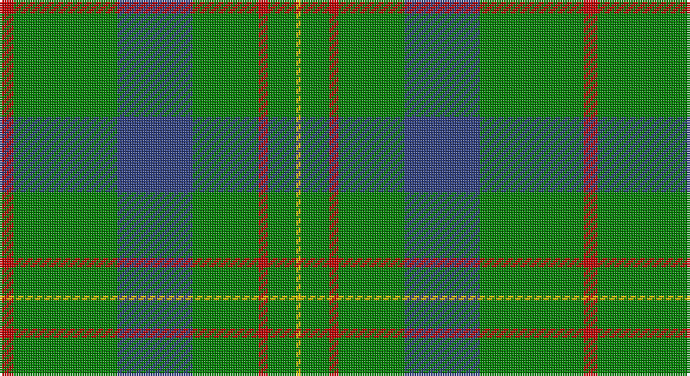

This page is one **sett** — a single exact thread-count. It belongs to the [tartan](/setts/r3g22db16g14r2g6ly1/)
(the same proportion at any scale), whose colour order is pattern [RGBGRGY](/stripes/rgbgrgy/).

Part of the [Scottish Scouts](/tartans/scottish-scouts/) tartan — the named design grouping this sett with its other cloths.

Sourced from weddslist.  It is a [7 stripe tartan](/stripes/stripes7/).

Original link http://www.weddslist.com/cgi-bin/tartans/pg.pl?source=sts

## Provenance

Earliest known date: 1957 This tartan currently in use for Scottish Scouts is based upon the MacLaren, in honour of a MacLaren who gave an estate to the movement. On the blue and green base the strong red overcheck represents the Rover Scouts, the finer red lines, the Scouts and Senior Scouts and yellow the Wolf Cubs.

## Also known as

This cloth is also recorded under:

- Scottish Scouts #2

2 attestations — the source records this cloth was collapsed from (oldest owns this page)

<ul>
<li>undated — Scottish Scouts (weddslist, <a href="http://www.weddslist.com/cgi-bin/tartans/pg.pl?source=sts">record</a>)</li>
<li>undated — Scottish Scouts Corporate Tartan (house-of-tartan, <a href="http://www.house-of-tartan.scotland.net/house/TartanViewjs.asp?colr=Def&tnam=1463">record</a>)</li>
</ul>

## Thread count
R/6 G44 B32 G28 R4 G12 Y/2

One full sett is **248 threads**.

## Palette

Palette: <strong>custom</strong>
<table><thead><tr><th>Colour</th><th>Threads</th><th>Shade</th><th>Base</th><th>OKLCh</th></tr></thead><tbody><tr><td>R/</td><td style="text-align:right;font-variant-numeric:tabular-nums">6</td><td><code style="background-color:#C00000;">#C00000</code> <small style="color:#888">#C00000</small></td><td>R <code style="background-color:#CC0000;">#CC0000</code></td><td><small style="color:#888">oklch(50.7% 0.208 29.2)</small></td></tr><tr><td>G</td><td style="text-align:right;font-variant-numeric:tabular-nums">44</td><td><code style="background-color:#008000;">#008000</code> <small style="color:#888">#008000</small></td><td>G <code style="background-color:#006100;">#006100</code></td><td><small style="color:#888">oklch(52.0% 0.177 142.5)</small></td></tr><tr><td>B</td><td style="text-align:right;font-variant-numeric:tabular-nums">32</td><td><code style="background-color:#304080;">#304080</code> <small style="color:#888">#304080</small></td><td>B <code style="background-color:#2A418A;">#2A418A</code></td><td><small style="color:#888">oklch(39.4% 0.109 270.2)</small></td></tr><tr><td>G</td><td style="text-align:right;font-variant-numeric:tabular-nums">28</td><td><code style="background-color:#008000;">#008000</code> <small style="color:#888">#008000</small></td><td>G <code style="background-color:#006100;">#006100</code></td><td><small style="color:#888">oklch(52.0% 0.177 142.5)</small></td></tr><tr><td>R</td><td style="text-align:right;font-variant-numeric:tabular-nums">4</td><td><code style="background-color:#C00000;">#C00000</code> <small style="color:#888">#C00000</small></td><td>R <code style="background-color:#CC0000;">#CC0000</code></td><td><small style="color:#888">oklch(50.7% 0.208 29.2)</small></td></tr><tr><td>G</td><td style="text-align:right;font-variant-numeric:tabular-nums">12</td><td><code style="background-color:#008000;">#008000</code> <small style="color:#888">#008000</small></td><td>G <code style="background-color:#006100;">#006100</code></td><td><small style="color:#888">oklch(52.0% 0.177 142.5)</small></td></tr><tr><td>Y/</td><td style="text-align:right;font-variant-numeric:tabular-nums">2</td><td><code style="background-color:#F0C000;">#F0C000</code> <small style="color:#888">#F0C000</small></td><td>Y <code style="background-color:#F2BF00;">#F2BF00</code></td><td><small style="color:#888">oklch(82.7% 0.169 90.5)</small></td></tr></tbody></table>

# Sample pattern

## Compared to the master

This cloth is one sett of its design; the master sett (the exemplar the design is anchored on) is below for comparison.

<figure style="margin:0"><figcaption style="color:#888;font-size:smaller">this sett</figcaption></figure>
<figure style="margin:0"><figcaption style="color:#888;font-size:smaller"><a href="/setts/n11dt2n2dt2n2dt12o12dt2o12dt12n11dt2n2/">master sett →</a></figcaption></figure>

## Nearest tartans

The nearest existing variants by ΔTartan distance, with this tartan at the top so the swatches line up against it.

ΔTartan

Tartan

Sett

—

<a href="/ttd/edit/#slug=r3g22db16g14r2g6ly1~x2">Scottish Scouts</a> <a class="nn-out" href="/variants/s7/r3g22db16g14r2g6ly1~x2/" title="open its dictionary page">↗</a>

1.20

<a href="/ttd/edit/#slug=db1r3g11r2db5g11ly1~x2&amp;base=r3g22db16g14r2g6ly1~x2">MacKintosh, hunting</a> <a class="nn-out" href="/variants/s7/db1r3g11r2db5g11ly1~x2/" title="open its dictionary page">↗</a>

1.23

<a href="/ttd/edit/#slug=g18r6g75b6g13dy35g12b6&amp;base=r3g22db16g14r2g6ly1~x2">Glenlivet</a> <a class="nn-out" href="/variants/s8/g18r6g75b6g13dy35g12b6/" title="open its dictionary page">↗</a>

1.29

<a href="/ttd/edit/#slug=g5o9g4w5g30r2g4r2~x2&amp;base=r3g22db16g14r2g6ly1~x2">Welsh Assembly (Fashion)</a> <a class="nn-out" href="/variants/s8/g5o9g4w5g30r2g4r2~x2/" title="open its dictionary page">↗</a>

1.35

<a href="/ttd/edit/#slug=g4r1g15t5r1w5g4r1~x4&amp;base=r3g22db16g14r2g6ly1~x2">McGirr (Letterkenny) David, (Pers.)</a> <a class="nn-out" href="/variants/s8/g4r1g15t5r1w5g4r1~x4/" title="open its dictionary page">↗</a>

1.41

<a href="/ttd/edit/#slug=g47r3g6db35ly3~x2&amp;base=r3g22db16g14r2g6ly1~x2">Gracie</a> <a class="nn-out" href="/variants/s5/g47r3g6db35ly3~x2/" title="open its dictionary page">↗</a>

1.46

<a href="/ttd/edit/#slug=g30t8g5lb4g5r2~x4&amp;base=r3g22db16g14r2g6ly1~x2">Annapolis Valley</a> <a class="nn-out" href="/variants/s6/g30t8g5lb4g5r2~x4/" title="open its dictionary page">↗</a>

1.49

<a href="/ttd/edit/#slug=g50db20k3db2o2db5~x2&amp;base=r3g22db16g14r2g6ly1~x2">St Andrews Hotel, Golf Resort, and SPA</a> <a class="nn-out" href="/variants/s6/g50db20k3db2o2db5~x2/" title="open its dictionary page">↗</a>

1.50

<a href="/ttd/edit/#slug=g5y9g4w5g30r2g4r2~x2&amp;base=r3g22db16g14r2g6ly1~x2">Welsh Assembly</a> <a class="nn-out" href="/variants/s8/g5y9g4w5g30r2g4r2~x2/" title="open its dictionary page">↗</a>

1.52

<a href="/ttd/edit/#slug=dg5r3dg3lo2dg1ly8dg24lo2~x2&amp;base=r3g22db16g14r2g6ly1~x2">St. Christopher (Corporate)</a> <a class="nn-out" href="/variants/s8/dg5r3dg3lo2dg1ly8dg24lo2~x2/" title="open its dictionary page">↗</a>

1.54

<a href="/ttd/edit/#slug=r3g22db16g14r2g6lo2~x2&amp;base=r3g22db16g14r2g6ly1~x2">Scottish Scouts (1957) (Corporate)</a> <a class="nn-out" href="/variants/s7/r3g22db16g14r2g6lo2~x2/" title="open its dictionary page">↗</a>

## Neighbour map

Every grey dot is one of 14360 variants placed by the first two principal components of the ΔTartan feature space (44% of its variance). Red is this tartan; blue dots are its nearest — click one to open its page.

<svg viewBox="0 0 640 380" role="img" style="max-width:100%;height:auto;border:1px solid #e0e0e0;border-radius:4px;display:block" xmlns="http://www.w3.org/2000/svg"><image href="/nn/cloud.v1.png" width="640" height="380"/><a href="/variants/s7/db1r3g11r2db5g11ly1~x2/"><circle cx="364.5" cy="217.9" r="4" fill="#3465a4"><title>MacKintosh, hunting</title></circle></a><a href="/variants/s8/g18r6g75b6g13dy35g12b6/"><circle cx="418.6" cy="200.2" r="4" fill="#3465a4"><title>Glenlivet</title></circle></a><a href="/variants/s8/g5o9g4w5g30r2g4r2~x2/"><circle cx="433.2" cy="182.1" r="4" fill="#3465a4"><title>Welsh Assembly (Fashion)</title></circle></a><a href="/variants/s8/g4r1g15t5r1w5g4r1~x4/"><circle cx="352.6" cy="180.9" r="4" fill="#3465a4"><title>McGirr (Letterkenny) David, (Pers.)</title></circle></a><a href="/variants/s5/g47r3g6db35ly3~x2/"><circle cx="363.9" cy="213.0" r="4" fill="#3465a4"><title>Gracie</title></circle></a><a href="/variants/s6/g30t8g5lb4g5r2~x4/"><circle cx="477.5" cy="213.2" r="4" fill="#3465a4"><title>Annapolis Valley</title></circle></a><a href="/variants/s6/g50db20k3db2o2db5~x2/"><circle cx="416.1" cy="173.6" r="4" fill="#3465a4"><title>St Andrews Hotel, Golf Resort, and SPA</title></circle></a><a href="/variants/s8/g5y9g4w5g30r2g4r2~x2/"><circle cx="441.2" cy="186.9" r="4" fill="#3465a4"><title>Welsh Assembly</title></circle></a><a href="/variants/s8/dg5r3dg3lo2dg1ly8dg24lo2~x2/"><circle cx="441.4" cy="158.5" r="4" fill="#3465a4"><title>St. Christopher (Corporate)</title></circle></a><a href="/variants/s7/r3g22db16g14r2g6lo2~x2/"><circle cx="365.3" cy="227.3" r="4" fill="#3465a4"><title>Scottish Scouts (1957) (Corporate)</title></circle></a><circle cx="407.9" cy="202.5" r="5" fill="#c00000"/></svg>

ID: /variants/s7/r3g22db16g14r2g6ly1~x2/
