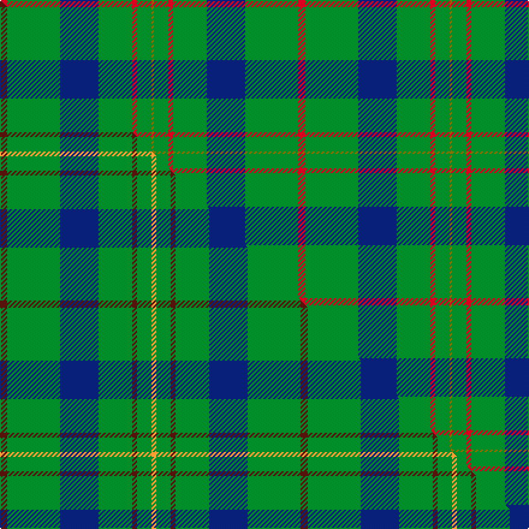

This is one **variant** — a specific cloth: this exact thread count and colourway, with its own
provenance below. It is one weaving of the [sett](/tartans/s/sc/scottish-scouts-2/) (the scale-free proportion — the
same cloth at any scale or shade), whose colour order is pattern [GGRGBGR](/stripes/ggrgbgr/).

Part of the [Scottish Scouts](/tartans/s/sc/scottish-scouts-2/) tartan — the named design grouping this sett with its other cloths.

Sourced from house-of-tartan.  It is a [7 stripe tartan](/stripes/stripes7/).

Original link [http://www.house-of-tartan.scotland.net/house/TartanViewjs.asp?colr=Def&tnam=1463](http://www.house-of-tartan.scotland.net/house/TartanViewjs.asp?colr=Def&tnam=1463)

## Provenance

Earliest known date: 1957 This tartan currently in use for Scottish Scouts is based upon the MacLaren, in honour of a MacLaren who gave an estate to the movement. On the blue and green base the strong red overcheck represents the Rover Scouts, the finer red lines, the Scouts and Senior Scouts and yellow the Wolf Cubs.

2 attestations — the source records this cloth was collapsed from (oldest owns this page)

<ul>
<li>1957 — Scottish Scouts Corporate Tartan (house-of-tartan, <a href="http://www.house-of-tartan.scotland.net/house/TartanViewjs.asp?colr=Def&tnam=1463">record</a>) </li>
<li>undated — Scottish Scouts (weddslist, <a href="http://www.weddslist.com/cgi-bin/tartans/pg.pl?source=sts">record</a>) </li>
</ul>

Dataset <small>— provenance for this record, inherited from the source manifest</small>

<dl class="dataset-prov">
<dt>source</dt><dd><a href="/sources/house-of-tartan/">House of Tartan</a></dd>
<dt>data captured from</dt><dd><a href="https://github.com/thetartan/tartan-database/blob/master/data/house-of-tartan/data.csv">https://github.com/thetartan/tartan-database/blob/master/data/house-of-tartan/data.csv</a></dd>
<dt>data date</dt><dd>1957 <small>(this record)</small></dd>
<dt>licence</dt><dd><a href="https://creativecommons.org/licenses/by-nc-nd/4.0/">CC BY-NC-ND 4.0</a></dd>
</dl>

Capture chain <small>— the hands this data passed through, oldest first; each capture carries its own licence</small>

<ol class="capture-chain">
<li><a href="http://www.house-of-tartan.scotland.net/">House of Tartan</a> <small>the weaver/retailer's database — the site is now offline; the URL is kept as the ultimate source's identity</small></li>
<li><a href="https://github.com/thetartan/tartan-database">thetartan/tartan-database</a> <small>2016-2017</small> · <a href="https://creativecommons.org/licenses/by-nc-nd/4.0/">CC BY-NC-ND 4.0</a> <small>Levko Kravets's frozen compilation — the capture we vendored, and where its CC licence text came from</small></li>
<li>this dictionary <small>captured 2026-06-10 · commit 5bf86c7566</small> <small>each re-capture is a git commit to data/sources</small></li>
</ol>

## Thread count
R/6 G44 DB32 G28 R4 G12 Y/2

One full sett is **248 threads**.

## Palette
<table><thead><tr><th>Colour</th><th>Shade</th><th>OKLCh</th></tr></thead><tbody><tr><td>DB</td><td><code style="background-color:#082077;">#082077</code> <small style="color:#888">#082077</small></td><td><small style="color:#888">oklch(30.0% 0.149 265.1)</small></td></tr><tr><td>G</td><td><code style="background-color:#008B2A;">#008B2A</code> <small style="color:#888">#008B2A</small></td><td><small style="color:#888">oklch(55.4% 0.170 145.9)</small></td></tr><tr><td>R</td><td><code style="background-color:#D60020;">#D60020</code> <small style="color:#888">#D60020</small></td><td><small style="color:#888">oklch(55.2% 0.224 25.5)</small></td></tr><tr><td>Y</td><td><code style="background-color:#8B6E00;">#8B6E00</code> <small style="color:#888">#8B6E00</small></td><td><small style="color:#888">oklch(55.1% 0.113 90.4)</small></td></tr></tbody></table>

# Sample pattern

## Compared to the master

This cloth is one sett of its design; the master sett (the exemplar the design is anchored on) is below for comparison.

Its **ΔTartan distance** from the master is **0.80** — the same measure the nearest-tartans table ranks by (0 is identical; a re-scale of the same cloth is near 0, a recolour or a different proportion further).

<figure class="master-compare" style="margin:0">

this sett
master sett ★

<figcaption style="color:#888;font-size:smaller">One weave of this sett against the <a href="/setts/dr3g22db16g14dr2g6lo2/">master sett ★</a>, split on the diagonal: a shared proportion runs seamlessly across it with only the shades shifting; a different proportion breaks on it.</figcaption>
</figure>

## Nearest tartan variants

The nearest existing variants by ΔTartan distance, with this cloth at the top so the swatches line up against it.

ΔTartan

Threads

Variant

Sett

—

248

<a href="/variants/s7/r3g22db16g14r2g6y1~x2/">Scottish Scouts Corporate Tartan</a>

<a href="/ttd/edit/#slug=dr3g22db16g14dr2g6lo2~x2&amp;base=r3g22db16g14r2g6y1~x2" title="compare in the TTD">0.80</a>

250

<a href="/variants/s7/dr3g22db16g14dr2g6lo2~x2/">Scottish Scouts (1957) (Corporate)</a>

<a href="/ttd/edit/#slug=g30db8g5lb4g5r1~x4&amp;base=r3g22db16g14r2g6y1~x2" title="compare in the TTD">1.36</a>

300

<a href="/variants/s6/g30db8g5lb4g5r1~x4/">Annapolis Valley</a>

<a href="/ttd/edit/#slug=g4r1g15t5r1w5g4r1~x4&amp;base=r3g22db16g14r2g6y1~x2" title="compare in the TTD">1.54</a>

268

<a href="/variants/s8/g4r1g15t5r1w5g4r1~x4/">McGirr (Letterkenny) David, (Pers.)</a>

<a href="/ttd/edit/#slug=g40r3g4r3g12db32lo4r3~x2&amp;base=r3g22db16g14r2g6y1~x2" title="compare in the TTD">1.59</a>

318

<a href="/variants/s8/g40r3g4r3g12db32lo4r3~x2/">US Marine Corps</a>

<a href="/ttd/edit/#slug=g28r2g2r2g8db24y3r2~x2&amp;base=r3g22db16g14r2g6y1~x2" title="compare in the TTD">1.62</a>

224

<a href="/variants/s8/g28r2g2r2g8db24y3r2~x2/">Leatherneck, U.S.Marine Corps</a>

<a href="/ttd/edit/#slug=g28r2g2r2g8db24dy3r2~x2&amp;base=r3g22db16g14r2g6y1~x2" title="compare in the TTD">1.62</a>

224

<a href="/variants/s8/g28r2g2r2g8db24dy3r2~x2/">Leatherneck U.S.Marine Corps Corporate Tartan</a>

<a href="/ttd/edit/#slug=g47r3g6db35y3~x2&amp;base=r3g22db16g14r2g6y1~x2" title="compare in the TTD">2.11</a>

276

<a href="/variants/s5/g47r3g6db35y3~x2/">Gracie</a>

<a href="/ttd/edit/#slug=db16g4db3g3y2g24r2~x2&amp;base=r3g22db16g14r2g6y1~x2" title="compare in the TTD">2.13</a>

180

<a href="/variants/s7/db16g4db3g3y2g24r2~x2/">St Andrews Links</a>

<a href="/ttd/edit/#slug=g4lb1db2r1g1r1db2lb1g14lo1~x4&amp;base=r3g22db16g14r2g6y1~x2" title="compare in the TTD">2.18</a>

204

<a href="/variants/s10/g4lb1db2r1g1r1db2lb1g14lo1~x4/">Seattle (District)</a>

<a href="/ttd/edit/#slug=g14w1db2r1g1r1db2w1g4y1~x4&amp;base=r3g22db16g14r2g6y1~x2" title="compare in the TTD">2.23</a>

164

<a href="/variants/s10/g14w1db2r1g1r1db2w1g4y1~x4/">Seattle District Tartan</a>

## Neighbour map

Every grey dot is one of 13656 variants placed by the first two principal components of the ΔTartan feature space (42% of its variance). Red is this tartan; blue dots are its nearest — click one to open its page. The map is a flat projection of a many-dimensional space — [how to read it](/posts/neighbourhood-maps/).

<svg viewBox="0 0 640 380" role="img" style="max-width:100%;height:auto;border:1px solid #e0e0e0;border-radius:4px;display:block" xmlns="http://www.w3.org/2000/svg"><image href="/nn/cloud.v1.png" width="640" height="380"/><a href="/variants/s7/dr3g22db16g14dr2g6lo2~x2/"><circle cx="387.0" cy="232.9" r="4" fill="#3465a4"><title>Scottish Scouts (1957) (Corporate)</title></circle></a><a href="/variants/s6/g30db8g5lb4g5r1~x4/"><circle cx="500.2" cy="167.7" r="4" fill="#3465a4"><title>Annapolis Valley</title></circle></a><a href="/variants/s8/g4r1g15t5r1w5g4r1~x4/"><circle cx="369.6" cy="190.4" r="4" fill="#3465a4"><title>McGirr (Letterkenny) David, (Pers.)</title></circle></a><a href="/variants/s8/g40r3g4r3g12db32lo4r3~x2/"><circle cx="321.7" cy="177.1" r="4" fill="#3465a4"><title>US Marine Corps</title></circle></a><a href="/variants/s8/g28r2g2r2g8db24y3r2~x2/"><circle cx="324.8" cy="176.3" r="4" fill="#3465a4"><title>Leatherneck, U.S.Marine Corps</title></circle></a><a href="/variants/s8/g28r2g2r2g8db24dy3r2~x2/"><circle cx="323.4" cy="175.6" r="4" fill="#3465a4"><title>Leatherneck U.S.Marine Corps Corporate Tartan</title></circle></a><a href="/variants/s5/g47r3g6db35y3~x2/"><circle cx="359.5" cy="202.9" r="4" fill="#3465a4"><title>Gracie</title></circle></a><a href="/variants/s7/db16g4db3g3y2g24r2~x2/"><circle cx="349.7" cy="195.4" r="4" fill="#3465a4"><title>St Andrews Links</title></circle></a><a href="/variants/s10/g4lb1db2r1g1r1db2lb1g14lo1~x4/"><circle cx="389.4" cy="141.4" r="4" fill="#3465a4"><title>Seattle (District)</title></circle></a><a href="/variants/s10/g14w1db2r1g1r1db2w1g4y1~x4/"><circle cx="378.5" cy="138.4" r="4" fill="#3465a4"><title>Seattle District Tartan</title></circle></a><circle cx="396.6" cy="189.2" r="5" fill="#c00000"/><text x="320" y="376" text-anchor="middle" font-size="11" fill="#999">ground</text><text x="11" y="190" text-anchor="middle" font-size="11" fill="#999" transform="rotate(-90 11 190)">complexity</text></svg>

ID: /variants/s7/r3g22db16g14r2g6y1~x2/
