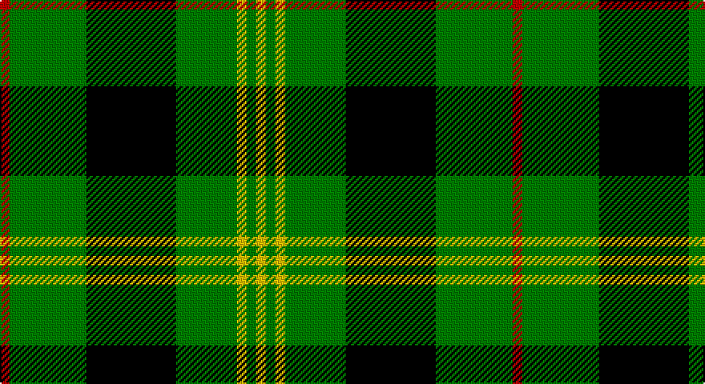

This page is one **sett** — a single exact thread-count. It belongs to the [tartan](/setts/r3g24k28g19ly3g3ly3/)
(the same proportion at any scale), whose colour order is pattern [RGKGYGY](/stripes/rgkgygy/).

Part of the [Paton](/tartans/paton/) tartan — the named design grouping this sett with its other cloths.

Sourced from weddslist.  It is a [7 stripe tartan](/stripes/stripes7/).

Original link http://www.weddslist.com/cgi-bin/tartans/pg.pl?source=sts

## Provenance

Earliest known date: 1930 Discovered in 1993 at P and J Haggart, weavers in Aberfeldy. It was possibly designed by the late Mr John Robertson around the 1930's, but the sample appears to have been woven in 1952. The Paton family associated with the tartan come from Aberdeenshire. Apart from the red stripe this sett resembles the Gordon of Abergeldy previously known as Ancient Gordon.

2 attestations — the source records this cloth was collapsed from (oldest owns this page)

<ul>
<li>undated — Paton (weddslist, <a href="http://www.weddslist.com/cgi-bin/tartans/pg.pl?source=sts">record</a>)</li>
<li>undated — Paton Family Tartan (house-of-tartan, <a href="http://www.house-of-tartan.scotland.net/house/TartanViewjs.asp?colr=Def&tnam=2127">record</a>)</li>
</ul>

## Thread count
R/6 G48 K56 G38 Y6 G6 Y/6

One full sett is **320 threads**.

## Palette

Palette: <strong>Ingles Buchan</strong> <small style="color:#888">(1 of 4 colours)</small>
<table><thead><tr><th>Colour</th><th>Threads</th><th>Shade</th><th>Base</th><th>OKLCh</th></tr></thead><tbody><tr><td>R/</td><td style="text-align:right;font-variant-numeric:tabular-nums">6</td><td><code style="background-color:#C00000;">#C00000</code> <small style="color:#888">#C00000</small></td><td>R <code style="background-color:#CC0000;">#CC0000</code></td><td><small style="color:#888">oklch(50.7% 0.208 29.2)</small></td></tr><tr><td>G</td><td style="text-align:right;font-variant-numeric:tabular-nums">48</td><td><code style="background-color:#008000;">#008000</code> <small style="color:#888">#008000</small></td><td>G <code style="background-color:#006100;">#006100</code></td><td><small style="color:#888">oklch(52.0% 0.177 142.5)</small></td></tr><tr><td>K</td><td style="text-align:right;font-variant-numeric:tabular-nums">56</td><td><code style="background-color:#000000;">#000000</code> <small style="color:#888">#000000</small></td><td>K <code style="background-color:#000000;">#000000</code></td><td><small style="color:#888">oklch(0.0% 0.000 0.0)</small></td></tr><tr><td>G</td><td style="text-align:right;font-variant-numeric:tabular-nums">38</td><td><code style="background-color:#008000;">#008000</code> <small style="color:#888">#008000</small></td><td>G <code style="background-color:#006100;">#006100</code></td><td><small style="color:#888">oklch(52.0% 0.177 142.5)</small></td></tr><tr><td>Y</td><td style="text-align:right;font-variant-numeric:tabular-nums">6</td><td><code style="background-color:#F0C000;">#F0C000</code> <small style="color:#888">#F0C000</small></td><td>Y <code style="background-color:#F2BF00;">#F2BF00</code></td><td><small style="color:#888">oklch(82.7% 0.169 90.5)</small></td></tr><tr><td>G</td><td style="text-align:right;font-variant-numeric:tabular-nums">6</td><td><code style="background-color:#008000;">#008000</code> <small style="color:#888">#008000</small></td><td>G <code style="background-color:#006100;">#006100</code></td><td><small style="color:#888">oklch(52.0% 0.177 142.5)</small></td></tr><tr><td>Y/</td><td style="text-align:right;font-variant-numeric:tabular-nums">6</td><td><code style="background-color:#F0C000;">#F0C000</code> <small style="color:#888">#F0C000</small></td><td>Y <code style="background-color:#F2BF00;">#F2BF00</code></td><td><small style="color:#888">oklch(82.7% 0.169 90.5)</small></td></tr></tbody></table>

# Sample pattern

## Compared to the master

This cloth is one sett of its design; the master sett (the exemplar the design is anchored on) is below for comparison.

<figure style="margin:0"><figcaption style="color:#888;font-size:smaller">this sett</figcaption></figure>
<figure style="margin:0"><figcaption style="color:#888;font-size:smaller"><a href="/setts/r3g20k20g20lo2g2lo2/">master sett →</a></figcaption></figure>

## Nearest tartans

The nearest existing variants by ΔTartan distance, with this tartan at the top so the swatches line up against it.

ΔTartan

Tartan

Sett

—

<a href="/ttd/edit/#slug=r3g24k28g19ly3g3ly3~x2">Paton</a> <a class="nn-out" href="/variants/s7/r3g24k28g19ly3g3ly3~x2/" title="open its dictionary page">↗</a>

0.77

<a href="/ttd/edit/#slug=w3g27k5g5k32g5k5g27ly3~x2&amp;base=r3g24k28g19ly3g3ly3~x2">MacIver hunting</a> <a class="nn-out" href="/variants/s9/w3g27k5g5k32g5k5g27ly3~x2/" title="open its dictionary page">↗</a>

0.86

<a href="/ttd/edit/#slug=k4g32k4g4k8w3k8b4~x2&amp;base=r3g24k28g19ly3g3ly3~x2">Hartmann</a> <a class="nn-out" href="/variants/s8/k4g32k4g4k8w3k8b4~x2/" title="open its dictionary page">↗</a>

1.04

<a href="/ttd/edit/#slug=r1g16k8g4k4ly1~x2&amp;base=r3g24k28g19ly3g3ly3~x2">Forbes</a> <a class="nn-out" href="/variants/s6/r1g16k8g4k4ly1~x2/" title="open its dictionary page">↗</a>

1.08

<a href="/ttd/edit/#slug=k7r3k24g28ly3~x2&amp;base=r3g24k28g19ly3g3ly3~x2">Robert Gordon University</a> <a class="nn-out" href="/variants/s5/k7r3k24g28ly3~x2/" title="open its dictionary page">↗</a>

1.20

<a href="/ttd/edit/#slug=k60g64gi5g8gi5g64k60ly8k8ly8&amp;base=r3g24k28g19ly3g3ly3~x2">Sin-Cos</a> <a class="nn-out" href="/variants/s10/k60g64gi5g8gi5g64k60ly8k8ly8/" title="open its dictionary page">↗</a>

1.34

<a href="/ttd/edit/#slug=g8r3g30k8w3k36w8~x2&amp;base=r3g24k28g19ly3g3ly3~x2">Cleghorn (Personal)</a> <a class="nn-out" href="/variants/s7/g8r3g30k8w3k36w8~x2/" title="open its dictionary page">↗</a>

1.38

<a href="/ttd/edit/#slug=g7k1g7t1k6t1~x2&amp;base=r3g24k28g19ly3g3ly3~x2">Innes</a> <a class="nn-out" href="/variants/s6/g7k1g7t1k6t1~x2/" title="open its dictionary page">↗</a>

1.39

<a href="/ttd/edit/#slug=w2g12k3g3k16g3k3g12ly2~x2&amp;base=r3g24k28g19ly3g3ly3~x2">MacIver Hunting</a> <a class="nn-out" href="/variants/s9/w2g12k3g3k16g3k3g12ly2~x2/" title="open its dictionary page">↗</a>

1.40

<a href="/ttd/edit/#slug=r1k6g6ly1g6ly1~x6&amp;base=r3g24k28g19ly3g3ly3~x2">Moore Caledonian (Personal)</a> <a class="nn-out" href="/variants/s6/r1k6g6ly1g6ly1~x6/" title="open its dictionary page">↗</a>

1.46

<a href="/ttd/edit/#slug=g30k12g6k6db2k5~x2&amp;base=r3g24k28g19ly3g3ly3~x2">Fife, Duchess of..</a> <a class="nn-out" href="/variants/s6/g30k12g6k6db2k5~x2/" title="open its dictionary page">↗</a>

## Neighbour map

Every grey dot is one of 14360 variants placed by the first two principal components of the ΔTartan feature space (44% of its variance). Red is this tartan; blue dots are its nearest — click one to open its page.

<svg viewBox="0 0 640 380" role="img" style="max-width:100%;height:auto;border:1px solid #e0e0e0;border-radius:4px;display:block" xmlns="http://www.w3.org/2000/svg"><image href="/nn/cloud.v1.png" width="640" height="380"/><a href="/variants/s9/w3g27k5g5k32g5k5g27ly3~x2/"><circle cx="286.1" cy="185.4" r="4" fill="#3465a4"><title>MacIver hunting</title></circle></a><a href="/variants/s8/k4g32k4g4k8w3k8b4~x2/"><circle cx="270.1" cy="176.1" r="4" fill="#3465a4"><title>Hartmann</title></circle></a><a href="/variants/s6/r1g16k8g4k4ly1~x2/"><circle cx="318.0" cy="190.0" r="4" fill="#3465a4"><title>Forbes</title></circle></a><a href="/variants/s5/k7r3k24g28ly3~x2/"><circle cx="232.8" cy="215.8" r="4" fill="#3465a4"><title>Robert Gordon University</title></circle></a><a href="/variants/s10/k60g64gi5g8gi5g64k60ly8k8ly8/"><circle cx="238.3" cy="171.2" r="4" fill="#3465a4"><title>Sin-Cos</title></circle></a><a href="/variants/s7/g8r3g30k8w3k36w8~x2/"><circle cx="222.7" cy="185.7" r="4" fill="#3465a4"><title>Cleghorn (Personal)</title></circle></a><a href="/variants/s6/g7k1g7t1k6t1~x2/"><circle cx="297.9" cy="251.0" r="4" fill="#3465a4"><title>Innes</title></circle></a><a href="/variants/s9/w2g12k3g3k16g3k3g12ly2~x2/"><circle cx="273.3" cy="206.0" r="4" fill="#3465a4"><title>MacIver Hunting</title></circle></a><a href="/variants/s6/r1k6g6ly1g6ly1~x6/"><circle cx="262.1" cy="244.2" r="4" fill="#3465a4"><title>Moore Caledonian (Personal)</title></circle></a><a href="/variants/s6/g30k12g6k6db2k5~x2/"><circle cx="343.6" cy="211.8" r="4" fill="#3465a4"><title>Fife, Duchess of..</title></circle></a><circle cx="262.5" cy="199.6" r="5" fill="#c00000"/></svg>

ID: /variants/s7/r3g24k28g19ly3g3ly3~x2/
