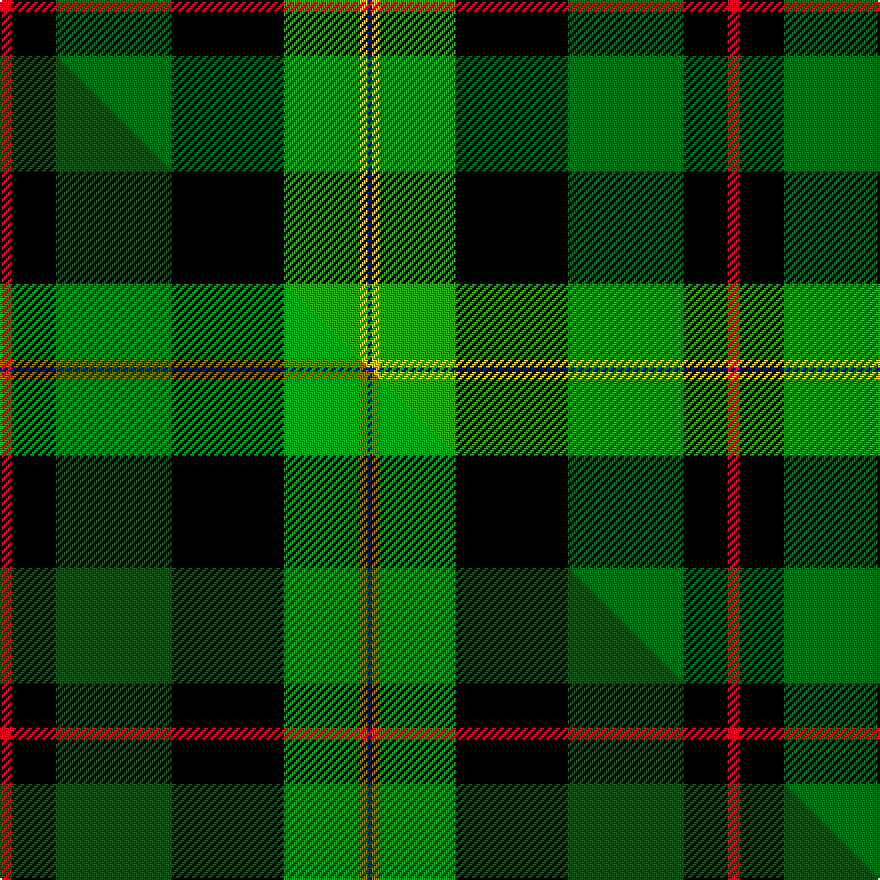

This is one **variant** — a specific cloth: this exact thread count and colourway, with its own
provenance below. It is one weaving of the [sett](/setts/r3k11dg29k28g19ly2db1/) (the scale-free proportion — the
same cloth at any scale or shade), whose colour order is pattern [BYGKGKR](/stripes/bygkgkr/).

Part of the [PMMC](/tartans/p/pm/pmmc/) tartan — the named design grouping this sett with its other cloths.

Sourced from tartans-authority.  It is a [7 stripe tartan](/stripes/stripes7/).

Original link [https://www.tartanregister.gov.uk/tartanDetails.aspx?ref=11051](https://www.tartanregister.gov.uk/tartanDetails.aspx?ref=11051)

Dataset <small>— provenance for this record, inherited from the source manifest</small>

<dl class="dataset-prov">
<dt>source</dt><dd><a href="/sources/tartans-authority/">Scottish Tartans Authority</a></dd>
<dt>data captured from</dt><dd><a href="https://github.com/thetartan/tartan-database/blob/master/data/tartans-authority/data.csv">https://github.com/thetartan/tartan-database/blob/master/data/tartans-authority/data.csv</a></dd>
<dt>data date</dt><dd>2014 <small>(this record)</small></dd>
<dt>licence</dt><dd><a href="https://creativecommons.org/licenses/by-nc-nd/4.0/">CC BY-NC-ND 4.0</a></dd>
</dl>

Capture chain <small>— the hands this data passed through, oldest first; each capture carries its own licence</small>

<ol class="capture-chain">
<li><a href="https://www.tartansauthority.com/">Scottish Tartans Authority</a> <small>the heritage body's archive — its tartan-ferret record browser is retired (links repaired to the SRT, above)</small></li>
<li><a href="https://github.com/thetartan/tartan-database">thetartan/tartan-database</a> <small>2016-2017</small> · <a href="https://creativecommons.org/licenses/by-nc-nd/4.0/">CC BY-NC-ND 4.0</a> <small>Levko Kravets's frozen compilation — the capture we vendored, and where its CC licence text came from</small></li>
<li>this dictionary <small>captured 2026-06-10 · commit 5bf86c7566</small> <small>each re-capture is a git commit to data/sources</small></li>
</ol>

## Register references

External register numbers recorded for this tartan.

- Scottish Register of Tartans: [11051](https://www.tartanregister.gov.uk/tartanDetails?ref=11051)
- Scottish Tartans Authority (ITI): 11051

## Thread count
R/6 K22 DG58 K56 G38 LY4 DB/2

One full sett is **364 threads**.

## Palette
<table><thead><tr><th>Colour</th><th>Shade</th><th>OKLCh</th></tr></thead><tbody><tr><td>DB</td><td><code style="background-color:#082077;">#082077</code> <small style="color:#888">#082077</small></td><td><small style="color:#888">oklch(30.0% 0.149 265.1)</small></td></tr><tr><td>G</td><td><code style="background-color:#289C18;">#289C18</code> <small style="color:#888">#289C18</small></td><td><small style="color:#888">oklch(60.6% 0.191 141.6)</small></td></tr><tr><td>DG</td><td><code style="background-color:#006818;">#006818</code> <small style="color:#888">#006818</small></td><td><small style="color:#888">oklch(45.0% 0.142 145.0)</small></td></tr><tr><td>K</td><td><code style="background-color:#000000;">#000000</code> <small style="color:#888">#000000</small></td><td><small style="color:#888">oklch(0.0% 0.000 0.0)</small></td></tr><tr><td>R</td><td><code style="background-color:#D60020;">#D60020</code> <small style="color:#888">#D60020</small></td><td><small style="color:#888">oklch(55.2% 0.224 25.5)</small></td></tr><tr><td>LY</td><td><code style="background-color:#DCBC32;">#DCBC32</code> <small style="color:#888">#DCBC32</small></td><td><small style="color:#888">oklch(80.0% 0.150 95.2)</small></td></tr></tbody></table>

# Sample pattern

## Compared to the master

This cloth is one sett of its design; the master sett (the exemplar the design is anchored on) is below for comparison.

Its **ΔTartan distance** from the master is **0.07** — the same measure the nearest-tartans table ranks by (0 is identical; a re-scale of the same cloth is near 0, a recolour or a different proportion further).

<figure class="master-compare" style="margin:0">

this sett
master sett ★

<figcaption style="color:#888;font-size:smaller">One weave of this sett against the <a href="/setts/r3k11dg29k28g19y2db1/">master sett ★</a>, split on the diagonal: a shared proportion runs seamlessly across it with only the shades shifting; a different proportion breaks on it.</figcaption>
</figure>

## Nearest tartan variants

The nearest existing variants by ΔTartan distance, with this cloth at the top so the swatches line up against it.

ΔTartan

Threads

Variant

Sett

—

364

<a href="/variants/s7/r3k11dg29k28g19ly2db1~x2~dg1806142-g2408144/">PMMC</a>

<a href="/ttd/edit/#slug=r3k11dg29k28g19y2db1~x2~dg1504144-g2408144&amp;base=r3k11dg29k28g19ly2db1~x2~dg1806142-g2408144" title="compare in the TTD">0.07</a>

364

<a href="/variants/s7/r3k11dg29k28g19y2db1~x2~dg1504144-g2408144/">PMMC</a>

<a href="/ttd/edit/#slug=dy3g22dg13k15w3k16g1r3~x2&amp;base=r3k11dg29k28g19ly2db1~x2~dg1806142-g2408144" title="compare in the TTD">1.58</a>

292

<a href="/variants/s8/dy3g22dg13k15w3k16g1r3~x2/">Lawson, William</a>

<a href="/ttd/edit/#slug=y4k1dg16k16r1w3~x2&amp;base=r3k11dg29k28g19ly2db1~x2~dg1806142-g2408144" title="compare in the TTD">1.95</a>

150

<a href="/variants/s6/y4k1dg16k16r1w3~x2/">MacLamroc</a>

<a href="/ttd/edit/#slug=db2k6g2k6dg12y1~x4~g2408144-dg1806142&amp;base=r3k11dg29k28g19ly2db1~x2~dg1806142-g2408144" title="compare in the TTD">2.27</a>

220

<a href="/variants/s6/db2k6g2k6dg12y1~x4~g2408144-dg1806142/">Leahy (Australia) (Personal)</a>

<a href="/ttd/edit/#slug=db3g19dg29k11r4y2~x2&amp;base=r3k11dg29k28g19ly2db1~x2~dg1806142-g2408144" title="compare in the TTD">2.35</a>

262

<a href="/variants/s6/db3g19dg29k11r4y2~x2/">Zimmermann, Martin (Personal)</a>

<a href="/ttd/edit/#slug=ly3k1g20k20db18lb3~x2&amp;base=r3k11dg29k28g19ly2db1~x2~dg1806142-g2408144" title="compare in the TTD">2.41</a>

248

<a href="/variants/s6/ly3k1g20k20db18lb3~x2/">Smith, Sir William (?)</a>

<a href="/ttd/edit/#slug=y3k1g20k20db18lb3~x2&amp;base=r3k11dg29k28g19ly2db1~x2~dg1806142-g2408144" title="compare in the TTD">2.41</a>

248

<a href="/variants/s6/y3k1g20k20db18lb3~x2/">Smith</a>

<a href="/ttd/edit/#slug=y2w2r2k14g20k16b2lb1b2~x2&amp;base=r3k11dg29k28g19ly2db1~x2~dg1806142-g2408144" title="compare in the TTD">2.45</a>

236

<a href="/variants/s9/y2w2r2k14g20k16b2lb1b2~x2/">Brooke</a>

<a href="/ttd/edit/#slug=y1k6g32k12dr12dp9db6w1~x2&amp;base=r3k11dg29k28g19ly2db1~x2~dg1806142-g2408144" title="compare in the TTD">2.57</a>

312

<a href="/variants/s8/y1k6g32k12dr12dp9db6w1~x2/">Fujitsu</a>

<a href="/ttd/edit/#slug=y1k6g32k12r12b9k6w1~x2&amp;base=r3k11dg29k28g19ly2db1~x2~dg1806142-g2408144" title="compare in the TTD">2.60</a>

312

<a href="/variants/s8/y1k6g32k12r12b9k6w1~x2/">McGeachie (Personal)</a>

## Neighbour map

Every grey dot is one of 13621 variants placed by the first two principal components of the ΔTartan feature space (42% of its variance). Red is this tartan; blue dots are its nearest — click one to open its page. The map is a flat projection of a many-dimensional space — [how to read it](/posts/neighbourhood-maps/).

<svg viewBox="0 0 640 380" role="img" style="max-width:100%;height:auto;border:1px solid #e0e0e0;border-radius:4px;display:block" xmlns="http://www.w3.org/2000/svg"><image href="/nn/cloud.v1.png" width="640" height="380"/><a href="/variants/s7/r3k11dg29k28g19y2db1~x2~dg1504144-g2408144/"><circle cx="175.5" cy="122.6" r="4" fill="#3465a4"><title>PMMC</title></circle></a><a href="/variants/s8/dy3g22dg13k15w3k16g1r3~x2/"><circle cx="141.5" cy="131.9" r="4" fill="#3465a4"><title>Lawson, William</title></circle></a><a href="/variants/s6/y4k1dg16k16r1w3~x2/"><circle cx="189.6" cy="150.9" r="4" fill="#3465a4"><title>MacLamroc</title></circle></a><a href="/variants/s6/db2k6g2k6dg12y1~x4~g2408144-dg1806142/"><circle cx="181.7" cy="184.3" r="4" fill="#3465a4"><title>Leahy (Australia) (Personal)</title></circle></a><a href="/variants/s6/db3g19dg29k11r4y2~x2/"><circle cx="180.5" cy="162.3" r="4" fill="#3465a4"><title>Zimmermann, Martin (Personal)</title></circle></a><a href="/variants/s6/ly3k1g20k20db18lb3~x2/"><circle cx="132.4" cy="161.7" r="4" fill="#3465a4"><title>Smith, Sir William (?)</title></circle></a><a href="/variants/s6/y3k1g20k20db18lb3~x2/"><circle cx="137.3" cy="163.1" r="4" fill="#3465a4"><title>Smith</title></circle></a><a href="/variants/s9/y2w2r2k14g20k16b2lb1b2~x2/"><circle cx="174.7" cy="89.6" r="4" fill="#3465a4"><title>Brooke</title></circle></a><a href="/variants/s8/y1k6g32k12dr12dp9db6w1~x2/"><circle cx="147.9" cy="94.8" r="4" fill="#3465a4"><title>Fujitsu</title></circle></a><a href="/variants/s8/y1k6g32k12r12b9k6w1~x2/"><circle cx="159.2" cy="101.8" r="4" fill="#3465a4"><title>McGeachie (Personal)</title></circle></a><circle cx="167.8" cy="121.4" r="5" fill="#c00000"/><text x="320" y="376" text-anchor="middle" font-size="11" fill="#999">ground</text><text x="11" y="190" text-anchor="middle" font-size="11" fill="#999" transform="rotate(-90 11 190)">complexity</text></svg>

ID: /variants/s7/r3k11dg29k28g19ly2db1~x2~dg1806142-g2408144/
