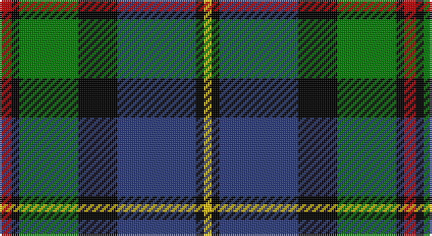

This page is one **sett** — a single exact thread-count. It belongs to the [tartan](/setts/r3k2g15k10db20k2ly2/)
(the same proportion at any scale), whose colour order is pattern [RKGKBKY](/stripes/rkgkbky/).

Sourced from weddslist.  It is a [7 stripe tartan](/stripes/stripes7/).

Original link http://www.weddslist.com/cgi-bin/tartans/pg.pl?source=sts

## Provenance

Earliest known date: 1831 This design appears in many early collections including Logans 'The Scottish Gael'(1831) and Smibert (1850). The sett has its source in the MacKenzie tartan used in 1777 by John MacKenzie called Lord MacLeod when he raised a regiment called 'Lord MacLeod's Highlanders'. The family claimed to be heirs of the last chief of Lewis, Roderick, who had died in 1595. (Tartans of Clan MacLeod. Rhuairidh MacLeod (1990).) This tartan was approved by Chief Norman Magnus, 26th Chief, in 1910, and has been the usual modern sett since then. The present Chief, John MacLeod, lives in Dunvegan Castle, Skye.

2 attestations — the source records this cloth was collapsed from (oldest owns this page)

<ul>
<li>undated — MacLeod, Macleod of Harris (weddslist, <a href="http://www.weddslist.com/cgi-bin/tartans/pg.pl?source=sts">record</a>)</li>
<li>undated — MacLeod Clan Tartan (house-of-tartan, <a href="http://www.house-of-tartan.scotland.net/house/TartanViewjs.asp?colr=Def&tnam=1583">record</a>)</li>
</ul>

## Thread count
R/6 K4 G30 K20 B40 K4 Y/4

One full sett is **206 threads**.

## Palette

Palette: <strong>Ingles Buchan</strong> <small style="color:#888">(1 of 5 colours)</small>
<table><thead><tr><th>Colour</th><th>Threads</th><th>Shade</th><th>Base</th><th>OKLCh</th></tr></thead><tbody><tr><td>R/</td><td style="text-align:right;font-variant-numeric:tabular-nums">6</td><td><code style="background-color:#C00000;">#C00000</code> <small style="color:#888">#C00000</small></td><td>R <code style="background-color:#CC0000;">#CC0000</code></td><td><small style="color:#888">oklch(50.7% 0.208 29.2)</small></td></tr><tr><td>K</td><td style="text-align:right;font-variant-numeric:tabular-nums">4</td><td><code style="background-color:#000000;">#000000</code> <small style="color:#888">#000000</small></td><td>K <code style="background-color:#000000;">#000000</code></td><td><small style="color:#888">oklch(0.0% 0.000 0.0)</small></td></tr><tr><td>G</td><td style="text-align:right;font-variant-numeric:tabular-nums">30</td><td><code style="background-color:#008000;">#008000</code> <small style="color:#888">#008000</small></td><td>G <code style="background-color:#006100;">#006100</code></td><td><small style="color:#888">oklch(52.0% 0.177 142.5)</small></td></tr><tr><td>K</td><td style="text-align:right;font-variant-numeric:tabular-nums">20</td><td><code style="background-color:#000000;">#000000</code> <small style="color:#888">#000000</small></td><td>K <code style="background-color:#000000;">#000000</code></td><td><small style="color:#888">oklch(0.0% 0.000 0.0)</small></td></tr><tr><td>B</td><td style="text-align:right;font-variant-numeric:tabular-nums">40</td><td><code style="background-color:#304080;">#304080</code> <small style="color:#888">#304080</small></td><td>B <code style="background-color:#2A418A;">#2A418A</code></td><td><small style="color:#888">oklch(39.4% 0.109 270.2)</small></td></tr><tr><td>K</td><td style="text-align:right;font-variant-numeric:tabular-nums">4</td><td><code style="background-color:#000000;">#000000</code> <small style="color:#888">#000000</small></td><td>K <code style="background-color:#000000;">#000000</code></td><td><small style="color:#888">oklch(0.0% 0.000 0.0)</small></td></tr><tr><td>Y/</td><td style="text-align:right;font-variant-numeric:tabular-nums">4</td><td><code style="background-color:#F0C000;">#F0C000</code> <small style="color:#888">#F0C000</small></td><td>Y <code style="background-color:#F2BF00;">#F2BF00</code></td><td><small style="color:#888">oklch(82.7% 0.169 90.5)</small></td></tr></tbody></table>

# Sample pattern

## Nearest tartans

The nearest existing variants by ΔTartan distance, with this tartan at the top so the swatches line up against it.

ΔTartan

Tartan

Sett

—

<a href="/ttd/edit/#slug=r3k2g15k10db20k2ly2~x2">MacLeod, Macleod of Harris</a> <a class="nn-out" href="/variants/s7/r3k2g15k10db20k2ly2~x2/" title="open its dictionary page">↗</a>

0.46

<a href="/ttd/edit/#slug=r3k2g15k10db20ly2~x2&amp;base=r3k2g15k10db20k2ly2~x2">MacLeod of Assynt</a> <a class="nn-out" href="/variants/s6/r3k2g15k10db20ly2~x2/" title="open its dictionary page">↗</a>

0.52

<a href="/ttd/edit/#slug=r2db23k14g16k2w2~x2&amp;base=r3k2g15k10db20k2ly2~x2">MacPhail, hunting</a> <a class="nn-out" href="/variants/s6/r2db23k14g16k2w2~x2/" title="open its dictionary page">↗</a>

0.62

<a href="/ttd/edit/#slug=g9t2g1k6db6r1db1~x2&amp;base=r3k2g15k10db20k2ly2~x2">MacTaggert</a> <a class="nn-out" href="/variants/s7/g9t2g1k6db6r1db1~x2/" title="open its dictionary page">↗</a>

0.65

<a href="/ttd/edit/#slug=db24k4r3k4g24k4lo4~x2&amp;base=r3k2g15k10db20k2ly2~x2">Skene</a> <a class="nn-out" href="/variants/s7/db24k4r3k4g24k4lo4~x2/" title="open its dictionary page">↗</a>

0.67

<a href="/ttd/edit/#slug=r2g8w1k8db8k1db1~x4&amp;base=r3k2g15k10db20k2ly2~x2">Colquhoun</a> <a class="nn-out" href="/variants/s7/r2g8w1k8db8k1db1~x4/" title="open its dictionary page">↗</a>

0.70

<a href="/ttd/edit/#slug=w1db8k9g9k1ly1~x4&amp;base=r3k2g15k10db20k2ly2~x2">MacNeil 4</a> <a class="nn-out" href="/variants/s6/w1db8k9g9k1ly1~x4/" title="open its dictionary page">↗</a>

0.73

<a href="/ttd/edit/#slug=g17ly2k14r2db9r2db10~x2&amp;base=r3k2g15k10db20k2ly2~x2">MacDonald, (Flora.. )</a> <a class="nn-out" href="/variants/s7/g17ly2k14r2db9r2db10~x2/" title="open its dictionary page">↗</a>

0.74

<a href="/ttd/edit/#slug=r5db3r3db29k29g29w4r4~x2&amp;base=r3k2g15k10db20k2ly2~x2">Borrodale</a> <a class="nn-out" href="/variants/s8/r5db3r3db29k29g29w4r4~x2/" title="open its dictionary page">↗</a>

0.74

<a href="/ttd/edit/#slug=k2g12k12r1db12w2~x2&amp;base=r3k2g15k10db20k2ly2~x2">Russell, or Mitchell or Hunter or Galbraith</a> <a class="nn-out" href="/variants/s6/k2g12k12r1db12w2~x2/" title="open its dictionary page">↗</a>

0.79

<a href="/ttd/edit/#slug=g3db12lr1k12g13r2g2~x2&amp;base=r3k2g15k10db20k2ly2~x2">MacPhadran</a> <a class="nn-out" href="/variants/s7/g3db12lr1k12g13r2g2~x2/" title="open its dictionary page">↗</a>

## Neighbour map

Every grey dot is one of 14360 variants placed by the first two principal components of the ΔTartan feature space (44% of its variance). Red is this tartan; blue dots are its nearest — click one to open its page.

<svg viewBox="0 0 640 380" role="img" style="max-width:100%;height:auto;border:1px solid #e0e0e0;border-radius:4px;display:block" xmlns="http://www.w3.org/2000/svg"><image href="/nn/cloud.v1.png" width="640" height="380"/><a href="/variants/s6/r3k2g15k10db20ly2~x2/"><circle cx="153.9" cy="194.2" r="4" fill="#3465a4"><title>MacLeod of Assynt</title></circle></a><a href="/variants/s6/r2db23k14g16k2w2~x2/"><circle cx="167.0" cy="187.3" r="4" fill="#3465a4"><title>MacPhail, hunting</title></circle></a><a href="/variants/s7/g9t2g1k6db6r1db1~x2/"><circle cx="144.7" cy="193.7" r="4" fill="#3465a4"><title>MacTaggert</title></circle></a><a href="/variants/s7/db24k4r3k4g24k4lo4~x2/"><circle cx="149.2" cy="183.6" r="4" fill="#3465a4"><title>Skene</title></circle></a><a href="/variants/s7/r2g8w1k8db8k1db1~x4/"><circle cx="110.6" cy="193.4" r="4" fill="#3465a4"><title>Colquhoun</title></circle></a><a href="/variants/s6/w1db8k9g9k1ly1~x4/"><circle cx="128.9" cy="197.7" r="4" fill="#3465a4"><title>MacNeil 4</title></circle></a><a href="/variants/s7/g17ly2k14r2db9r2db10~x2/"><circle cx="116.5" cy="200.3" r="4" fill="#3465a4"><title>MacDonald, (Flora.. )</title></circle></a><a href="/variants/s8/r5db3r3db29k29g29w4r4~x2/"><circle cx="114.1" cy="169.0" r="4" fill="#3465a4"><title>Borrodale</title></circle></a><a href="/variants/s6/k2g12k12r1db12w2~x2/"><circle cx="136.5" cy="191.5" r="4" fill="#3465a4"><title>Russell, or Mitchell or Hunter or Galbraith</title></circle></a><a href="/variants/s7/g3db12lr1k12g13r2g2~x2/"><circle cx="168.6" cy="181.1" r="4" fill="#3465a4"><title>MacPhadran</title></circle></a><circle cx="151.2" cy="180.6" r="5" fill="#c00000"/></svg>

ID: /variants/s7/r3k2g15k10db20k2ly2~x2/
