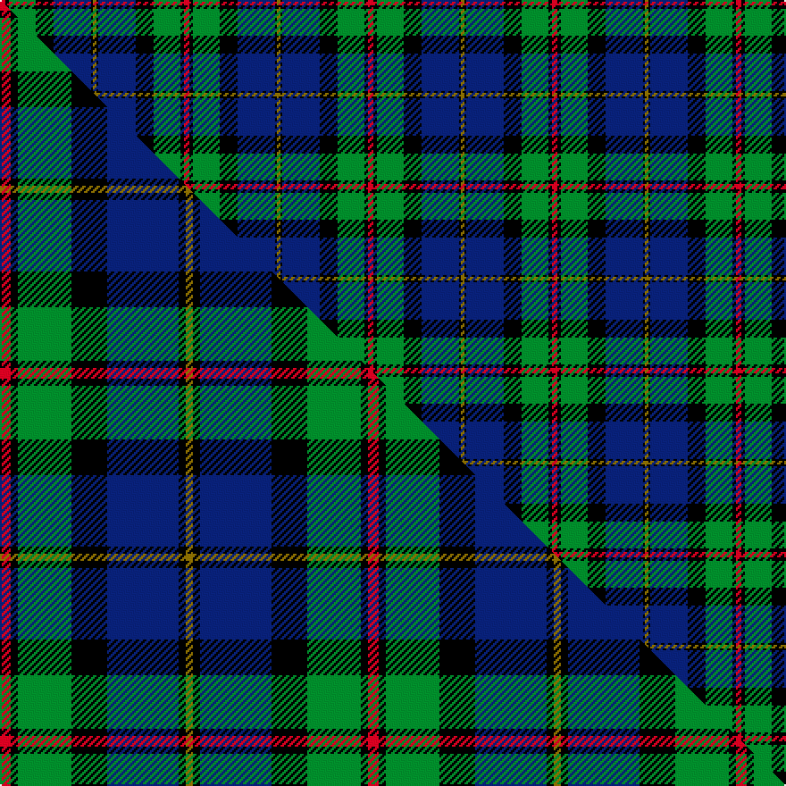

This page is one **sett** — a single exact thread-count. It belongs to the [tartan](/setts/r3k2g15k10db21k1y2/)
(the same proportion at any scale), whose colour order is pattern [GKBKGKR](/stripes/gkbkgkr/).

Part of the [MacLeod](/tartans/macleod/) tartan — the named design grouping this sett with its other cloths.

Sourced from weddslist.  It is a [7 stripe tartan](/stripes/stripes7/).

Original link http://www.weddslist.com/cgi-bin/tartans/pg.pl?source=rb

## Thread count
R/3 K2 G15 K10 DB21 K1 Y/2

One full sett is **103 threads**.

## Palette
<table><thead><tr><th>Colour</th><th>Shade</th><th>OKLCh</th></tr></thead><tbody><tr><td>DB</td><td><code style="background-color:#082077;">#082077</code> <small style="color:#888">#082077</small></td><td><small style="color:#888">oklch(30.0% 0.149 265.1)</small></td></tr><tr><td>G</td><td><code style="background-color:#008B2A;">#008B2A</code> <small style="color:#888">#008B2A</small></td><td><small style="color:#888">oklch(55.4% 0.170 145.9)</small></td></tr><tr><td>K</td><td><code style="background-color:#000000;">#000000</code> <small style="color:#888">#000000</small></td><td><small style="color:#888">oklch(0.0% 0.000 0.0)</small></td></tr><tr><td>R</td><td><code style="background-color:#D60020;">#D60020</code> <small style="color:#888">#D60020</small></td><td><small style="color:#888">oklch(55.2% 0.224 25.5)</small></td></tr><tr><td>Y</td><td><code style="background-color:#8B6E00;">#8B6E00</code> <small style="color:#888">#8B6E00</small></td><td><small style="color:#888">oklch(55.1% 0.113 90.4)</small></td></tr></tbody></table>

# Sample pattern

## Compared to the master

This cloth is one sett of its design; the master sett (the exemplar the design is anchored on) is below for comparison.

Its **ΔTartan distance** from the master is **1.14** — the same measure the nearest-tartans table ranks by (0 is identical; a re-scale of the same cloth is near 0, a recolour or a different proportion further).

<figure class="master-compare" style="margin:0">

this sett
master sett ★

<figcaption style="color:#888;font-size:smaller">One weave of this sett against the <a href="/setts/r3k2g15k10db20k2y2/">master sett ★</a>, split on the diagonal: a shared proportion runs seamlessly across it with only the shades shifting; a different proportion breaks on it.</figcaption>
</figure>

## Nearest tartan variants

The nearest existing variants by ΔTartan distance, with this cloth at the top so the swatches line up against it.

ΔTartan

Threads

Variant

Sett

—

103

<a href="/variants/s7/r3k2g15k10db21k1y2/">MacLeod</a>

<a href="/ttd/edit/#slug=r1k1g7k5db10k1y1~x2&amp;base=r3k2g15k10db21k1y2" title="compare in the TTD">0.52</a>

100

<a href="/variants/s7/r1k1g7k5db10k1y1~x2/">MacLeod Small Clan Tartan</a>

<a href="/ttd/edit/#slug=y3k1db20k16g20k1w3~x2&amp;base=r3k2g15k10db21k1y2" title="compare in the TTD">0.74</a>

244

<a href="/variants/s7/y3k1db20k16g20k1w3~x2/">MacCormick</a>

<a href="/ttd/edit/#slug=r2k4db23k14g16y1k4y2~x2&amp;base=r3k2g15k10db21k1y2" title="compare in the TTD">1.13</a>

256

<a href="/variants/s8/r2k4db23k14g16y1k4y2~x2/">Thomas, baron of Craigie, Robert (Personal)</a>

<a href="/ttd/edit/#slug=k2r1g15k15db15y1k2~x2&amp;base=r3k2g15k10db21k1y2" title="compare in the TTD">1.64</a>

196

<a href="/variants/s7/k2r1g15k15db15y1k2~x2/">MacCaskill</a>

<a href="/ttd/edit/#slug=y3k1g20k20db18lb3~x2&amp;base=r3k2g15k10db21k1y2" title="compare in the TTD">1.86</a>

248

<a href="/variants/s6/y3k1g20k20db18lb3~x2/">Smith</a>

<a href="/ttd/edit/#slug=ly3k1g20k20db18lb3~x2&amp;base=r3k2g15k10db21k1y2" title="compare in the TTD">1.86</a>

248

<a href="/variants/s6/ly3k1g20k20db18lb3~x2/">Smith, Sir William (?)</a>

<a href="/ttd/edit/#slug=y2k6g33k33db33r3w2~x2&amp;base=r3k2g15k10db21k1y2" title="compare in the TTD">2.05</a>

440

<a href="/variants/s7/y2k6g33k33db33r3w2~x2/">MacNeil - 1840 (Chief's sett)</a>

<a href="/ttd/edit/#slug=r2db23k14g16k2w2~x2&amp;base=r3k2g15k10db21k1y2" title="compare in the TTD">2.07</a>

228

<a href="/variants/s6/r2db23k14g16k2w2~x2/">MacPhail Hunting</a>

<a href="/ttd/edit/#slug=r6db32k18g28k1lb2~x2&amp;base=r3k2g15k10db21k1y2" title="compare in the TTD">2.14</a>

332

<a href="/variants/s6/r6db32k18g28k1lb2~x2/">Naysmith (Name)</a>

<a href="/ttd/edit/#slug=y6g28r4k20r3db45k5~x2&amp;base=r3k2g15k10db21k1y2" title="compare in the TTD">2.34</a>

422

<a href="/variants/s7/y6g28r4k20r3db45k5~x2/">Nery</a>

## Neighbour map

Every grey dot is one of 13620 variants placed by the first two principal components of the ΔTartan feature space (42% of its variance). Red is this tartan; blue dots are its nearest — click one to open its page.

<svg viewBox="0 0 640 380" role="img" style="max-width:100%;height:auto;border:1px solid #e0e0e0;border-radius:4px;display:block" xmlns="http://www.w3.org/2000/svg"><image href="/nn/cloud.v1.png" width="640" height="380"/><a href="/variants/s7/r1k1g7k5db10k1y1~x2/"><circle cx="152.7" cy="170.1" r="4" fill="#3465a4"><title>MacLeod Small Clan Tartan</title></circle></a><a href="/variants/s7/y3k1db20k16g20k1w3~x2/"><circle cx="135.2" cy="145.8" r="4" fill="#3465a4"><title>MacCormick</title></circle></a><a href="/variants/s8/r2k4db23k14g16y1k4y2~x2/"><circle cx="163.7" cy="133.0" r="4" fill="#3465a4"><title>Thomas, baron of Craigie, Robert (Personal)</title></circle></a><a href="/variants/s7/k2r1g15k15db15y1k2~x2/"><circle cx="158.4" cy="151.7" r="4" fill="#3465a4"><title>MacCaskill</title></circle></a><a href="/variants/s6/y3k1g20k20db18lb3~x2/"><circle cx="137.3" cy="162.8" r="4" fill="#3465a4"><title>Smith</title></circle></a><a href="/variants/s6/ly3k1g20k20db18lb3~x2/"><circle cx="132.4" cy="161.4" r="4" fill="#3465a4"><title>Smith, Sir William (?)</title></circle></a><a href="/variants/s7/y2k6g33k33db33r3w2~x2/"><circle cx="133.9" cy="137.7" r="4" fill="#3465a4"><title>MacNeil - 1840 (Chief's sett)</title></circle></a><a href="/variants/s6/r2db23k14g16k2w2~x2/"><circle cx="152.7" cy="176.0" r="4" fill="#3465a4"><title>MacPhail Hunting</title></circle></a><a href="/variants/s6/r6db32k18g28k1lb2~x2/"><circle cx="179.7" cy="140.3" r="4" fill="#3465a4"><title>Naysmith (Name)</title></circle></a><a href="/variants/s7/y6g28r4k20r3db45k5~x2/"><circle cx="170.8" cy="153.6" r="4" fill="#3465a4"><title>Nery</title></circle></a><circle cx="176.5" cy="141.2" r="5" fill="#c00000"/><text x="320" y="376" text-anchor="middle" font-size="11" fill="#999">ground</text><text x="11" y="190" text-anchor="middle" font-size="11" fill="#999" transform="rotate(-90 11 190)">complexity</text></svg>

ID: /variants/s7/r3k2g15k10db21k1y2/
