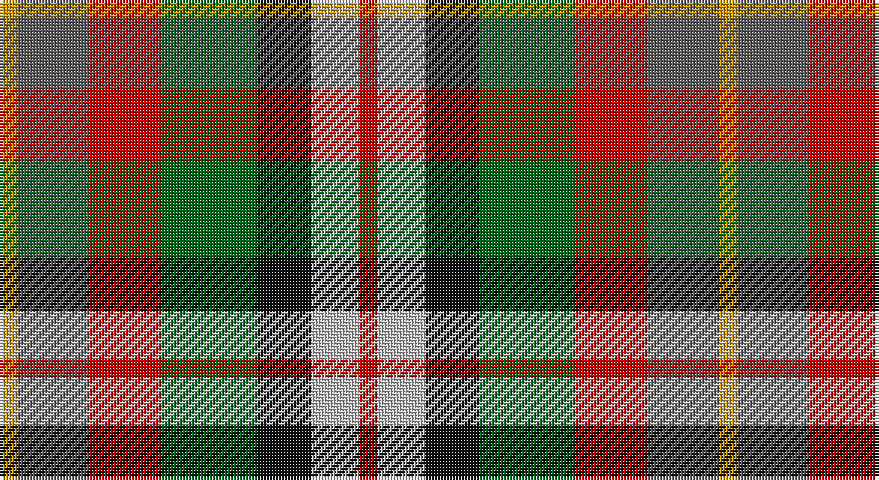

This page is one **sett** — a single exact thread-count. It belongs to the [tartan](/setts/r3lb8k9g16r12n12lo3/)
(the same proportion at any scale), whose colour order is pattern [RWKGRBY](/stripes/rwkgrby/).

Part of the [Alabama](/tartans/alabama/) tartan — the named design grouping this sett with its other cloths.

Sourced from tartans-authority.  It is a [7 stripe tartan](/stripes/stripes7/).

Original link http://www.tartansauthority.com/tartan-ferret/display/3033/

## Provenance

Earliest known date: 2002 No details known possibly a fashion tartan.

## Also known as

This cloth is also recorded under:

- Alabama Fancy

2 attestations — the source records this cloth was collapsed from (oldest owns this page)

<ul>
<li>pre 2002 — Alabama (Fashion) (tartans-authority, <a href="http://www.tartansauthority.com/tartan-ferret/display/3033/">record</a>)</li>
<li>undated — Alabama Fancy Tartan (house-of-tartan, <a href="http://www.house-of-tartan.scotland.net/house/TartanViewjs.asp?colr=Def&tnam=3033">record</a>)</li>
</ul>

## Register references

External register numbers recorded for this tartan.

- Scottish Tartans Authority (ITI): 3033

## Thread count
DY/6 N24 R24 G32 K18 Na16 R/6

One full sett is **240 threads**.

## Palette

Palette: <strong>Tartan Register</strong> <small style="color:#888">(4 of 6 colours)</small>
<table><thead><tr><th>Colour</th><th>Threads</th><th>Shade</th><th>Base</th><th>OKLCh</th></tr></thead><tbody><tr><td>DY/</td><td style="text-align:right;font-variant-numeric:tabular-nums">6</td><td><code style="background-color:#D09800;">#D09800</code> <small style="color:#888">#D09800</small></td><td>Y <code style="background-color:#F2BF00;">#F2BF00</code></td><td><small style="color:#888">oklch(71.4% 0.147 82.1)</small></td></tr><tr><td>N</td><td style="text-align:right;font-variant-numeric:tabular-nums">24</td><td><code style="background-color:#5C5C5C;">#5C5C5C</code> <small style="color:#888">#5C5C5C</small></td><td>B <code style="background-color:#2A418A;">#2A418A</code></td><td><small style="color:#888">oklch(47.5% 0.000 89.9)</small></td></tr><tr><td>R</td><td style="text-align:right;font-variant-numeric:tabular-nums">24</td><td><code style="background-color:#C80000;">#C80000</code> <small style="color:#888">#C80000</small></td><td>R <code style="background-color:#CC0000;">#CC0000</code></td><td><small style="color:#888">oklch(52.3% 0.215 29.2)</small></td></tr><tr><td>G</td><td style="text-align:right;font-variant-numeric:tabular-nums">32</td><td><code style="background-color:#006818;">#006818</code> <small style="color:#888">#006818</small></td><td>G <code style="background-color:#006100;">#006100</code></td><td><small style="color:#888">oklch(45.0% 0.142 145.0)</small></td></tr><tr><td>K</td><td style="text-align:right;font-variant-numeric:tabular-nums">18</td><td><code style="background-color:#101010;">#101010</code> <small style="color:#888">#101010</small></td><td>K <code style="background-color:#000000;">#000000</code></td><td><small style="color:#888">oklch(17.3% 0.000 89.9)</small></td></tr><tr><td>Na</td><td style="text-align:right;font-variant-numeric:tabular-nums">16</td><td><code style="background-color:#C0C0C0;">#C0C0C0</code> <small style="color:#888">#C0C0C0</small></td><td>W <code style="background-color:#F7F7F7;">#F7F7F7</code></td><td><small style="color:#888">oklch(80.8% 0.000 89.9)</small></td></tr><tr><td>R/</td><td style="text-align:right;font-variant-numeric:tabular-nums">6</td><td><code style="background-color:#C80000;">#C80000</code> <small style="color:#888">#C80000</small></td><td>R <code style="background-color:#CC0000;">#CC0000</code></td><td><small style="color:#888">oklch(52.3% 0.215 29.2)</small></td></tr></tbody></table>

# Sample pattern

## Compared to the master

This cloth is one sett of its design; the master sett (the exemplar the design is anchored on) is below for comparison.

<figure style="margin:0"><figcaption style="color:#888;font-size:smaller">this sett</figcaption></figure>
<figure style="margin:0"><figcaption style="color:#888;font-size:smaller"><a href="/setts/r5w3dt2w1dt4ri1dt1ri3dt1ri1dt4o4t1o1t1o4dt4b25w1b2w2b2w3/">master sett →</a></figcaption></figure>

## Nearest tartans

The nearest existing variants by ΔTartan distance, with this tartan at the top so the swatches line up against it.

ΔTartan

Tartan

Sett

—

<a href="/ttd/edit/#slug=r3lb8k9g16r12n12lo3~x2">Alabama (Fashion)</a> <a class="nn-out" href="/variants/s7/r3lb8k9g16r12n12lo3~x2/" title="open its dictionary page">↗</a>

0.88

<a href="/ttd/edit/#slug=lo6r8k4w6y16k13lr19k5~x2&amp;base=r3lb8k9g16r12n12lo3~x2">Kilkenny County Crest (Fashion)</a> <a class="nn-out" href="/variants/s8/lo6r8k4w6y16k13lr19k5~x2/" title="open its dictionary page">↗</a>

0.94

<a href="/ttd/edit/#slug=dy19g23ly3db15r11w5~x2&amp;base=r3lb8k9g16r12n12lo3~x2">Mekos, The</a> <a class="nn-out" href="/variants/s6/dy19g23ly3db15r11w5~x2/" title="open its dictionary page">↗</a>

1.02

<a href="/ttd/edit/#slug=r1lo4dr3r1dr3lr1g3db3lr1~x4&amp;base=r3lb8k9g16r12n12lo3~x2">Isle of Arran (Personal)</a> <a class="nn-out" href="/variants/s9/r1lo4dr3r1dr3lr1g3db3lr1~x4/" title="open its dictionary page">↗</a>

1.11

<a href="/ttd/edit/#slug=r8lo4ly3g6t6dp1~x5&amp;base=r3lb8k9g16r12n12lo3~x2">Pride, The Tartan of</a> <a class="nn-out" href="/variants/s6/r8lo4ly3g6t6dp1~x5/" title="open its dictionary page">↗</a>

1.16

<a href="/ttd/edit/#slug=w5y4b1y4r4b1dg4ly1~x2&amp;base=r3lb8k9g16r12n12lo3~x2">Devon Rural Skills Trust</a> <a class="nn-out" href="/variants/s8/w5y4b1y4r4b1dg4ly1~x2/" title="open its dictionary page">↗</a>

1.23

<a href="/ttd/edit/#slug=r1dy3g5lo5dt5t1~x4&amp;base=r3lb8k9g16r12n12lo3~x2">Loch Fyne</a> <a class="nn-out" href="/variants/s6/r1dy3g5lo5dt5t1~x4/" title="open its dictionary page">↗</a>

1.26

<a href="/ttd/edit/#slug=r10lr36k24r30lo8k16w18db16lo9&amp;base=r3lb8k9g16r12n12lo3~x2">Tipperary County Crest (Fashion)</a> <a class="nn-out" href="/variants/s9/r10lr36k24r30lo8k16w18db16lo9/" title="open its dictionary page">↗</a>

1.28

<a href="/ttd/edit/#slug=g13w2g10k5r13k3r5dt15o5~x2&amp;base=r3lb8k9g16r12n12lo3~x2">Glen Chalmadale</a> <a class="nn-out" href="/variants/s9/g13w2g10k5r13k3r5dt15o5~x2/" title="open its dictionary page">↗</a>

1.32

<a href="/ttd/edit/#slug=g8y8t7r5o2k2o2k2o2~x2&amp;base=r3lb8k9g16r12n12lo3~x2">Somerset</a> <a class="nn-out" href="/variants/s9/g8y8t7r5o2k2o2k2o2~x2/" title="open its dictionary page">↗</a>

1.32

<a href="/ttd/edit/#slug=lb3g6lb1db1r5db2o5db1lb3~x4&amp;base=r3lb8k9g16r12n12lo3~x2">Wombles 7 (Corporate)</a> <a class="nn-out" href="/variants/s9/lb3g6lb1db1r5db2o5db1lb3~x4/" title="open its dictionary page">↗</a>

## Neighbour map

Every grey dot is one of 14360 variants placed by the first two principal components of the ΔTartan feature space (44% of its variance). Red is this tartan; blue dots are its nearest — click one to open its page.

<svg viewBox="0 0 640 380" role="img" style="max-width:100%;height:auto;border:1px solid #e0e0e0;border-radius:4px;display:block" xmlns="http://www.w3.org/2000/svg"><image href="/nn/cloud.v1.png" width="640" height="380"/><a href="/variants/s8/lo6r8k4w6y16k13lr19k5~x2/"><circle cx="20.6" cy="204.5" r="4" fill="#3465a4"><title>Kilkenny County Crest (Fashion)</title></circle></a><a href="/variants/s6/dy19g23ly3db15r11w5~x2/"><circle cx="70.3" cy="207.0" r="4" fill="#3465a4"><title>Mekos, The</title></circle></a><a href="/variants/s9/r1lo4dr3r1dr3lr1g3db3lr1~x4/"><circle cx="16.1" cy="212.0" r="4" fill="#3465a4"><title>Isle of Arran (Personal)</title></circle></a><a href="/variants/s6/r8lo4ly3g6t6dp1~x5/"><circle cx="64.3" cy="209.5" r="4" fill="#3465a4"><title>Pride, The Tartan of</title></circle></a><a href="/variants/s8/w5y4b1y4r4b1dg4ly1~x2/"><circle cx="44.4" cy="204.1" r="4" fill="#3465a4"><title>Devon Rural Skills Trust</title></circle></a><a href="/variants/s6/r1dy3g5lo5dt5t1~x4/"><circle cx="48.1" cy="237.5" r="4" fill="#3465a4"><title>Loch Fyne</title></circle></a><a href="/variants/s9/r10lr36k24r30lo8k16w18db16lo9/"><circle cx="14.0" cy="202.2" r="4" fill="#3465a4"><title>Tipperary County Crest (Fashion)</title></circle></a><a href="/variants/s9/g13w2g10k5r13k3r5dt15o5~x2/"><circle cx="91.0" cy="198.2" r="4" fill="#3465a4"><title>Glen Chalmadale</title></circle></a><a href="/variants/s9/g8y8t7r5o2k2o2k2o2~x2/"><circle cx="14.0" cy="211.8" r="4" fill="#3465a4"><title>Somerset</title></circle></a><a href="/variants/s9/lb3g6lb1db1r5db2o5db1lb3~x4/"><circle cx="50.7" cy="200.5" r="4" fill="#3465a4"><title>Wombles 7 (Corporate)</title></circle></a><circle cx="25.5" cy="218.8" r="5" fill="#c00000"/></svg>

ID: /variants/s7/r3lb8k9g16r12n12lo3~x2/
