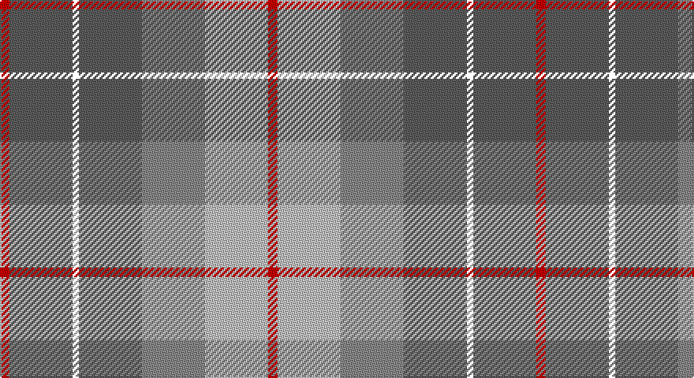

This page is one **sett** — a single exact thread-count. It belongs to the [tartan](/setts/r3n20k2n20o20lb20r3/)
(the same proportion at any scale), whose colour order is pattern [RBKBRWR](/stripes/rbkbrwr/).

Part of the [Brodie Silver](/tartans/brodie-silver/) tartan — the named design grouping this sett with its other cloths.

Sourced from register-of-tartans.  It is a [7 stripe tartan](/stripes/stripes7/).

Original link https://www.tartanregister.gov.uk/tartanDetails.aspx?ref=373

## Also known as

This cloth is also recorded under:

- Brodie, Silver

## Register references

External register numbers recorded for this tartan.

- Scottish Register of Tartans: [373](https://www.tartanregister.gov.uk/tartanDetails.aspx?ref=373)
- Scottish Tartans Authority (ITI): 1630
- Scottish Tartans World Register: 1630

## Thread count
R/6 N40 Y4 N40 Na40 Nb40 R/6

One full sett is **340 threads**.

## Palette

Palette: <strong>Tartan Register</strong> <small style="color:#888">(3 of 4 colours)</small>
<table><thead><tr><th>Colour</th><th>Threads</th><th>Shade</th><th>Base</th><th>OKLCh</th></tr></thead><tbody><tr><td>R/</td><td style="text-align:right;font-variant-numeric:tabular-nums">6</td><td><code style="background-color:#C80000;">#C80000</code> <small style="color:#888">#C80000</small></td><td>R <code style="background-color:#CC0000;">#CC0000</code></td><td><small style="color:#888">oklch(52.3% 0.215 29.2)</small></td></tr><tr><td>N</td><td style="text-align:right;font-variant-numeric:tabular-nums">40</td><td><code style="background-color:#5C5C5C;">#5C5C5C</code> <small style="color:#888">#5C5C5C</small></td><td>B <code style="background-color:#2A418A;">#2A418A</code></td><td><small style="color:#888">oklch(47.5% 0.000 89.9)</small></td></tr><tr><td></td><td style="text-align:right;font-variant-numeric:tabular-nums">4</td><td><code style="background-color:;"></code> <small style="color:#888"></small></td><td> <code style="background-color:;"></code></td><td><small style="color:#888"></small></td></tr><tr><td>N</td><td style="text-align:right;font-variant-numeric:tabular-nums">40</td><td><code style="background-color:#5C5C5C;">#5C5C5C</code> <small style="color:#888">#5C5C5C</small></td><td>B <code style="background-color:#2A418A;">#2A418A</code></td><td><small style="color:#888">oklch(47.5% 0.000 89.9)</small></td></tr><tr><td>Na</td><td style="text-align:right;font-variant-numeric:tabular-nums">40</td><td><code style="background-color:#888888;">#888888</code> <small style="color:#888">#888888</small></td><td>R <code style="background-color:#CC0000;">#CC0000</code></td><td><small style="color:#888">oklch(62.7% 0.000 89.9)</small></td></tr><tr><td>Nb</td><td style="text-align:right;font-variant-numeric:tabular-nums">40</td><td><code style="background-color:#C0C0C0;">#C0C0C0</code> <small style="color:#888">#C0C0C0</small></td><td>W <code style="background-color:#F7F7F7;">#F7F7F7</code></td><td><small style="color:#888">oklch(80.8% 0.000 89.9)</small></td></tr><tr><td>R/</td><td style="text-align:right;font-variant-numeric:tabular-nums">6</td><td><code style="background-color:#C80000;">#C80000</code> <small style="color:#888">#C80000</small></td><td>R <code style="background-color:#CC0000;">#CC0000</code></td><td><small style="color:#888">oklch(52.3% 0.215 29.2)</small></td></tr></tbody></table>

# Sample pattern

## Nearest tartans

The nearest existing variants by ΔTartan distance, with this tartan at the top so the swatches line up against it.

ΔTartan

Tartan

Sett

—

<a href="/ttd/edit/#slug=r3n20k2n20o20lb20r3~x2">Brodie Silver</a> <a class="nn-out" href="/variants/s7/r3n20k2n20o20lb20r3~x2/" title="open its dictionary page">↗</a>

0.16

<a href="/ttd/edit/#slug=r3n20ly2n20y20lb20r3~x2&amp;base=r3n20k2n20o20lb20r3~x2">Brodie, Silver</a> <a class="nn-out" href="/variants/s7/r3n20ly2n20y20lb20r3~x2/" title="open its dictionary page">↗</a>

0.62

<a href="/ttd/edit/#slug=r3n20ly2n20o20lb20r3~x2&amp;base=r3n20k2n20o20lb20r3~x2">Brodie Silver Clan Tartan</a> <a class="nn-out" href="/variants/s7/r3n20ly2n20o20lb20r3~x2/" title="open its dictionary page">↗</a>

0.96

<a href="/ttd/edit/#slug=g11lo10dp11t33w3~x2&amp;base=r3n20k2n20o20lb20r3~x2">Sterling, Rob (Florida) (Persona Name Tartan</a> <a class="nn-out" href="/variants/s5/g11lo10dp11t33w3~x2/" title="open its dictionary page">↗</a>

1.02

<a href="/ttd/edit/#slug=y15k10n30o11w3y5~x2&amp;base=r3n20k2n20o20lb20r3~x2">McHale (Personal)</a> <a class="nn-out" href="/variants/s6/y15k10n30o11w3y5~x2/" title="open its dictionary page">↗</a>

1.14

<a href="/ttd/edit/#slug=t4r1ly1t12do4y10ly1r3~x4&amp;base=r3n20k2n20o20lb20r3~x2">Hawaii (District)</a> <a class="nn-out" href="/variants/s8/t4r1ly1t12do4y10ly1r3~x4/" title="open its dictionary page">↗</a>

1.19

<a href="/ttd/edit/#slug=t24r27g20lo6g20r2w3~x2&amp;base=r3n20k2n20o20lb20r3~x2">Buchanhaven Heritage</a> <a class="nn-out" href="/variants/s7/t24r27g20lo6g20r2w3~x2/" title="open its dictionary page">↗</a>

1.19

<a href="/ttd/edit/#slug=db30ly3dy11ly3y33r6~x2&amp;base=r3n20k2n20o20lb20r3~x2">Balfour</a> <a class="nn-out" href="/variants/s6/db30ly3dy11ly3y33r6~x2/" title="open its dictionary page">↗</a>

1.20

<a href="/ttd/edit/#slug=n2r10n10o3r2lr24w2~x2&amp;base=r3n20k2n20o20lb20r3~x2">Un-named Dutch</a> <a class="nn-out" href="/variants/s7/n2r10n10o3r2lr24w2~x2/" title="open its dictionary page">↗</a>

1.21

<a href="/ttd/edit/#slug=y19r3t19r11y19ly2db4~x2&amp;base=r3n20k2n20o20lb20r3~x2">Rotary Corporate Tartan</a> <a class="nn-out" href="/variants/s7/y19r3t19r11y19ly2db4~x2/" title="open its dictionary page">↗</a>

1.22

<a href="/ttd/edit/#slug=w15lo98do72r25do8lg15&amp;base=r3n20k2n20o20lb20r3~x2">Afternoon Tea / Milk Tea</a> <a class="nn-out" href="/variants/s6/w15lo98do72r25do8lg15/" title="open its dictionary page">↗</a>

## Neighbour map

Every grey dot is one of 14360 variants placed by the first two principal components of the ΔTartan feature space (44% of its variance). Red is this tartan; blue dots are its nearest — click one to open its page.

<svg viewBox="0 0 640 380" role="img" style="max-width:100%;height:auto;border:1px solid #e0e0e0;border-radius:4px;display:block" xmlns="http://www.w3.org/2000/svg"><image href="/nn/cloud.v1.png" width="640" height="380"/><a href="/variants/s7/r3n20ly2n20y20lb20r3~x2/"><circle cx="221.0" cy="208.5" r="4" fill="#3465a4"><title>Brodie, Silver</title></circle></a><a href="/variants/s7/r3n20ly2n20o20lb20r3~x2/"><circle cx="236.1" cy="215.5" r="4" fill="#3465a4"><title>Brodie Silver Clan Tartan</title></circle></a><a href="/variants/s5/g11lo10dp11t33w3~x2/"><circle cx="242.2" cy="215.6" r="4" fill="#3465a4"><title>Sterling, Rob (Florida) (Persona Name Tartan</title></circle></a><a href="/variants/s6/y15k10n30o11w3y5~x2/"><circle cx="200.4" cy="218.8" r="4" fill="#3465a4"><title>McHale (Personal)</title></circle></a><a href="/variants/s8/t4r1ly1t12do4y10ly1r3~x4/"><circle cx="249.5" cy="191.4" r="4" fill="#3465a4"><title>Hawaii (District)</title></circle></a><a href="/variants/s7/t24r27g20lo6g20r2w3~x2/"><circle cx="225.2" cy="209.0" r="4" fill="#3465a4"><title>Buchanhaven Heritage</title></circle></a><a href="/variants/s6/db30ly3dy11ly3y33r6~x2/"><circle cx="213.9" cy="197.6" r="4" fill="#3465a4"><title>Balfour</title></circle></a><a href="/variants/s7/n2r10n10o3r2lr24w2~x2/"><circle cx="250.7" cy="170.5" r="4" fill="#3465a4"><title>Un-named Dutch</title></circle></a><a href="/variants/s7/y19r3t19r11y19ly2db4~x2/"><circle cx="265.0" cy="226.0" r="4" fill="#3465a4"><title>Rotary Corporate Tartan</title></circle></a><a href="/variants/s6/w15lo98do72r25do8lg15/"><circle cx="227.2" cy="182.2" r="4" fill="#3465a4"><title>Afternoon Tea / Milk Tea</title></circle></a><circle cx="219.5" cy="208.0" r="5" fill="#c00000"/></svg>

ID: /variants/s7/r3n20k2n20o20lb20r3~x2/
