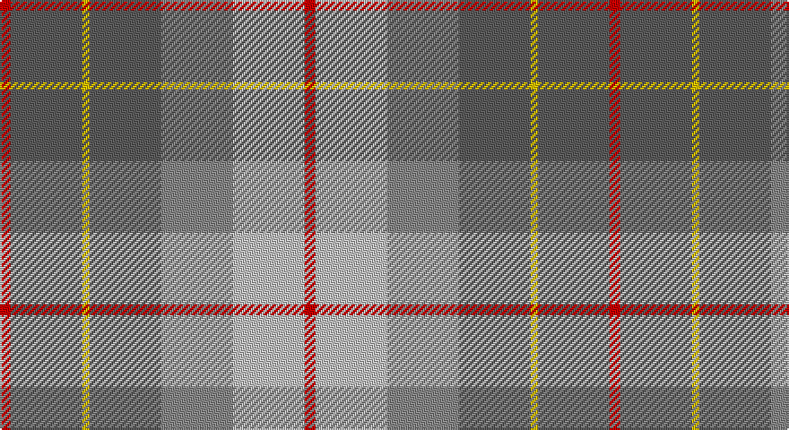

This page is one **sett** — a single exact thread-count. It belongs to the [tartan](/setts/r3n20ly2n20o20lb20r3/)
(the same proportion at any scale), whose colour order is pattern [RBYBRWR](/stripes/rbybrwr/).

Part of the [Brodie Silver](/tartans/brodie-silver/) tartan — the named design grouping this sett with its other cloths.

Sourced from house-of-tartan.  It is a [7 stripe tartan](/stripes/stripes7/).

Original link http://www.house-of-tartan.scotland.net/house/TartanViewjs.asp?colr=Def&tnam=1630

## Provenance

Earliest known date: c.1940-50 Probably a trade design based on Hunting Brodie, that has appeared in the last forty years. It is sometimes referred to as muted Brodie. (P.E. MacDonald, STS 1984)

## Also known as

This cloth is also recorded under:

- Brodie, Silver

## Thread count
R/6 N40 Y4 N40 Na40 Nb40 R/6

One full sett is **340 threads**.

## Palette

Palette: <strong>Tartan Register</strong> <small style="color:#888">(4 of 5 colours)</small>
<table><thead><tr><th>Colour</th><th>Threads</th><th>Shade</th><th>Base</th><th>OKLCh</th></tr></thead><tbody><tr><td>R/</td><td style="text-align:right;font-variant-numeric:tabular-nums">6</td><td><code style="background-color:#C80000;">#C80000</code> <small style="color:#888">#C80000</small></td><td>R <code style="background-color:#CC0000;">#CC0000</code></td><td><small style="color:#888">oklch(52.3% 0.215 29.2)</small></td></tr><tr><td>N</td><td style="text-align:right;font-variant-numeric:tabular-nums">40</td><td><code style="background-color:#5C5C5C;">#5C5C5C</code> <small style="color:#888">#5C5C5C</small></td><td>B <code style="background-color:#2A418A;">#2A418A</code></td><td><small style="color:#888">oklch(47.5% 0.000 89.9)</small></td></tr><tr><td>Y</td><td style="text-align:right;font-variant-numeric:tabular-nums">4</td><td><code style="background-color:#E8C000;">#E8C000</code> <small style="color:#888">#E8C000</small></td><td>Y <code style="background-color:#F2BF00;">#F2BF00</code></td><td><small style="color:#888">oklch(81.9% 0.168 93.7)</small></td></tr><tr><td>N</td><td style="text-align:right;font-variant-numeric:tabular-nums">40</td><td><code style="background-color:#5C5C5C;">#5C5C5C</code> <small style="color:#888">#5C5C5C</small></td><td>B <code style="background-color:#2A418A;">#2A418A</code></td><td><small style="color:#888">oklch(47.5% 0.000 89.9)</small></td></tr><tr><td>Na</td><td style="text-align:right;font-variant-numeric:tabular-nums">40</td><td><code style="background-color:#888888;">#888888</code> <small style="color:#888">#888888</small></td><td>R <code style="background-color:#CC0000;">#CC0000</code></td><td><small style="color:#888">oklch(62.7% 0.000 89.9)</small></td></tr><tr><td>Nb</td><td style="text-align:right;font-variant-numeric:tabular-nums">40</td><td><code style="background-color:#C0C0C0;">#C0C0C0</code> <small style="color:#888">#C0C0C0</small></td><td>W <code style="background-color:#F7F7F7;">#F7F7F7</code></td><td><small style="color:#888">oklch(80.8% 0.000 89.9)</small></td></tr><tr><td>R/</td><td style="text-align:right;font-variant-numeric:tabular-nums">6</td><td><code style="background-color:#C80000;">#C80000</code> <small style="color:#888">#C80000</small></td><td>R <code style="background-color:#CC0000;">#CC0000</code></td><td><small style="color:#888">oklch(52.3% 0.215 29.2)</small></td></tr></tbody></table>

# Sample pattern

## Compared to the master

This cloth is one sett of its design; the master sett (the exemplar the design is anchored on) is below for comparison.

<figure style="margin:0"><figcaption style="color:#888;font-size:smaller">this sett</figcaption></figure>
<figure style="margin:0"><figcaption style="color:#888;font-size:smaller"><a href="/setts/r3n20k2n20o20lb20r3/">master sett →</a></figcaption></figure>

## Nearest tartans

The nearest existing variants by ΔTartan distance, with this tartan at the top so the swatches line up against it.

ΔTartan

Tartan

Sett

—

<a href="/ttd/edit/#slug=r3n20ly2n20o20lb20r3~x2">Brodie Silver Clan Tartan</a> <a class="nn-out" href="/variants/s7/r3n20ly2n20o20lb20r3~x2/" title="open its dictionary page">↗</a>

0.62

<a href="/ttd/edit/#slug=r3n20k2n20o20lb20r3~x2&amp;base=r3n20ly2n20o20lb20r3~x2">Brodie Silver</a> <a class="nn-out" href="/variants/s7/r3n20k2n20o20lb20r3~x2/" title="open its dictionary page">↗</a>

0.63

<a href="/ttd/edit/#slug=r3n20ly2n20y20lb20r3~x2&amp;base=r3n20ly2n20o20lb20r3~x2">Brodie, Silver</a> <a class="nn-out" href="/variants/s7/r3n20ly2n20y20lb20r3~x2/" title="open its dictionary page">↗</a>

0.85

<a href="/ttd/edit/#slug=t24r27g20lo6g20r2w3~x2&amp;base=r3n20ly2n20o20lb20r3~x2">Buchanhaven Heritage</a> <a class="nn-out" href="/variants/s7/t24r27g20lo6g20r2w3~x2/" title="open its dictionary page">↗</a>

0.97

<a href="/ttd/edit/#slug=y19r3t19r11y19ly2db4~x2&amp;base=r3n20ly2n20o20lb20r3~x2">Rotary Corporate Tartan</a> <a class="nn-out" href="/variants/s7/y19r3t19r11y19ly2db4~x2/" title="open its dictionary page">↗</a>

1.03

<a href="/ttd/edit/#slug=t4r1ly1t12do4y10ly1r3~x4&amp;base=r3n20ly2n20o20lb20r3~x2">Hawaii (District)</a> <a class="nn-out" href="/variants/s8/t4r1ly1t12do4y10ly1r3~x4/" title="open its dictionary page">↗</a>

1.13

<a href="/ttd/edit/#slug=g11lo10dp11t33w3~x2&amp;base=r3n20ly2n20o20lb20r3~x2">Sterling, Rob (Florida) (Persona Name Tartan</a> <a class="nn-out" href="/variants/s5/g11lo10dp11t33w3~x2/" title="open its dictionary page">↗</a>

1.18

<a href="/ttd/edit/#slug=y15k10n30o11w3y5~x2&amp;base=r3n20ly2n20o20lb20r3~x2">McHale (Personal)</a> <a class="nn-out" href="/variants/s6/y15k10n30o11w3y5~x2/" title="open its dictionary page">↗</a>

1.25

<a href="/ttd/edit/#slug=db30ly3o11ly3y33r6~x2&amp;base=r3n20ly2n20o20lb20r3~x2">Balfour</a> <a class="nn-out" href="/variants/s6/db30ly3o11ly3y33r6~x2/" title="open its dictionary page">↗</a>

1.36

<a href="/ttd/edit/#slug=n2r10n10o3r2lr24w2~x2&amp;base=r3n20ly2n20o20lb20r3~x2">Un-named Dutch</a> <a class="nn-out" href="/variants/s7/n2r10n10o3r2lr24w2~x2/" title="open its dictionary page">↗</a>

1.37

<a href="/ttd/edit/#slug=y25p3y8p13lyi8lr2ly11y2p3~x2&amp;base=r3n20ly2n20o20lb20r3~x2">Organic</a> <a class="nn-out" href="/variants/s9/y25p3y8p13lyi8lr2ly11y2p3~x2/" title="open its dictionary page">↗</a>

## Neighbour map

Every grey dot is one of 14360 variants placed by the first two principal components of the ΔTartan feature space (44% of its variance). Red is this tartan; blue dots are its nearest — click one to open its page.

<svg viewBox="0 0 640 380" role="img" style="max-width:100%;height:auto;border:1px solid #e0e0e0;border-radius:4px;display:block" xmlns="http://www.w3.org/2000/svg"><image href="/nn/cloud.v1.png" width="640" height="380"/><a href="/variants/s7/r3n20k2n20o20lb20r3~x2/"><circle cx="219.5" cy="208.0" r="4" fill="#3465a4"><title>Brodie Silver</title></circle></a><a href="/variants/s7/r3n20ly2n20y20lb20r3~x2/"><circle cx="221.0" cy="208.5" r="4" fill="#3465a4"><title>Brodie, Silver</title></circle></a><a href="/variants/s7/t24r27g20lo6g20r2w3~x2/"><circle cx="225.2" cy="209.0" r="4" fill="#3465a4"><title>Buchanhaven Heritage</title></circle></a><a href="/variants/s7/y19r3t19r11y19ly2db4~x2/"><circle cx="265.0" cy="226.0" r="4" fill="#3465a4"><title>Rotary Corporate Tartan</title></circle></a><a href="/variants/s8/t4r1ly1t12do4y10ly1r3~x4/"><circle cx="249.5" cy="191.4" r="4" fill="#3465a4"><title>Hawaii (District)</title></circle></a><a href="/variants/s5/g11lo10dp11t33w3~x2/"><circle cx="242.2" cy="215.6" r="4" fill="#3465a4"><title>Sterling, Rob (Florida) (Persona Name Tartan</title></circle></a><a href="/variants/s6/y15k10n30o11w3y5~x2/"><circle cx="200.4" cy="218.8" r="4" fill="#3465a4"><title>McHale (Personal)</title></circle></a><a href="/variants/s6/db30ly3o11ly3y33r6~x2/"><circle cx="228.9" cy="204.8" r="4" fill="#3465a4"><title>Balfour</title></circle></a><a href="/variants/s7/n2r10n10o3r2lr24w2~x2/"><circle cx="250.7" cy="170.5" r="4" fill="#3465a4"><title>Un-named Dutch</title></circle></a><a href="/variants/s9/y25p3y8p13lyi8lr2ly11y2p3~x2/"><circle cx="269.3" cy="190.9" r="4" fill="#3465a4"><title>Organic</title></circle></a><circle cx="236.1" cy="215.5" r="5" fill="#c00000"/></svg>

ID: /variants/s7/r3n20ly2n20o20lb20r3~x2/
