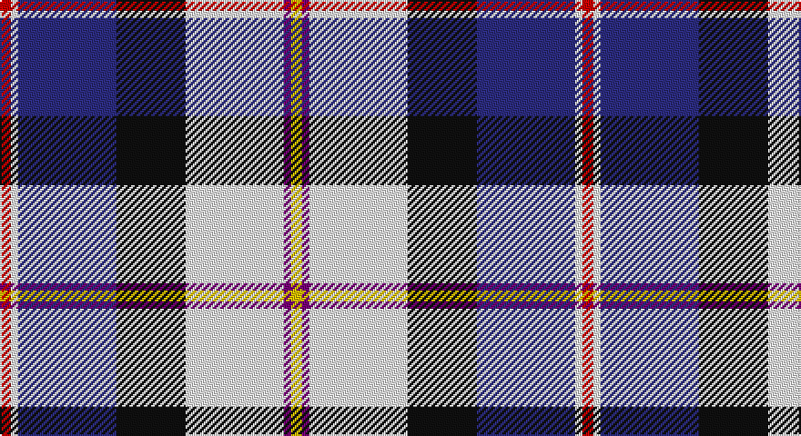

This page is one **sett** — a single exact thread-count. It belongs to the [tartan](/setts/r3w2db27k19w27dp2ly3/)
(the same proportion at any scale), whose colour order is pattern [RWBKWBY](/stripes/rwbkwby/).

Sourced from register-of-tartans.  It is a [7 stripe tartan](/stripes/stripes7/).

Original link https://www.tartanregister.gov.uk/tartanDetails.aspx?ref=646

2 attestations — the source records this cloth was collapsed from (oldest owns this page)

<ul>
<li>01/01/2005 — Christian Dress (Personal) (register-of-tartans, <a href="https://www.tartanregister.gov.uk/tartanDetails.aspx?ref=646">record</a>)</li>
<li>2005 January — Christian Dress (Personal) (tartans-authority, <a href="http://www.tartansauthority.com/tartan-ferret/display/6831/">record</a>)</li>
</ul>

## Register references

External register numbers recorded for this tartan.

- Scottish Register of Tartans: [646](https://www.tartanregister.gov.uk/tartanDetails.aspx?ref=646)
- Scottish Tartans Authority (ITI): 6831

## Thread count
R/6 W4 DB54 K38 W54 P4 Y/6

One full sett is **320 threads**.

## Palette

Palette: <strong>Tartan Register</strong>
<table><thead><tr><th>Colour</th><th>Threads</th><th>Shade</th><th>Base</th><th>OKLCh</th></tr></thead><tbody><tr><td>R/</td><td style="text-align:right;font-variant-numeric:tabular-nums">6</td><td><code style="background-color:#C80000;">#C80000</code> <small style="color:#888">#C80000</small></td><td>R <code style="background-color:#CC0000;">#CC0000</code></td><td><small style="color:#888">oklch(52.3% 0.215 29.2)</small></td></tr><tr><td>W</td><td style="text-align:right;font-variant-numeric:tabular-nums">4</td><td><code style="background-color:#F8F8F8;">#F8F8F8</code> <small style="color:#888">#F8F8F8</small></td><td>W <code style="background-color:#F7F7F7;">#F7F7F7</code></td><td><small style="color:#888">oklch(97.9% 0.000 89.9)</small></td></tr><tr><td>DB</td><td style="text-align:right;font-variant-numeric:tabular-nums">54</td><td><code style="background-color:#2C2C80;">#2C2C80</code> <small style="color:#888">#2C2C80</small></td><td>B <code style="background-color:#2A418A;">#2A418A</code></td><td><small style="color:#888">oklch(35.0% 0.138 276.6)</small></td></tr><tr><td>K</td><td style="text-align:right;font-variant-numeric:tabular-nums">38</td><td><code style="background-color:#101010;">#101010</code> <small style="color:#888">#101010</small></td><td>K <code style="background-color:#000000;">#000000</code></td><td><small style="color:#888">oklch(17.3% 0.000 89.9)</small></td></tr><tr><td>W</td><td style="text-align:right;font-variant-numeric:tabular-nums">54</td><td><code style="background-color:#F8F8F8;">#F8F8F8</code> <small style="color:#888">#F8F8F8</small></td><td>W <code style="background-color:#F7F7F7;">#F7F7F7</code></td><td><small style="color:#888">oklch(97.9% 0.000 89.9)</small></td></tr><tr><td>P</td><td style="text-align:right;font-variant-numeric:tabular-nums">4</td><td><code style="background-color:#780078;">#780078</code> <small style="color:#888">#780078</small></td><td>B <code style="background-color:#2A418A;">#2A418A</code></td><td><small style="color:#888">oklch(40.2% 0.185 328.4)</small></td></tr><tr><td>Y/</td><td style="text-align:right;font-variant-numeric:tabular-nums">6</td><td><code style="background-color:#E8C000;">#E8C000</code> <small style="color:#888">#E8C000</small></td><td>Y <code style="background-color:#F2BF00;">#F2BF00</code></td><td><small style="color:#888">oklch(81.9% 0.168 93.7)</small></td></tr></tbody></table>

# Sample pattern

## Nearest tartans

The nearest existing variants by ΔTartan distance, with this tartan at the top so the swatches line up against it.

ΔTartan

Tartan

Sett

—

<a href="/ttd/edit/#slug=r3w2db27k19w27dp2ly3~x2">Christian Dress (Personal)</a> <a class="nn-out" href="/variants/s7/r3w2db27k19w27dp2ly3~x2/" title="open its dictionary page">↗</a>

0.84

<a href="/ttd/edit/#slug=ly2r1t16k5p2w11p1~x4&amp;base=r3w2db27k19w27dp2ly3~x2">Dignan</a> <a class="nn-out" href="/variants/s7/ly2r1t16k5p2w11p1~x4/" title="open its dictionary page">↗</a>

0.88

<a href="/ttd/edit/#slug=k6w49db50dp6dbi8ly4&amp;base=r3w2db27k19w27dp2ly3~x2">Pipers' Trail Dance, The</a> <a class="nn-out" href="/variants/s6/k6w49db50dp6dbi8ly4/" title="open its dictionary page">↗</a>

0.90

<a href="/ttd/edit/#slug=r2db14k6g1w12g1w2~x4&amp;base=r3w2db27k19w27dp2ly3~x2">Davidson (Wedding) (Personal)</a> <a class="nn-out" href="/variants/s7/r2db14k6g1w12g1w2~x4/" title="open its dictionary page">↗</a>

0.92

<a href="/ttd/edit/#slug=dp4k2w3k2db30g9k4w20ly3~x2&amp;base=r3w2db27k19w27dp2ly3~x2">Minnesota Dress</a> <a class="nn-out" href="/variants/s9/dp4k2w3k2db30g9k4w20ly3~x2/" title="open its dictionary page">↗</a>

1.04

<a href="/ttd/edit/#slug=r6t3dp24ly2k23w23k2w6~x2&amp;base=r3w2db27k19w27dp2ly3~x2">Culloden Dress</a> <a class="nn-out" href="/variants/s8/r6t3dp24ly2k23w23k2w6~x2/" title="open its dictionary page">↗</a>

1.04

<a href="/ttd/edit/#slug=g5db22g6k10w24ly2db2w2r2~x2&amp;base=r3w2db27k19w27dp2ly3~x2">Haymarket, dress Blue</a> <a class="nn-out" href="/variants/s9/g5db22g6k10w24ly2db2w2r2~x2/" title="open its dictionary page">↗</a>

1.08

<a href="/ttd/edit/#slug=ly6k2t15r5t9k13w25db2w3db2~x2&amp;base=r3w2db27k19w27dp2ly3~x2">Gillies, dress Blue</a> <a class="nn-out" href="/variants/s10/ly6k2t15r5t9k13w25db2w3db2~x2/" title="open its dictionary page">↗</a>

1.09

<a href="/ttd/edit/#slug=r6db2dp21w3dg19w26dg3w5~x2&amp;base=r3w2db27k19w27dp2ly3~x2">Culloden Dress Ancient</a> <a class="nn-out" href="/variants/s8/r6db2dp21w3dg19w26dg3w5~x2/" title="open its dictionary page">↗</a>

1.09

<a href="/ttd/edit/#slug=db1t9w3ly3db9ly1g1r1~x4&amp;base=r3w2db27k19w27dp2ly3~x2">Curd (2013)</a> <a class="nn-out" href="/variants/s8/db1t9w3ly3db9ly1g1r1~x4/" title="open its dictionary page">↗</a>

1.12

<a href="/ttd/edit/#slug=db68k42w32r5w32dg4w6&amp;base=r3w2db27k19w27dp2ly3~x2">Ferguson Dress #2</a> <a class="nn-out" href="/variants/s7/db68k42w32r5w32dg4w6/" title="open its dictionary page">↗</a>

## Neighbour map

Every grey dot is one of 14360 variants placed by the first two principal components of the ΔTartan feature space (44% of its variance). Red is this tartan; blue dots are its nearest — click one to open its page.

<svg viewBox="0 0 640 380" role="img" style="max-width:100%;height:auto;border:1px solid #e0e0e0;border-radius:4px;display:block" xmlns="http://www.w3.org/2000/svg"><image href="/nn/cloud.v1.png" width="640" height="380"/><a href="/variants/s7/ly2r1t16k5p2w11p1~x4/"><circle cx="159.1" cy="116.6" r="4" fill="#3465a4"><title>Dignan</title></circle></a><a href="/variants/s6/k6w49db50dp6dbi8ly4/"><circle cx="158.4" cy="129.3" r="4" fill="#3465a4"><title>Pipers' Trail Dance, The</title></circle></a><a href="/variants/s7/r2db14k6g1w12g1w2~x4/"><circle cx="148.7" cy="139.6" r="4" fill="#3465a4"><title>Davidson (Wedding) (Personal)</title></circle></a><a href="/variants/s9/dp4k2w3k2db30g9k4w20ly3~x2/"><circle cx="142.1" cy="106.5" r="4" fill="#3465a4"><title>Minnesota Dress</title></circle></a><a href="/variants/s8/r6t3dp24ly2k23w23k2w6~x2/"><circle cx="96.7" cy="123.4" r="4" fill="#3465a4"><title>Culloden Dress</title></circle></a><a href="/variants/s9/g5db22g6k10w24ly2db2w2r2~x2/"><circle cx="104.7" cy="118.5" r="4" fill="#3465a4"><title>Haymarket, dress Blue</title></circle></a><a href="/variants/s10/ly6k2t15r5t9k13w25db2w3db2~x2/"><circle cx="86.9" cy="115.7" r="4" fill="#3465a4"><title>Gillies, dress Blue</title></circle></a><a href="/variants/s8/r6db2dp21w3dg19w26dg3w5~x2/"><circle cx="151.8" cy="142.5" r="4" fill="#3465a4"><title>Culloden Dress Ancient</title></circle></a><a href="/variants/s8/db1t9w3ly3db9ly1g1r1~x4/"><circle cx="108.8" cy="144.5" r="4" fill="#3465a4"><title>Curd (2013)</title></circle></a><a href="/variants/s7/db68k42w32r5w32dg4w6/"><circle cx="159.6" cy="149.0" r="4" fill="#3465a4"><title>Ferguson Dress #2</title></circle></a><circle cx="118.8" cy="125.1" r="5" fill="#c00000"/></svg>

ID: /variants/s7/r3w2db27k19w27dp2ly3~x2/
