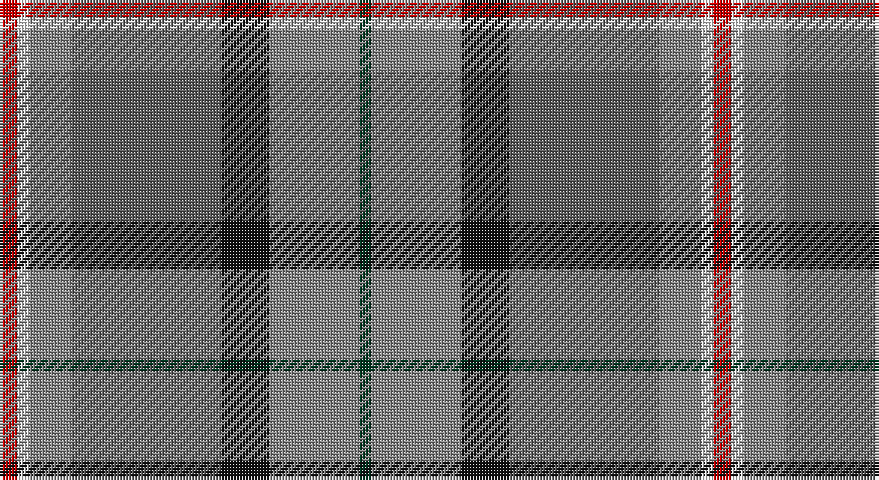

This page is one **sett** — a single exact thread-count. It belongs to the [tartan](/setts/r3w2o7n25k8o15dg2/)
(the same proportion at any scale), whose colour order is pattern [GRKBRWR](/stripes/grkbrwr/).

Part of the [Allman-Jones](/tartans/allman-jones/) tartan — the named design grouping this sett with its other cloths.

Sourced from tartans-authority.  It is a [7 stripe tartan](/stripes/stripes7/).

Original link http://www.tartansauthority.com/tartan-ferret/display/10925/

## Register references

External register numbers recorded for this tartan.

- Scottish Register of Tartans: [10925](https://www.tartanregister.gov.uk/tartanDetails?ref=10925)
- Scottish Tartans Authority (ITI): 10925

## Thread count
R/6 W4 Na14 N50 K16 Na30 DG/4

One full sett is **238 threads**.

## Palette

Palette: <strong>Tartan Register</strong> <small style="color:#888">(5 of 6 colours)</small>
<table><thead><tr><th>Colour</th><th>Threads</th><th>Shade</th><th>Base</th><th>OKLCh</th></tr></thead><tbody><tr><td>R/</td><td style="text-align:right;font-variant-numeric:tabular-nums">6</td><td><code style="background-color:#C80000;">#C80000</code> <small style="color:#888">#C80000</small></td><td>R <code style="background-color:#CC0000;">#CC0000</code></td><td><small style="color:#888">oklch(52.3% 0.215 29.2)</small></td></tr><tr><td>W</td><td style="text-align:right;font-variant-numeric:tabular-nums">4</td><td><code style="background-color:#FCFCFC;">#FCFCFC</code> <small style="color:#888">#FCFCFC</small></td><td>W <code style="background-color:#F7F7F7;">#F7F7F7</code></td><td><small style="color:#888">oklch(99.1% 0.000 89.9)</small></td></tr><tr><td>Na</td><td style="text-align:right;font-variant-numeric:tabular-nums">14</td><td><code style="background-color:#888888;">#888888</code> <small style="color:#888">#888888</small></td><td>R <code style="background-color:#CC0000;">#CC0000</code></td><td><small style="color:#888">oklch(62.7% 0.000 89.9)</small></td></tr><tr><td>N</td><td style="text-align:right;font-variant-numeric:tabular-nums">50</td><td><code style="background-color:#5C5C5C;">#5C5C5C</code> <small style="color:#888">#5C5C5C</small></td><td>B <code style="background-color:#2A418A;">#2A418A</code></td><td><small style="color:#888">oklch(47.5% 0.000 89.9)</small></td></tr><tr><td>K</td><td style="text-align:right;font-variant-numeric:tabular-nums">16</td><td><code style="background-color:#101010;">#101010</code> <small style="color:#888">#101010</small></td><td>K <code style="background-color:#000000;">#000000</code></td><td><small style="color:#888">oklch(17.3% 0.000 89.9)</small></td></tr><tr><td>Na</td><td style="text-align:right;font-variant-numeric:tabular-nums">30</td><td><code style="background-color:#888888;">#888888</code> <small style="color:#888">#888888</small></td><td>R <code style="background-color:#CC0000;">#CC0000</code></td><td><small style="color:#888">oklch(62.7% 0.000 89.9)</small></td></tr><tr><td>DG/</td><td style="text-align:right;font-variant-numeric:tabular-nums">4</td><td><code style="background-color:#003820;">#003820</code> <small style="color:#888">#003820</small></td><td>G <code style="background-color:#006100;">#006100</code></td><td><small style="color:#888">oklch(30.0% 0.070 158.3)</small></td></tr></tbody></table>

# Sample pattern

## Compared to the master

This cloth is one sett of its design; the master sett (the exemplar the design is anchored on) is below for comparison.

<figure style="margin:0"><figcaption style="color:#888;font-size:smaller">this sett</figcaption></figure>
<figure style="margin:0"><figcaption style="color:#888;font-size:smaller"><a href="/setts/r3w2y7n25k8y15dg2/">master sett →</a></figcaption></figure>

## Nearest tartans

The nearest existing variants by ΔTartan distance, with this tartan at the top so the swatches line up against it.

ΔTartan

Tartan

Sett

—

<a href="/ttd/edit/#slug=r3w2o7n25k8o15dg2~x2">Allman-Jones (Personal)</a> <a class="nn-out" href="/variants/s7/r3w2o7n25k8o15dg2~x2/" title="open its dictionary page">↗</a>

0.37

<a href="/ttd/edit/#slug=r3w2y7n25k8y15dg2~x2&amp;base=r3w2o7n25k8o15dg2~x2">Allman-Jones (Personal)</a> <a class="nn-out" href="/variants/s7/r3w2y7n25k8y15dg2~x2/" title="open its dictionary page">↗</a>

0.79

<a href="/ttd/edit/#slug=r16ly2dy7ly2b24k2g2~x2&amp;base=r3w2o7n25k8o15dg2~x2">Traill Clan/Family Weavers Tartan</a> <a class="nn-out" href="/variants/s7/r16ly2dy7ly2b24k2g2~x2/" title="open its dictionary page">↗</a>

0.83

<a href="/ttd/edit/#slug=o3db1o11w1k5n14lo3~x4&amp;base=r3w2o7n25k8o15dg2~x2">Glen Lyon (Fashion)</a> <a class="nn-out" href="/variants/s7/o3db1o11w1k5n14lo3~x4/" title="open its dictionary page">↗</a>

0.88

<a href="/ttd/edit/#slug=o4do2o21db11w2oi20r3~x2&amp;base=r3w2o7n25k8o15dg2~x2">Barbour Dress</a> <a class="nn-out" href="/variants/s7/o4do2o21db11w2oi20r3~x2/" title="open its dictionary page">↗</a>

0.97

<a href="/ttd/edit/#slug=r4do27lo6n19b38lb4~x2&amp;base=r3w2o7n25k8o15dg2~x2">State Seal of Michigan (Fashion)</a> <a class="nn-out" href="/variants/s6/r4do27lo6n19b38lb4~x2/" title="open its dictionary page">↗</a>

1.04

<a href="/ttd/edit/#slug=lb5o49lb3dg24r5lo4dy30lb4~x2&amp;base=r3w2o7n25k8o15dg2~x2">State Seal of New Mexico (Fashion)</a> <a class="nn-out" href="/variants/s8/lb5o49lb3dg24r5lo4dy30lb4~x2/" title="open its dictionary page">↗</a>

1.06

<a href="/ttd/edit/#slug=db30ly3dy11ly3y33r6~x2&amp;base=r3w2o7n25k8o15dg2~x2">Balfour</a> <a class="nn-out" href="/variants/s6/db30ly3dy11ly3y33r6~x2/" title="open its dictionary page">↗</a>

1.09

<a href="/ttd/edit/#slug=dy2o2dg19o6dg2o6lo14r4w2~x2&amp;base=r3w2o7n25k8o15dg2~x2">Royal Pharmaceutical Society (Corp)</a> <a class="nn-out" href="/variants/s9/dy2o2dg19o6dg2o6lo14r4w2~x2/" title="open its dictionary page">↗</a>

1.10

<a href="/ttd/edit/#slug=w3n25m3r3m3r5g10m3k2~x2&amp;base=r3w2o7n25k8o15dg2~x2">Edinburgh District (District)</a> <a class="nn-out" href="/variants/s9/w3n25m3r3m3r5g10m3k2~x2/" title="open its dictionary page">↗</a>

1.10

<a href="/ttd/edit/#slug=db2r1db10w1o4g8ly1g2~x4&amp;base=r3w2o7n25k8o15dg2~x2">Ayrshire</a> <a class="nn-out" href="/variants/s8/db2r1db10w1o4g8ly1g2~x4/" title="open its dictionary page">↗</a>

## Neighbour map

Every grey dot is one of 14360 variants placed by the first two principal components of the ΔTartan feature space (44% of its variance). Red is this tartan; blue dots are its nearest — click one to open its page.

<svg viewBox="0 0 640 380" role="img" style="max-width:100%;height:auto;border:1px solid #e0e0e0;border-radius:4px;display:block" xmlns="http://www.w3.org/2000/svg"><image href="/nn/cloud.v1.png" width="640" height="380"/><a href="/variants/s7/r3w2y7n25k8y15dg2~x2/"><circle cx="213.8" cy="174.7" r="4" fill="#3465a4"><title>Allman-Jones (Personal)</title></circle></a><a href="/variants/s7/r16ly2dy7ly2b24k2g2~x2/"><circle cx="211.7" cy="152.9" r="4" fill="#3465a4"><title>Traill Clan/Family Weavers Tartan</title></circle></a><a href="/variants/s7/o3db1o11w1k5n14lo3~x4/"><circle cx="181.2" cy="164.7" r="4" fill="#3465a4"><title>Glen Lyon (Fashion)</title></circle></a><a href="/variants/s7/o4do2o21db11w2oi20r3~x2/"><circle cx="189.2" cy="168.1" r="4" fill="#3465a4"><title>Barbour Dress</title></circle></a><a href="/variants/s6/r4do27lo6n19b38lb4~x2/"><circle cx="173.6" cy="196.3" r="4" fill="#3465a4"><title>State Seal of Michigan (Fashion)</title></circle></a><a href="/variants/s8/lb5o49lb3dg24r5lo4dy30lb4~x2/"><circle cx="196.5" cy="136.2" r="4" fill="#3465a4"><title>State Seal of New Mexico (Fashion)</title></circle></a><a href="/variants/s6/db30ly3dy11ly3y33r6~x2/"><circle cx="213.9" cy="197.6" r="4" fill="#3465a4"><title>Balfour</title></circle></a><a href="/variants/s9/dy2o2dg19o6dg2o6lo14r4w2~x2/"><circle cx="157.2" cy="162.8" r="4" fill="#3465a4"><title>Royal Pharmaceutical Society (Corp)</title></circle></a><a href="/variants/s9/w3n25m3r3m3r5g10m3k2~x2/"><circle cx="205.5" cy="136.7" r="4" fill="#3465a4"><title>Edinburgh District (District)</title></circle></a><a href="/variants/s8/db2r1db10w1o4g8ly1g2~x4/"><circle cx="191.7" cy="173.1" r="4" fill="#3465a4"><title>Ayrshire</title></circle></a><circle cx="205.8" cy="168.8" r="5" fill="#c00000"/></svg>

ID: /variants/s7/r3w2o7n25k8o15dg2~x2/
