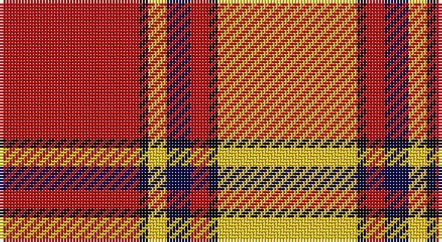

This page is one **sett** — a single exact thread-count. It belongs to the [tartan](/setts/r46k3ly6db8r6k3ly46/)
(the same proportion at any scale), whose colour order is pattern [RKYBRKY](/stripes/rkybrky/).

Part of the [Scrymgeour](/tartans/scrymgeour/) tartan — the named design grouping this sett with its other cloths.

Sourced from weddslist.  It is a [7 stripe tartan](/stripes/stripes7/).

Original link http://www.weddslist.com/cgi-bin/tartans/pg.pl?source=rb

## Thread count
R/46 K3 Y6 DB8 R6 K3 Y/46

One full sett is **144 threads**.

## Palette

Palette: <strong>Tartan Register</strong> <small style="color:#888">(2 of 4 colours)</small>
<table><thead><tr><th>Colour</th><th>Threads</th><th>Shade</th><th>Base</th><th>OKLCh</th></tr></thead><tbody><tr><td>R/</td><td style="text-align:right;font-variant-numeric:tabular-nums">46</td><td><code style="background-color:#C80000;">#C80000</code> <small style="color:#888">#C80000</small></td><td>R <code style="background-color:#CC0000;">#CC0000</code></td><td><small style="color:#888">oklch(52.3% 0.215 29.2)</small></td></tr><tr><td>K</td><td style="text-align:right;font-variant-numeric:tabular-nums">3</td><td><code style="background-color:#000000;">#000000</code> <small style="color:#888">#000000</small></td><td>K <code style="background-color:#000000;">#000000</code></td><td><small style="color:#888">oklch(0.0% 0.000 0.0)</small></td></tr><tr><td>Y</td><td style="text-align:right;font-variant-numeric:tabular-nums">6</td><td><code style="background-color:#FFC800;">#FFC800</code> <small style="color:#888">#FFC800</small></td><td>Y <code style="background-color:#F2BF00;">#F2BF00</code></td><td><small style="color:#888">oklch(85.7% 0.175 88.5)</small></td></tr><tr><td>DB</td><td style="text-align:right;font-variant-numeric:tabular-nums">8</td><td><code style="background-color:#00004C;">#00004C</code> <small style="color:#888">#00004C</small></td><td>B <code style="background-color:#2A418A;">#2A418A</code></td><td><small style="color:#888">oklch(18.8% 0.130 264.1)</small></td></tr><tr><td>R</td><td style="text-align:right;font-variant-numeric:tabular-nums">6</td><td><code style="background-color:#C80000;">#C80000</code> <small style="color:#888">#C80000</small></td><td>R <code style="background-color:#CC0000;">#CC0000</code></td><td><small style="color:#888">oklch(52.3% 0.215 29.2)</small></td></tr><tr><td>K</td><td style="text-align:right;font-variant-numeric:tabular-nums">3</td><td><code style="background-color:#000000;">#000000</code> <small style="color:#888">#000000</small></td><td>K <code style="background-color:#000000;">#000000</code></td><td><small style="color:#888">oklch(0.0% 0.000 0.0)</small></td></tr><tr><td>Y/</td><td style="text-align:right;font-variant-numeric:tabular-nums">46</td><td><code style="background-color:#FFC800;">#FFC800</code> <small style="color:#888">#FFC800</small></td><td>Y <code style="background-color:#F2BF00;">#F2BF00</code></td><td><small style="color:#888">oklch(85.7% 0.175 88.5)</small></td></tr></tbody></table>

# Sample pattern

## Compared to the master

This cloth is one sett of its design; the master sett (the exemplar the design is anchored on) is below for comparison.

<figure style="margin:0"><figcaption style="color:#888;font-size:smaller">this sett</figcaption></figure>
<figure style="margin:0"><figcaption style="color:#888;font-size:smaller"><a href="/setts/r15k1lo2g3r2k1lo15/">master sett →</a></figcaption></figure>

## Nearest tartans

The nearest existing variants by ΔTartan distance, with this tartan at the top so the swatches line up against it.

ΔTartan

Tartan

Sett

—

<a href="/ttd/edit/#slug=r46k3ly6db8r6k3ly46">Scrymgeour</a> <a class="nn-out" href="/variants/s7/r46k3ly6db8r6k3ly46/" title="open its dictionary page">↗</a>

0.95

<a href="/ttd/edit/#slug=g5ly5g5ly35ri44r3ri3~x2&amp;base=r46k3ly6db8r6k3ly46">Fernandes (Personal)</a> <a class="nn-out" href="/variants/s7/g5ly5g5ly35ri44r3ri3~x2/" title="open its dictionary page">↗</a>

0.98

<a href="/ttd/edit/#slug=o15k1ly2db3o2k1ly15~x4&amp;base=r46k3ly6db8r6k3ly46">Scrymgeour Family Tartan</a> <a class="nn-out" href="/variants/s7/o15k1ly2db3o2k1ly15~x4/" title="open its dictionary page">↗</a>

1.25

<a href="/ttd/edit/#slug=r15k1ly2db3r2k1ly15~x6&amp;base=r46k3ly6db8r6k3ly46">Scrymgeour</a> <a class="nn-out" href="/variants/s7/r15k1ly2db3r2k1ly15~x6/" title="open its dictionary page">↗</a>

1.25

<a href="/ttd/edit/#slug=r15k1ly2db3r2k1ly15~x3&amp;base=r46k3ly6db8r6k3ly46">Scrymgeour</a> <a class="nn-out" href="/variants/s7/r15k1ly2db3r2k1ly15~x3/" title="open its dictionary page">↗</a>

1.30

<a href="/ttd/edit/#slug=ri3r2db2r30w30db2w3~x2&amp;base=r46k3ly6db8r6k3ly46">Torridon, Cherry (Dance)</a> <a class="nn-out" href="/variants/s7/ri3r2db2r30w30db2w3~x2/" title="open its dictionary page">↗</a>

1.44

<a href="/ttd/edit/#slug=db4ly1r12ly2r2ly12r1ly4~x4&amp;base=r46k3ly6db8r6k3ly46">Glassary #3</a> <a class="nn-out" href="/variants/s8/db4ly1r12ly2r2ly12r1ly4~x4/" title="open its dictionary page">↗</a>

1.48

<a href="/ttd/edit/#slug=r3ri3w23ri3r3ri23k2ri3~x2&amp;base=r46k3ly6db8r6k3ly46">Cameron, Hose for E</a> <a class="nn-out" href="/variants/s8/r3ri3w23ri3r3ri23k2ri3~x2/" title="open its dictionary page">↗</a>

1.51

<a href="/ttd/edit/#slug=db4r1ly12r2ly2r12ly1db4~x4&amp;base=r46k3ly6db8r6k3ly46">Glassary #2</a> <a class="nn-out" href="/variants/s8/db4r1ly12r2ly2r12ly1db4~x4/" title="open its dictionary page">↗</a>

1.53

<a href="/ttd/edit/#slug=g1ly1g1w1g10r20ly1~x4&amp;base=r46k3ly6db8r6k3ly46">Maver (Buckie)</a> <a class="nn-out" href="/variants/s7/g1ly1g1w1g10r20ly1~x4/" title="open its dictionary page">↗</a>

1.54

<a href="/ttd/edit/#slug=ri42rii2w2rii2ri5r12w32ri4~x2&amp;base=r46k3ly6db8r6k3ly46">Longniddry Burgundy (Dance)</a> <a class="nn-out" href="/variants/s8/ri42rii2w2rii2ri5r12w32ri4~x2/" title="open its dictionary page">↗</a>

## Neighbour map

Every grey dot is one of 14360 variants placed by the first two principal components of the ΔTartan feature space (44% of its variance). Red is this tartan; blue dots are its nearest — click one to open its page.

<svg viewBox="0 0 640 380" role="img" style="max-width:100%;height:auto;border:1px solid #e0e0e0;border-radius:4px;display:block" xmlns="http://www.w3.org/2000/svg"><image href="/nn/cloud.v1.png" width="640" height="380"/><a href="/variants/s7/g5ly5g5ly35ri44r3ri3~x2/"><circle cx="283.3" cy="143.7" r="4" fill="#3465a4"><title>Fernandes (Personal)</title></circle></a><a href="/variants/s7/o15k1ly2db3o2k1ly15~x4/"><circle cx="266.4" cy="146.3" r="4" fill="#3465a4"><title>Scrymgeour Family Tartan</title></circle></a><a href="/variants/s7/r15k1ly2db3r2k1ly15~x6/"><circle cx="265.9" cy="149.7" r="4" fill="#3465a4"><title>Scrymgeour</title></circle></a><a href="/variants/s7/r15k1ly2db3r2k1ly15~x3/"><circle cx="265.9" cy="149.7" r="4" fill="#3465a4"><title>Scrymgeour</title></circle></a><a href="/variants/s7/ri3r2db2r30w30db2w3~x2/"><circle cx="283.3" cy="126.8" r="4" fill="#3465a4"><title>Torridon, Cherry (Dance)</title></circle></a><a href="/variants/s8/db4ly1r12ly2r2ly12r1ly4~x4/"><circle cx="296.7" cy="172.1" r="4" fill="#3465a4"><title>Glassary #3</title></circle></a><a href="/variants/s8/r3ri3w23ri3r3ri23k2ri3~x2/"><circle cx="284.0" cy="137.4" r="4" fill="#3465a4"><title>Cameron, Hose for E</title></circle></a><a href="/variants/s8/db4r1ly12r2ly2r12ly1db4~x4/"><circle cx="234.7" cy="170.6" r="4" fill="#3465a4"><title>Glassary #2</title></circle></a><a href="/variants/s7/g1ly1g1w1g10r20ly1~x4/"><circle cx="368.0" cy="118.1" r="4" fill="#3465a4"><title>Maver (Buckie)</title></circle></a><a href="/variants/s8/ri42rii2w2rii2ri5r12w32ri4~x2/"><circle cx="300.3" cy="116.6" r="4" fill="#3465a4"><title>Longniddry Burgundy (Dance)</title></circle></a><circle cx="261.4" cy="130.8" r="5" fill="#c00000"/></svg>

ID: /variants/s7/r46k3ly6db8r6k3ly46/
