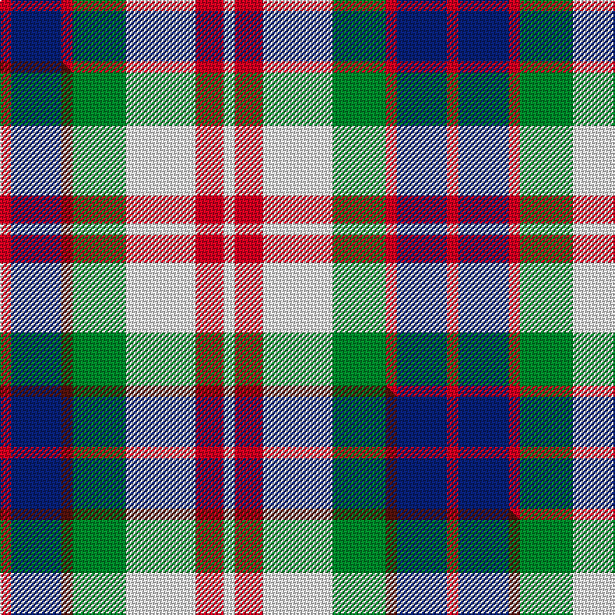

This is one **variant** — a specific cloth: this exact thread count and colourway, with its own
provenance below. It is one weaving of the [sett](/setts/r4db18r4g19w25r10w4/) (the scale-free proportion — the
same cloth at any scale or shade), whose colour order is pattern [RBRGWRW](/stripes/rbrgwrw/).

Part of the [Fraser Red Dress](/tartans/f/fr/fraser-red-dress/) tartan — the named design grouping this sett with its other cloths.

Sourced from house-of-tartan.  It is a [7 stripe tartan](/stripes/stripes7/).

Original link [http://www.house-of-tartan.scotland.net/house/TartanViewjs.asp?colr=Def&tnam=1427](http://www.house-of-tartan.scotland.net/house/TartanViewjs.asp?colr=Def&tnam=1427)

## Provenance

Earliest known date: pre 2003 A sample of this tartan was recorded by the Scottish Tartans Society during the period 1970 to 1990.

Dataset <small>— provenance for this record, inherited from the source manifest</small>

<dl class="dataset-prov">
<dt>source</dt><dd><a href="/sources/house-of-tartan/">House of Tartan</a></dd>
<dt>data captured from</dt><dd><a href="https://github.com/thetartan/tartan-database/blob/master/data/house-of-tartan/data.csv">https://github.com/thetartan/tartan-database/blob/master/data/house-of-tartan/data.csv</a></dd>
<dt>data date</dt><dd>pre 2003 <small>(this record)</small></dd>
<dt>licence</dt><dd><a href="https://creativecommons.org/licenses/by-nc-nd/4.0/">CC BY-NC-ND 4.0</a></dd>
</dl>

Capture chain <small>— the hands this data passed through, oldest first; each capture carries its own licence</small>

<ol class="capture-chain">
<li><a href="http://www.house-of-tartan.scotland.net/">House of Tartan</a> <small>the weaver/retailer's database — the site is now offline; the URL is kept as the ultimate source's identity</small></li>
<li><a href="https://github.com/thetartan/tartan-database">thetartan/tartan-database</a> <small>2016-2017</small> · <a href="https://creativecommons.org/licenses/by-nc-nd/4.0/">CC BY-NC-ND 4.0</a> <small>Levko Kravets's frozen compilation — the capture we vendored, and where its CC licence text came from</small></li>
<li>this dictionary <small>captured 2026-06-10 · commit 5bf86c7566</small> <small>each re-capture is a git commit to data/sources</small></li>
</ol>

## Thread count
R/8 DB36 R8 G38 W50 R20 W/8

One full sett is **320 threads**.

## Palette
<table><thead><tr><th>Colour</th><th>Shade</th><th>OKLCh</th></tr></thead><tbody><tr><td>DB</td><td><code style="background-color:#082077;">#082077</code> <small style="color:#888">#082077</small></td><td><small style="color:#888">oklch(30.0% 0.149 265.1)</small></td></tr><tr><td>G</td><td><code style="background-color:#008B2A;">#008B2A</code> <small style="color:#888">#008B2A</small></td><td><small style="color:#888">oklch(55.4% 0.170 145.9)</small></td></tr><tr><td>W</td><td><code style="background-color:#F7F7F7;">#F7F7F7</code> <small style="color:#888">#F7F7F7</small></td><td><small style="color:#888">oklch(97.6% 0.000 89.9)</small></td></tr><tr><td>R</td><td><code style="background-color:#D60020;">#D60020</code> <small style="color:#888">#D60020</small></td><td><small style="color:#888">oklch(55.2% 0.224 25.5)</small></td></tr></tbody></table>

# Sample pattern

## Compared to the master

This cloth is one sett of its design; the master sett (the exemplar the design is anchored on) is below for comparison.

Its **ΔTartan distance** from the master is **2.00** — the same measure the nearest-tartans table ranks by (0 is identical; a re-scale of the same cloth is near 0, a recolour or a different proportion further).

<figure class="master-compare" style="margin:0">

this sett
master sett ★

<figcaption style="color:#888;font-size:smaller">One weave of this sett against the <a href="/setts/r4db18dr4g19w25r10w4/">master sett ★</a>, split on the diagonal: a shared proportion runs seamlessly across it with only the shades shifting; a different proportion breaks on it.</figcaption>
</figure>

## Nearest tartan variants

The nearest existing variants by ΔTartan distance, with this cloth at the top so the swatches line up against it.

ΔTartan

Threads

Variant

Sett

—

320

<a href="/variants/s7/r4db18r4g19w25r10w4~x2/">Fraser Red Dress Clan Tartan</a>

<a href="/ttd/edit/#slug=ri4db18r4g19w25ri10w4~x2~ri2008029-r1506028&amp;base=r4db18r4g19w25r10w4~x2" title="compare in the TTD">2.00</a>

320

<a href="/variants/s7/ri4db18r4g19w25ri10w4~x2~ri2008029-r1506028/">Fraser, Red dress</a>

<a href="/ttd/edit/#slug=r4db18dr4g19w25r10w4~x2&amp;base=r4db18r4g19w25r10w4~x2" title="compare in the TTD">2.00</a>

320

<a href="/variants/s7/r4db18dr4g19w25r10w4~x2/">Fraser Red Dress</a>

<a href="/ttd/edit/#slug=db24r4g24r4w20r10g3w4~x2&amp;base=r4db18r4g19w25r10w4~x2" title="compare in the TTD">2.10</a>

316

<a href="/variants/s8/db24r4g24r4w20r10g3w4~x2/">Robertson Dress (Dalgleish) #2</a>

<a href="/ttd/edit/#slug=db24r4g24r4db4w20r10g3w4~x2&amp;base=r4db18r4g19w25r10w4~x2" title="compare in the TTD">2.40</a>

332

<a href="/variants/s9/db24r4g24r4db4w20r10g3w4~x2/">Robertson Dress Clan Tartan</a>

<a href="/ttd/edit/#slug=r3w8db4g14r4db2~x2&amp;base=r4db18r4g19w25r10w4~x2" title="compare in the TTD">2.57</a>

130

<a href="/variants/s6/r3w8db4g14r4db2~x2/">MacIntosh Dress Clan Tartan</a>

<a href="/ttd/edit/#slug=r3w8db4dg14r4db2~x4&amp;base=r4db18r4g19w25r10w4~x2" title="compare in the TTD">2.75</a>

260

<a href="/variants/s6/r3w8db4dg14r4db2~x4/">MacKintosh Dress (Scott Adie)</a>

<a href="/ttd/edit/#slug=dp13r8w5g24w5r10w5r10~x2&amp;base=r4db18r4g19w25r10w4~x2" title="compare in the TTD">2.76</a>

274

<a href="/variants/s8/dp13r8w5g24w5r10w5r10~x2/">Chaudhri, Zafar Iqbal</a>

<a href="/ttd/edit/#slug=o20db2o2db2ly3db12w18db3~x2&amp;base=r4db18r4g19w25r10w4~x2" title="compare in the TTD">2.84</a>

202

<a href="/variants/s8/o20db2o2db2ly3db12w18db3~x2/">Heriot (Fashion)</a>

<a href="/ttd/edit/#slug=lb1w6b1lb3k3lb1~x8&amp;base=r4db18r4g19w25r10w4~x2" title="compare in the TTD">2.86</a>

224

<a href="/variants/s6/lb1w6b1lb3k3lb1~x8/">Thompson (Dance)</a>

<a href="/ttd/edit/#slug=r3db15w13o6db2o2r2~x2&amp;base=r4db18r4g19w25r10w4~x2" title="compare in the TTD">2.91</a>

162

<a href="/variants/s7/r3db15w13o6db2o2r2~x2/">Thom(p)son, Navy</a>

## Neighbour map

Every grey dot is one of 13621 variants placed by the first two principal components of the ΔTartan feature space (42% of its variance). Red is this tartan; blue dots are its nearest — click one to open its page. The map is a flat projection of a many-dimensional space — [how to read it](/posts/neighbourhood-maps/).

<svg viewBox="0 0 640 380" role="img" style="max-width:100%;height:auto;border:1px solid #e0e0e0;border-radius:4px;display:block" xmlns="http://www.w3.org/2000/svg"><image href="/nn/cloud.v1.png" width="640" height="380"/><a href="/variants/s7/ri4db18r4g19w25ri10w4~x2~ri2008029-r1506028/"><circle cx="102.1" cy="222.2" r="4" fill="#3465a4"><title>Fraser, Red dress</title></circle></a><a href="/variants/s7/r4db18dr4g19w25r10w4~x2/"><circle cx="104.0" cy="223.5" r="4" fill="#3465a4"><title>Fraser Red Dress</title></circle></a><a href="/variants/s8/db24r4g24r4w20r10g3w4~x2/"><circle cx="117.5" cy="213.5" r="4" fill="#3465a4"><title>Robertson Dress (Dalgleish) #2</title></circle></a><a href="/variants/s9/db24r4g24r4db4w20r10g3w4~x2/"><circle cx="117.5" cy="204.7" r="4" fill="#3465a4"><title>Robertson Dress Clan Tartan</title></circle></a><a href="/variants/s6/r3w8db4g14r4db2~x2/"><circle cx="163.4" cy="236.5" r="4" fill="#3465a4"><title>MacIntosh Dress Clan Tartan</title></circle></a><a href="/variants/s6/r3w8db4dg14r4db2~x4/"><circle cx="157.6" cy="230.2" r="4" fill="#3465a4"><title>MacKintosh Dress (Scott Adie)</title></circle></a><a href="/variants/s8/dp13r8w5g24w5r10w5r10~x2/"><circle cx="131.9" cy="249.1" r="4" fill="#3465a4"><title>Chaudhri, Zafar Iqbal</title></circle></a><a href="/variants/s8/o20db2o2db2ly3db12w18db3~x2/"><circle cx="178.1" cy="189.5" r="4" fill="#3465a4"><title>Heriot (Fashion)</title></circle></a><a href="/variants/s6/lb1w6b1lb3k3lb1~x8/"><circle cx="143.4" cy="227.1" r="4" fill="#3465a4"><title>Thompson (Dance)</title></circle></a><a href="/variants/s7/r3db15w13o6db2o2r2~x2/"><circle cx="164.9" cy="204.5" r="4" fill="#3465a4"><title>Thom(p)son, Navy</title></circle></a><circle cx="125.2" cy="235.5" r="5" fill="#c00000"/><text x="320" y="376" text-anchor="middle" font-size="11" fill="#999">ground</text><text x="11" y="190" text-anchor="middle" font-size="11" fill="#999" transform="rotate(-90 11 190)">complexity</text></svg>

ID: /variants/s7/r4db18r4g19w25r10w4~x2/
