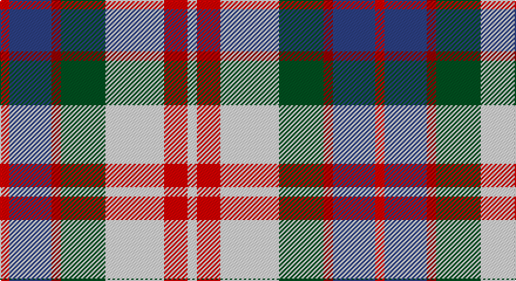

This page is one **sett** — a single exact thread-count. It belongs to the [tartan](/setts/r4db18ri4dg19w25r10w4/)
(the same proportion at any scale), whose colour order is pattern [RBRGWRW](/stripes/rbrgwrw/).

Sourced from register-of-tartans.  It is a [7 stripe tartan](/stripes/stripes7/).

Original link https://www.tartanregister.gov.uk/tartanDetails.aspx?ref=1266

## Register references

External register numbers recorded for this tartan.

- Scottish Register of Tartans: [1266](https://www.tartanregister.gov.uk/tartanDetails.aspx?ref=1266)
- Scottish Tartans World Register: 1427

## Thread count
R/8 B36 DR8 G38 LN50 R20 LN/8

One full sett is **320 threads**.

## Palette

Palette: <strong>Tartan Register</strong>
<table><thead><tr><th>Colour</th><th>Threads</th><th>Shade</th><th>Base</th><th>OKLCh</th></tr></thead><tbody><tr><td>R/</td><td style="text-align:right;font-variant-numeric:tabular-nums">8</td><td><code style="background-color:#DC0000;">#DC0000</code> <small style="color:#888">#DC0000</small></td><td>R <code style="background-color:#CC0000;">#CC0000</code></td><td><small style="color:#888">oklch(56.2% 0.230 29.2)</small></td></tr><tr><td>B</td><td style="text-align:right;font-variant-numeric:tabular-nums">36</td><td><code style="background-color:#2C4084;">#2C4084</code> <small style="color:#888">#2C4084</small></td><td>B <code style="background-color:#2A418A;">#2A418A</code></td><td><small style="color:#888">oklch(39.4% 0.117 268.3)</small></td></tr><tr><td>DR</td><td style="text-align:right;font-variant-numeric:tabular-nums">8</td><td><code style="background-color:#960000;">#960000</code> <small style="color:#888">#960000</small></td><td>R <code style="background-color:#CC0000;">#CC0000</code></td><td><small style="color:#888">oklch(42.3% 0.173 29.2)</small></td></tr><tr><td>G</td><td style="text-align:right;font-variant-numeric:tabular-nums">38</td><td><code style="background-color:#005020;">#005020</code> <small style="color:#888">#005020</small></td><td>G <code style="background-color:#006100;">#006100</code></td><td><small style="color:#888">oklch(37.7% 0.105 149.6)</small></td></tr><tr><td>LN</td><td style="text-align:right;font-variant-numeric:tabular-nums">50</td><td><code style="background-color:#E0E0E0;">#E0E0E0</code> <small style="color:#888">#E0E0E0</small></td><td>W <code style="background-color:#F7F7F7;">#F7F7F7</code></td><td><small style="color:#888">oklch(90.7% 0.000 89.9)</small></td></tr><tr><td>R</td><td style="text-align:right;font-variant-numeric:tabular-nums">20</td><td><code style="background-color:#DC0000;">#DC0000</code> <small style="color:#888">#DC0000</small></td><td>R <code style="background-color:#CC0000;">#CC0000</code></td><td><small style="color:#888">oklch(56.2% 0.230 29.2)</small></td></tr><tr><td>LN/</td><td style="text-align:right;font-variant-numeric:tabular-nums">8</td><td><code style="background-color:#E0E0E0;">#E0E0E0</code> <small style="color:#888">#E0E0E0</small></td><td>W <code style="background-color:#F7F7F7;">#F7F7F7</code></td><td><small style="color:#888">oklch(90.7% 0.000 89.9)</small></td></tr></tbody></table>

# Sample pattern

## Nearest tartans

The nearest existing variants by ΔTartan distance, with this tartan at the top so the swatches line up against it.

ΔTartan

Tartan

Sett

—

<a href="/ttd/edit/#slug=r4db18ri4dg19w25r10w4~x2">Fraser Red Dress</a> <a class="nn-out" href="/variants/s7/r4db18ri4dg19w25r10w4~x2/" title="open its dictionary page">↗</a>

0.45

<a href="/ttd/edit/#slug=r4db18ri4g19w25r10w4~x2&amp;base=r4db18ri4dg19w25r10w4~x2">Fraser, Red dress</a> <a class="nn-out" href="/variants/s7/r4db18ri4g19w25r10w4~x2/" title="open its dictionary page">↗</a>

0.86

<a href="/ttd/edit/#slug=r4db18r4g19w25r10w4~x2&amp;base=r4db18ri4dg19w25r10w4~x2">Fraser Red Dress Clan Tartan</a> <a class="nn-out" href="/variants/s7/r4db18r4g19w25r10w4~x2/" title="open its dictionary page">↗</a>

0.93

<a href="/ttd/edit/#slug=do3o1lr1do1o3do3lr3ly6n1~x6&amp;base=r4db18ri4dg19w25r10w4~x2">Toorak Chapler</a> <a class="nn-out" href="/variants/s9/do3o1lr1do1o3do3lr3ly6n1~x6/" title="open its dictionary page">↗</a>

0.94

<a href="/ttd/edit/#slug=dy17g5db2w12db2ly4g7~x4&amp;base=r4db18ri4dg19w25r10w4~x2">Northern Ontario</a> <a class="nn-out" href="/variants/s7/dy17g5db2w12db2ly4g7~x4/" title="open its dictionary page">↗</a>

0.96

<a href="/ttd/edit/#slug=r4o25k6w12k11ly3~x2&amp;base=r4db18ri4dg19w25r10w4~x2">Thomson Dress (Grey) (Fashion)</a> <a class="nn-out" href="/variants/s6/r4o25k6w12k11ly3~x2/" title="open its dictionary page">↗</a>

1.00

<a href="/ttd/edit/#slug=db12r2db2r2db2g10w12o3~x2&amp;base=r4db18ri4dg19w25r10w4~x2">Idaho, Centennial</a> <a class="nn-out" href="/variants/s8/db12r2db2r2db2g10w12o3~x2/" title="open its dictionary page">↗</a>

1.07

<a href="/ttd/edit/#slug=w5g3r3g3r3db20r16w21k3~x2&amp;base=r4db18ri4dg19w25r10w4~x2">Oliver, dress</a> <a class="nn-out" href="/variants/s9/w5g3r3g3r3db20r16w21k3~x2/" title="open its dictionary page">↗</a>

1.12

<a href="/ttd/edit/#slug=db13w13db4ly2g8r3~x2&amp;base=r4db18ri4dg19w25r10w4~x2">Unidentified (Winterbottom)</a> <a class="nn-out" href="/variants/s6/db13w13db4ly2g8r3~x2/" title="open its dictionary page">↗</a>

1.12

<a href="/ttd/edit/#slug=k2t10r5w2db2w2r2~x6&amp;base=r4db18ri4dg19w25r10w4~x2">U.S. Postal Service (Corporate)</a> <a class="nn-out" href="/variants/s7/k2t10r5w2db2w2r2~x6/" title="open its dictionary page">↗</a>

1.16

<a href="/ttd/edit/#slug=g4ly7o9ly9db20w2db2~x2&amp;base=r4db18ri4dg19w25r10w4~x2">Tombow 140th Anniversary, The</a> <a class="nn-out" href="/variants/s7/g4ly7o9ly9db20w2db2~x2/" title="open its dictionary page">↗</a>

## Neighbour map

Every grey dot is one of 14360 variants placed by the first two principal components of the ΔTartan feature space (44% of its variance). Red is this tartan; blue dots are its nearest — click one to open its page.

<svg viewBox="0 0 640 380" role="img" style="max-width:100%;height:auto;border:1px solid #e0e0e0;border-radius:4px;display:block" xmlns="http://www.w3.org/2000/svg"><image href="/nn/cloud.v1.png" width="640" height="380"/><a href="/variants/s7/r4db18ri4g19w25r10w4~x2/"><circle cx="86.0" cy="193.7" r="4" fill="#3465a4"><title>Fraser, Red dress</title></circle></a><a href="/variants/s7/r4db18r4g19w25r10w4~x2/"><circle cx="107.0" cy="207.4" r="4" fill="#3465a4"><title>Fraser Red Dress Clan Tartan</title></circle></a><a href="/variants/s9/do3o1lr1do1o3do3lr3ly6n1~x6/"><circle cx="79.1" cy="190.9" r="4" fill="#3465a4"><title>Toorak Chapler</title></circle></a><a href="/variants/s7/dy17g5db2w12db2ly4g7~x4/"><circle cx="102.8" cy="176.6" r="4" fill="#3465a4"><title>Northern Ontario</title></circle></a><a href="/variants/s6/r4o25k6w12k11ly3~x2/"><circle cx="140.5" cy="186.0" r="4" fill="#3465a4"><title>Thomson Dress (Grey) (Fashion)</title></circle></a><a href="/variants/s8/db12r2db2r2db2g10w12o3~x2/"><circle cx="105.7" cy="186.6" r="4" fill="#3465a4"><title>Idaho, Centennial</title></circle></a><a href="/variants/s9/w5g3r3g3r3db20r16w21k3~x2/"><circle cx="109.8" cy="155.6" r="4" fill="#3465a4"><title>Oliver, dress</title></circle></a><a href="/variants/s6/db13w13db4ly2g8r3~x2/"><circle cx="113.0" cy="207.2" r="4" fill="#3465a4"><title>Unidentified (Winterbottom)</title></circle></a><a href="/variants/s7/k2t10r5w2db2w2r2~x6/"><circle cx="118.4" cy="190.6" r="4" fill="#3465a4"><title>U.S. Postal Service (Corporate)</title></circle></a><a href="/variants/s7/g4ly7o9ly9db20w2db2~x2/"><circle cx="155.4" cy="171.6" r="4" fill="#3465a4"><title>Tombow 140th Anniversary, The</title></circle></a><circle cx="85.3" cy="192.2" r="5" fill="#c00000"/></svg>

ID: /variants/s7/r4db18ri4dg19w25r10w4~x2/
