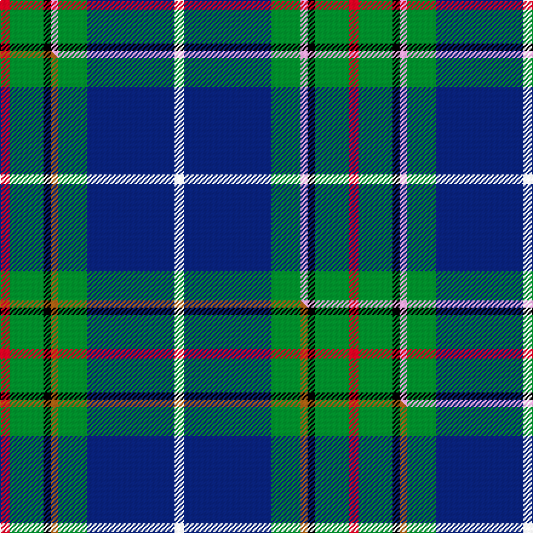

This page is one **sett** — a single exact thread-count. It belongs to the [tartan](/setts/r4g14k3lp3g12db36w4/)
(the same proportion at any scale), whose colour order is pattern [RGKWGBW](/stripes/rgkwgbw/).

Part of the [Vipont](/tartans/vipont-2/) tartan — the named design grouping this sett with its other cloths.

Sourced from house-of-tartan.  It is a [7 stripe tartan](/stripes/stripes7/).

Original link http://www.house-of-tartan.scotland.net/house/TartanViewjs.asp?colr=Def&tnam=1479

## Provenance

Earliest known date: 1983 This count comes from a sample at the Scottish Tartans Society, in the MacGregor Hastie collection. He in turn procured it from J.Wright of Edinburgh. A contradictory note in the files says, "It was apparently designed and woven by them (J.Wright) for the family of Vipont c.1930. It is rarely if ever used today." The Scottish Viponts are an ancient family, who formerly possessed lands in Aberdour, Fife.

## Thread count
R/8 G28 K6 LP6 G24 DB72 W/8

One full sett is **288 threads**.

## Palette
<table><thead><tr><th>Colour</th><th>Shade</th><th>OKLCh</th></tr></thead><tbody><tr><td>DB</td><td><code style="background-color:#082077;">#082077</code> <small style="color:#888">#082077</small></td><td><small style="color:#888">oklch(30.0% 0.149 265.1)</small></td></tr><tr><td>G</td><td><code style="background-color:#008B2A;">#008B2A</code> <small style="color:#888">#008B2A</small></td><td><small style="color:#888">oklch(55.4% 0.170 145.9)</small></td></tr><tr><td>K</td><td><code style="background-color:#000000;">#000000</code> <small style="color:#888">#000000</small></td><td><small style="color:#888">oklch(0.0% 0.000 0.0)</small></td></tr><tr><td>W</td><td><code style="background-color:#F7F7F7;">#F7F7F7</code> <small style="color:#888">#F7F7F7</small></td><td><small style="color:#888">oklch(97.6% 0.000 89.9)</small></td></tr><tr><td>LP</td><td><code style="background-color:#E4A6DB;">#E4A6DB</code> <small style="color:#888">#E4A6DB</small></td><td><small style="color:#888">oklch(80.0% 0.100 331.6)</small></td></tr><tr><td>R</td><td><code style="background-color:#D60020;">#D60020</code> <small style="color:#888">#D60020</small></td><td><small style="color:#888">oklch(55.2% 0.224 25.5)</small></td></tr></tbody></table>

# Sample pattern

## Compared to the master

This cloth is one sett of its design; the master sett (the exemplar the design is anchored on) is below for comparison.

Its **ΔTartan distance** from the master is **0.30** — the same measure the nearest-tartans table ranks by (0 is identical; a re-scale of the same cloth is near 0, a recolour or a different proportion further).

<figure class="master-compare" style="margin:0">

this sett
master sett ★

<figcaption style="color:#888;font-size:smaller">One weave of this sett against the <a href="/setts/r4g14k3o3g12db36w4/">master sett ★</a>, split on the diagonal: a shared proportion runs seamlessly across it with only the shades shifting; a different proportion breaks on it.</figcaption>
</figure>

## Nearest tartan variants

The nearest existing variants by ΔTartan distance, with this cloth at the top so the swatches line up against it.

ΔTartan

Threads

Variant

Sett

—

288

<a href="/variants/s7/r4g14k3lp3g12db36w4~x2/">Vipont Family Tartan</a>

<a href="/ttd/edit/#slug=r4g14k3b3g12db36w4~x2&amp;base=r4g14k3lp3g12db36w4~x2" title="compare in the TTD">0.30</a>

288

<a href="/variants/s7/r4g14k3b3g12db36w4~x2/">Vipont</a>

<a href="/ttd/edit/#slug=r4g14k3o3g12db36w4~x2&amp;base=r4g14k3lp3g12db36w4~x2" title="compare in the TTD">0.30</a>

288

<a href="/variants/s7/r4g14k3o3g12db36w4~x2/">Vipont (White line)</a>

<a href="/ttd/edit/#slug=r1g1k1g9db9w1~x6&amp;base=r4g14k3lp3g12db36w4~x2" title="compare in the TTD">0.97</a>

252

<a href="/variants/s6/r1g1k1g9db9w1~x6/">Irving of Bonshaw Tower</a>

<a href="/ttd/edit/#slug=db20r2g9w6y4k2g8~x2&amp;base=r4g14k3lp3g12db36w4~x2" title="compare in the TTD">1.44</a>

148

<a href="/variants/s7/db20r2g9w6y4k2g8~x2/">Crofters (Personal)</a>

<a href="/ttd/edit/#slug=db22w2k10g11r3g4~x2&amp;base=r4g14k3lp3g12db36w4~x2" title="compare in the TTD">1.87</a>

156

<a href="/variants/s6/db22w2k10g11r3g4~x2/">Paterson Blue (Personal)</a>

<a href="/ttd/edit/#slug=r3w3db36g36k2r2~x2&amp;base=r4g14k3lp3g12db36w4~x2" title="compare in the TTD">1.96</a>

318

<a href="/variants/s6/r3w3db36g36k2r2~x2/">Militello (Palermo) Dress (Personal)</a>

<a href="/ttd/edit/#slug=k2dy1g10db10w1~x6&amp;base=r4g14k3lp3g12db36w4~x2" title="compare in the TTD">2.19</a>

270

<a href="/variants/s5/k2dy1g10db10w1~x6/">Turnbull Hunting (1983) #2</a>

<a href="/ttd/edit/#slug=k1db1g8dt8w1~x4~db1406275-dt1204274&amp;base=r4g14k3lp3g12db36w4~x2" title="compare in the TTD">2.20</a>

144

<a href="/variants/s5/k1dbi1g8db8w1~x4~dbi1406275-db1204274/">Douglas, Green (Wilsons)</a>

<a href="/ttd/edit/#slug=k7dr3g29db29w3~x2&amp;base=r4g14k3lp3g12db36w4~x2" title="compare in the TTD">2.20</a>

264

<a href="/variants/s5/k7dr3g29db29w3~x2/">Highlander, Highland Laddie Kilts</a>

<a href="/ttd/edit/#slug=k6g15w2db22b2k4~x2&amp;base=r4g14k3lp3g12db36w4~x2" title="compare in the TTD">2.27</a>

184

<a href="/variants/s6/k6g15w2db22b2k4~x2/">Leslie, Hebridean</a>

## Neighbour map

Every grey dot is one of 13620 variants placed by the first two principal components of the ΔTartan feature space (42% of its variance). Red is this tartan; blue dots are its nearest — click one to open its page.

<svg viewBox="0 0 640 380" role="img" style="max-width:100%;height:auto;border:1px solid #e0e0e0;border-radius:4px;display:block" xmlns="http://www.w3.org/2000/svg"><image href="/nn/cloud.v1.png" width="640" height="380"/><a href="/variants/s7/r4g14k3b3g12db36w4~x2/"><circle cx="199.6" cy="145.9" r="4" fill="#3465a4"><title>Vipont</title></circle></a><a href="/variants/s7/r4g14k3o3g12db36w4~x2/"><circle cx="196.1" cy="143.3" r="4" fill="#3465a4"><title>Vipont (White line)</title></circle></a><a href="/variants/s6/r1g1k1g9db9w1~x6/"><circle cx="214.7" cy="177.2" r="4" fill="#3465a4"><title>Irving of Bonshaw Tower</title></circle></a><a href="/variants/s7/db20r2g9w6y4k2g8~x2/"><circle cx="123.6" cy="170.2" r="4" fill="#3465a4"><title>Crofters (Personal)</title></circle></a><a href="/variants/s6/db22w2k10g11r3g4~x2/"><circle cx="160.7" cy="182.3" r="4" fill="#3465a4"><title>Paterson Blue (Personal)</title></circle></a><a href="/variants/s6/r3w3db36g36k2r2~x2/"><circle cx="243.9" cy="142.7" r="4" fill="#3465a4"><title>Militello (Palermo) Dress (Personal)</title></circle></a><a href="/variants/s5/k2dy1g10db10w1~x6/"><circle cx="194.5" cy="192.2" r="4" fill="#3465a4"><title>Turnbull Hunting (1983) #2</title></circle></a><a href="/variants/s5/k1dbi1g8db8w1~x4~dbi1406275-db1204274/"><circle cx="199.4" cy="201.6" r="4" fill="#3465a4"><title>Douglas, Green (Wilsons)</title></circle></a><a href="/variants/s5/k7dr3g29db29w3~x2/"><circle cx="186.4" cy="197.0" r="4" fill="#3465a4"><title>Highlander, Highland Laddie Kilts</title></circle></a><a href="/variants/s6/k6g15w2db22b2k4~x2/"><circle cx="168.1" cy="172.8" r="4" fill="#3465a4"><title>Leslie, Hebridean</title></circle></a><circle cx="195.0" cy="144.0" r="5" fill="#c00000"/><text x="320" y="376" text-anchor="middle" font-size="11" fill="#999">ground</text><text x="11" y="190" text-anchor="middle" font-size="11" fill="#999" transform="rotate(-90 11 190)">complexity</text></svg>

ID: /variants/s7/r4g14k3lp3g12db36w4~x2/
