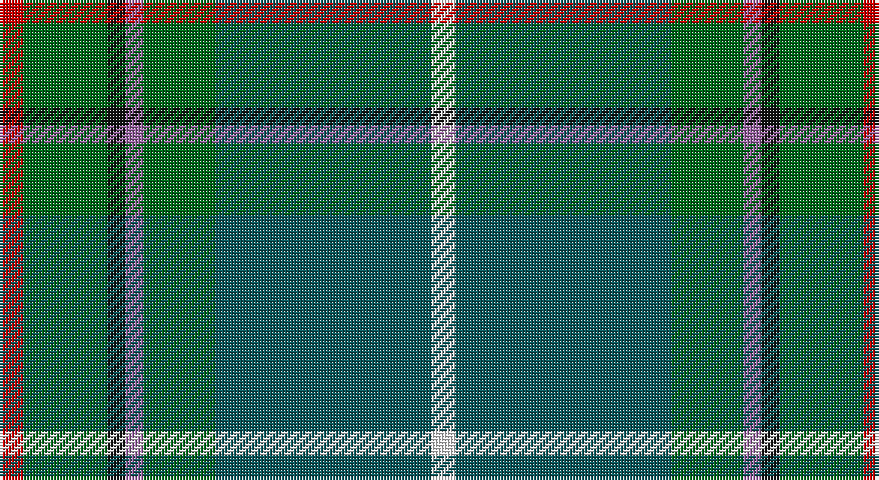

This page is one **sett** — a single exact thread-count. It belongs to the [tartan](/setts/r4g14k3m3g12n36w4/)
(the same proportion at any scale), whose colour order is pattern [RGKRGBW](/stripes/rgkrgbw/).

Part of the [Vipont](/tartans/vipont/) tartan — the named design grouping this sett with its other cloths.

Sourced from register-of-tartans.  It is a [7 stripe tartan](/stripes/stripes7/).

Original link https://www.tartanregister.gov.uk/tartanDetails.aspx?ref=4463

2 attestations — the source records this cloth was collapsed from (oldest owns this page)

<ul>
<li>01/01/1930 — Vipont (White line) (register-of-tartans, <a href="https://www.tartanregister.gov.uk/tartanDetails.aspx?ref=4463">record</a>)</li>
<li>1930 ish — Vipont (White line) (Name) (tartans-authority, <a href="http://www.tartansauthority.com/tartan-ferret/display/1479/">record</a>)</li>
</ul>

## Register references

External register numbers recorded for this tartan.

- Scottish Register of Tartans: [4463](https://www.tartanregister.gov.uk/tartanDetails.aspx?ref=4463)
- Scottish Tartans Authority (ITI): 1479
- Scottish Tartans World Register: 1479

## Thread count
R/8 Ga28 K6 LP6 Ga24 G72 W/8

One full sett is **288 threads**.

## Palette

Palette: <strong>Tartan Register</strong> <small style="color:#888">(6 of 7 colours)</small>
<table><thead><tr><th>Colour</th><th>Threads</th><th>Shade</th><th>Base</th><th>OKLCh</th></tr></thead><tbody><tr><td>R/</td><td style="text-align:right;font-variant-numeric:tabular-nums">8</td><td><code style="background-color:#C80000;">#C80000</code> <small style="color:#888">#C80000</small></td><td>R <code style="background-color:#CC0000;">#CC0000</code></td><td><small style="color:#888">oklch(52.3% 0.215 29.2)</small></td></tr><tr><td>Ga</td><td style="text-align:right;font-variant-numeric:tabular-nums">28</td><td><code style="background-color:#006818;">#006818</code> <small style="color:#888">#006818</small></td><td>G <code style="background-color:#006100;">#006100</code></td><td><small style="color:#888">oklch(45.0% 0.142 145.0)</small></td></tr><tr><td>K</td><td style="text-align:right;font-variant-numeric:tabular-nums">6</td><td><code style="background-color:#101010;">#101010</code> <small style="color:#888">#101010</small></td><td>K <code style="background-color:#000000;">#000000</code></td><td><small style="color:#888">oklch(17.3% 0.000 89.9)</small></td></tr><tr><td>LP</td><td style="text-align:right;font-variant-numeric:tabular-nums">6</td><td><code style="background-color:#9C68A4;">#9C68A4</code> <small style="color:#888">#9C68A4</small></td><td>R <code style="background-color:#CC0000;">#CC0000</code></td><td><small style="color:#888">oklch(59.4% 0.107 322.0)</small></td></tr><tr><td>Ga</td><td style="text-align:right;font-variant-numeric:tabular-nums">24</td><td><code style="background-color:#006818;">#006818</code> <small style="color:#888">#006818</small></td><td>G <code style="background-color:#006100;">#006100</code></td><td><small style="color:#888">oklch(45.0% 0.142 145.0)</small></td></tr><tr><td>G</td><td style="text-align:right;font-variant-numeric:tabular-nums">72</td><td><code style="background-color:#0C585C;">#0C585C</code> <small style="color:#888">#0C585C</small></td><td>B <code style="background-color:#2A418A;">#2A418A</code></td><td><small style="color:#888">oklch(42.0% 0.068 200.5)</small></td></tr><tr><td>W/</td><td style="text-align:right;font-variant-numeric:tabular-nums">8</td><td><code style="background-color:#FCFCFC;">#FCFCFC</code> <small style="color:#888">#FCFCFC</small></td><td>W <code style="background-color:#F7F7F7;">#F7F7F7</code></td><td><small style="color:#888">oklch(99.1% 0.000 89.9)</small></td></tr></tbody></table>

# Sample pattern

## Compared to the master

This cloth is one sett of its design; the master sett (the exemplar the design is anchored on) is below for comparison.

<figure style="margin:0"><figcaption style="color:#888;font-size:smaller">this sett</figcaption></figure>
<figure style="margin:0"><figcaption style="color:#888;font-size:smaller"><a href="/setts/r3g14k2p2g14k36ly3/">master sett →</a></figcaption></figure>

## Nearest tartans

The nearest existing variants by ΔTartan distance, with this tartan at the top so the swatches line up against it.

ΔTartan

Tartan

Sett

—

<a href="/ttd/edit/#slug=r4g14k3m3g12n36w4~x2">Vipont (White line)</a> <a class="nn-out" href="/variants/s7/r4g14k3m3g12n36w4~x2/" title="open its dictionary page">↗</a>

0.86

<a href="/ttd/edit/#slug=r3db6ly2db15g12dg39w3~x2&amp;base=r4g14k3m3g12n36w4~x2">Wagland (Name)</a> <a class="nn-out" href="/variants/s7/r3db6ly2db15g12dg39w3~x2/" title="open its dictionary page">↗</a>

0.88

<a href="/ttd/edit/#slug=r3db6ly2db15dg12g39w3~x2&amp;base=r4g14k3m3g12n36w4~x2">Wagland</a> <a class="nn-out" href="/variants/s7/r3db6ly2db15dg12g39w3~x2/" title="open its dictionary page">↗</a>

0.92

<a href="/ttd/edit/#slug=dt40r4dt10g10y22lo3y4ly3y4~x2&amp;base=r4g14k3m3g12n36w4~x2">Keith Stanhope Society (Commem.)</a> <a class="nn-out" href="/variants/s9/dt40r4dt10g10y22lo3y4ly3y4~x2/" title="open its dictionary page">↗</a>

1.16

<a href="/ttd/edit/#slug=db2r1db10w1o4g8ly1g2~x4&amp;base=r4g14k3m3g12n36w4~x2">Ayrshire</a> <a class="nn-out" href="/variants/s8/db2r1db10w1o4g8ly1g2~x4/" title="open its dictionary page">↗</a>

1.20

<a href="/ttd/edit/#slug=db1dy4g8ly1g8db12w1db2r1~x4&amp;base=r4g14k3m3g12n36w4~x2">Connor (Personal)</a> <a class="nn-out" href="/variants/s9/db1dy4g8ly1g8db12w1db2r1~x4/" title="open its dictionary page">↗</a>

1.22

<a href="/ttd/edit/#slug=r4db15w2n15g30r2g4~x2&amp;base=r4g14k3m3g12n36w4~x2">Sinclair Green (Personal)</a> <a class="nn-out" href="/variants/s7/r4db15w2n15g30r2g4~x2/" title="open its dictionary page">↗</a>

1.25

<a href="/ttd/edit/#slug=g15ly1dy2db5k4dg5~x6&amp;base=r4g14k3m3g12n36w4~x2">Dobson (Palm Bay) (Personal)</a> <a class="nn-out" href="/variants/s6/g15ly1dy2db5k4dg5~x6/" title="open its dictionary page">↗</a>

1.26

<a href="/ttd/edit/#slug=db4t3db6k2dbi12g2dbi2g24lb2~x2&amp;base=r4g14k3m3g12n36w4~x2">Halcrow Howell (Name)</a> <a class="nn-out" href="/variants/s9/db4t3db6k2dbi12g2dbi2g24lb2~x2/" title="open its dictionary page">↗</a>

1.26

<a href="/ttd/edit/#slug=r3y13db13ly2dg34w3~x2&amp;base=r4g14k3m3g12n36w4~x2">Glencross, Tynron (Name)</a> <a class="nn-out" href="/variants/s6/r3y13db13ly2dg34w3~x2/" title="open its dictionary page">↗</a>

1.27

<a href="/ttd/edit/#slug=w4r13g54dg22k4y20g48r13w4&amp;base=r4g14k3m3g12n36w4~x2">Wynberg Boys' High School</a> <a class="nn-out" href="/variants/s9/w4r13g54dg22k4y20g48r13w4/" title="open its dictionary page">↗</a>

## Neighbour map

Every grey dot is one of 14360 variants placed by the first two principal components of the ΔTartan feature space (44% of its variance). Red is this tartan; blue dots are its nearest — click one to open its page.

<svg viewBox="0 0 640 380" role="img" style="max-width:100%;height:auto;border:1px solid #e0e0e0;border-radius:4px;display:block" xmlns="http://www.w3.org/2000/svg"><image href="/nn/cloud.v1.png" width="640" height="380"/><a href="/variants/s7/r3db6ly2db15g12dg39w3~x2/"><circle cx="271.6" cy="154.6" r="4" fill="#3465a4"><title>Wagland (Name)</title></circle></a><a href="/variants/s7/r3db6ly2db15dg12g39w3~x2/"><circle cx="281.3" cy="156.9" r="4" fill="#3465a4"><title>Wagland</title></circle></a><a href="/variants/s9/dt40r4dt10g10y22lo3y4ly3y4~x2/"><circle cx="278.3" cy="164.3" r="4" fill="#3465a4"><title>Keith Stanhope Society (Commem.)</title></circle></a><a href="/variants/s8/db2r1db10w1o4g8ly1g2~x4/"><circle cx="191.7" cy="173.1" r="4" fill="#3465a4"><title>Ayrshire</title></circle></a><a href="/variants/s9/db1dy4g8ly1g8db12w1db2r1~x4/"><circle cx="216.8" cy="167.0" r="4" fill="#3465a4"><title>Connor (Personal)</title></circle></a><a href="/variants/s7/r4db15w2n15g30r2g4~x2/"><circle cx="254.8" cy="183.5" r="4" fill="#3465a4"><title>Sinclair Green (Personal)</title></circle></a><a href="/variants/s6/g15ly1dy2db5k4dg5~x6/"><circle cx="242.7" cy="196.1" r="4" fill="#3465a4"><title>Dobson (Palm Bay) (Personal)</title></circle></a><a href="/variants/s9/db4t3db6k2dbi12g2dbi2g24lb2~x2/"><circle cx="228.4" cy="160.1" r="4" fill="#3465a4"><title>Halcrow Howell (Name)</title></circle></a><a href="/variants/s6/r3y13db13ly2dg34w3~x2/"><circle cx="259.2" cy="165.3" r="4" fill="#3465a4"><title>Glencross, Tynron (Name)</title></circle></a><a href="/variants/s9/w4r13g54dg22k4y20g48r13w4/"><circle cx="266.8" cy="162.5" r="4" fill="#3465a4"><title>Wynberg Boys' High School</title></circle></a><circle cx="255.4" cy="177.2" r="5" fill="#c00000"/></svg>

ID: /variants/s7/r4g14k3m3g12n36w4~x2/
