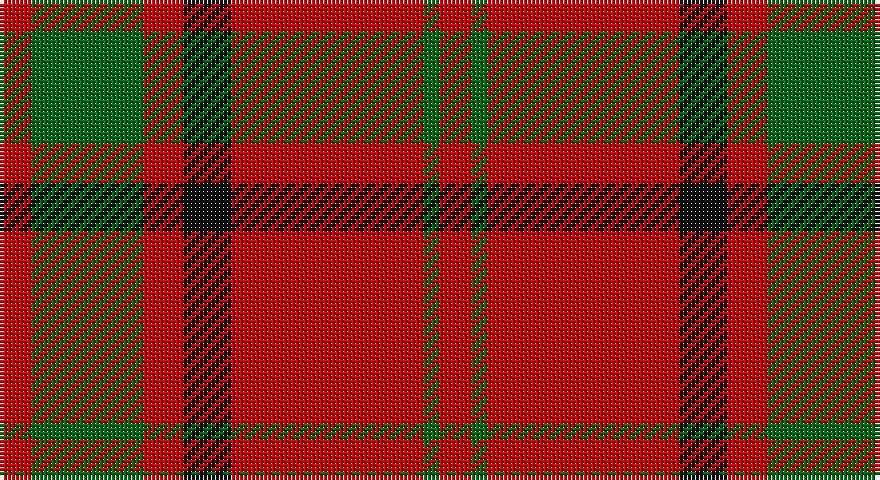

This page is one **sett** — a single exact thread-count. It belongs to the [tartan](/setts/r4g14r5k6r24g2r4/)
(the same proportion at any scale), whose colour order is pattern [RGRKRGR](/stripes/rgrkrgr/).

Part of the [Auld Lang Syne](/tartans/auld-lang-syne/) tartan — the named design grouping this sett with its other cloths.

Sourced from house-of-tartan.  It is a [7 stripe tartan](/stripes/stripes7/).

Original link http://www.house-of-tartan.scotland.net/house/TartanViewjs.asp?colr=Def&tnam=2402

## Provenance

Earliest known date: Threadcount and colours aren't 100% original. Generated manually.

## Also known as

This cloth is also recorded under:

- Auld Lang Syne Blue
- Auld Lang Syne Brown
- Auld Lang Syne, Blue
- Auld Lang Syne, Grey
- MacRae, Rae
- MacRae/Rae

## Thread count
R/8 G28 R10 K12 R48 G4 R/8

One full sett is **220 threads**.

## Palette

Palette: <strong>Tartan Register</strong>
<table><thead><tr><th>Colour</th><th>Threads</th><th>Shade</th><th>Base</th><th>OKLCh</th></tr></thead><tbody><tr><td>R/</td><td style="text-align:right;font-variant-numeric:tabular-nums">8</td><td><code style="background-color:#C80000;">#C80000</code> <small style="color:#888">#C80000</small></td><td>R <code style="background-color:#CC0000;">#CC0000</code></td><td><small style="color:#888">oklch(52.3% 0.215 29.2)</small></td></tr><tr><td>G</td><td style="text-align:right;font-variant-numeric:tabular-nums">28</td><td><code style="background-color:#006818;">#006818</code> <small style="color:#888">#006818</small></td><td>G <code style="background-color:#006100;">#006100</code></td><td><small style="color:#888">oklch(45.0% 0.142 145.0)</small></td></tr><tr><td>R</td><td style="text-align:right;font-variant-numeric:tabular-nums">10</td><td><code style="background-color:#C80000;">#C80000</code> <small style="color:#888">#C80000</small></td><td>R <code style="background-color:#CC0000;">#CC0000</code></td><td><small style="color:#888">oklch(52.3% 0.215 29.2)</small></td></tr><tr><td>K</td><td style="text-align:right;font-variant-numeric:tabular-nums">12</td><td><code style="background-color:#101010;">#101010</code> <small style="color:#888">#101010</small></td><td>K <code style="background-color:#000000;">#000000</code></td><td><small style="color:#888">oklch(17.3% 0.000 89.9)</small></td></tr><tr><td>R</td><td style="text-align:right;font-variant-numeric:tabular-nums">48</td><td><code style="background-color:#C80000;">#C80000</code> <small style="color:#888">#C80000</small></td><td>R <code style="background-color:#CC0000;">#CC0000</code></td><td><small style="color:#888">oklch(52.3% 0.215 29.2)</small></td></tr><tr><td>G</td><td style="text-align:right;font-variant-numeric:tabular-nums">4</td><td><code style="background-color:#006818;">#006818</code> <small style="color:#888">#006818</small></td><td>G <code style="background-color:#006100;">#006100</code></td><td><small style="color:#888">oklch(45.0% 0.142 145.0)</small></td></tr><tr><td>R/</td><td style="text-align:right;font-variant-numeric:tabular-nums">8</td><td><code style="background-color:#C80000;">#C80000</code> <small style="color:#888">#C80000</small></td><td>R <code style="background-color:#CC0000;">#CC0000</code></td><td><small style="color:#888">oklch(52.3% 0.215 29.2)</small></td></tr></tbody></table>

# Sample pattern

## Compared to the master

This cloth is one sett of its design; the master sett (the exemplar the design is anchored on) is below for comparison.

<figure style="margin:0"><figcaption style="color:#888;font-size:smaller">this sett</figcaption></figure>
<figure style="margin:0"><figcaption style="color:#888;font-size:smaller"><a href="/setts/dp27dg6dp27dg28dp5dg7dp5dg28dp31dg6dp31dg28dp2dg2dp4dg2dp2dg28dp2dg2dp4dg2dp2dg28dp27dg6dp27/">master sett →</a></figcaption></figure>

## Nearest tartans

The nearest existing variants by ΔTartan distance, with this tartan at the top so the swatches line up against it.

ΔTartan

Tartan

Sett

—

<a href="/ttd/edit/#slug=r4g14r5k6r24g2r4~x2">Auld Lang Syne (red) Tartan</a> <a class="nn-out" href="/variants/s7/r4g14r5k6r24g2r4~x2/" title="open its dictionary page">↗</a>

0.53

<a href="/ttd/edit/#slug=r6lb2r30dg12r3dg12r3&amp;base=r4g14r5k6r24g2r4~x2">Crawford</a> <a class="nn-out" href="/variants/s7/r6lb2r30dg12r3dg12r3/" title="open its dictionary page">↗</a>

0.68

<a href="/ttd/edit/#slug=r2dg6r2dg6r16ly1~x2&amp;base=r4g14r5k6r24g2r4~x2">Cameron</a> <a class="nn-out" href="/variants/s6/r2dg6r2dg6r16ly1~x2/" title="open its dictionary page">↗</a>

0.87

<a href="/ttd/edit/#slug=r2g6r2g6r16ly1~x4&amp;base=r4g14r5k6r24g2r4~x2">Cameron (Clan)</a> <a class="nn-out" href="/variants/s6/r2g6r2g6r16ly1~x4/" title="open its dictionary page">↗</a>

0.89

<a href="/ttd/edit/#slug=db4r3db3r22g8r2~x2&amp;base=r4g14r5k6r24g2r4~x2">Auld Reekie</a> <a class="nn-out" href="/variants/s6/db4r3db3r22g8r2~x2/" title="open its dictionary page">↗</a>

0.89

<a href="/ttd/edit/#slug=r1dg6r1dg6r15ly1~x2&amp;base=r4g14r5k6r24g2r4~x2">Cameron Clan D</a> <a class="nn-out" href="/variants/s6/r1dg6r1dg6r15ly1~x2/" title="open its dictionary page">↗</a>

0.98

<a href="/ttd/edit/#slug=r1g3r1g3r8ly1~x8&amp;base=r4g14r5k6r24g2r4~x2">Cameron</a> <a class="nn-out" href="/variants/s6/r1g3r1g3r8ly1~x8/" title="open its dictionary page">↗</a>

0.99

<a href="/ttd/edit/#slug=r16db6r2g6r2db1~x2&amp;base=r4g14r5k6r24g2r4~x2">MacKintosh, Plaid</a> <a class="nn-out" href="/variants/s6/r16db6r2g6r2db1~x2/" title="open its dictionary page">↗</a>

1.04

<a href="/ttd/edit/#slug=r6g21k8r28k2r4~x2&amp;base=r4g14r5k6r24g2r4~x2">Dunbar</a> <a class="nn-out" href="/variants/s6/r6g21k8r28k2r4~x2/" title="open its dictionary page">↗</a>

1.07

<a href="/ttd/edit/#slug=r6w2r30g12r3g12r3~x2&amp;base=r4g14r5k6r24g2r4~x2">Crawford</a> <a class="nn-out" href="/variants/s7/r6w2r30g12r3g12r3~x2/" title="open its dictionary page">↗</a>

1.07

<a href="/ttd/edit/#slug=r2g6r2g6r16ly1~x2&amp;base=r4g14r5k6r24g2r4~x2">Cameron</a> <a class="nn-out" href="/variants/s6/r2g6r2g6r16ly1~x2/" title="open its dictionary page">↗</a>

## Neighbour map

Every grey dot is one of 14360 variants placed by the first two principal components of the ΔTartan feature space (44% of its variance). Red is this tartan; blue dots are its nearest — click one to open its page.

<svg viewBox="0 0 640 380" role="img" style="max-width:100%;height:auto;border:1px solid #e0e0e0;border-radius:4px;display:block" xmlns="http://www.w3.org/2000/svg"><image href="/nn/cloud.v1.png" width="640" height="380"/><a href="/variants/s7/r6lb2r30dg12r3dg12r3/"><circle cx="416.0" cy="194.0" r="4" fill="#3465a4"><title>Crawford</title></circle></a><a href="/variants/s6/r2dg6r2dg6r16ly1~x2/"><circle cx="413.4" cy="199.1" r="4" fill="#3465a4"><title>Cameron</title></circle></a><a href="/variants/s6/r2g6r2g6r16ly1~x4/"><circle cx="420.6" cy="202.7" r="4" fill="#3465a4"><title>Cameron (Clan)</title></circle></a><a href="/variants/s6/db4r3db3r22g8r2~x2/"><circle cx="416.2" cy="207.8" r="4" fill="#3465a4"><title>Auld Reekie</title></circle></a><a href="/variants/s6/r1dg6r1dg6r15ly1~x2/"><circle cx="393.3" cy="195.9" r="4" fill="#3465a4"><title>Cameron Clan D</title></circle></a><a href="/variants/s6/r1g3r1g3r8ly1~x8/"><circle cx="369.6" cy="227.2" r="4" fill="#3465a4"><title>Cameron</title></circle></a><a href="/variants/s6/r16db6r2g6r2db1~x2/"><circle cx="401.6" cy="202.3" r="4" fill="#3465a4"><title>MacKintosh, Plaid</title></circle></a><a href="/variants/s6/r6g21k8r28k2r4~x2/"><circle cx="344.5" cy="208.5" r="4" fill="#3465a4"><title>Dunbar</title></circle></a><a href="/variants/s7/r6w2r30g12r3g12r3~x2/"><circle cx="409.9" cy="198.6" r="4" fill="#3465a4"><title>Crawford</title></circle></a><a href="/variants/s6/r2g6r2g6r16ly1~x2/"><circle cx="415.5" cy="201.3" r="4" fill="#3465a4"><title>Cameron</title></circle></a><circle cx="393.5" cy="206.4" r="5" fill="#c00000"/></svg>

ID: /variants/s7/r4g14r5k6r24g2r4~x2/
