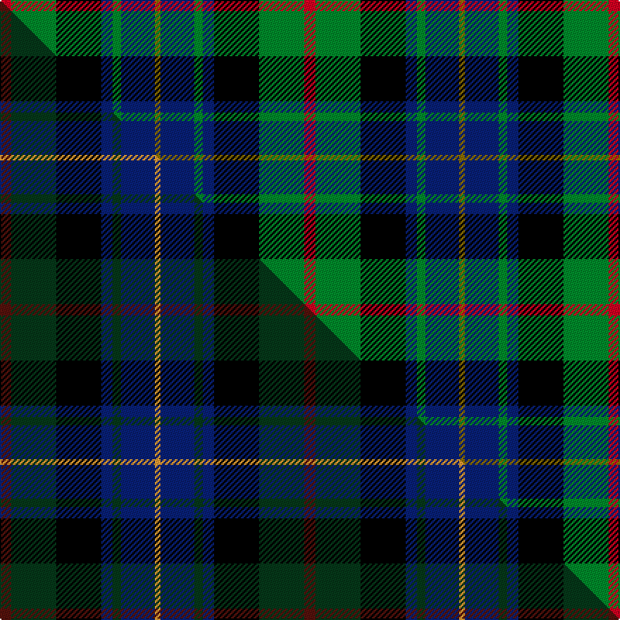

This page is one **sett** — a single exact thread-count. It belongs to the [tartan](/setts/r4g16k16db4g3db12y2/)
(the same proportion at any scale), whose colour order is pattern [GBGBKGR](/stripes/gbgbkgr/).

Part of the [Junior Chamber International](/tartans/junior-chamber-international/) tartan — the named design grouping this sett with its other cloths.

Sourced from weddslist.  It is a [7 stripe tartan](/stripes/stripes7/).

Original link http://www.weddslist.com/cgi-bin/tartans/pg.pl?source=sts

## Thread count
R/8 G32 K32 DB8 G6 DB24 Y/4

One full sett is **216 threads**.

## Palette
<table><thead><tr><th>Colour</th><th>Shade</th><th>OKLCh</th></tr></thead><tbody><tr><td>DB</td><td><code style="background-color:#082077;">#082077</code> <small style="color:#888">#082077</small></td><td><small style="color:#888">oklch(30.0% 0.149 265.1)</small></td></tr><tr><td>G</td><td><code style="background-color:#008B2A;">#008B2A</code> <small style="color:#888">#008B2A</small></td><td><small style="color:#888">oklch(55.4% 0.170 145.9)</small></td></tr><tr><td>K</td><td><code style="background-color:#000000;">#000000</code> <small style="color:#888">#000000</small></td><td><small style="color:#888">oklch(0.0% 0.000 0.0)</small></td></tr><tr><td>R</td><td><code style="background-color:#D60020;">#D60020</code> <small style="color:#888">#D60020</small></td><td><small style="color:#888">oklch(55.2% 0.224 25.5)</small></td></tr><tr><td>Y</td><td><code style="background-color:#8B6E00;">#8B6E00</code> <small style="color:#888">#8B6E00</small></td><td><small style="color:#888">oklch(55.1% 0.113 90.4)</small></td></tr></tbody></table>

# Sample pattern

## Compared to the master

This cloth is one sett of its design; the master sett (the exemplar the design is anchored on) is below for comparison.

Its **ΔTartan distance** from the master is **1.70** — the same measure the nearest-tartans table ranks by (0 is identical; a re-scale of the same cloth is near 0, a recolour or a different proportion further).

<figure class="master-compare" style="margin:0">

this sett
master sett ★

<figcaption style="color:#888;font-size:smaller">One weave of this sett against the <a href="/setts/dr4dg16k16db4dg3db12lo2/">master sett ★</a>, split on the diagonal: a shared proportion runs seamlessly across it with only the shades shifting; a different proportion breaks on it.</figcaption>
</figure>

## Nearest tartan variants

The nearest existing variants by ΔTartan distance, with this cloth at the top so the swatches line up against it.

ΔTartan

Threads

Variant

Sett

—

216

<a href="/variants/s7/r4g16k16db4g3db12y2~x2/">Junior Chamber International</a>

<a href="/ttd/edit/#slug=db27g5y8k20y3g15r3~x2&amp;base=r4g16k16db4g3db12y2~x2" title="compare in the TTD">2.04</a>

264

<a href="/variants/s7/db27g5y8k20y3g15r3~x2/">Nelson Mandela (Personal)</a>

<a href="/ttd/edit/#slug=db27g5ly8k20ly3g15r3~x2&amp;base=r4g16k16db4g3db12y2~x2" title="compare in the TTD">2.04</a>

264

<a href="/variants/s7/db27g5ly8k20ly3g15r3~x2/">Nelson Mandela (Personal)</a>

<a href="/ttd/edit/#slug=r2g8w1k8db8k1db1~x4&amp;base=r4g16k16db4g3db12y2~x2" title="compare in the TTD">2.18</a>

220

<a href="/variants/s7/r2g8w1k8db8k1db1~x4/">Colquhoun</a>

<a href="/ttd/edit/#slug=r2g8w1k8db8k1db1~x2&amp;base=r4g16k16db4g3db12y2~x2" title="compare in the TTD">2.18</a>

110

<a href="/variants/s7/r2g8w1k8db8k1db1~x2/">Colquhoun</a>

<a href="/ttd/edit/#slug=db1r1db6k6g6w1~x2&amp;base=r4g16k16db4g3db12y2~x2" title="compare in the TTD">2.19</a>

80

<a href="/variants/s6/db1r1db6k6g6w1~x2/">Wellington</a>

<a href="/ttd/edit/#slug=db6g27db3k19dp27w3~x2&amp;base=r4g16k16db4g3db12y2~x2" title="compare in the TTD">2.19</a>

322

<a href="/variants/s6/db6g27db3k19dp27w3~x2/">Gold Brothers</a>

<a href="/ttd/edit/#slug=r3g16w2k16db16k2db2~x2&amp;base=r4g16k16db4g3db12y2~x2" title="compare in the TTD">2.19</a>

218

<a href="/variants/s7/r3g16w2k16db16k2db2~x2/">Colquhoun Clan Tartan</a>

<a href="/ttd/edit/#slug=db20k6dy4db3k16g20w2~x2&amp;base=r4g16k16db4g3db12y2~x2" title="compare in the TTD">2.29</a>

240

<a href="/variants/s7/db20k6dy4db3k16g20w2~x2/">Deloughery, Paul</a>

<a href="/ttd/edit/#slug=dr3g2dr3g18k14w2db16g3~x2&amp;base=r4g16k16db4g3db12y2~x2" title="compare in the TTD">2.34</a>

232

<a href="/variants/s8/dr3g2dr3g18k14w2db16g3~x2/">Mantle (Personal)</a>

<a href="/ttd/edit/#slug=g4w1g10k10db10r2&amp;base=r4g16k16db4g3db12y2~x2" title="compare in the TTD">2.37</a>

68

<a href="/variants/s6/g4w1g10k10db10r2/">Rose Hunting</a>

## Neighbour map

Every grey dot is one of 13620 variants placed by the first two principal components of the ΔTartan feature space (42% of its variance). Red is this tartan; blue dots are its nearest — click one to open its page.

<svg viewBox="0 0 640 380" role="img" style="max-width:100%;height:auto;border:1px solid #e0e0e0;border-radius:4px;display:block" xmlns="http://www.w3.org/2000/svg"><image href="/nn/cloud.v1.png" width="640" height="380"/><a href="/variants/s7/db27g5y8k20y3g15r3~x2/"><circle cx="111.1" cy="192.1" r="4" fill="#3465a4"><title>Nelson Mandela (Personal)</title></circle></a><a href="/variants/s7/db27g5ly8k20ly3g15r3~x2/"><circle cx="102.1" cy="191.9" r="4" fill="#3465a4"><title>Nelson Mandela (Personal)</title></circle></a><a href="/variants/s7/r2g8w1k8db8k1db1~x4/"><circle cx="102.7" cy="188.3" r="4" fill="#3465a4"><title>Colquhoun</title></circle></a><a href="/variants/s7/r2g8w1k8db8k1db1~x2/"><circle cx="102.7" cy="188.3" r="4" fill="#3465a4"><title>Colquhoun</title></circle></a><a href="/variants/s6/db1r1db6k6g6w1~x2/"><circle cx="96.7" cy="213.2" r="4" fill="#3465a4"><title>Wellington</title></circle></a><a href="/variants/s6/db6g27db3k19dp27w3~x2/"><circle cx="114.3" cy="197.9" r="4" fill="#3465a4"><title>Gold Brothers</title></circle></a><a href="/variants/s7/r3g16w2k16db16k2db2~x2/"><circle cx="108.8" cy="186.3" r="4" fill="#3465a4"><title>Colquhoun Clan Tartan</title></circle></a><a href="/variants/s7/db20k6dy4db3k16g20w2~x2/"><circle cx="116.0" cy="187.9" r="4" fill="#3465a4"><title>Deloughery, Paul</title></circle></a><a href="/variants/s8/dr3g2dr3g18k14w2db16g3~x2/"><circle cx="128.8" cy="175.5" r="4" fill="#3465a4"><title>Mantle (Personal)</title></circle></a><a href="/variants/s6/g4w1g10k10db10r2/"><circle cx="125.1" cy="202.9" r="4" fill="#3465a4"><title>Rose Hunting</title></circle></a><circle cx="105.9" cy="197.7" r="5" fill="#c00000"/><text x="320" y="376" text-anchor="middle" font-size="11" fill="#999">ground</text><text x="11" y="190" text-anchor="middle" font-size="11" fill="#999" transform="rotate(-90 11 190)">complexity</text></svg>

ID: /variants/s7/r4g16k16db4g3db12y2~x2/
