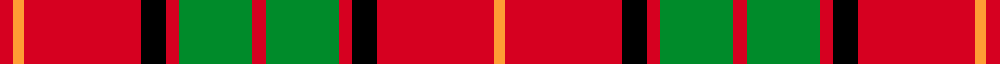

This page is one **sett** — a single exact thread-count. It belongs to the [tartan](/setts/r4g21r4k7r34lo3r4/)
(the same proportion at any scale), whose colour order is pattern [RYRKRGRGRKRY](/stripes/ryrkrgrgrkry/).

Sourced from register-of-tartans.  It is a [12 stripe tartan](/stripes/stripes12/).

Original link https://www.tartanregister.gov.uk/tartanDetails.aspx?ref=2003

2 attestations — the source records this cloth was collapsed from (oldest owns this page)

<ul>
<li>01/10/1999 — Kirk (register-of-tartans, <a href="https://www.tartanregister.gov.uk/tartanDetails.aspx?ref=2003">record</a>)  <em>A design based on Maxwell by Dr Phil Smith ofTECAsubmitted on behalf of Gilbert and Nancy Kirk of Missouri. Intended for use by all of the name Kirk. Sample in Scottish Tartans Authority's Johnston Collection. Green should be even darker.</em></li>
<li>October 1999 — Kirk (Name) (tartans-authority, <a href="http://www.tartansauthority.com/tartan-ferret/display/4229/">record</a>)  <em>A design based on Maxwell by Dr Phil Smith of TECA and submitted on behalf of Gilbert and Nancy Kirk of Missouri. Intended for use by all of the name Kirk. Green should be even darker.</em></li>
</ul>

## Register references

External register numbers recorded for this tartan.

- Scottish Register of Tartans: [2003](https://www.tartanregister.gov.uk/tartanDetails.aspx?ref=2003)
- Scottish Tartans Authority (ITI): 4229

## Thread count
R/8 LO6 R68 K14 R8 G42 R8 G42 R8 K14 R68 LO/6

One full sett is **570 threads**.

## Palette
<table><thead><tr><th>Colour</th><th>Shade</th><th>OKLCh</th></tr></thead><tbody><tr><td>DG</td><td><code style="background-color:#053819;">#053819</code> <small style="color:#888">#053819</small></td><td><small style="color:#888">oklch(30.0% 0.075 151.3)</small></td></tr><tr><td>DR</td><td><code style="background-color:#D60020;">#D60020</code> <small style="color:#888">#D60020</small></td><td><small style="color:#888">oklch(55.2% 0.224 25.5)</small></td></tr><tr><td>DY</td><td><code style="background-color:#FF9C34;">#FF9C34</code> <small style="color:#888">#FF9C34</small></td><td><small style="color:#888">oklch(77.9% 0.161 61.8)</small></td></tr><tr><td>G</td><td><code style="background-color:#008B2A;">#008B2A</code> <small style="color:#888">#008B2A</small></td><td><small style="color:#888">oklch(55.4% 0.170 145.9)</small></td></tr><tr><td>K</td><td><code style="background-color:#000000;">#000000</code> <small style="color:#888">#000000</small></td><td><small style="color:#888">oklch(0.0% 0.000 0.0)</small></td></tr></tbody></table>

# Sample pattern

## Nearest variants

The nearest existing variants by ΔTartan distance, with this cloth at the top so the swatches line up against it.

ΔTartan

Threads

Variant

Sett

—

570

<a href="/variants/s7/r4g21r4k7r34lo3r4~x2/">Kirk</a>

<a href="/ttd/edit/#slug=r2db1r10k4r2g8r2g8r7k1r2db1~x2&amp;base=r4g21r4k7r34lo3r4~x2" title="compare in the TTD">1.20</a>

186

<a href="/variants/s12/r2db1r10k4r2g8r2g8r7k1r2db1~x2/">MacQuarrie Ancient</a>

<a href="/ttd/edit/#slug=r6g1r6k4r1lb1r1g8r6k1r6g1~x2&amp;base=r4g21r4k7r34lo3r4~x2" title="compare in the TTD">2.02</a>

154

<a href="/variants/s12/r6g1r6k4r1lb1r1g8r6k1r6g1~x2/">Nicolson, MacNicol</a>

<a href="/ttd/edit/#slug=r6g1r6k4r1lb1r1g8r6k1r6g1&amp;base=r4g21r4k7r34lo3r4~x2" title="compare in the TTD">2.02</a>

77

<a href="/variants/s12/r6g1r6k4r1lb1r1g8r6k1r6g1/">MacNicol</a>

<a href="/ttd/edit/#slug=r6g1r6k4r1lb1r1g8r6k1r6g1~x6&amp;base=r4g21r4k7r34lo3r4~x2" title="compare in the TTD">2.02</a>

462

<a href="/variants/s12/r6g1r6k4r1lb1r1g8r6k1r6g1~x6/">Nicolson (McIan)</a>

<a href="/ttd/edit/#slug=r6g1r6k4r1w1r1g8r6k1r6g1&amp;base=r4g21r4k7r34lo3r4~x2" title="compare in the TTD">2.02</a>

77

<a href="/variants/s12/r6g1r6k4r1w1r1g8r6k1r6g1/">MacNicol</a>

<a href="/ttd/edit/#slug=r8g1r8g16r4k2lb1k4r8g1r8k1~x2&amp;base=r4g21r4k7r34lo3r4~x2" title="compare in the TTD">2.72</a>

230

<a href="/variants/s12/r8g1r8g16r4k2lb1k4r8g1r8k1~x2/">MacLeod and MacNicol</a>

## Neighbour map

Every grey dot is one of 13620 variants placed by the first two principal components of the ΔTartan feature space (42% of its variance). Red is this tartan; blue dots are its nearest — click one to open its page.

<svg viewBox="0 0 640 380" role="img" style="max-width:100%;height:auto;border:1px solid #e0e0e0;border-radius:4px;display:block" xmlns="http://www.w3.org/2000/svg"><image href="/nn/cloud.v1.png" width="640" height="380"/><a href="/variants/s12/r2db1r10k4r2g8r2g8r7k1r2db1~x2/"><circle cx="233.6" cy="163.9" r="4" fill="#3465a4"><title>MacQuarrie Ancient</title></circle></a><a href="/variants/s12/r6g1r6k4r1lb1r1g8r6k1r6g1~x2/"><circle cx="275.8" cy="169.9" r="4" fill="#3465a4"><title>Nicolson, MacNicol</title></circle></a><a href="/variants/s12/r6g1r6k4r1lb1r1g8r6k1r6g1/"><circle cx="275.8" cy="169.9" r="4" fill="#3465a4"><title>MacNicol</title></circle></a><a href="/variants/s12/r6g1r6k4r1lb1r1g8r6k1r6g1~x6/"><circle cx="275.8" cy="169.9" r="4" fill="#3465a4"><title>Nicolson (McIan)</title></circle></a><a href="/variants/s12/r6g1r6k4r1w1r1g8r6k1r6g1/"><circle cx="272.8" cy="169.0" r="4" fill="#3465a4"><title>MacNicol</title></circle></a><a href="/variants/s12/r8g1r8g16r4k2lb1k4r8g1r8k1~x2/"><circle cx="285.1" cy="138.3" r="4" fill="#3465a4"><title>MacLeod and MacNicol</title></circle></a><circle cx="280.0" cy="144.4" r="5" fill="#c00000"/><text x="320" y="376" text-anchor="middle" font-size="11" fill="#999">ground</text><text x="11" y="190" text-anchor="middle" font-size="11" fill="#999" transform="rotate(-90 11 190)">complexity</text></svg>

ID: /variants/s7/r4g21r4k7r34lo3r4~x2/
