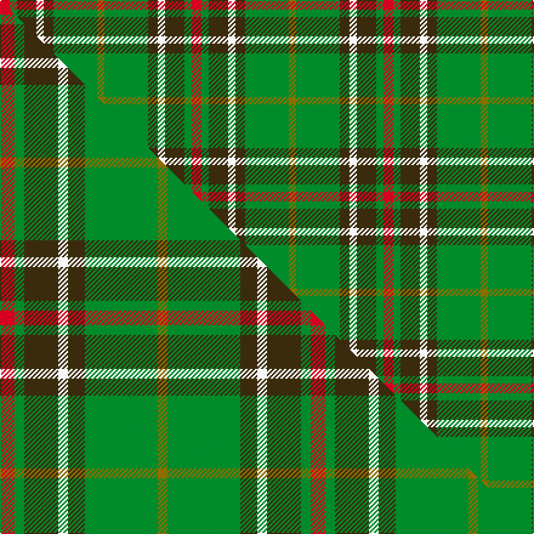

This is one **variant** — a specific cloth: this exact thread count and colourway, with its own
provenance below. It is one weaving of the [sett](/tartans/n/ne/newfoundland-2/) (the scale-free proportion — the
same cloth at any scale or shade), whose colour order is pattern [GGGWGGR](/stripes/gggwggr/).

Part of the [Newfoundland](/tartans/n/ne/newfoundland-2/) tartan — the named design grouping this sett with its other cloths.

Sourced from house-of-tartan.  It is a [7 stripe tartan](/stripes/stripes7/).

Original link [http://www.house-of-tartan.scotland.net/house/TartanViewjs.asp?colr=Def&tnam=1543](http://www.house-of-tartan.scotland.net/house/TartanViewjs.asp?colr=Def&tnam=1543)

## Provenance

Earliest known date: 1972 The colours of the Newfoundland tartan are related to the 'Ode to Newfoundland', the second anthem of the province. Gold for the sun, green for the pine clad hill, white for the snow, brown for the minerals under the earth and red to denote her British origins. In 1972, the Minute of Provincial Affairs of the Province petitioned the Lord Lyon to record the tartan in the Writs section of the Lyon Court Books. This was done on the 3rd of September, 1973.

Dataset <small>— provenance for this record, inherited from the source manifest</small>

<dl class="dataset-prov">
<dt>source</dt><dd><a href="/sources/house-of-tartan/">House of Tartan</a></dd>
<dt>data captured from</dt><dd><a href="https://github.com/thetartan/tartan-database/blob/master/data/house-of-tartan/data.csv">https://github.com/thetartan/tartan-database/blob/master/data/house-of-tartan/data.csv</a></dd>
<dt>data date</dt><dd>1972 <small>(this record)</small></dd>
<dt>licence</dt><dd><a href="https://creativecommons.org/licenses/by-nc-nd/4.0/">CC BY-NC-ND 4.0</a></dd>
</dl>

Capture chain <small>— the hands this data passed through, oldest first; each capture carries its own licence</small>

<ol class="capture-chain">
<li><a href="http://www.house-of-tartan.scotland.net/">House of Tartan</a> <small>the weaver/retailer's database — the site is now offline; the URL is kept as the ultimate source's identity</small></li>
<li><a href="https://github.com/thetartan/tartan-database">thetartan/tartan-database</a> <small>2016-2017</small> · <a href="https://creativecommons.org/licenses/by-nc-nd/4.0/">CC BY-NC-ND 4.0</a> <small>Levko Kravets's frozen compilation — the capture we vendored, and where its CC licence text came from</small></li>
<li>this dictionary <small>captured 2026-06-10 · commit 5bf86c7566</small> <small>each re-capture is a git commit to data/sources</small></li>
</ol>

## Thread count
R/8 G6 DY16 W6 DY8 G36 Y/6

One full sett is **158 threads**.

## Palette
<table><thead><tr><th>Colour</th><th>Shade</th><th>OKLCh</th></tr></thead><tbody><tr><td>G</td><td><code style="background-color:#008B2A;">#008B2A</code> <small style="color:#888">#008B2A</small></td><td><small style="color:#888">oklch(55.4% 0.170 145.9)</small></td></tr><tr><td>W</td><td><code style="background-color:#F7F7F7;">#F7F7F7</code> <small style="color:#888">#F7F7F7</small></td><td><small style="color:#888">oklch(97.6% 0.000 89.9)</small></td></tr><tr><td>R</td><td><code style="background-color:#D60020;">#D60020</code> <small style="color:#888">#D60020</small></td><td><small style="color:#888">oklch(55.2% 0.224 25.5)</small></td></tr><tr><td>DY</td><td><code style="background-color:#3A2B0D;">#3A2B0D</code> <small style="color:#888">#3A2B0D</small></td><td><small style="color:#888">oklch(30.0% 0.049 82.0)</small></td></tr><tr><td>Y</td><td><code style="background-color:#8B6E00;">#8B6E00</code> <small style="color:#888">#8B6E00</small></td><td><small style="color:#888">oklch(55.1% 0.113 90.4)</small></td></tr></tbody></table>

# Sample pattern

## Compared to the master

This cloth is one sett of its design; the master sett (the exemplar the design is anchored on) is below for comparison.

Its **ΔTartan distance** from the master is **0.26** — the same measure the nearest-tartans table ranks by (0 is identical; a re-scale of the same cloth is near 0, a recolour or a different proportion further).

<figure class="master-compare" style="margin:0">

this sett
master sett ★

<figcaption style="color:#888;font-size:smaller">One weave of this sett against the <a href="/setts/r6g4dy14w4dy7g30y4/">master sett ★</a>, split on the diagonal: a shared proportion runs seamlessly across it with only the shades shifting; a different proportion breaks on it.</figcaption>
</figure>

## Nearest tartan variants

The nearest existing variants by ΔTartan distance, with this cloth at the top so the swatches line up against it.

ΔTartan

Threads

Variant

Sett

—

158

<a href="/variants/s7/r4g3dy8w3dy4g18y3~x2/">Newfoundland District Tartan</a>

<a href="/ttd/edit/#slug=r6g4dy14w4dy7g30y4~x2&amp;base=r4g3dy8w3dy4g18y3~x2" title="compare in the TTD">0.26</a>

256

<a href="/variants/s7/r6g4dy14w4dy7g30y4~x2/">Newfoundland</a>

<a href="/ttd/edit/#slug=g4r1db2r1g10dy5r3dy10y1~x4&amp;base=r4g3dy8w3dy4g18y3~x2" title="compare in the TTD">2.07</a>

276

<a href="/variants/s9/g4r1db2r1g10dy5r3dy10y1~x4/">Moncton, City of</a>

<a href="/ttd/edit/#slug=g1dy8g8r1g8dy8w1~x2&amp;base=r4g3dy8w3dy4g18y3~x2" title="compare in the TTD">2.09</a>

136

<a href="/variants/s7/g1dy8g8r1g8dy8w1~x2/">MacKinnon Hunting Clan Tartan</a>

<a href="/ttd/edit/#slug=g1dy8g8r1g8dy8w1~x4&amp;base=r4g3dy8w3dy4g18y3~x2" title="compare in the TTD">2.09</a>

272

<a href="/variants/s7/g1dy8g8r1g8dy8w1~x4/">MacKinnon Htg (Clan)</a>

<a href="/ttd/edit/#slug=r6g4do14w4do7g30lo4~x2&amp;base=r4g3dy8w3dy4g18y3~x2" title="compare in the TTD">2.17</a>

256

<a href="/variants/s7/r6g4do14w4do7g30lo4~x2/">Newfoundland (District)</a>

<a href="/ttd/edit/#slug=g10dp42r5dg42g42ly5g6~g2408144-dg1806142&amp;base=r4g3dy8w3dy4g18y3~x2" title="compare in the TTD">2.46</a>

288

<a href="/variants/s7/g10dp42r5dg42g42ly5g6~g2408144-dg1806142/">New Mexico (Fashion)</a>

<a href="/ttd/edit/#slug=g4lo1dt1lo1dt2g9r1dt6w1~x4&amp;base=r4g3dy8w3dy4g18y3~x2" title="compare in the TTD">2.51</a>

188

<a href="/variants/s9/g4lo1dt1lo1dt2g9r1dt6w1~x4/">Casey of West Virginia (Personal)</a>

<a href="/ttd/edit/#slug=r5dt12g3db4g20dt3g3r5~x4&amp;base=r4g3dy8w3dy4g18y3~x2" title="compare in the TTD">2.52</a>

400

<a href="/variants/s8/r5dt12g3db4g20dt3g3r5~x4/">Daks (0600150)</a>

<a href="/ttd/edit/#slug=g15y3r3dp8w2~x6&amp;base=r4g3dy8w3dy4g18y3~x2" title="compare in the TTD">2.57</a>

270

<a href="/variants/s5/g15y3r3dp8w2~x6/">ChuMac (Personal)</a>

<a href="/ttd/edit/#slug=dy21r2g18r2g18r2dg8w6dy10~x2&amp;base=r4g3dy8w3dy4g18y3~x2" title="compare in the TTD">2.70</a>

286

<a href="/variants/s9/dy21r2g18r2g18r2dg8w6dy10~x2/">Red Dirt Girl</a>

## Neighbour map

Every grey dot is one of 13656 variants placed by the first two principal components of the ΔTartan feature space (42% of its variance). Red is this tartan; blue dots are its nearest — click one to open its page. The map is a flat projection of a many-dimensional space — [how to read it](/posts/neighbourhood-maps/).

<svg viewBox="0 0 640 380" role="img" style="max-width:100%;height:auto;border:1px solid #e0e0e0;border-radius:4px;display:block" xmlns="http://www.w3.org/2000/svg"><image href="/nn/cloud.v1.png" width="640" height="380"/><a href="/variants/s7/r6g4dy14w4dy7g30y4~x2/"><circle cx="249.4" cy="209.4" r="4" fill="#3465a4"><title>Newfoundland</title></circle></a><a href="/variants/s9/g4r1db2r1g10dy5r3dy10y1~x4/"><circle cx="235.2" cy="200.1" r="4" fill="#3465a4"><title>Moncton, City of</title></circle></a><a href="/variants/s7/g1dy8g8r1g8dy8w1~x2/"><circle cx="296.7" cy="243.6" r="4" fill="#3465a4"><title>MacKinnon Hunting Clan Tartan</title></circle></a><a href="/variants/s7/g1dy8g8r1g8dy8w1~x4/"><circle cx="296.7" cy="243.6" r="4" fill="#3465a4"><title>MacKinnon Htg (Clan)</title></circle></a><a href="/variants/s7/r6g4do14w4do7g30lo4~x2/"><circle cx="238.5" cy="204.6" r="4" fill="#3465a4"><title>Newfoundland (District)</title></circle></a><a href="/variants/s7/g10dp42r5dg42g42ly5g6~g2408144-dg1806142/"><circle cx="200.2" cy="217.3" r="4" fill="#3465a4"><title>New Mexico (Fashion)</title></circle></a><a href="/variants/s9/g4lo1dt1lo1dt2g9r1dt6w1~x4/"><circle cx="256.7" cy="189.9" r="4" fill="#3465a4"><title>Casey of West Virginia (Personal)</title></circle></a><a href="/variants/s8/r5dt12g3db4g20dt3g3r5~x4/"><circle cx="247.5" cy="227.5" r="4" fill="#3465a4"><title>Daks (0600150)</title></circle></a><a href="/variants/s5/g15y3r3dp8w2~x6/"><circle cx="224.9" cy="224.7" r="4" fill="#3465a4"><title>ChuMac (Personal)</title></circle></a><a href="/variants/s9/dy21r2g18r2g18r2dg8w6dy10~x2/"><circle cx="200.0" cy="200.3" r="4" fill="#3465a4"><title>Red Dirt Girl</title></circle></a><circle cx="228.5" cy="222.1" r="5" fill="#c00000"/><text x="320" y="376" text-anchor="middle" font-size="11" fill="#999">ground</text><text x="11" y="190" text-anchor="middle" font-size="11" fill="#999" transform="rotate(-90 11 190)">complexity</text></svg>

ID: /variants/s7/r4g3dy8w3dy4g18y3~x2/
