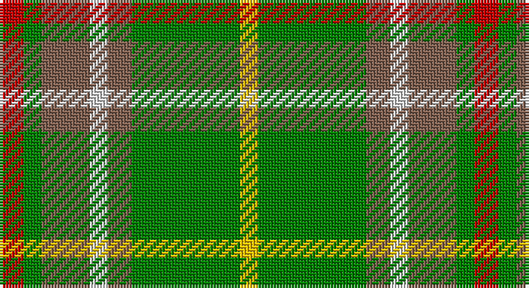

This page is one **sett** — a single exact thread-count. It belongs to the [tartan](/setts/r4g3o8w3o4g18ly3/)
(the same proportion at any scale), whose colour order is pattern [RGRWRGY](/stripes/rgrwrgy/).

Sourced from weddslist.  It is a [7 stripe tartan](/stripes/stripes7/).

Original link http://www.weddslist.com/cgi-bin/tartans/pg.pl?source=sts

## Thread count
R/8 G6 LT16 LN6 LT8 G36 Y/6

One full sett is **158 threads**.

## Palette

Palette: <strong>Tartan Dictionary</strong> <small style="color:#888">(1 of 5 colours)</small>
<table><thead><tr><th>Colour</th><th>Threads</th><th>Shade</th><th>Base</th><th>OKLCh</th></tr></thead><tbody><tr><td>R/</td><td style="text-align:right;font-variant-numeric:tabular-nums">8</td><td><code style="background-color:#C00000;">#C00000</code> <small style="color:#888">#C00000</small></td><td>R <code style="background-color:#CC0000;">#CC0000</code></td><td><small style="color:#888">oklch(50.7% 0.208 29.2)</small></td></tr><tr><td>G</td><td style="text-align:right;font-variant-numeric:tabular-nums">6</td><td><code style="background-color:#008000;">#008000</code> <small style="color:#888">#008000</small></td><td>G <code style="background-color:#006100;">#006100</code></td><td><small style="color:#888">oklch(52.0% 0.177 142.5)</small></td></tr><tr><td>LT</td><td style="text-align:right;font-variant-numeric:tabular-nums">16</td><td><code style="background-color:#806050;">#806050</code> <small style="color:#888">#806050</small></td><td>R <code style="background-color:#CC0000;">#CC0000</code></td><td><small style="color:#888">oklch(51.7% 0.049 47.8)</small></td></tr><tr><td>LN</td><td style="text-align:right;font-variant-numeric:tabular-nums">6</td><td><code style="background-color:#E0E0E0;">#E0E0E0</code> <small style="color:#888">#E0E0E0</small></td><td>W <code style="background-color:#F7F7F7;">#F7F7F7</code></td><td><small style="color:#888">oklch(90.7% 0.000 89.9)</small></td></tr><tr><td>LT</td><td style="text-align:right;font-variant-numeric:tabular-nums">8</td><td><code style="background-color:#806050;">#806050</code> <small style="color:#888">#806050</small></td><td>R <code style="background-color:#CC0000;">#CC0000</code></td><td><small style="color:#888">oklch(51.7% 0.049 47.8)</small></td></tr><tr><td>G</td><td style="text-align:right;font-variant-numeric:tabular-nums">36</td><td><code style="background-color:#008000;">#008000</code> <small style="color:#888">#008000</small></td><td>G <code style="background-color:#006100;">#006100</code></td><td><small style="color:#888">oklch(52.0% 0.177 142.5)</small></td></tr><tr><td>Y/</td><td style="text-align:right;font-variant-numeric:tabular-nums">6</td><td><code style="background-color:#F0C000;">#F0C000</code> <small style="color:#888">#F0C000</small></td><td>Y <code style="background-color:#F2BF00;">#F2BF00</code></td><td><small style="color:#888">oklch(82.7% 0.169 90.5)</small></td></tr></tbody></table>

# Sample pattern

## Nearest tartans

The nearest existing variants by ΔTartan distance, with this tartan at the top so the swatches line up against it.

ΔTartan

Tartan

Sett

—

<a href="/ttd/edit/#slug=r4g3o8w3o4g18ly3~x2">Newfoundland</a> <a class="nn-out" href="/variants/s7/r4g3o8w3o4g18ly3~x2/" title="open its dictionary page">↗</a>

0.66

<a href="/ttd/edit/#slug=r4g3dy8w3dy4g18ly3~x2&amp;base=r4g3o8w3o4g18ly3~x2">Newfoundland District Tartan</a> <a class="nn-out" href="/variants/s7/r4g3dy8w3dy4g18ly3~x2/" title="open its dictionary page">↗</a>

1.23

<a href="/ttd/edit/#slug=g6ly1r1t2r2~x4&amp;base=r4g3o8w3o4g18ly3~x2">Wilson's, No 179</a> <a class="nn-out" href="/variants/s5/g6ly1r1t2r2~x4/" title="open its dictionary page">↗</a>

1.39

<a href="/ttd/edit/#slug=gi2g8dp4lb2gi13b2~x4&amp;base=r4g3o8w3o4g18ly3~x2">Ellan Vannin</a> <a class="nn-out" href="/variants/s6/gi2g8dp4lb2gi13b2~x4/" title="open its dictionary page">↗</a>

1.41

<a href="/ttd/edit/#slug=r6g4do14w4do7g30lo4~x2&amp;base=r4g3o8w3o4g18ly3~x2">Newfoundland</a> <a class="nn-out" href="/variants/s7/r6g4do14w4do7g30lo4~x2/" title="open its dictionary page">↗</a>

1.42

<a href="/ttd/edit/#slug=dy21r2g18r2g18r2dg8w6dy10~x2&amp;base=r4g3o8w3o4g18ly3~x2">Red Dirt Girl</a> <a class="nn-out" href="/variants/s9/dy21r2g18r2g18r2dg8w6dy10~x2/" title="open its dictionary page">↗</a>

1.44

<a href="/ttd/edit/#slug=g9lb2g9k2dy14ly4lb2r2~x4&amp;base=r4g3o8w3o4g18ly3~x2">McShane (Personal)</a> <a class="nn-out" href="/variants/s8/g9lb2g9k2dy14ly4lb2r2~x4/" title="open its dictionary page">↗</a>

1.46

<a href="/ttd/edit/#slug=w1y1p2y7g1gi5ly1~x4&amp;base=r4g3o8w3o4g18ly3~x2">Deeside</a> <a class="nn-out" href="/variants/s7/w1y1p2y7g1gi5ly1~x4/" title="open its dictionary page">↗</a>

1.49

<a href="/ttd/edit/#slug=t2g1t1g12r2g1ri6ly2~x2&amp;base=r4g3o8w3o4g18ly3~x2">Manitoba</a> <a class="nn-out" href="/variants/s8/t2g1t1g12r2g1ri6ly2~x2/" title="open its dictionary page">↗</a>

1.49

<a href="/ttd/edit/#slug=g10dp42r5gi42g42ly5g6&amp;base=r4g3o8w3o4g18ly3~x2">New Mexico (Fashion)</a> <a class="nn-out" href="/variants/s7/g10dp42r5gi42g42ly5g6/" title="open its dictionary page">↗</a>

1.50

<a href="/ttd/edit/#slug=ri13g6ly2g3ly2g6t3g2t3g12r3g6~x2&amp;base=r4g3o8w3o4g18ly3~x2">O'Brien</a> <a class="nn-out" href="/variants/s12/ri13g6ly2g3ly2g6t3g2t3g12r3g6~x2/" title="open its dictionary page">↗</a>

## Neighbour map

Every grey dot is one of 14360 variants placed by the first two principal components of the ΔTartan feature space (44% of its variance). Red is this tartan; blue dots are its nearest — click one to open its page.

<svg viewBox="0 0 640 380" role="img" style="max-width:100%;height:auto;border:1px solid #e0e0e0;border-radius:4px;display:block" xmlns="http://www.w3.org/2000/svg"><image href="/nn/cloud.v1.png" width="640" height="380"/><a href="/variants/s7/r4g3dy8w3dy4g18ly3~x2/"><circle cx="219.6" cy="214.4" r="4" fill="#3465a4"><title>Newfoundland District Tartan</title></circle></a><a href="/variants/s5/g6ly1r1t2r2~x4/"><circle cx="244.6" cy="244.0" r="4" fill="#3465a4"><title>Wilson's, No 179</title></circle></a><a href="/variants/s6/gi2g8dp4lb2gi13b2~x4/"><circle cx="234.0" cy="240.0" r="4" fill="#3465a4"><title>Ellan Vannin</title></circle></a><a href="/variants/s7/r6g4do14w4do7g30lo4~x2/"><circle cx="232.5" cy="197.7" r="4" fill="#3465a4"><title>Newfoundland</title></circle></a><a href="/variants/s9/dy21r2g18r2g18r2dg8w6dy10~x2/"><circle cx="200.3" cy="196.0" r="4" fill="#3465a4"><title>Red Dirt Girl</title></circle></a><a href="/variants/s8/g9lb2g9k2dy14ly4lb2r2~x4/"><circle cx="156.1" cy="190.0" r="4" fill="#3465a4"><title>McShane (Personal)</title></circle></a><a href="/variants/s7/w1y1p2y7g1gi5ly1~x4/"><circle cx="189.6" cy="188.6" r="4" fill="#3465a4"><title>Deeside</title></circle></a><a href="/variants/s8/t2g1t1g12r2g1ri6ly2~x2/"><circle cx="268.2" cy="162.1" r="4" fill="#3465a4"><title>Manitoba</title></circle></a><a href="/variants/s7/g10dp42r5gi42g42ly5g6/"><circle cx="171.4" cy="198.7" r="4" fill="#3465a4"><title>New Mexico (Fashion)</title></circle></a><a href="/variants/s12/ri13g6ly2g3ly2g6t3g2t3g12r3g6~x2/"><circle cx="251.5" cy="198.8" r="4" fill="#3465a4"><title>O'Brien</title></circle></a><circle cx="224.5" cy="215.2" r="5" fill="#c00000"/></svg>

ID: /variants/s7/r4g3o8w3o4g18ly3~x2/
