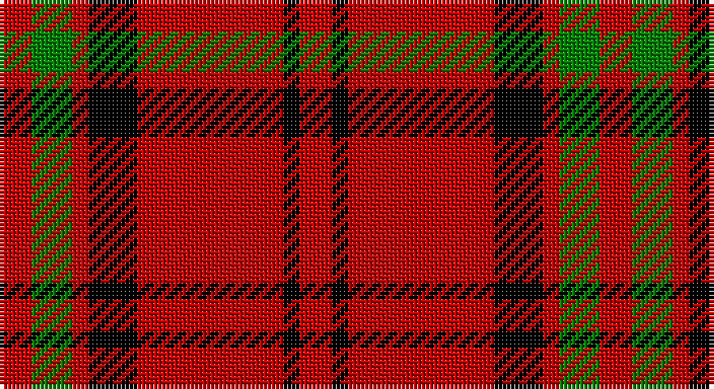

This page is one **sett** — a single exact thread-count. It belongs to the [tartan](/setts/r4g5r2k6r18k2r4/)
(the same proportion at any scale), whose colour order is pattern [RGRKRKR](/stripes/rgrkrkr/).

Sourced from weddslist.  It is a [7 stripe tartan](/stripes/stripes7/).

Original link http://www.weddslist.com/cgi-bin/tartans/pg.pl?source=sts

## Thread count
R/8 G10 R4 K12 R36 K4 R/8

One full sett is **148 threads**.

## Palette

Palette: <strong>Ingles Buchan</strong> <small style="color:#888">(1 of 3 colours)</small>
<table><thead><tr><th>Colour</th><th>Threads</th><th>Shade</th><th>Base</th><th>OKLCh</th></tr></thead><tbody><tr><td>R/</td><td style="text-align:right;font-variant-numeric:tabular-nums">8</td><td><code style="background-color:#C00000;">#C00000</code> <small style="color:#888">#C00000</small></td><td>R <code style="background-color:#CC0000;">#CC0000</code></td><td><small style="color:#888">oklch(50.7% 0.208 29.2)</small></td></tr><tr><td>G</td><td style="text-align:right;font-variant-numeric:tabular-nums">10</td><td><code style="background-color:#008000;">#008000</code> <small style="color:#888">#008000</small></td><td>G <code style="background-color:#006100;">#006100</code></td><td><small style="color:#888">oklch(52.0% 0.177 142.5)</small></td></tr><tr><td>R</td><td style="text-align:right;font-variant-numeric:tabular-nums">4</td><td><code style="background-color:#C00000;">#C00000</code> <small style="color:#888">#C00000</small></td><td>R <code style="background-color:#CC0000;">#CC0000</code></td><td><small style="color:#888">oklch(50.7% 0.208 29.2)</small></td></tr><tr><td>K</td><td style="text-align:right;font-variant-numeric:tabular-nums">12</td><td><code style="background-color:#000000;">#000000</code> <small style="color:#888">#000000</small></td><td>K <code style="background-color:#000000;">#000000</code></td><td><small style="color:#888">oklch(0.0% 0.000 0.0)</small></td></tr><tr><td>R</td><td style="text-align:right;font-variant-numeric:tabular-nums">36</td><td><code style="background-color:#C00000;">#C00000</code> <small style="color:#888">#C00000</small></td><td>R <code style="background-color:#CC0000;">#CC0000</code></td><td><small style="color:#888">oklch(50.7% 0.208 29.2)</small></td></tr><tr><td>K</td><td style="text-align:right;font-variant-numeric:tabular-nums">4</td><td><code style="background-color:#000000;">#000000</code> <small style="color:#888">#000000</small></td><td>K <code style="background-color:#000000;">#000000</code></td><td><small style="color:#888">oklch(0.0% 0.000 0.0)</small></td></tr><tr><td>R/</td><td style="text-align:right;font-variant-numeric:tabular-nums">8</td><td><code style="background-color:#C00000;">#C00000</code> <small style="color:#888">#C00000</small></td><td>R <code style="background-color:#CC0000;">#CC0000</code></td><td><small style="color:#888">oklch(50.7% 0.208 29.2)</small></td></tr></tbody></table>

# Sample pattern

## Nearest tartans

The nearest existing variants by ΔTartan distance, with this tartan at the top so the swatches line up against it.

ΔTartan

Tartan

Sett

—

<a href="/ttd/edit/#slug=r4g5r2k6r18k2r4~x2">MacQuarrie 5</a> <a class="nn-out" href="/variants/s7/r4g5r2k6r18k2r4~x2/" title="open its dictionary page">↗</a>

0.87

<a href="/ttd/edit/#slug=r4dg5r2k6r18k2r4~x2&amp;base=r4g5r2k6r18k2r4~x2">MacQuarrie #7</a> <a class="nn-out" href="/variants/s7/r4dg5r2k6r18k2r4~x2/" title="open its dictionary page">↗</a>

1.10

<a href="/ttd/edit/#slug=r4k8r12k1ly1~x2&amp;base=r4g5r2k6r18k2r4~x2">MacKeane</a> <a class="nn-out" href="/variants/s5/r4k8r12k1ly1~x2/" title="open its dictionary page">↗</a>

1.16

<a href="/variants/s6/r10k1r4g6~x2/">Macan, of Lurgyvallan (Hose)</a>

1.20

<a href="/ttd/edit/#slug=r41k19r7k9w3~x2&amp;base=r4g5r2k6r18k2r4~x2">MacGregor, Black (Personal)</a> <a class="nn-out" href="/variants/s5/r41k19r7k9w3~x2/" title="open its dictionary page">↗</a>

1.21

<a href="/ttd/edit/#slug=db4r3db3r22dg8r2~x2&amp;base=r4g5r2k6r18k2r4~x2">Auld Reekie</a> <a class="nn-out" href="/variants/s6/db4r3db3r22dg8r2~x2/" title="open its dictionary page">↗</a>

1.26

<a href="/ttd/edit/#slug=r20k3r4lb2k7~x2&amp;base=r4g5r2k6r18k2r4~x2">Loevenstein Castle</a> <a class="nn-out" href="/variants/s5/r20k3r4lb2k7~x2/" title="open its dictionary page">↗</a>

1.27

<a href="/ttd/edit/#slug=r20k3r4w2k7~x2&amp;base=r4g5r2k6r18k2r4~x2">Loevenstein Castle 1 (Artefact)</a> <a class="nn-out" href="/variants/s5/r20k3r4w2k7~x2/" title="open its dictionary page">↗</a>

1.37

<a href="/ttd/edit/#slug=r13lb3r1dg3lb1~x6&amp;base=r4g5r2k6r18k2r4~x2">Glen Shiel (Fashion)</a> <a class="nn-out" href="/variants/s5/r13lb3r1dg3lb1~x6/" title="open its dictionary page">↗</a>

1.39

<a href="/ttd/edit/#slug=r9g4r6k2r4k2r8g14r24k2r4~x2&amp;base=r4g5r2k6r18k2r4~x2">MacDonell of Keppach</a> <a class="nn-out" href="/variants/s11/r9g4r6k2r4k2r8g14r24k2r4~x2/" title="open its dictionary page">↗</a>

1.39

<a href="/ttd/edit/#slug=k12r3k2r16k8r12k2r3~x2&amp;base=r4g5r2k6r18k2r4~x2">MacLeod #2</a> <a class="nn-out" href="/variants/s8/k12r3k2r16k8r12k2r3~x2/" title="open its dictionary page">↗</a>

## Neighbour map

Every grey dot is one of 14360 variants placed by the first two principal components of the ΔTartan feature space (44% of its variance). Red is this tartan; blue dots are its nearest — click one to open its page.

<svg viewBox="0 0 640 380" role="img" style="max-width:100%;height:auto;border:1px solid #e0e0e0;border-radius:4px;display:block" xmlns="http://www.w3.org/2000/svg"><image href="/nn/cloud.v1.png" width="640" height="380"/><a href="/variants/s7/r4dg5r2k6r18k2r4~x2/"><circle cx="406.7" cy="204.2" r="4" fill="#3465a4"><title>MacQuarrie #7</title></circle></a><a href="/variants/s5/r4k8r12k1ly1~x2/"><circle cx="383.5" cy="213.8" r="4" fill="#3465a4"><title>MacKeane</title></circle></a><a href="/variants/s6/r10k1r4g6~x2/"><circle cx="406.6" cy="225.7" r="4" fill="#3465a4"><title>Macan, of Lurgyvallan (Hose)</title></circle></a><a href="/variants/s5/r41k19r7k9w3~x2/"><circle cx="381.4" cy="202.6" r="4" fill="#3465a4"><title>MacGregor, Black (Personal)</title></circle></a><a href="/variants/s6/db4r3db3r22dg8r2~x2/"><circle cx="398.9" cy="202.7" r="4" fill="#3465a4"><title>Auld Reekie</title></circle></a><a href="/variants/s5/r20k3r4lb2k7~x2/"><circle cx="403.3" cy="218.4" r="4" fill="#3465a4"><title>Loevenstein Castle</title></circle></a><a href="/variants/s5/r20k3r4w2k7~x2/"><circle cx="396.6" cy="215.6" r="4" fill="#3465a4"><title>Loevenstein Castle 1 (Artefact)</title></circle></a><a href="/variants/s5/r13lb3r1dg3lb1~x6/"><circle cx="417.0" cy="193.1" r="4" fill="#3465a4"><title>Glen Shiel (Fashion)</title></circle></a><a href="/variants/s11/r9g4r6k2r4k2r8g14r24k2r4~x2/"><circle cx="419.0" cy="179.0" r="4" fill="#3465a4"><title>MacDonell of Keppach</title></circle></a><a href="/variants/s8/k12r3k2r16k8r12k2r3~x2/"><circle cx="358.8" cy="232.2" r="4" fill="#3465a4"><title>MacLeod #2</title></circle></a><circle cx="388.8" cy="201.6" r="5" fill="#c00000"/></svg>

ID: /variants/s7/r4g5r2k6r18k2r4~x2/
