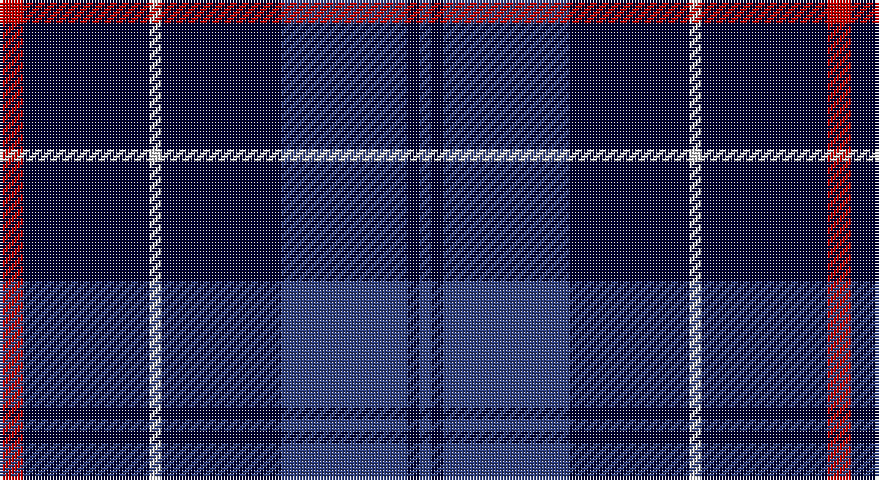

This page is one **sett** — a single exact thread-count. It belongs to the [tartan](/setts/r4k21w2k20db21k2db2/)
(the same proportion at any scale), whose colour order is pattern [BKBKWKR](/stripes/bkbkwkr/).

Sourced from weddslist.  It is a [7 stripe tartan](/stripes/stripes7/).

Original link http://www.weddslist.com/cgi-bin/tartans/pg.pl?source=sts

## Thread count
R/8 DB42 LN4 DB40 B42 DB4 B/4

One full sett is **276 threads**.

## Palette

Palette: <strong>Tartan Dictionary</strong> <small style="color:#888">(1 of 4 colours)</small>
<table><thead><tr><th>Colour</th><th>Threads</th><th>Shade</th><th>Base</th><th>OKLCh</th></tr></thead><tbody><tr><td>R/</td><td style="text-align:right;font-variant-numeric:tabular-nums">8</td><td><code style="background-color:#C00000;">#C00000</code> <small style="color:#888">#C00000</small></td><td>R <code style="background-color:#CC0000;">#CC0000</code></td><td><small style="color:#888">oklch(50.7% 0.208 29.2)</small></td></tr><tr><td>DB</td><td style="text-align:right;font-variant-numeric:tabular-nums">42</td><td><code style="background-color:#000030;">#000030</code> <small style="color:#888">#000030</small></td><td>K <code style="background-color:#000000;">#000000</code></td><td><small style="color:#888">oklch(14.0% 0.097 264.1)</small></td></tr><tr><td>LN</td><td style="text-align:right;font-variant-numeric:tabular-nums">4</td><td><code style="background-color:#E0E0E0;">#E0E0E0</code> <small style="color:#888">#E0E0E0</small></td><td>W <code style="background-color:#F7F7F7;">#F7F7F7</code></td><td><small style="color:#888">oklch(90.7% 0.000 89.9)</small></td></tr><tr><td>DB</td><td style="text-align:right;font-variant-numeric:tabular-nums">40</td><td><code style="background-color:#000030;">#000030</code> <small style="color:#888">#000030</small></td><td>K <code style="background-color:#000000;">#000000</code></td><td><small style="color:#888">oklch(14.0% 0.097 264.1)</small></td></tr><tr><td>B</td><td style="text-align:right;font-variant-numeric:tabular-nums">42</td><td><code style="background-color:#304080;">#304080</code> <small style="color:#888">#304080</small></td><td>B <code style="background-color:#2A418A;">#2A418A</code></td><td><small style="color:#888">oklch(39.4% 0.109 270.2)</small></td></tr><tr><td>DB</td><td style="text-align:right;font-variant-numeric:tabular-nums">4</td><td><code style="background-color:#000030;">#000030</code> <small style="color:#888">#000030</small></td><td>K <code style="background-color:#000000;">#000000</code></td><td><small style="color:#888">oklch(14.0% 0.097 264.1)</small></td></tr><tr><td>B/</td><td style="text-align:right;font-variant-numeric:tabular-nums">4</td><td><code style="background-color:#304080;">#304080</code> <small style="color:#888">#304080</small></td><td>B <code style="background-color:#2A418A;">#2A418A</code></td><td><small style="color:#888">oklch(39.4% 0.109 270.2)</small></td></tr></tbody></table>

# Sample pattern

## Nearest tartans

The nearest existing variants by ΔTartan distance, with this tartan at the top so the swatches line up against it.

ΔTartan

Tartan

Sett

—

<a href="/ttd/edit/#slug=r4k21w2k20db21k2db2~x2">St. Georges, Edgbaston</a> <a class="nn-out" href="/variants/s7/r4k21w2k20db21k2db2~x2/" title="open its dictionary page">↗</a>

1.06

<a href="/ttd/edit/#slug=db4ly2db17k2r4k2db3k11db3~x2&amp;base=r4k21w2k20db21k2db2~x2">Stone of Destiny</a> <a class="nn-out" href="/variants/s9/db4ly2db17k2r4k2db3k11db3~x2/" title="open its dictionary page">↗</a>

1.07

<a href="/ttd/edit/#slug=k1lo2k3db12k18w1~x2&amp;base=r4k21w2k20db21k2db2~x2">Jon's Theme (Fashion)</a> <a class="nn-out" href="/variants/s6/k1lo2k3db12k18w1~x2/" title="open its dictionary page">↗</a>

1.26

<a href="/ttd/edit/#slug=r1db12k5lo3db5lb1~x4&amp;base=r4k21w2k20db21k2db2~x2">Massachusetts (Unofficial)</a> <a class="nn-out" href="/variants/s6/r1db12k5lo3db5lb1~x4/" title="open its dictionary page">↗</a>

1.27

<a href="/ttd/edit/#slug=k1ly2k3n12k18w1~x2&amp;base=r4k21w2k20db21k2db2~x2">Jon's Theme</a> <a class="nn-out" href="/variants/s6/k1ly2k3n12k18w1~x2/" title="open its dictionary page">↗</a>

1.34

<a href="/ttd/edit/#slug=db9k4lb1k4db9r1~x4&amp;base=r4k21w2k20db21k2db2~x2">Scottish Nuclear</a> <a class="nn-out" href="/variants/s6/db9k4lb1k4db9r1~x4/" title="open its dictionary page">↗</a>

1.35

<a href="/ttd/edit/#slug=k20db2k6db2k4db27w2db8~x2&amp;base=r4k21w2k20db21k2db2~x2">Pride of Kinross</a> <a class="nn-out" href="/variants/s8/k20db2k6db2k4db27w2db8~x2/" title="open its dictionary page">↗</a>

1.36

<a href="/ttd/edit/#slug=k1db7k4lb1k4p1~x4&amp;base=r4k21w2k20db21k2db2~x2">Scottish Express International</a> <a class="nn-out" href="/variants/s6/k1db7k4lb1k4p1~x4/" title="open its dictionary page">↗</a>

1.37

<a href="/ttd/edit/#slug=k21db8r4db2r2db23k4w2~x2&amp;base=r4k21w2k20db21k2db2~x2">Murdoch Clebration (Personal)</a> <a class="nn-out" href="/variants/s8/k21db8r4db2r2db23k4w2~x2/" title="open its dictionary page">↗</a>

1.40

<a href="/ttd/edit/#slug=db4r2db2r4k7db10w2k13db18k2db2~x4&amp;base=r4k21w2k20db21k2db2~x2">Ibrox</a> <a class="nn-out" href="/variants/s11/db4r2db2r4k7db10w2k13db18k2db2~x4/" title="open its dictionary page">↗</a>

1.44

<a href="/ttd/edit/#slug=k15lo2k10db18lb3~x2&amp;base=r4k21w2k20db21k2db2~x2">College of Radiographers</a> <a class="nn-out" href="/variants/s5/k15lo2k10db18lb3~x2/" title="open its dictionary page">↗</a>

## Neighbour map

Every grey dot is one of 14360 variants placed by the first two principal components of the ΔTartan feature space (44% of its variance). Red is this tartan; blue dots are its nearest — click one to open its page.

<svg viewBox="0 0 640 380" role="img" style="max-width:100%;height:auto;border:1px solid #e0e0e0;border-radius:4px;display:block" xmlns="http://www.w3.org/2000/svg"><image href="/nn/cloud.v1.png" width="640" height="380"/><a href="/variants/s9/db4ly2db17k2r4k2db3k11db3~x2/"><circle cx="307.8" cy="208.0" r="4" fill="#3465a4"><title>Stone of Destiny</title></circle></a><a href="/variants/s6/k1lo2k3db12k18w1~x2/"><circle cx="373.9" cy="194.9" r="4" fill="#3465a4"><title>Jon's Theme (Fashion)</title></circle></a><a href="/variants/s6/r1db12k5lo3db5lb1~x4/"><circle cx="324.0" cy="199.6" r="4" fill="#3465a4"><title>Massachusetts (Unofficial)</title></circle></a><a href="/variants/s6/k1ly2k3n12k18w1~x2/"><circle cx="366.0" cy="187.5" r="4" fill="#3465a4"><title>Jon's Theme</title></circle></a><a href="/variants/s6/db9k4lb1k4db9r1~x4/"><circle cx="382.0" cy="258.2" r="4" fill="#3465a4"><title>Scottish Nuclear</title></circle></a><a href="/variants/s8/k20db2k6db2k4db27w2db8~x2/"><circle cx="389.7" cy="222.8" r="4" fill="#3465a4"><title>Pride of Kinross</title></circle></a><a href="/variants/s6/k1db7k4lb1k4p1~x4/"><circle cx="285.6" cy="258.2" r="4" fill="#3465a4"><title>Scottish Express International</title></circle></a><a href="/variants/s8/k21db8r4db2r2db23k4w2~x2/"><circle cx="308.6" cy="199.4" r="4" fill="#3465a4"><title>Murdoch Clebration (Personal)</title></circle></a><a href="/variants/s11/db4r2db2r4k7db10w2k13db18k2db2~x4/"><circle cx="305.1" cy="204.7" r="4" fill="#3465a4"><title>Ibrox</title></circle></a><a href="/variants/s5/k15lo2k10db18lb3~x2/"><circle cx="273.6" cy="254.0" r="4" fill="#3465a4"><title>College of Radiographers</title></circle></a><circle cx="347.6" cy="223.2" r="5" fill="#c00000"/></svg>

ID: /variants/s7/r4k21w2k20db21k2db2~x2/
