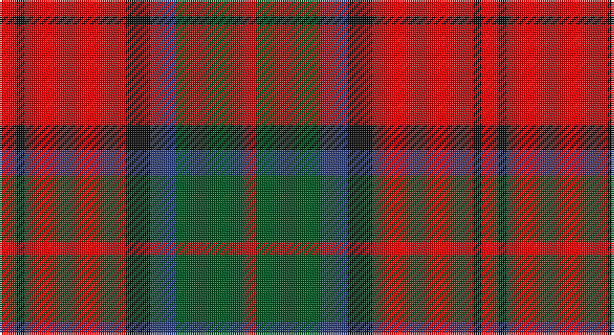

This page is one **sett** — a single exact thread-count. It belongs to the [tartan](/setts/r4k2r24k6db6dg16r3/)
(the same proportion at any scale), whose colour order is pattern [RGBKRKR](/stripes/rgbkrkr/).

Part of the [MacDuff](/tartans/macduff/) tartan — the named design grouping this sett with its other cloths.

Sourced from register-of-tartans.  It is a [7 stripe tartan](/stripes/stripes7/).

Original link https://www.tartanregister.gov.uk/tartanDetails.aspx?ref=2416

## Also known as

This cloth is also recorded under:

- MacDuff #2
- MacDuff #3
- MacDuff #4
- MacDuff #5
- MacDuff #6
- MacDuff Dress #2

## Register references

External register numbers recorded for this tartan.

- Scottish Register of Tartans: [2416](https://www.tartanregister.gov.uk/tartanDetails.aspx?ref=2416)
- Scottish Tartans World Register: 1453

## Thread count
R/8 K4 R48 K12 B12 G32 R/6

One full sett is **230 threads**.

## Palette

Palette: <strong>Tartan Register</strong>
<table><thead><tr><th>Colour</th><th>Threads</th><th>Shade</th><th>Base</th><th>OKLCh</th></tr></thead><tbody><tr><td>R/</td><td style="text-align:right;font-variant-numeric:tabular-nums">8</td><td><code style="background-color:#DC0000;">#DC0000</code> <small style="color:#888">#DC0000</small></td><td>R <code style="background-color:#CC0000;">#CC0000</code></td><td><small style="color:#888">oklch(56.2% 0.230 29.2)</small></td></tr><tr><td>K</td><td style="text-align:right;font-variant-numeric:tabular-nums">4</td><td><code style="background-color:#101010;">#101010</code> <small style="color:#888">#101010</small></td><td>K <code style="background-color:#000000;">#000000</code></td><td><small style="color:#888">oklch(17.3% 0.000 89.9)</small></td></tr><tr><td>R</td><td style="text-align:right;font-variant-numeric:tabular-nums">48</td><td><code style="background-color:#DC0000;">#DC0000</code> <small style="color:#888">#DC0000</small></td><td>R <code style="background-color:#CC0000;">#CC0000</code></td><td><small style="color:#888">oklch(56.2% 0.230 29.2)</small></td></tr><tr><td>K</td><td style="text-align:right;font-variant-numeric:tabular-nums">12</td><td><code style="background-color:#101010;">#101010</code> <small style="color:#888">#101010</small></td><td>K <code style="background-color:#000000;">#000000</code></td><td><small style="color:#888">oklch(17.3% 0.000 89.9)</small></td></tr><tr><td>B</td><td style="text-align:right;font-variant-numeric:tabular-nums">12</td><td><code style="background-color:#2C4084;">#2C4084</code> <small style="color:#888">#2C4084</small></td><td>B <code style="background-color:#2A418A;">#2A418A</code></td><td><small style="color:#888">oklch(39.4% 0.117 268.3)</small></td></tr><tr><td>G</td><td style="text-align:right;font-variant-numeric:tabular-nums">32</td><td><code style="background-color:#005020;">#005020</code> <small style="color:#888">#005020</small></td><td>G <code style="background-color:#006100;">#006100</code></td><td><small style="color:#888">oklch(37.7% 0.105 149.6)</small></td></tr><tr><td>R/</td><td style="text-align:right;font-variant-numeric:tabular-nums">6</td><td><code style="background-color:#DC0000;">#DC0000</code> <small style="color:#888">#DC0000</small></td><td>R <code style="background-color:#CC0000;">#CC0000</code></td><td><small style="color:#888">oklch(56.2% 0.230 29.2)</small></td></tr></tbody></table>

# Sample pattern

## Compared to the master

This cloth is one sett of its design; the master sett (the exemplar the design is anchored on) is below for comparison.

<figure style="margin:0"><figcaption style="color:#888;font-size:smaller">this sett</figcaption></figure>
<figure style="margin:0"><figcaption style="color:#888;font-size:smaller"><a href="/setts/r10db6k8dg10r6dg3r6/">master sett →</a></figcaption></figure>

## Nearest tartans

The nearest existing variants by ΔTartan distance, with this tartan at the top so the swatches line up against it.

ΔTartan

Tartan

Sett

—

<a href="/ttd/edit/#slug=r4k2r24k6db6dg16r3~x2">MacDuff #4</a> <a class="nn-out" href="/variants/s7/r4k2r24k6db6dg16r3~x2/" title="open its dictionary page">↗</a>

0.64

<a href="/ttd/edit/#slug=r1db6r1dg6r12w1~x2&amp;base=r4k2r24k6db6dg16r3~x2">Fraser Red Clan Tartan</a> <a class="nn-out" href="/variants/s6/r1db6r1dg6r12w1~x2/" title="open its dictionary page">↗</a>

0.65

<a href="/ttd/edit/#slug=r28db12r3dg20t2dg2r7~x2&amp;base=r4k2r24k6db6dg16r3~x2">Carrick (Strathmore) District Tartan</a> <a class="nn-out" href="/variants/s7/r28db12r3dg20t2dg2r7~x2/" title="open its dictionary page">↗</a>

0.66

<a href="/ttd/edit/#slug=k2r12db6r3dg12r4db1~x2&amp;base=r4k2r24k6db6dg16r3~x2">MacBean/MacElvain</a> <a class="nn-out" href="/variants/s7/k2r12db6r3dg12r4db1~x2/" title="open its dictionary page">↗</a>

0.72

<a href="/ttd/edit/#slug=t2k2r27dg27k12t12r27k2t2~x2&amp;base=r4k2r24k6db6dg16r3~x2">MacNaughton</a> <a class="nn-out" href="/variants/s9/t2k2r27dg27k12t12r27k2t2~x2/" title="open its dictionary page">↗</a>

0.73

<a href="/ttd/edit/#slug=r1db6r1dg6r12lb1&amp;base=r4k2r24k6db6dg16r3~x2">Fraser VS</a> <a class="nn-out" href="/variants/s6/r1db6r1dg6r12lb1/" title="open its dictionary page">↗</a>

0.75

<a href="/ttd/edit/#slug=dg28r7m7dg14m7r48k4~x2&amp;base=r4k2r24k6db6dg16r3~x2">MacNab (Crimson)</a> <a class="nn-out" href="/variants/s7/dg28r7m7dg14m7r48k4~x2/" title="open its dictionary page">↗</a>

0.76

<a href="/ttd/edit/#slug=r4k2r24k6db6g16r3~x2&amp;base=r4k2r24k6db6dg16r3~x2">MacDuff</a> <a class="nn-out" href="/variants/s7/r4k2r24k6db6g16r3~x2/" title="open its dictionary page">↗</a>

0.78

<a href="/ttd/edit/#slug=r2db12r2g11r4db5g2r24w2~x2&amp;base=r4k2r24k6db6dg16r3~x2">Fraser Gathering, Red (1997)</a> <a class="nn-out" href="/variants/s9/r2db12r2g11r4db5g2r24w2~x2/" title="open its dictionary page">↗</a>

0.80

<a href="/ttd/edit/#slug=r5w2r28k12dg16r3~x2&amp;base=r4k2r24k6db6dg16r3~x2">MacKintosh #4</a> <a class="nn-out" href="/variants/s6/r5w2r28k12dg16r3~x2/" title="open its dictionary page">↗</a>

0.88

<a href="/ttd/edit/#slug=r6dg16r4db12r16t1r2~x2&amp;base=r4k2r24k6db6dg16r3~x2">MacQuarrie #6</a> <a class="nn-out" href="/variants/s7/r6dg16r4db12r16t1r2~x2/" title="open its dictionary page">↗</a>

## Neighbour map

Every grey dot is one of 14360 variants placed by the first two principal components of the ΔTartan feature space (44% of its variance). Red is this tartan; blue dots are its nearest — click one to open its page.

<svg viewBox="0 0 640 380" role="img" style="max-width:100%;height:auto;border:1px solid #e0e0e0;border-radius:4px;display:block" xmlns="http://www.w3.org/2000/svg"><image href="/nn/cloud.v1.png" width="640" height="380"/><a href="/variants/s6/r1db6r1dg6r12w1~x2/"><circle cx="292.6" cy="189.0" r="4" fill="#3465a4"><title>Fraser Red Clan Tartan</title></circle></a><a href="/variants/s7/r28db12r3dg20t2dg2r7~x2/"><circle cx="308.1" cy="185.9" r="4" fill="#3465a4"><title>Carrick (Strathmore) District Tartan</title></circle></a><a href="/variants/s7/k2r12db6r3dg12r4db1~x2/"><circle cx="259.2" cy="199.0" r="4" fill="#3465a4"><title>MacBean/MacElvain</title></circle></a><a href="/variants/s9/t2k2r27dg27k12t12r27k2t2~x2/"><circle cx="251.4" cy="166.7" r="4" fill="#3465a4"><title>MacNaughton</title></circle></a><a href="/variants/s6/r1db6r1dg6r12lb1/"><circle cx="280.6" cy="185.4" r="4" fill="#3465a4"><title>Fraser VS</title></circle></a><a href="/variants/s7/dg28r7m7dg14m7r48k4~x2/"><circle cx="297.3" cy="188.5" r="4" fill="#3465a4"><title>MacNab (Crimson)</title></circle></a><a href="/variants/s7/r4k2r24k6db6g16r3~x2/"><circle cx="260.4" cy="179.1" r="4" fill="#3465a4"><title>MacDuff</title></circle></a><a href="/variants/s9/r2db12r2g11r4db5g2r24w2~x2/"><circle cx="277.2" cy="163.1" r="4" fill="#3465a4"><title>Fraser Gathering, Red (1997)</title></circle></a><a href="/variants/s6/r5w2r28k12dg16r3~x2/"><circle cx="300.2" cy="181.9" r="4" fill="#3465a4"><title>MacKintosh #4</title></circle></a><a href="/variants/s7/r6dg16r4db12r16t1r2~x2/"><circle cx="284.4" cy="191.1" r="4" fill="#3465a4"><title>MacQuarrie #6</title></circle></a><circle cx="278.1" cy="183.7" r="5" fill="#c00000"/></svg>

ID: /variants/s7/r4k2r24k6db6dg16r3~x2/
