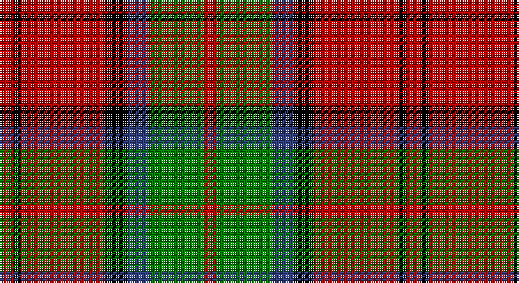

This page is one **sett** — a single exact thread-count. It belongs to the [tartan](/setts/r4k2r24k6db6g16r3/)
(the same proportion at any scale), whose colour order is pattern [RGBKRKR](/stripes/rgbkrkr/).

Part of the [MacDuff](/tartans/macduff/) tartan — the named design grouping this sett with its other cloths.

Sourced from weddslist.  It is a [7 stripe tartan](/stripes/stripes7/).

Original link http://www.weddslist.com/cgi-bin/tartans/pg.pl?source=sts

## Also known as

This cloth is also recorded under:

- MacDuff #2
- MacDuff #3
- MacDuff #4
- MacDuff #5
- MacDuff #6
- MacDuff Dress #2

## Thread count
R/8 K4 R48 K12 B12 G32 R/6

One full sett is **230 threads**.

## Palette

Palette: <strong>Ingles Buchan</strong> <small style="color:#888">(1 of 4 colours)</small>
<table><thead><tr><th>Colour</th><th>Threads</th><th>Shade</th><th>Base</th><th>OKLCh</th></tr></thead><tbody><tr><td>R/</td><td style="text-align:right;font-variant-numeric:tabular-nums">8</td><td><code style="background-color:#C00000;">#C00000</code> <small style="color:#888">#C00000</small></td><td>R <code style="background-color:#CC0000;">#CC0000</code></td><td><small style="color:#888">oklch(50.7% 0.208 29.2)</small></td></tr><tr><td>K</td><td style="text-align:right;font-variant-numeric:tabular-nums">4</td><td><code style="background-color:#000000;">#000000</code> <small style="color:#888">#000000</small></td><td>K <code style="background-color:#000000;">#000000</code></td><td><small style="color:#888">oklch(0.0% 0.000 0.0)</small></td></tr><tr><td>R</td><td style="text-align:right;font-variant-numeric:tabular-nums">48</td><td><code style="background-color:#C00000;">#C00000</code> <small style="color:#888">#C00000</small></td><td>R <code style="background-color:#CC0000;">#CC0000</code></td><td><small style="color:#888">oklch(50.7% 0.208 29.2)</small></td></tr><tr><td>K</td><td style="text-align:right;font-variant-numeric:tabular-nums">12</td><td><code style="background-color:#000000;">#000000</code> <small style="color:#888">#000000</small></td><td>K <code style="background-color:#000000;">#000000</code></td><td><small style="color:#888">oklch(0.0% 0.000 0.0)</small></td></tr><tr><td>B</td><td style="text-align:right;font-variant-numeric:tabular-nums">12</td><td><code style="background-color:#304080;">#304080</code> <small style="color:#888">#304080</small></td><td>B <code style="background-color:#2A418A;">#2A418A</code></td><td><small style="color:#888">oklch(39.4% 0.109 270.2)</small></td></tr><tr><td>G</td><td style="text-align:right;font-variant-numeric:tabular-nums">32</td><td><code style="background-color:#008000;">#008000</code> <small style="color:#888">#008000</small></td><td>G <code style="background-color:#006100;">#006100</code></td><td><small style="color:#888">oklch(52.0% 0.177 142.5)</small></td></tr><tr><td>R/</td><td style="text-align:right;font-variant-numeric:tabular-nums">6</td><td><code style="background-color:#C00000;">#C00000</code> <small style="color:#888">#C00000</small></td><td>R <code style="background-color:#CC0000;">#CC0000</code></td><td><small style="color:#888">oklch(50.7% 0.208 29.2)</small></td></tr></tbody></table>

# Sample pattern

## Compared to the master

This cloth is one sett of its design; the master sett (the exemplar the design is anchored on) is below for comparison.

<figure style="margin:0"><figcaption style="color:#888;font-size:smaller">this sett</figcaption></figure>
<figure style="margin:0"><figcaption style="color:#888;font-size:smaller"><a href="/setts/r10db6k8dg10r6dg3r6/">master sett →</a></figcaption></figure>

## Nearest tartans

The nearest existing variants by ΔTartan distance, with this tartan at the top so the swatches line up against it.

ΔTartan

Tartan

Sett

—

<a href="/ttd/edit/#slug=r4k2r24k6db6g16r3~x2">MacDuff</a> <a class="nn-out" href="/variants/s7/r4k2r24k6db6g16r3~x2/" title="open its dictionary page">↗</a>

0.73

<a href="/ttd/edit/#slug=db1k1r12g12k6db5r12k1db1~x2&amp;base=r4k2r24k6db6g16r3~x2">Montrose</a> <a class="nn-out" href="/variants/s9/db1k1r12g12k6db5r12k1db1~x2/" title="open its dictionary page">↗</a>

0.76

<a href="/ttd/edit/#slug=r4k2r24k6db6dg16r3~x2&amp;base=r4k2r24k6db6g16r3~x2">MacDuff #4</a> <a class="nn-out" href="/variants/s7/r4k2r24k6db6dg16r3~x2/" title="open its dictionary page">↗</a>

0.78

<a href="/ttd/edit/#slug=r5w2r28k12g16r3~x2&amp;base=r4k2r24k6db6g16r3~x2">MacKintosh 6</a> <a class="nn-out" href="/variants/s6/r5w2r28k12g16r3~x2/" title="open its dictionary page">↗</a>

0.85

<a href="/ttd/edit/#slug=k2r12db6r3g12r4db1~x2&amp;base=r4k2r24k6db6g16r3~x2">MacBean, MacElvain</a> <a class="nn-out" href="/variants/s7/k2r12db6r3g12r4db1~x2/" title="open its dictionary page">↗</a>

0.86

<a href="/ttd/edit/#slug=r1db6r1dg6r12lb1&amp;base=r4k2r24k6db6g16r3~x2">Fraser VS</a> <a class="nn-out" href="/variants/s6/r1db6r1dg6r12lb1/" title="open its dictionary page">↗</a>

0.91

<a href="/ttd/edit/#slug=k15dg1k3r9dg1r3lo11k1~x4&amp;base=r4k2r24k6db6g16r3~x2">Island of Innis, The</a> <a class="nn-out" href="/variants/s8/k15dg1k3r9dg1r3lo11k1~x4/" title="open its dictionary page">↗</a>

0.91

<a href="/ttd/edit/#slug=t2k2r27dg27k12t12r27k2t2~x2&amp;base=r4k2r24k6db6g16r3~x2">MacNaughton</a> <a class="nn-out" href="/variants/s9/t2k2r27dg27k12t12r27k2t2~x2/" title="open its dictionary page">↗</a>

0.92

<a href="/ttd/edit/#slug=k2db2r26dg25k13db13r26db2k2~x2&amp;base=r4k2r24k6db6g16r3~x2">MacNaughton (Logan) #2</a> <a class="nn-out" href="/variants/s9/k2db2r26dg25k13db13r26db2k2~x2/" title="open its dictionary page">↗</a>

0.96

<a href="/ttd/edit/#slug=dg3r1w5r1dg2r1dg1r9do2~x4&amp;base=r4k2r24k6db6g16r3~x2">Redwood Dress</a> <a class="nn-out" href="/variants/s9/dg3r1w5r1dg2r1dg1r9do2~x4/" title="open its dictionary page">↗</a>

0.97

<a href="/ttd/edit/#slug=r6dg16r4db12r16lb1r2~x2&amp;base=r4k2r24k6db6g16r3~x2">MacQuarrie LO</a> <a class="nn-out" href="/variants/s7/r6dg16r4db12r16lb1r2~x2/" title="open its dictionary page">↗</a>

## Neighbour map

Every grey dot is one of 14360 variants placed by the first two principal components of the ΔTartan feature space (44% of its variance). Red is this tartan; blue dots are its nearest — click one to open its page.

<svg viewBox="0 0 640 380" role="img" style="max-width:100%;height:auto;border:1px solid #e0e0e0;border-radius:4px;display:block" xmlns="http://www.w3.org/2000/svg"><image href="/nn/cloud.v1.png" width="640" height="380"/><a href="/variants/s9/db1k1r12g12k6db5r12k1db1~x2/"><circle cx="226.2" cy="169.7" r="4" fill="#3465a4"><title>Montrose</title></circle></a><a href="/variants/s7/r4k2r24k6db6dg16r3~x2/"><circle cx="278.1" cy="183.7" r="4" fill="#3465a4"><title>MacDuff #4</title></circle></a><a href="/variants/s6/r5w2r28k12g16r3~x2/"><circle cx="282.9" cy="178.5" r="4" fill="#3465a4"><title>MacKintosh 6</title></circle></a><a href="/variants/s7/k2r12db6r3g12r4db1~x2/"><circle cx="249.5" cy="197.5" r="4" fill="#3465a4"><title>MacBean, MacElvain</title></circle></a><a href="/variants/s6/r1db6r1dg6r12lb1/"><circle cx="280.6" cy="185.4" r="4" fill="#3465a4"><title>Fraser VS</title></circle></a><a href="/variants/s8/k15dg1k3r9dg1r3lo11k1~x4/"><circle cx="232.9" cy="163.7" r="4" fill="#3465a4"><title>Island of Innis, The</title></circle></a><a href="/variants/s9/t2k2r27dg27k12t12r27k2t2~x2/"><circle cx="251.4" cy="166.7" r="4" fill="#3465a4"><title>MacNaughton</title></circle></a><a href="/variants/s9/k2db2r26dg25k13db13r26db2k2~x2/"><circle cx="229.3" cy="162.3" r="4" fill="#3465a4"><title>MacNaughton (Logan) #2</title></circle></a><a href="/variants/s9/dg3r1w5r1dg2r1dg1r9do2~x4/"><circle cx="227.6" cy="171.9" r="4" fill="#3465a4"><title>Redwood Dress</title></circle></a><a href="/variants/s7/r6dg16r4db12r16lb1r2~x2/"><circle cx="267.5" cy="187.0" r="4" fill="#3465a4"><title>MacQuarrie LO</title></circle></a><circle cx="260.4" cy="179.1" r="5" fill="#c00000"/></svg>

ID: /variants/s7/r4k2r24k6db6g16r3~x2/
