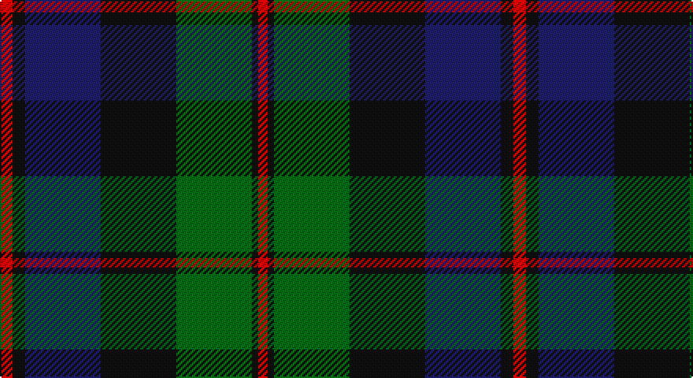

This page is one **sett** — a single exact thread-count. It belongs to the [tartan](/setts/r4k4db24k24g24k2r3/)
(the same proportion at any scale), whose colour order is pattern [RKBKGKR](/stripes/rkbkgkr/).

Part of the [Black Watch](/tartans/black-watch/) tartan — the named design grouping this sett with its other cloths.

Sourced from register-of-tartans.  It is a [7 stripe tartan](/stripes/stripes7/).

Original link https://www.tartanregister.gov.uk/tartanDetails.aspx?ref=279

## Also known as

This cloth is also recorded under:

- Black Watch, Plaid for Band

2 attestations — the source records this cloth was collapsed from (oldest owns this page)

<ul>
<li>01/01/1788 — Black Watch (Coarse Kilt) (register-of-tartans, <a href="https://www.tartanregister.gov.uk/tartanDetails.aspx?ref=279">record</a>)</li>
<li>undated — Black Watch (weddslist, <a href="http://www.weddslist.com/cgi-bin/tartans/pg.pl?source=sts">record</a>)</li>
</ul>

## Register references

External register numbers recorded for this tartan.

- Scottish Register of Tartans: [279](https://www.tartanregister.gov.uk/tartanDetails.aspx?ref=279)
- Scottish Tartans Authority (ITI): 1563
- Scottish Tartans World Register: 1563

## Thread count
R/8 K8 DB48 K48 G48 K4 R/6

One full sett is **326 threads**.

## Palette

Palette: <strong>Tartan Register</strong>
<table><thead><tr><th>Colour</th><th>Threads</th><th>Shade</th><th>Base</th><th>OKLCh</th></tr></thead><tbody><tr><td>R/</td><td style="text-align:right;font-variant-numeric:tabular-nums">8</td><td><code style="background-color:#C80000;">#C80000</code> <small style="color:#888">#C80000</small></td><td>R <code style="background-color:#CC0000;">#CC0000</code></td><td><small style="color:#888">oklch(52.3% 0.215 29.2)</small></td></tr><tr><td>K</td><td style="text-align:right;font-variant-numeric:tabular-nums">8</td><td><code style="background-color:#101010;">#101010</code> <small style="color:#888">#101010</small></td><td>K <code style="background-color:#000000;">#000000</code></td><td><small style="color:#888">oklch(17.3% 0.000 89.9)</small></td></tr><tr><td>DB</td><td style="text-align:right;font-variant-numeric:tabular-nums">48</td><td><code style="background-color:#202060;">#202060</code> <small style="color:#888">#202060</small></td><td>B <code style="background-color:#2A418A;">#2A418A</code></td><td><small style="color:#888">oklch(28.9% 0.111 276.9)</small></td></tr><tr><td>K</td><td style="text-align:right;font-variant-numeric:tabular-nums">48</td><td><code style="background-color:#101010;">#101010</code> <small style="color:#888">#101010</small></td><td>K <code style="background-color:#000000;">#000000</code></td><td><small style="color:#888">oklch(17.3% 0.000 89.9)</small></td></tr><tr><td>G</td><td style="text-align:right;font-variant-numeric:tabular-nums">48</td><td><code style="background-color:#006818;">#006818</code> <small style="color:#888">#006818</small></td><td>G <code style="background-color:#006100;">#006100</code></td><td><small style="color:#888">oklch(45.0% 0.142 145.0)</small></td></tr><tr><td>K</td><td style="text-align:right;font-variant-numeric:tabular-nums">4</td><td><code style="background-color:#101010;">#101010</code> <small style="color:#888">#101010</small></td><td>K <code style="background-color:#000000;">#000000</code></td><td><small style="color:#888">oklch(17.3% 0.000 89.9)</small></td></tr><tr><td>R/</td><td style="text-align:right;font-variant-numeric:tabular-nums">6</td><td><code style="background-color:#C80000;">#C80000</code> <small style="color:#888">#C80000</small></td><td>R <code style="background-color:#CC0000;">#CC0000</code></td><td><small style="color:#888">oklch(52.3% 0.215 29.2)</small></td></tr></tbody></table>

# Sample pattern

## Compared to the master

This cloth is one sett of its design; the master sett (the exemplar the design is anchored on) is below for comparison.

<figure style="margin:0"><figcaption style="color:#888;font-size:smaller">this sett</figcaption></figure>
<figure style="margin:0"><figcaption style="color:#888;font-size:smaller"><a href="/setts/b3k2b8db8g8db2/">master sett →</a></figcaption></figure>

## Nearest tartans

The nearest existing variants by ΔTartan distance, with this tartan at the top so the swatches line up against it.

ΔTartan

Tartan

Sett

—

<a href="/ttd/edit/#slug=r4k4db24k24g24k2r3~x2">Black Watch (Coarse Kilt)</a> <a class="nn-out" href="/variants/s7/r4k4db24k24g24k2r3~x2/" title="open its dictionary page">↗</a>

0.60

<a href="/ttd/edit/#slug=k2g10k9db9r1k1db2~x2&amp;base=r4k4db24k24g24k2r3~x2">Reid and Taylor</a> <a class="nn-out" href="/variants/s7/k2g10k9db9r1k1db2~x2/" title="open its dictionary page">↗</a>

0.64

<a href="/ttd/edit/#slug=k7g22k22db6r2db15r2~x2&amp;base=r4k4db24k24g24k2r3~x2">National Galleries of Scotland</a> <a class="nn-out" href="/variants/s7/k7g22k22db6r2db15r2~x2/" title="open its dictionary page">↗</a>

0.68

<a href="/ttd/edit/#slug=r2g12k12g1db12g2~x2&amp;base=r4k4db24k24g24k2r3~x2">Gunn</a> <a class="nn-out" href="/variants/s6/r2g12k12g1db12g2~x2/" title="open its dictionary page">↗</a>

0.76

<a href="/ttd/edit/#slug=k4db16k12g12r1g2k2~x2&amp;base=r4k4db24k24g24k2r3~x2">Dundas #2</a> <a class="nn-out" href="/variants/s7/k4db16k12g12r1g2k2~x2/" title="open its dictionary page">↗</a>

0.80

<a href="/ttd/edit/#slug=g8t1g1k6dp6k1dp3~x4&amp;base=r4k4db24k24g24k2r3~x2">Unnamed 19th Century Plaid</a> <a class="nn-out" href="/variants/s7/g8t1g1k6dp6k1dp3~x4/" title="open its dictionary page">↗</a>

0.80

<a href="/ttd/edit/#slug=db6k2db18k18g18k3r2~x2&amp;base=r4k4db24k24g24k2r3~x2">Renfrew</a> <a class="nn-out" href="/variants/s7/db6k2db18k18g18k3r2~x2/" title="open its dictionary page">↗</a>

0.82

<a href="/ttd/edit/#slug=m7g3m2g33k31db31k3db3&amp;base=r4k4db24k24g24k2r3~x2">Baird (Old) Clan Tartan</a> <a class="nn-out" href="/variants/s8/m7g3m2g33k31db31k3db3/" title="open its dictionary page">↗</a>

0.84

<a href="/ttd/edit/#slug=db4k3db12k11gi13g1gi1g3~x2&amp;base=r4k4db24k24g24k2r3~x2">Bedford High School</a> <a class="nn-out" href="/variants/s8/db4k3db12k11gi13g1gi1g3~x2/" title="open its dictionary page">↗</a>

0.88

<a href="/ttd/edit/#slug=k4g25k24r3db24g4~x2&amp;base=r4k4db24k24g24k2r3~x2">Ferguson of Balquhidder #2</a> <a class="nn-out" href="/variants/s6/k4g25k24r3db24g4~x2/" title="open its dictionary page">↗</a>

0.92

<a href="/ttd/edit/#slug=db24k3db5k23ly2k11g22~x2&amp;base=r4k4db24k24g24k2r3~x2">Mowat (Clans Originaux)</a> <a class="nn-out" href="/variants/s7/db24k3db5k23ly2k11g22~x2/" title="open its dictionary page">↗</a>

## Neighbour map

Every grey dot is one of 14360 variants placed by the first two principal components of the ΔTartan feature space (44% of its variance). Red is this tartan; blue dots are its nearest — click one to open its page.

<svg viewBox="0 0 640 380" role="img" style="max-width:100%;height:auto;border:1px solid #e0e0e0;border-radius:4px;display:block" xmlns="http://www.w3.org/2000/svg"><image href="/nn/cloud.v1.png" width="640" height="380"/><a href="/variants/s7/k2g10k9db9r1k1db2~x2/"><circle cx="221.4" cy="232.8" r="4" fill="#3465a4"><title>Reid and Taylor</title></circle></a><a href="/variants/s7/k7g22k22db6r2db15r2~x2/"><circle cx="218.5" cy="230.5" r="4" fill="#3465a4"><title>National Galleries of Scotland</title></circle></a><a href="/variants/s6/r2g12k12g1db12g2~x2/"><circle cx="216.6" cy="231.7" r="4" fill="#3465a4"><title>Gunn</title></circle></a><a href="/variants/s7/k4db16k12g12r1g2k2~x2/"><circle cx="248.8" cy="217.5" r="4" fill="#3465a4"><title>Dundas #2</title></circle></a><a href="/variants/s7/g8t1g1k6dp6k1dp3~x4/"><circle cx="203.2" cy="242.9" r="4" fill="#3465a4"><title>Unnamed 19th Century Plaid</title></circle></a><a href="/variants/s7/db6k2db18k18g18k3r2~x2/"><circle cx="219.4" cy="240.0" r="4" fill="#3465a4"><title>Renfrew</title></circle></a><a href="/variants/s8/m7g3m2g33k31db31k3db3/"><circle cx="226.8" cy="193.0" r="4" fill="#3465a4"><title>Baird (Old) Clan Tartan</title></circle></a><a href="/variants/s8/db4k3db12k11gi13g1gi1g3~x2/"><circle cx="197.9" cy="213.5" r="4" fill="#3465a4"><title>Bedford High School</title></circle></a><a href="/variants/s6/k4g25k24r3db24g4~x2/"><circle cx="204.5" cy="249.5" r="4" fill="#3465a4"><title>Ferguson of Balquhidder #2</title></circle></a><a href="/variants/s7/db24k3db5k23ly2k11g22~x2/"><circle cx="238.5" cy="232.6" r="4" fill="#3465a4"><title>Mowat (Clans Originaux)</title></circle></a><circle cx="220.5" cy="219.1" r="5" fill="#c00000"/></svg>

ID: /variants/s7/r4k4db24k24g24k2r3~x2/
