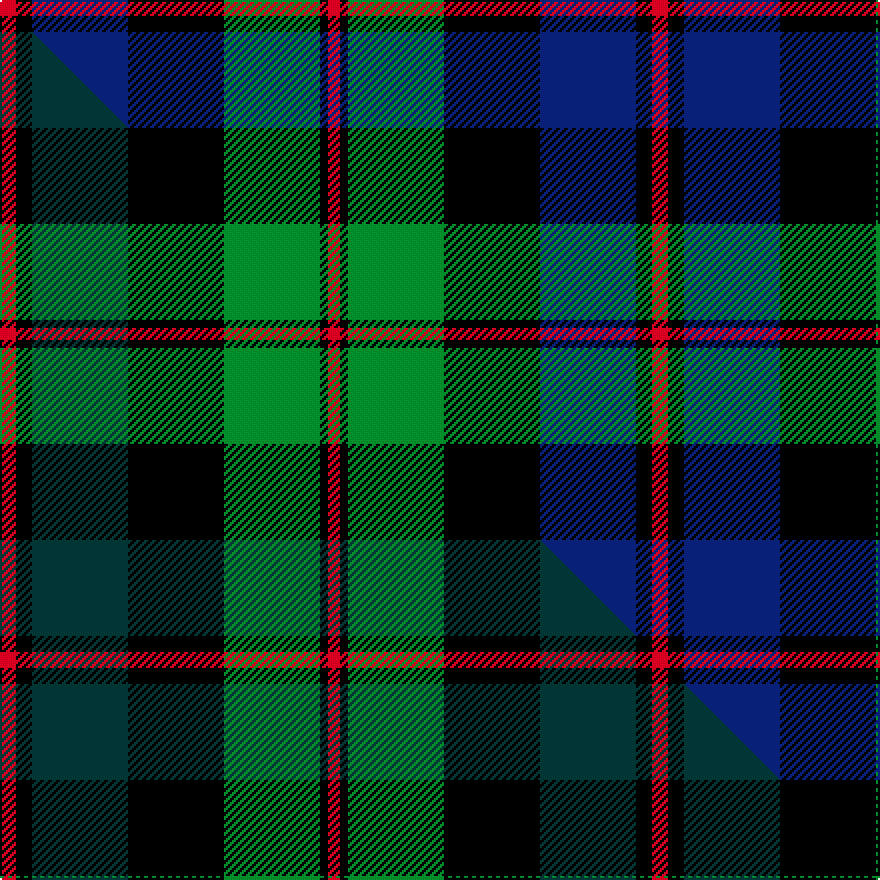

This page is one **sett** — a single exact thread-count. It belongs to the [tartan](/setts/r4k4db24k24g24k2r3/)
(the same proportion at any scale), whose colour order is pattern [RKBKGKR](/stripes/rkbkgkr/).

Part of the [Black Watch](/tartans/black-watch/) tartan — the named design grouping this sett with its other cloths.

Sourced from weddslist.  It is a [7 stripe tartan](/stripes/stripes7/).

Original link http://www.weddslist.com/cgi-bin/tartans/pg.pl?source=sts

## Thread count
R/8 K8 DB48 K48 G48 K4 R/6

One full sett is **326 threads**.

## Palette
<table><thead><tr><th>Colour</th><th>Shade</th><th>OKLCh</th></tr></thead><tbody><tr><td>DB</td><td><code style="background-color:#082077;">#082077</code> <small style="color:#888">#082077</small></td><td><small style="color:#888">oklch(30.0% 0.149 265.1)</small></td></tr><tr><td>G</td><td><code style="background-color:#008B2A;">#008B2A</code> <small style="color:#888">#008B2A</small></td><td><small style="color:#888">oklch(55.4% 0.170 145.9)</small></td></tr><tr><td>K</td><td><code style="background-color:#000000;">#000000</code> <small style="color:#888">#000000</small></td><td><small style="color:#888">oklch(0.0% 0.000 0.0)</small></td></tr><tr><td>R</td><td><code style="background-color:#D60020;">#D60020</code> <small style="color:#888">#D60020</small></td><td><small style="color:#888">oklch(55.2% 0.224 25.5)</small></td></tr></tbody></table>

# Sample pattern

## Compared to the master

This cloth is one sett of its design; the master sett (the exemplar the design is anchored on) is below for comparison.

Its **ΔTartan distance** from the master is **0.83** — the same measure the nearest-tartans table ranks by (0 is identical; a re-scale of the same cloth is near 0, a recolour or a different proportion further).

<figure class="master-compare" style="margin:0">

this sett
master sett ★

<figcaption style="color:#888;font-size:smaller">One weave of this sett against the <a href="/setts/r4k4dt24k24g24k2r3/">master sett ★</a>, split on the diagonal: a shared proportion runs seamlessly across it with only the shades shifting; a different proportion breaks on it.</figcaption>
</figure>

## Nearest tartan variants

The nearest existing variants by ΔTartan distance, with this cloth at the top so the swatches line up against it.

ΔTartan

Threads

Variant

Sett

—

326

<a href="/variants/s7/r4k4db24k24g24k2r3~x2/">Black Watch</a>

<a href="/ttd/edit/#slug=r3k2db25k28g25k2r3~x2&amp;base=r4k4db24k24g24k2r3~x2" title="compare in the TTD">0.16</a>

340

<a href="/variants/s7/r3k2db25k28g25k2r3~x2/">Coarse Kilt</a>

<a href="/ttd/edit/#slug=r3k2g15k10db20k2y2~x2&amp;base=r4k4db24k24g24k2r3~x2" title="compare in the TTD">1.01</a>

206

<a href="/variants/s7/r3k2g15k10db20k2y2~x2/">MacLeod, Macleod of Harris</a>

<a href="/ttd/edit/#slug=r3k2g15k10db20k2y2&amp;base=r4k4db24k24g24k2r3~x2" title="compare in the TTD">1.01</a>

103

<a href="/variants/s7/r3k2g15k10db20k2y2/">MacLeod</a>

<a href="/ttd/edit/#slug=db6k2db18k18g18k3r2~x2&amp;base=r4k4db24k24g24k2r3~x2" title="compare in the TTD">1.46</a>

252

<a href="/variants/s7/db6k2db18k18g18k3r2~x2/">Renfrew</a>

<a href="/ttd/edit/#slug=k2r1g15k15db15y1k2~x2&amp;base=r4k4db24k24g24k2r3~x2" title="compare in the TTD">1.46</a>

196

<a href="/variants/s7/k2r1g15k15db15y1k2~x2/">MacCaskill</a>

<a href="/ttd/edit/#slug=k4w2g18k13db12k2~x2&amp;base=r4k4db24k24g24k2r3~x2" title="compare in the TTD">1.46</a>

192

<a href="/variants/s6/k4w2g18k13db12k2~x2/">Melville</a>

<a href="/ttd/edit/#slug=r4k4dt24k24g24k2r3~x2&amp;base=r4k4db24k24g24k2r3~x2" title="compare in the TTD">1.53</a>

326

<a href="/variants/s7/r4k4dt24k24g24k2r3~x2/">Black Watch (Coarse Kilt)</a>

<a href="/ttd/edit/#slug=k2g10k9db9r1k1db2~x2&amp;base=r4k4db24k24g24k2r3~x2" title="compare in the TTD">1.64</a>

128

<a href="/variants/s7/k2g10k9db9r1k1db2~x2/">Reid and Taylor</a>

<a href="/ttd/edit/#slug=lb1db11k11g11k2lb1~x2&amp;base=r4k4db24k24g24k2r3~x2" title="compare in the TTD">1.76</a>

144

<a href="/variants/s6/lb1db11k11g11k2lb1~x2/">Unidentified No 59</a>

<a href="/ttd/edit/#slug=r3k12g4db12r1k2r1~x4&amp;base=r4k4db24k24g24k2r3~x2" title="compare in the TTD">1.80</a>

264

<a href="/variants/s7/r3k12g4db12r1k2r1~x4/">Sandberg</a>

## Neighbour map

Every grey dot is one of 13620 variants placed by the first two principal components of the ΔTartan feature space (42% of its variance). Red is this tartan; blue dots are its nearest — click one to open its page.

<svg viewBox="0 0 640 380" role="img" style="max-width:100%;height:auto;border:1px solid #e0e0e0;border-radius:4px;display:block" xmlns="http://www.w3.org/2000/svg"><image href="/nn/cloud.v1.png" width="640" height="380"/><a href="/variants/s7/r3k2db25k28g25k2r3~x2/"><circle cx="167.5" cy="167.4" r="4" fill="#3465a4"><title>Coarse Kilt</title></circle></a><a href="/variants/s7/r3k2g15k10db20k2y2~x2/"><circle cx="142.2" cy="172.2" r="4" fill="#3465a4"><title>MacLeod, Macleod of Harris</title></circle></a><a href="/variants/s7/r3k2g15k10db20k2y2/"><circle cx="142.2" cy="172.2" r="4" fill="#3465a4"><title>MacLeod</title></circle></a><a href="/variants/s7/db6k2db18k18g18k3r2~x2/"><circle cx="155.4" cy="200.1" r="4" fill="#3465a4"><title>Renfrew</title></circle></a><a href="/variants/s7/k2r1g15k15db15y1k2~x2/"><circle cx="158.4" cy="151.7" r="4" fill="#3465a4"><title>MacCaskill</title></circle></a><a href="/variants/s6/k4w2g18k13db12k2~x2/"><circle cx="140.9" cy="205.2" r="4" fill="#3465a4"><title>Melville</title></circle></a><a href="/variants/s7/r4k4dt24k24g24k2r3~x2/"><circle cx="156.6" cy="182.2" r="4" fill="#3465a4"><title>Black Watch (Coarse Kilt)</title></circle></a><a href="/variants/s7/k2g10k9db9r1k1db2~x2/"><circle cx="155.8" cy="193.1" r="4" fill="#3465a4"><title>Reid and Taylor</title></circle></a><a href="/variants/s6/lb1db11k11g11k2lb1~x2/"><circle cx="150.9" cy="197.3" r="4" fill="#3465a4"><title>Unidentified No 59</title></circle></a><a href="/variants/s7/r3k12g4db12r1k2r1~x4/"><circle cx="184.1" cy="171.3" r="4" fill="#3465a4"><title>Sandberg</title></circle></a><circle cx="151.5" cy="179.5" r="5" fill="#c00000"/><text x="320" y="376" text-anchor="middle" font-size="11" fill="#999">ground</text><text x="11" y="190" text-anchor="middle" font-size="11" fill="#999" transform="rotate(-90 11 190)">complexity</text></svg>

ID: /variants/s7/r4k4db24k24g24k2r3~x2/
