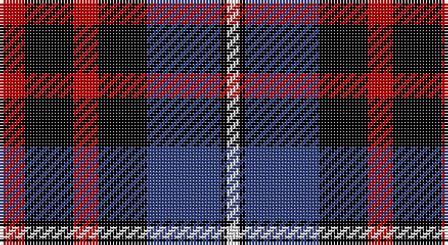

This page is one **sett** — a single exact thread-count. It belongs to the [tartan](/setts/r4k8r4k8db12k1w2/)
(the same proportion at any scale), whose colour order is pattern [RKRKBKW](/stripes/rkrkbkw/).

Part of the [MacKean](/tartans/mackean/) tartan — the named design grouping this sett with its other cloths.

Sourced from weddslist.  It is a [7 stripe tartan](/stripes/stripes7/).

Original link http://www.weddslist.com/cgi-bin/tartans/pg.pl?source=sts

## Also known as

This cloth is also recorded under:

- MacKean Green
- MacKean Red
- MacKean, Green

## Thread count
R/8 K16 R8 K16 B24 K2 LN/4

One full sett is **144 threads**.

## Palette

Palette: <strong>Tartan Register</strong> <small style="color:#888">(2 of 4 colours)</small>
<table><thead><tr><th>Colour</th><th>Threads</th><th>Shade</th><th>Base</th><th>OKLCh</th></tr></thead><tbody><tr><td>R/</td><td style="text-align:right;font-variant-numeric:tabular-nums">8</td><td><code style="background-color:#C00000;">#C00000</code> <small style="color:#888">#C00000</small></td><td>R <code style="background-color:#CC0000;">#CC0000</code></td><td><small style="color:#888">oklch(50.7% 0.208 29.2)</small></td></tr><tr><td>K</td><td style="text-align:right;font-variant-numeric:tabular-nums">16</td><td><code style="background-color:#000000;">#000000</code> <small style="color:#888">#000000</small></td><td>K <code style="background-color:#000000;">#000000</code></td><td><small style="color:#888">oklch(0.0% 0.000 0.0)</small></td></tr><tr><td>R</td><td style="text-align:right;font-variant-numeric:tabular-nums">8</td><td><code style="background-color:#C00000;">#C00000</code> <small style="color:#888">#C00000</small></td><td>R <code style="background-color:#CC0000;">#CC0000</code></td><td><small style="color:#888">oklch(50.7% 0.208 29.2)</small></td></tr><tr><td>K</td><td style="text-align:right;font-variant-numeric:tabular-nums">16</td><td><code style="background-color:#000000;">#000000</code> <small style="color:#888">#000000</small></td><td>K <code style="background-color:#000000;">#000000</code></td><td><small style="color:#888">oklch(0.0% 0.000 0.0)</small></td></tr><tr><td>B</td><td style="text-align:right;font-variant-numeric:tabular-nums">24</td><td><code style="background-color:#304080;">#304080</code> <small style="color:#888">#304080</small></td><td>B <code style="background-color:#2A418A;">#2A418A</code></td><td><small style="color:#888">oklch(39.4% 0.109 270.2)</small></td></tr><tr><td>K</td><td style="text-align:right;font-variant-numeric:tabular-nums">2</td><td><code style="background-color:#000000;">#000000</code> <small style="color:#888">#000000</small></td><td>K <code style="background-color:#000000;">#000000</code></td><td><small style="color:#888">oklch(0.0% 0.000 0.0)</small></td></tr><tr><td>LN/</td><td style="text-align:right;font-variant-numeric:tabular-nums">4</td><td><code style="background-color:#E0E0E0;">#E0E0E0</code> <small style="color:#888">#E0E0E0</small></td><td>W <code style="background-color:#F7F7F7;">#F7F7F7</code></td><td><small style="color:#888">oklch(90.7% 0.000 89.9)</small></td></tr></tbody></table>

# Sample pattern

## Compared to the master

This cloth is one sett of its design; the master sett (the exemplar the design is anchored on) is below for comparison.

<figure style="margin:0"><figcaption style="color:#888;font-size:smaller">this sett</figcaption></figure>
<figure style="margin:0"><figcaption style="color:#888;font-size:smaller"><a href="/setts/k4db8k4db8r2g10k1w2/">master sett →</a></figcaption></figure>

## Nearest tartans

The nearest existing variants by ΔTartan distance, with this tartan at the top so the swatches line up against it.

ΔTartan

Tartan

Sett

—

<a href="/ttd/edit/#slug=r4k8r4k8db12k1w2~x2">MacKean Red</a> <a class="nn-out" href="/variants/s7/r4k8r4k8db12k1w2~x2/" title="open its dictionary page">↗</a>

1.06

<a href="/ttd/edit/#slug=k2r2k8r2w1r2db8r2k2~x4&amp;base=r4k8r4k8db12k1w2~x2">Gipsy (Fashion)</a> <a class="nn-out" href="/variants/s9/k2r2k8r2w1r2db8r2k2~x4/" title="open its dictionary page">↗</a>

1.10

<a href="/ttd/edit/#slug=k2r2k8r2w1r2db8r2k2~x2&amp;base=r4k8r4k8db12k1w2~x2">Gipsy</a> <a class="nn-out" href="/variants/s9/k2r2k8r2w1r2db8r2k2~x2/" title="open its dictionary page">↗</a>

1.11

<a href="/ttd/edit/#slug=lo5db2k2db12k16r20k2r4~x2&amp;base=r4k8r4k8db12k1w2~x2">Aitken</a> <a class="nn-out" href="/variants/s8/lo5db2k2db12k16r20k2r4~x2/" title="open its dictionary page">↗</a>

1.19

<a href="/ttd/edit/#slug=p3k1p8k6g8k1w2~x2&amp;base=r4k8r4k8db12k1w2~x2">Baillie</a> <a class="nn-out" href="/variants/s7/p3k1p8k6g8k1w2~x2/" title="open its dictionary page">↗</a>

1.20

<a href="/ttd/edit/#slug=db14dg21db4r21db14ly2~x2&amp;base=r4k8r4k8db12k1w2~x2">Kilgour</a> <a class="nn-out" href="/variants/s6/db14dg21db4r21db14ly2~x2/" title="open its dictionary page">↗</a>

1.25

<a href="/ttd/edit/#slug=b2r12db2b6k6b1~x2&amp;base=r4k8r4k8db12k1w2~x2">MacTavish</a> <a class="nn-out" href="/variants/s6/b2r12db2b6k6b1~x2/" title="open its dictionary page">↗</a>

1.25

<a href="/ttd/edit/#slug=b2r12db2b6k6b1&amp;base=r4k8r4k8db12k1w2~x2">MacTavish</a> <a class="nn-out" href="/variants/s6/b2r12db2b6k6b1/" title="open its dictionary page">↗</a>

1.25

<a href="/ttd/edit/#slug=k5lb2dg18k17dp16k3&amp;base=r4k8r4k8db12k1w2~x2">Melville</a> <a class="nn-out" href="/variants/s6/k5lb2dg18k17dp16k3/" title="open its dictionary page">↗</a>

1.27

<a href="/ttd/edit/#slug=r8k18r6k18b27k2w3~x2&amp;base=r4k8r4k8db12k1w2~x2">MacKean (Personal)</a> <a class="nn-out" href="/variants/s7/r8k18r6k18b27k2w3~x2/" title="open its dictionary page">↗</a>

1.33

<a href="/ttd/edit/#slug=k4o19k19o2dp22w4~x2&amp;base=r4k8r4k8db12k1w2~x2">Dutch</a> <a class="nn-out" href="/variants/s6/k4o19k19o2dp22w4~x2/" title="open its dictionary page">↗</a>

## Neighbour map

Every grey dot is one of 14360 variants placed by the first two principal components of the ΔTartan feature space (44% of its variance). Red is this tartan; blue dots are its nearest — click one to open its page.

<svg viewBox="0 0 640 380" role="img" style="max-width:100%;height:auto;border:1px solid #e0e0e0;border-radius:4px;display:block" xmlns="http://www.w3.org/2000/svg"><image href="/nn/cloud.v1.png" width="640" height="380"/><a href="/variants/s9/k2r2k8r2w1r2db8r2k2~x4/"><circle cx="179.2" cy="195.1" r="4" fill="#3465a4"><title>Gipsy (Fashion)</title></circle></a><a href="/variants/s9/k2r2k8r2w1r2db8r2k2~x2/"><circle cx="183.9" cy="197.4" r="4" fill="#3465a4"><title>Gipsy</title></circle></a><a href="/variants/s8/lo5db2k2db12k16r20k2r4~x2/"><circle cx="188.0" cy="190.5" r="4" fill="#3465a4"><title>Aitken</title></circle></a><a href="/variants/s7/p3k1p8k6g8k1w2~x2/"><circle cx="147.8" cy="208.6" r="4" fill="#3465a4"><title>Baillie</title></circle></a><a href="/variants/s6/db14dg21db4r21db14ly2~x2/"><circle cx="197.4" cy="228.2" r="4" fill="#3465a4"><title>Kilgour</title></circle></a><a href="/variants/s6/b2r12db2b6k6b1~x2/"><circle cx="209.9" cy="196.7" r="4" fill="#3465a4"><title>MacTavish</title></circle></a><a href="/variants/s6/b2r12db2b6k6b1/"><circle cx="209.9" cy="196.7" r="4" fill="#3465a4"><title>MacTavish</title></circle></a><a href="/variants/s6/k5lb2dg18k17dp16k3/"><circle cx="187.4" cy="232.9" r="4" fill="#3465a4"><title>Melville</title></circle></a><a href="/variants/s7/r8k18r6k18b27k2w3~x2/"><circle cx="229.8" cy="195.6" r="4" fill="#3465a4"><title>MacKean (Personal)</title></circle></a><a href="/variants/s6/k4o19k19o2dp22w4~x2/"><circle cx="152.2" cy="198.5" r="4" fill="#3465a4"><title>Dutch</title></circle></a><circle cx="195.1" cy="206.5" r="5" fill="#c00000"/></svg>

ID: /variants/s7/r4k8r4k8db12k1w2~x2/
