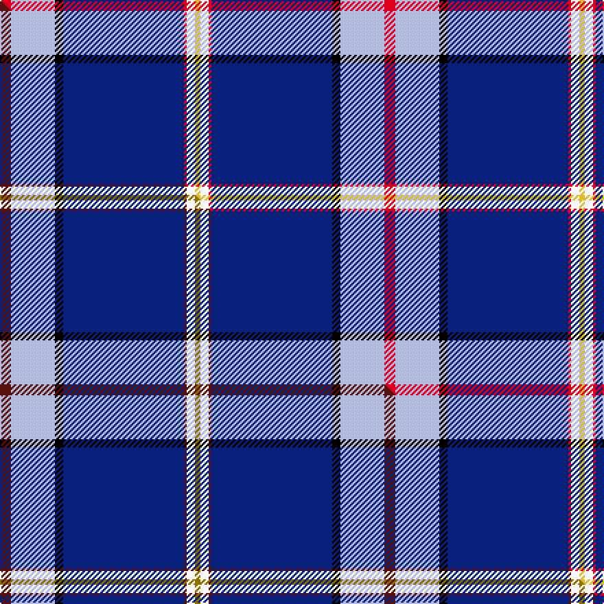

This is one **variant** — a specific cloth: this exact thread count and colourway, with its own
provenance below. It is one weaving of the [sett](/setts/r4lb16k3db44r1w3ly2/) (the scale-free proportion — the
same cloth at any scale or shade), whose colour order is pattern [RWKBRWY](/stripes/rwkbrwy/).

Part of the [Dress](/tartans/dress/) tartan — the named design grouping this sett with its other cloths.

Sourced from tartans-authority.  It is a [7 stripe tartan](/stripes/stripes7/).

Original link [https://www.tartanregister.gov.uk/tartanDetails.aspx?ref=10689](https://www.tartanregister.gov.uk/tartanDetails.aspx?ref=10689)

Dataset <small>— provenance for this record, inherited from the source manifest</small>

<dl class="dataset-prov">
<dt>source</dt><dd><a href="/sources/tartans-authority/">Scottish Tartans Authority</a></dd>
<dt>data captured from</dt><dd><a href="https://github.com/thetartan/tartan-database/blob/master/data/tartans-authority/data.csv">https://github.com/thetartan/tartan-database/blob/master/data/tartans-authority/data.csv</a></dd>
<dt>data date</dt><dd>09/06/2012 <small>(this record)</small></dd>
<dt>licence</dt><dd><a href="https://creativecommons.org/licenses/by-nc-nd/4.0/">CC BY-NC-ND 4.0</a></dd>
</dl>

Capture chain <small>— the hands this data passed through, oldest first; each capture carries its own licence</small>

<ol class="capture-chain">
<li><a href="https://www.tartansauthority.com/">Scottish Tartans Authority</a> <small>the heritage body's archive — its tartan-ferret record browser is retired (links repaired to the SRT, above)</small></li>
<li><a href="https://github.com/thetartan/tartan-database">thetartan/tartan-database</a> <small>2016-2017</small> · <a href="https://creativecommons.org/licenses/by-nc-nd/4.0/">CC BY-NC-ND 4.0</a> <small>Levko Kravets's frozen compilation — the capture we vendored, and where its CC licence text came from</small></li>
<li>this dictionary <small>captured 2026-06-10 · commit 5bf86c7566</small> <small>each re-capture is a git commit to data/sources</small></li>
</ol>

## Register references

External register numbers recorded for this tartan.

- Scottish Register of Tartans: [10689](https://www.tartanregister.gov.uk/tartanDetails?ref=10689)
- Scottish Tartans Authority (ITI): 10689

## Thread count
R/8 LB32 K6 DB88 R2 W6 LY/4

One full sett is **280 threads**.

## Palette
<table><thead><tr><th>Colour</th><th>Shade</th><th>OKLCh</th></tr></thead><tbody><tr><td>DB</td><td><code style="background-color:#082077;">#082077</code> <small style="color:#888">#082077</small></td><td><small style="color:#888">oklch(30.0% 0.149 265.1)</small></td></tr><tr><td>LY</td><td><code style="background-color:#DCBC32;">#DCBC32</code> <small style="color:#888">#DCBC32</small></td><td><small style="color:#888">oklch(80.0% 0.150 95.2)</small></td></tr><tr><td>K</td><td><code style="background-color:#000000;">#000000</code> <small style="color:#888">#000000</small></td><td><small style="color:#888">oklch(0.0% 0.000 0.0)</small></td></tr><tr><td>LB</td><td><code style="background-color:#B5BBDE;">#B5BBDE</code> <small style="color:#888">#B5BBDE</small></td><td><small style="color:#888">oklch(79.9% 0.050 277.6)</small></td></tr><tr><td>R</td><td><code style="background-color:#D60020;">#D60020</code> <small style="color:#888">#D60020</small></td><td><small style="color:#888">oklch(55.2% 0.224 25.5)</small></td></tr><tr><td>W</td><td><code style="background-color:#F7F7F7;">#F7F7F7</code> <small style="color:#888">#F7F7F7</small></td><td><small style="color:#888">oklch(97.6% 0.000 89.9)</small></td></tr></tbody></table>

# Sample pattern

## Compared to the master

This cloth is one sett of its design; the master sett (the exemplar the design is anchored on) is below for comparison.

Its **ΔTartan distance** from the master is **0.06** — the same measure the nearest-tartans table ranks by (0 is identical; a re-scale of the same cloth is near 0, a recolour or a different proportion further).

<figure class="master-compare" style="margin:0">

this sett
master sett ★

<figcaption style="color:#888;font-size:smaller">One weave of this sett against the <a href="/setts/dr4lb16k3db44dr1w3y2/">master sett ★</a>, split on the diagonal: a shared proportion runs seamlessly across it with only the shades shifting; a different proportion breaks on it.</figcaption>
</figure>

## Nearest tartan variants

The nearest existing variants by ΔTartan distance, with this cloth at the top so the swatches line up against it.

ΔTartan

Threads

Variant

Sett

—

280

<a href="/variants/s7/r4lb16k3db44r1w3ly2~x2/">Dress Blue (Fashion)</a>

<a href="/ttd/edit/#slug=dr4lb16k3db44dr1w3y2~x2&amp;base=r4lb16k3db44r1w3ly2~x2" title="compare in the TTD">0.06</a>

280

<a href="/variants/s7/dr4lb16k3db44dr1w3y2~x2/">Dress Blue</a>

<a href="/ttd/edit/#slug=lb23w3k10r2db45y1~x2&amp;base=r4lb16k3db44r1w3ly2~x2" title="compare in the TTD">1.55</a>

288

<a href="/variants/s6/lb23w3k10r2db45y1~x2/">Kirkcaldy</a>

<a href="/ttd/edit/#slug=t23w3k10r2db45dy1~x2&amp;base=r4lb16k3db44r1w3ly2~x2" title="compare in the TTD">1.55</a>

288

<a href="/variants/s6/t23w3k10r2db45dy1~x2/">Kirkcaldy Name Tartan</a>

<a href="/ttd/edit/#slug=b5g8k5db32w2r2~x2&amp;base=r4lb16k3db44r1w3ly2~x2" title="compare in the TTD">1.66</a>

202

<a href="/variants/s6/b5g8k5db32w2r2~x2/">Marion (Personal)</a>

<a href="/ttd/edit/#slug=r2w6k12db36n12y1~x2&amp;base=r4lb16k3db44r1w3ly2~x2" title="compare in the TTD">2.14</a>

270

<a href="/variants/s6/r2w6k12db36n12y1~x2/">Alan Stone Family (Personal)</a>

<a href="/ttd/edit/#slug=r2w1lb50db24g12k1y1~x2&amp;base=r4lb16k3db44r1w3ly2~x2" title="compare in the TTD">2.15</a>

358

<a href="/variants/s7/r2w1lb50db24g12k1y1~x2/">Pincock (Plockton), Dougie</a>

<a href="/ttd/edit/#slug=db73k9g3k5dbi13w3lb7k5w7r16~db1208266-dbi1606265&amp;base=r4lb16k3db44r1w3ly2~x2" title="compare in the TTD">2.24</a>

193

<a href="/variants/s10/db73k9g3k5dbi13w3lb7k5w7r16~db1208266-dbi1606265/">Ambulance Victoria</a>

<a href="/ttd/edit/#slug=r8y2b7y2db24k2g1~x2&amp;base=r4lb16k3db44r1w3ly2~x2" title="compare in the TTD">2.32</a>

166

<a href="/variants/s7/r8y2b7y2db24k2g1~x2/">(4) Traill</a>

<a href="/ttd/edit/#slug=db45w2lb23db10g2r1dr5wi1~x2~w3904115-wi4000000&amp;base=r4lb16k3db44r1w3ly2~x2" title="compare in the TTD">2.58</a>

264

<a href="/variants/s8/db45w2lb23db10g2r1dr5wi1~x2~w3904115-wi4000000/">Hier Family, Kilcreggan (Personal)</a>

<a href="/ttd/edit/#slug=ly8k2db20lb4w1k2~x4&amp;base=r4lb16k3db44r1w3ly2~x2" title="compare in the TTD">2.59</a>

256

<a href="/variants/s6/ly8k2db20lb4w1k2~x4/">Solberg-Bell</a>

## Neighbour map

Every grey dot is one of 13621 variants placed by the first two principal components of the ΔTartan feature space (42% of its variance). Red is this tartan; blue dots are its nearest — click one to open its page.

<svg viewBox="0 0 640 380" role="img" style="max-width:100%;height:auto;border:1px solid #e0e0e0;border-radius:4px;display:block" xmlns="http://www.w3.org/2000/svg"><image href="/nn/cloud.v1.png" width="640" height="380"/><a href="/variants/s7/dr4lb16k3db44dr1w3y2~x2/"><circle cx="318.8" cy="69.3" r="4" fill="#3465a4"><title>Dress Blue</title></circle></a><a href="/variants/s6/lb23w3k10r2db45y1~x2/"><circle cx="259.4" cy="83.3" r="4" fill="#3465a4"><title>Kirkcaldy</title></circle></a><a href="/variants/s6/t23w3k10r2db45dy1~x2/"><circle cx="286.0" cy="94.2" r="4" fill="#3465a4"><title>Kirkcaldy Name Tartan</title></circle></a><a href="/variants/s6/b5g8k5db32w2r2~x2/"><circle cx="279.2" cy="129.2" r="4" fill="#3465a4"><title>Marion (Personal)</title></circle></a><a href="/variants/s6/r2w6k12db36n12y1~x2/"><circle cx="247.7" cy="105.9" r="4" fill="#3465a4"><title>Alan Stone Family (Personal)</title></circle></a><a href="/variants/s7/r2w1lb50db24g12k1y1~x2/"><circle cx="276.2" cy="58.1" r="4" fill="#3465a4"><title>Pincock (Plockton), Dougie</title></circle></a><a href="/variants/s10/db73k9g3k5dbi13w3lb7k5w7r16~db1208266-dbi1606265/"><circle cx="205.7" cy="57.5" r="4" fill="#3465a4"><title>Ambulance Victoria</title></circle></a><a href="/variants/s7/r8y2b7y2db24k2g1~x2/"><circle cx="266.4" cy="112.1" r="4" fill="#3465a4"><title>(4) Traill</title></circle></a><a href="/variants/s8/db45w2lb23db10g2r1dr5wi1~x2~w3904115-wi4000000/"><circle cx="331.5" cy="66.2" r="4" fill="#3465a4"><title>Hier Family, Kilcreggan (Personal)</title></circle></a><a href="/variants/s6/ly8k2db20lb4w1k2~x4/"><circle cx="247.0" cy="134.8" r="4" fill="#3465a4"><title>Solberg-Bell</title></circle></a><circle cx="313.5" cy="66.6" r="5" fill="#c00000"/><text x="320" y="376" text-anchor="middle" font-size="11" fill="#999">ground</text><text x="11" y="190" text-anchor="middle" font-size="11" fill="#999" transform="rotate(-90 11 190)">complexity</text></svg>

ID: /variants/s7/r4lb16k3db44r1w3ly2~x2/
