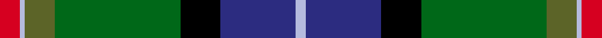

This is one **variant** — a specific cloth: this exact thread count and colourway, with its own
provenance below. It is one weaving of the [sett](/tartans/j/jo/jones/) (the scale-free proportion — the
same cloth at any scale or shade), whose colour order is pattern [RWGGKBW](/stripes/rwggkbw/).

Part of the [Jones](/tartans/j/jo/jones/) tartan — the named design grouping this sett with its other cloths.

Sourced from register-of-tartans.  It is a [7 stripe tartan](/stripes/stripes7/).

Original link [https://www.tartanregister.gov.uk/tartanDetails.aspx?ref=1904](https://www.tartanregister.gov.uk/tartanDetails.aspx?ref=1904)

Dataset <small>— provenance for this record, inherited from the source manifest</small>

<dl class="dataset-prov">
<dt>source</dt><dd><a href="/sources/register-of-tartans/">Scottish Register of Tartans</a></dd>
<dt>data captured from</dt><dd><a href="https://github.com/thetartan/tartan-database/blob/master/data/register-of-tartans/data.csv">https://github.com/thetartan/tartan-database/blob/master/data/register-of-tartans/data.csv</a></dd>
<dt>data date</dt><dd>1998 <small>(this record)</small></dd>
<dt>licence</dt><dd><a href="https://www.tartanregister.gov.uk/copyright">Crown copyright</a></dd>
</dl>

Capture chain <small>— the hands this data passed through, oldest first; each capture carries its own licence</small>

<ol class="capture-chain">
<li><a href="https://www.tartanregister.gov.uk/">Scottish Register of Tartans</a> · <a href="https://www.tartanregister.gov.uk/copyright">Crown copyright</a> <small>the living register — still published by National Records of Scotland</small></li>
<li><a href="https://github.com/thetartan/tartan-database">thetartan/tartan-database</a> <small>2016-2017</small> · <a href="https://creativecommons.org/licenses/by-nc-nd/4.0/">CC BY-NC-ND 4.0</a> <small>Levko Kravets's frozen compilation — the capture we vendored, and where its CC licence text came from</small></li>
<li>this dictionary <small>captured 2026-06-10 · commit 5bf86c7566</small> <small>each re-capture is a git commit to data/sources</small></li>
</ol>

## Register references

External register numbers recorded for this tartan.

- Scottish Register of Tartans: [1904](https://www.tartanregister.gov.uk/tartanDetails.aspx?ref=1904)
- Scottish Tartans Authority (ITI): 2476
- Scottish Tartans World Register: 2476

## Thread count
R/8 LB2 G12 DG50 K16 DB30 LB/4

One full sett is **232 threads**.

## Palette
<table><thead><tr><th>Colour</th><th>Shade</th><th>OKLCh</th></tr></thead><tbody><tr><td>DB</td><td><code style="background-color:#202060;">#202060</code> <small style="color:#888">#202060</small></td><td><small style="color:#888">oklch(28.9% 0.111 276.9)</small></td></tr><tr><td>DB</td><td><code style="background-color:#2C2C80;">#2C2C80</code> <small style="color:#888">#2C2C80</small></td><td><small style="color:#888">oklch(35.0% 0.138 276.6)</small></td></tr><tr><td>DG</td><td><code style="background-color:#053819;">#053819</code> <small style="color:#888">#053819</small></td><td><small style="color:#888">oklch(30.0% 0.075 151.3)</small></td></tr><tr><td>G</td><td><code style="background-color:#5C6428;">#5C6428</code> <small style="color:#888">#5C6428</small></td><td><small style="color:#888">oklch(48.3% 0.084 116.0)</small></td></tr><tr><td>DG</td><td><code style="background-color:#006818;">#006818</code> <small style="color:#888">#006818</small></td><td><small style="color:#888">oklch(45.0% 0.142 145.0)</small></td></tr><tr><td>K</td><td><code style="background-color:#000000;">#000000</code> <small style="color:#888">#000000</small></td><td><small style="color:#888">oklch(0.0% 0.000 0.0)</small></td></tr><tr><td>LB</td><td><code style="background-color:#B5BBDE;">#B5BBDE</code> <small style="color:#888">#B5BBDE</small></td><td><small style="color:#888">oklch(79.9% 0.050 277.6)</small></td></tr><tr><td>R</td><td><code style="background-color:#D60020;">#D60020</code> <small style="color:#888">#D60020</small></td><td><small style="color:#888">oklch(55.2% 0.224 25.5)</small></td></tr></tbody></table>

# Sample pattern

## Nearest tartan variants

The nearest existing variants by ΔTartan distance, with this cloth at the top so the swatches line up against it.

ΔTartan

Threads

Variant

Sett

—

232

<a href="/variants/s7/r4lb1g6dg25k8db15lb2~x2~g4808117-dg4514144-db3514276/">Jones</a>

<a href="/ttd/edit/#slug=r4lb1g6dg25k8db15lb2~x2~g4808117-dg4514144&amp;base=r4lb1g6dg25k8db15lb2~x2~g4808117-dg4514144-db3514276" title="compare in the TTD">0.03</a>

232

<a href="/variants/s7/r4lb1g6dg25k8db15lb2~x2~g4808117-dg4514144/">Jones (Name)</a>

<a href="/ttd/edit/#slug=r4lr1g6gi25k8db15lr2~x2~gi4909174&amp;base=r4lb1g6dg25k8db15lb2~x2~g4808117-dg4514144-db3514276" title="compare in the TTD">0.65</a>

232

<a href="/variants/s7/r4lr1g6gi25k8db15lr2~x2~gi4909174/">Jones Personal Tartan</a>

<a href="/ttd/edit/#slug=r3w2dy10dg37k12db21w2~x2~dy4207108-dg3210147&amp;base=r4lb1g6dg25k8db15lb2~x2~g4808117-dg4514144-db3514276" title="compare in the TTD">1.28</a>

338

<a href="/variants/s7/r3w2dy10dg37k12db21w2~x2~dy4207108-dg3210147/">Jones, The</a>

<a href="/ttd/edit/#slug=dbi5w3r12g37k12db21w2~x2~dbi3514276-db2911276&amp;base=r4lb1g6dg25k8db15lb2~x2~g4808117-dg4514144-db3514276" title="compare in the TTD">1.56</a>

354

<a href="/variants/s7/dbi5w3r12g37k12db21w2~x2~dbi3514276-db2911276/">Bergen Scottish</a>

<a href="/ttd/edit/#slug=k3dg44db27y6r10w3~x2&amp;base=r4lb1g6dg25k8db15lb2~x2~g4808117-dg4514144-db3514276" title="compare in the TTD">1.63</a>

360

<a href="/variants/s6/k3dg44db27y6r10w3~x2/">Official Glasgow 2014, The</a>

<a href="/ttd/edit/#slug=k3g44db27ly6r10w3~x2&amp;base=r4lb1g6dg25k8db15lb2~x2~g4808117-dg4514144-db3514276" title="compare in the TTD">1.63</a>

360

<a href="/variants/s6/k3g44db27ly6r10w3~x2/">Shawlands International (Commem.)</a>

<a href="/ttd/edit/#slug=g15y1dy2db5k4dg5~x6&amp;base=r4lb1g6dg25k8db15lb2~x2~g4808117-dg4514144-db3514276" title="compare in the TTD">1.79</a>

264

<a href="/variants/s6/g15y1dy2db5k4dg5~x6/">Dobson (Palm Bay) (Personal)</a>

<a href="/ttd/edit/#slug=g15ly1dy2db5k4dg5~x6~ly8117093-dy3908078&amp;base=r4lb1g6dg25k8db15lb2~x2~g4808117-dg4514144-db3514276" title="compare in the TTD">1.79</a>

264

<a href="/variants/s6/g15ly1dy2db5k4dg5~x6~ly8117093-dy3908078/">Dobson (Palm Bay) (Personal)</a>

<a href="/ttd/edit/#slug=dy2g12k10r1t16r2~x4&amp;base=r4lb1g6dg25k8db15lb2~x2~g4808117-dg4514144-db3514276" title="compare in the TTD">1.97</a>

328

<a href="/variants/s6/dy2g12k10r1t16r2~x4/">MacWilliam (Clan)</a>

<a href="/ttd/edit/#slug=lo3k2n15k10dt23r2dt1w2~x2&amp;base=r4lb1g6dg25k8db15lb2~x2~g4808117-dg4514144-db3514276" title="compare in the TTD">2.02</a>

222

<a href="/variants/s8/lo3k2n15k10dt23r2dt1w2~x2/">Vienna Highlander (Fashion)</a>

## Neighbour map

Every grey dot is one of 13662 variants placed by the first two principal components of the ΔTartan feature space (42% of its variance). Red is this tartan; blue dots are its nearest — click one to open its page. The map is a flat projection of a many-dimensional space — [how to read it](/posts/neighbourhood-maps/).

<svg viewBox="0 0 640 380" role="img" style="max-width:100%;height:auto;border:1px solid #e0e0e0;border-radius:4px;display:block" xmlns="http://www.w3.org/2000/svg"><image href="/nn/cloud.v1.png" width="640" height="380"/><a href="/variants/s7/r4lb1g6dg25k8db15lb2~x2~g4808117-dg4514144/"><circle cx="180.2" cy="133.1" r="4" fill="#3465a4"><title>Jones (Name)</title></circle></a><a href="/variants/s7/r4lr1g6gi25k8db15lr2~x2~gi4909174/"><circle cx="176.4" cy="131.8" r="4" fill="#3465a4"><title>Jones Personal Tartan</title></circle></a><a href="/variants/s7/r3w2dy10dg37k12db21w2~x2~dy4207108-dg3210147/"><circle cx="191.1" cy="141.9" r="4" fill="#3465a4"><title>Jones, The</title></circle></a><a href="/variants/s7/dbi5w3r12g37k12db21w2~x2~dbi3514276-db2911276/"><circle cx="138.7" cy="136.8" r="4" fill="#3465a4"><title>Bergen Scottish</title></circle></a><a href="/variants/s6/k3dg44db27y6r10w3~x2/"><circle cx="232.2" cy="155.2" r="4" fill="#3465a4"><title>Official Glasgow 2014, The</title></circle></a><a href="/variants/s6/k3g44db27ly6r10w3~x2/"><circle cx="197.9" cy="148.7" r="4" fill="#3465a4"><title>Shawlands International (Commem.)</title></circle></a><a href="/variants/s6/g15y1dy2db5k4dg5~x6/"><circle cx="192.2" cy="165.1" r="4" fill="#3465a4"><title>Dobson (Palm Bay) (Personal)</title></circle></a><a href="/variants/s6/g15ly1dy2db5k4dg5~x6~ly8117093-dy3908078/"><circle cx="184.9" cy="162.7" r="4" fill="#3465a4"><title>Dobson (Palm Bay) (Personal)</title></circle></a><a href="/variants/s6/dy2g12k10r1t16r2~x4/"><circle cx="148.7" cy="170.9" r="4" fill="#3465a4"><title>MacWilliam (Clan)</title></circle></a><a href="/variants/s8/lo3k2n15k10dt23r2dt1w2~x2/"><circle cx="184.4" cy="115.1" r="4" fill="#3465a4"><title>Vienna Highlander (Fashion)</title></circle></a><circle cx="184.0" cy="133.7" r="5" fill="#c00000"/><text x="320" y="376" text-anchor="middle" font-size="11" fill="#999">ground</text><text x="11" y="190" text-anchor="middle" font-size="11" fill="#999" transform="rotate(-90 11 190)">complexity</text></svg>

ID: /variants/s7/r4lb1g6dg25k8db15lb2~x2~g4808117-dg4514144-db3514276/
