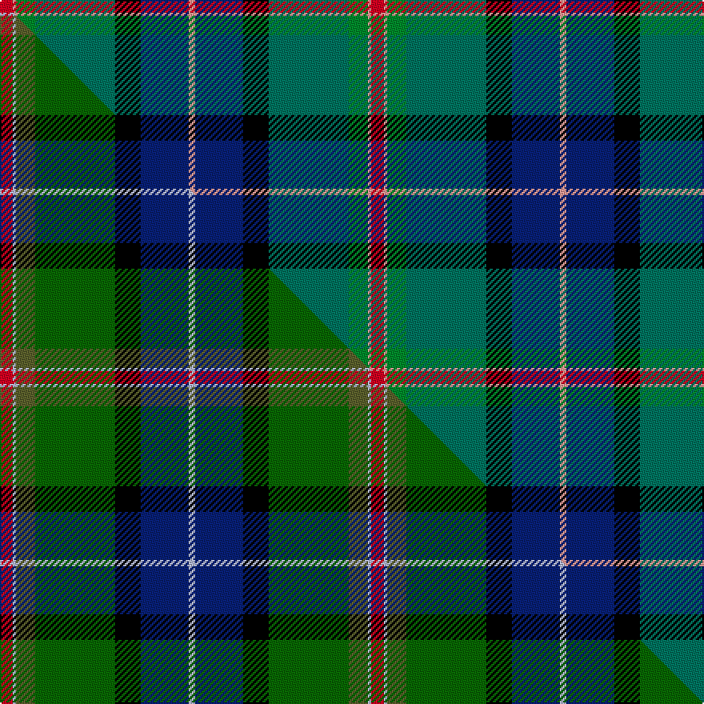

This is one **variant** — a specific cloth: this exact thread count and colourway, with its own
provenance below. It is one weaving of the [sett](/setts/r4lr1g6gi25k8db15lr2/) (the scale-free proportion — the
same cloth at any scale or shade), whose colour order is pattern [RYGGKBY](/stripes/ryggkby/).

Part of the [Jones](/tartans/jones/) tartan — the named design grouping this sett with its other cloths.

Sourced from house-of-tartan.  It is a [7 stripe tartan](/stripes/stripes7/).

Original link [http://www.house-of-tartan.scotland.net/house/TartanViewjs.asp?colr=Def&tnam=2476](http://www.house-of-tartan.scotland.net/house/TartanViewjs.asp?colr=Def&tnam=2476)

## Provenance

Earliest known date: 1997 Designed by Peter MacDonald for Mrs Ros Jones, Aros, Isle of Mull and intended for all of the name Jones. Produced to raise money for National and International Charities. Registered Design Number :- 602573

Dataset <small>— provenance for this record, inherited from the source manifest</small>

<dl class="dataset-prov">
<dt>source</dt><dd><a href="/sources/house-of-tartan/">House of Tartan</a></dd>
<dt>data captured from</dt><dd><a href="https://github.com/thetartan/tartan-database/blob/master/data/house-of-tartan/data.csv">https://github.com/thetartan/tartan-database/blob/master/data/house-of-tartan/data.csv</a></dd>
<dt>data date</dt><dd>1997 <small>(this record)</small></dd>
<dt>licence</dt><dd><a href="https://creativecommons.org/licenses/by-nc-nd/4.0/">CC BY-NC-ND 4.0</a></dd>
</dl>

Capture chain <small>— the hands this data passed through, oldest first; each capture carries its own licence</small>

<ol class="capture-chain">
<li><a href="http://www.house-of-tartan.scotland.net/">House of Tartan</a> <small>the weaver/retailer's database — the site is now offline; the URL is kept as the ultimate source's identity</small></li>
<li><a href="https://github.com/thetartan/tartan-database">thetartan/tartan-database</a> <small>2016-2017</small> · <a href="https://creativecommons.org/licenses/by-nc-nd/4.0/">CC BY-NC-ND 4.0</a> <small>Levko Kravets's frozen compilation — the capture we vendored, and where its CC licence text came from</small></li>
<li>this dictionary <small>captured 2026-06-10 · commit 5bf86c7566</small> <small>each re-capture is a git commit to data/sources</small></li>
</ol>

## Thread count
R/8 LR2 G12 Gi50 K16 DB30 LR/4

One full sett is **232 threads**.

## Palette
<table><thead><tr><th>Colour</th><th>Shade</th><th>OKLCh</th></tr></thead><tbody><tr><td>DB</td><td><code style="background-color:#082077;">#082077</code> <small style="color:#888">#082077</small></td><td><small style="color:#888">oklch(30.0% 0.149 265.1)</small></td></tr><tr><td>DG</td><td><code style="background-color:#003820;">#003820</code> <small style="color:#888">#003820</small></td><td><small style="color:#888">oklch(30.0% 0.070 158.3)</small></td></tr><tr><td>R</td><td><code style="background-color:#D60020;">#D60020</code> <small style="color:#888">#D60020</small></td><td><small style="color:#888">oklch(55.2% 0.224 25.5)</small></td></tr><tr><td>G</td><td><code style="background-color:#008B2A;">#008B2A</code> <small style="color:#888">#008B2A</small></td><td><small style="color:#888">oklch(55.4% 0.170 145.9)</small></td></tr><tr><td>G</td><td><code style="background-color:#007460;">#007460</code> <small style="color:#888">#007460</small></td><td><small style="color:#888">oklch(49.9% 0.094 175.1)</small></td></tr><tr><td>K</td><td><code style="background-color:#000000;">#000000</code> <small style="color:#888">#000000</small></td><td><small style="color:#888">oklch(0.0% 0.000 0.0)</small></td></tr><tr><td>LR</td><td><code style="background-color:#FF9C97;">#FF9C97</code> <small style="color:#888">#FF9C97</small></td><td><small style="color:#888">oklch(79.3% 0.119 23.2)</small></td></tr></tbody></table>

# Sample pattern

## Compared to the master

This cloth is one sett of its design; the master sett (the exemplar the design is anchored on) is below for comparison.

Its **ΔTartan distance** from the master is **0.91** — the same measure the nearest-tartans table ranks by (0 is identical; a re-scale of the same cloth is near 0, a recolour or a different proportion further).

<figure class="master-compare" style="margin:0">

this sett
master sett ★

<figcaption style="color:#888;font-size:smaller">One weave of this sett against the <a href="/setts/r4lb1g6dg25k8db15lb2/">master sett ★</a>, split on the diagonal: a shared proportion runs seamlessly across it with only the shades shifting; a different proportion breaks on it.</figcaption>
</figure>

## Nearest tartan variants

The nearest existing variants by ΔTartan distance, with this cloth at the top so the swatches line up against it.

ΔTartan

Threads

Variant

Sett

—

232

<a href="/variants/s7/r4lr1g6gi25k8db15lr2~x2~gi2004173/">Jones Personal Tartan</a>

<a href="/ttd/edit/#slug=r4lb1g6dg25k8db15lb2~x2~g1903114-dg1806142&amp;base=r4lr1g6gi25k8db15lr2~x2~gi2004173" title="compare in the TTD">0.64</a>

232

<a href="/variants/s7/r4lb1g6dg25k8db15lb2~x2~g1903114-dg1806142/">Jones (Name)</a>

<a href="/ttd/edit/#slug=r4lb1g6dg25k8db15lb2~x2~g1903114-dg1806142-db1406275&amp;base=r4lr1g6gi25k8db15lr2~x2~gi2004173" title="compare in the TTD">0.65</a>

232

<a href="/variants/s7/r4lb1g6dg25k8db15lb2~x2~g1903114-dg1806142-db1406275/">Jones</a>

<a href="/ttd/edit/#slug=r3w2dgi10dg37k12db21w2~x2~dgi1703114-dg1304144&amp;base=r4lr1g6gi25k8db15lr2~x2~gi2004173" title="compare in the TTD">1.28</a>

338

<a href="/variants/s7/r3w2dy10dg37k12db21w2~x2~dy1703114-dg1304144/">Jones, The</a>

<a href="/ttd/edit/#slug=db5w3r12g37k12dt21w2~x2~db1406275-dt1204274&amp;base=r4lr1g6gi25k8db15lr2~x2~gi2004173" title="compare in the TTD">1.56</a>

354

<a href="/variants/s7/dbi5w3r12g37k12db21w2~x2~dbi1406275-db1204274/">Bergen Scottish</a>

<a href="/ttd/edit/#slug=k3dg44db27y6r10w3~x2&amp;base=r4lr1g6gi25k8db15lr2~x2~gi2004173" title="compare in the TTD">1.63</a>

360

<a href="/variants/s6/k3dg44db27y6r10w3~x2/">Official Glasgow 2014, The</a>

<a href="/ttd/edit/#slug=k2w2k8y8db24g13k3dr1~x2&amp;base=r4lr1g6gi25k8db15lr2~x2~gi2004173" title="compare in the TTD">1.67</a>

238

<a href="/variants/s8/k2w2k8y8db24g13k3dr1~x2/">Froben, Christian (Personal)</a>

<a href="/ttd/edit/#slug=r2db16r1k10g12o2~x2&amp;base=r4lr1g6gi25k8db15lr2~x2~gi2004173" title="compare in the TTD">1.97</a>

164

<a href="/variants/s6/r2db16r1k10g12o2~x2/">MacWilliam</a>

<a href="/ttd/edit/#slug=dy2g12k10r1db16r2~x2&amp;base=r4lr1g6gi25k8db15lr2~x2~gi2004173" title="compare in the TTD">1.97</a>

164

<a href="/variants/s6/dy2g12k10r1db16r2~x2/">MacWilliam Clan Tartan</a>

<a href="/ttd/edit/#slug=dy2g12k10r1t16r2~x4&amp;base=r4lr1g6gi25k8db15lr2~x2~gi2004173" title="compare in the TTD">1.97</a>

328

<a href="/variants/s6/dy2g12k10r1t16r2~x4/">MacWilliam (Clan)</a>

<a href="/ttd/edit/#slug=k2w2k8ly8db24g13k3dr1~x2&amp;base=r4lr1g6gi25k8db15lr2~x2~gi2004173" title="compare in the TTD">2.09</a>

238

<a href="/variants/s8/k2w2k8ly8db24g13k3dr1~x2/">Froben, Christian (Personal)</a>

## Neighbour map

Every grey dot is one of 13621 variants placed by the first two principal components of the ΔTartan feature space (42% of its variance). Red is this tartan; blue dots are its nearest — click one to open its page.

<svg viewBox="0 0 640 380" role="img" style="max-width:100%;height:auto;border:1px solid #e0e0e0;border-radius:4px;display:block" xmlns="http://www.w3.org/2000/svg"><image href="/nn/cloud.v1.png" width="640" height="380"/><a href="/variants/s7/r4lb1g6dg25k8db15lb2~x2~g1903114-dg1806142/"><circle cx="180.4" cy="133.2" r="4" fill="#3465a4"><title>Jones (Name)</title></circle></a><a href="/variants/s7/r4lb1g6dg25k8db15lb2~x2~g1903114-dg1806142-db1406275/"><circle cx="184.3" cy="133.8" r="4" fill="#3465a4"><title>Jones</title></circle></a><a href="/variants/s7/r3w2dy10dg37k12db21w2~x2~dy1703114-dg1304144/"><circle cx="191.4" cy="142.0" r="4" fill="#3465a4"><title>Jones, The</title></circle></a><a href="/variants/s7/dbi5w3r12g37k12db21w2~x2~dbi1406275-db1204274/"><circle cx="138.8" cy="137.2" r="4" fill="#3465a4"><title>Bergen Scottish</title></circle></a><a href="/variants/s6/k3dg44db27y6r10w3~x2/"><circle cx="232.5" cy="155.4" r="4" fill="#3465a4"><title>Official Glasgow 2014, The</title></circle></a><a href="/variants/s8/k2w2k8y8db24g13k3dr1~x2/"><circle cx="154.4" cy="118.3" r="4" fill="#3465a4"><title>Froben, Christian (Personal)</title></circle></a><a href="/variants/s6/r2db16r1k10g12o2~x2/"><circle cx="153.5" cy="168.3" r="4" fill="#3465a4"><title>MacWilliam</title></circle></a><a href="/variants/s6/dy2g12k10r1db16r2~x2/"><circle cx="156.4" cy="169.4" r="4" fill="#3465a4"><title>MacWilliam Clan Tartan</title></circle></a><a href="/variants/s6/dy2g12k10r1t16r2~x4/"><circle cx="149.0" cy="171.4" r="4" fill="#3465a4"><title>MacWilliam (Clan)</title></circle></a><a href="/variants/s8/k2w2k8ly8db24g13k3dr1~x2/"><circle cx="141.0" cy="114.4" r="4" fill="#3465a4"><title>Froben, Christian (Personal)</title></circle></a><circle cx="176.7" cy="131.9" r="5" fill="#c00000"/><text x="320" y="376" text-anchor="middle" font-size="11" fill="#999">ground</text><text x="11" y="190" text-anchor="middle" font-size="11" fill="#999" transform="rotate(-90 11 190)">complexity</text></svg>

ID: /variants/s7/r4lr1g6gi25k8db15lr2~x2~gi2004173/
