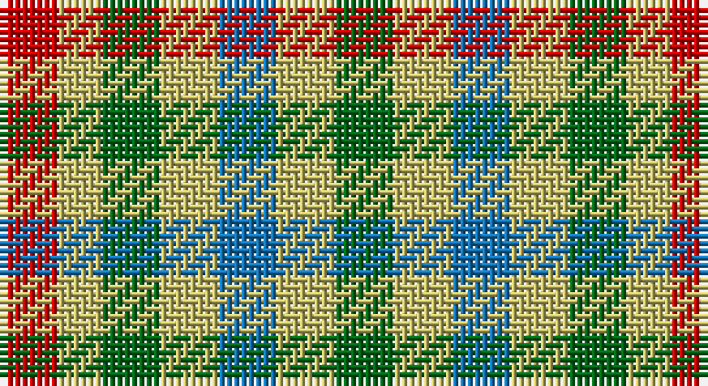

This page is one **sett** — a single exact thread-count. It belongs to the [tartan](/setts/r4ly3g4ly4b4ly4g4/)
(the same proportion at any scale), whose colour order is pattern [GYBYGYR](/stripes/gybygyr/).

Sourced from register-of-tartans.  It is a [7 stripe tartan](/stripes/stripes7/).

Original link https://www.tartanregister.gov.uk/tartanDetails.aspx?ref=2178

## Register references

External register numbers recorded for this tartan.

- Scottish Register of Tartans: [2178](https://www.tartanregister.gov.uk/tartanDetails.aspx?ref=2178)
- Scottish Tartans Authority (ITI): 5471

## Thread count
R/8 LG6 G8 LG8 B8 LG8 G/8

One full sett is **92 threads**.

## Palette

Palette: <strong>Tartan Register</strong>
<table><thead><tr><th>Colour</th><th>Threads</th><th>Shade</th><th>Base</th><th>OKLCh</th></tr></thead><tbody><tr><td>R/</td><td style="text-align:right;font-variant-numeric:tabular-nums">8</td><td><code style="background-color:#C80000;">#C80000</code> <small style="color:#888">#C80000</small></td><td>R <code style="background-color:#CC0000;">#CC0000</code></td><td><small style="color:#888">oklch(52.3% 0.215 29.2)</small></td></tr><tr><td>LG</td><td style="text-align:right;font-variant-numeric:tabular-nums">6</td><td><code style="background-color:#C4BC68;">#C4BC68</code> <small style="color:#888">#C4BC68</small></td><td>Y <code style="background-color:#F2BF00;">#F2BF00</code></td><td><small style="color:#888">oklch(78.4% 0.107 103.7)</small></td></tr><tr><td>G</td><td style="text-align:right;font-variant-numeric:tabular-nums">8</td><td><code style="background-color:#006818;">#006818</code> <small style="color:#888">#006818</small></td><td>G <code style="background-color:#006100;">#006100</code></td><td><small style="color:#888">oklch(45.0% 0.142 145.0)</small></td></tr><tr><td>LG</td><td style="text-align:right;font-variant-numeric:tabular-nums">8</td><td><code style="background-color:#C4BC68;">#C4BC68</code> <small style="color:#888">#C4BC68</small></td><td>Y <code style="background-color:#F2BF00;">#F2BF00</code></td><td><small style="color:#888">oklch(78.4% 0.107 103.7)</small></td></tr><tr><td>B</td><td style="text-align:right;font-variant-numeric:tabular-nums">8</td><td><code style="background-color:#1474B4;">#1474B4</code> <small style="color:#888">#1474B4</small></td><td>B <code style="background-color:#2A418A;">#2A418A</code></td><td><small style="color:#888">oklch(54.0% 0.129 245.1)</small></td></tr><tr><td>LG</td><td style="text-align:right;font-variant-numeric:tabular-nums">8</td><td><code style="background-color:#C4BC68;">#C4BC68</code> <small style="color:#888">#C4BC68</small></td><td>Y <code style="background-color:#F2BF00;">#F2BF00</code></td><td><small style="color:#888">oklch(78.4% 0.107 103.7)</small></td></tr><tr><td>G/</td><td style="text-align:right;font-variant-numeric:tabular-nums">8</td><td><code style="background-color:#006818;">#006818</code> <small style="color:#888">#006818</small></td><td>G <code style="background-color:#006100;">#006100</code></td><td><small style="color:#888">oklch(45.0% 0.142 145.0)</small></td></tr></tbody></table>

# Sample pattern

## Nearest tartans

The nearest existing variants by ΔTartan distance, with this tartan at the top so the swatches line up against it.

ΔTartan

Tartan

Sett

—

<a href="/ttd/edit/#slug=r4ly3g4ly4b4ly4g4~x2">Lochwood Estate Check</a> <a class="nn-out" href="/variants/s7/r4ly3g4ly4b4ly4g4~x2/" title="open its dictionary page">↗</a>

1.47

<a href="/ttd/edit/#slug=r1ly1g1ly1r1ly1g1~x8&amp;base=r4ly3g4ly4b4ly4g4~x2">Lochwood (Estate Check)</a> <a class="nn-out" href="/variants/s7/r1ly1g1ly1r1ly1g1~x8/" title="open its dictionary page">↗</a>

2.08

<a href="/ttd/edit/#slug=r2db2g3ly2~x5&amp;base=r4ly3g4ly4b4ly4g4~x2">Sturch (Corporate)</a> <a class="nn-out" href="/variants/s4/r2db2g3ly2~x5/" title="open its dictionary page">↗</a>

2.38

<a href="/ttd/edit/#slug=do1w1k1w1do1w1k1w1dt1~x6&amp;base=r4ly3g4ly4b4ly4g4~x2">Strathspey (Estate Check)</a> <a class="nn-out" href="/variants/s9/do1w1k1w1do1w1k1w1dt1~x6/" title="open its dictionary page">↗</a>

2.42

<a href="/ttd/edit/#slug=r1o1k1o1y1o1k1o1y1~x12&amp;base=r4ly3g4ly4b4ly4g4~x2">Seaforth (Estate Check)</a> <a class="nn-out" href="/variants/s9/r1o1k1o1y1o1k1o1y1~x12/" title="open its dictionary page">↗</a>

2.42

<a href="/ttd/edit/#slug=r1o1k1o1y1o1k1o1y1~x6&amp;base=r4ly3g4ly4b4ly4g4~x2">Seaforth Estate Check Estate Check Weavers Tartan</a> <a class="nn-out" href="/variants/s9/r1o1k1o1y1o1k1o1y1~x6/" title="open its dictionary page">↗</a>

2.50

<a href="/ttd/edit/#slug=k5g8lo5g3lo5~x4&amp;base=r4ly3g4ly4b4ly4g4~x2">Angle Dress (Fashion)</a> <a class="nn-out" href="/variants/s5/k5g8lo5g3lo5~x4/" title="open its dictionary page">↗</a>

2.61

<a href="/ttd/edit/#slug=ly15r7k12ly12k12dy12r7~x2&amp;base=r4ly3g4ly4b4ly4g4~x2">Duffus Lord... Portrait Tartan</a> <a class="nn-out" href="/variants/s7/ly15r7k12ly12k12dy12r7~x2/" title="open its dictionary page">↗</a>

2.61

<a href="/ttd/edit/#slug=dr1o1dr1o1dg1~x8&amp;base=r4ly3g4ly4b4ly4g4~x2">Ballindalloch Check</a> <a class="nn-out" href="/variants/s5/dr1o1dr1o1dg1~x8/" title="open its dictionary page">↗</a>

2.62

<a href="/ttd/edit/#slug=lr12lo8r5k6lr7g5~x4&amp;base=r4ly3g4ly4b4ly4g4~x2">Mitchell, Martin (Personal)</a> <a class="nn-out" href="/variants/s6/lr12lo8r5k6lr7g5~x4/" title="open its dictionary page">↗</a>

2.66

<a href="/ttd/edit/#slug=n4lr4do4lr4n4lr4do4lr4r1n4~x4&amp;base=r4ly3g4ly4b4ly4g4~x2">Brook (Estate Check)</a> <a class="nn-out" href="/variants/s10/n4lr4do4lr4n4lr4do4lr4r1n4~x4/" title="open its dictionary page">↗</a>

## Neighbour map

Every grey dot is one of 14360 variants placed by the first two principal components of the ΔTartan feature space (44% of its variance). Red is this tartan; blue dots are its nearest — click one to open its page.

<svg viewBox="0 0 640 380" role="img" style="max-width:100%;height:auto;border:1px solid #e0e0e0;border-radius:4px;display:block" xmlns="http://www.w3.org/2000/svg"><image href="/nn/cloud.v1.png" width="640" height="380"/><a href="/variants/s7/r1ly1g1ly1r1ly1g1~x8/"><circle cx="14.0" cy="366.0" r="4" fill="#3465a4"><title>Lochwood (Estate Check)</title></circle></a><a href="/variants/s4/r2db2g3ly2~x5/"><circle cx="14.0" cy="359.3" r="4" fill="#3465a4"><title>Sturch (Corporate)</title></circle></a><a href="/variants/s9/do1w1k1w1do1w1k1w1dt1~x6/"><circle cx="14.0" cy="366.0" r="4" fill="#3465a4"><title>Strathspey (Estate Check)</title></circle></a><a href="/variants/s9/r1o1k1o1y1o1k1o1y1~x12/"><circle cx="14.0" cy="366.0" r="4" fill="#3465a4"><title>Seaforth (Estate Check)</title></circle></a><a href="/variants/s9/r1o1k1o1y1o1k1o1y1~x6/"><circle cx="14.0" cy="366.0" r="4" fill="#3465a4"><title>Seaforth Estate Check Estate Check Weavers Tartan</title></circle></a><a href="/variants/s5/k5g8lo5g3lo5~x4/"><circle cx="149.2" cy="342.9" r="4" fill="#3465a4"><title>Angle Dress (Fashion)</title></circle></a><a href="/variants/s7/ly15r7k12ly12k12dy12r7~x2/"><circle cx="23.6" cy="302.5" r="4" fill="#3465a4"><title>Duffus Lord... Portrait Tartan</title></circle></a><a href="/variants/s5/dr1o1dr1o1dg1~x8/"><circle cx="67.5" cy="366.0" r="4" fill="#3465a4"><title>Ballindalloch Check</title></circle></a><a href="/variants/s6/lr12lo8r5k6lr7g5~x4/"><circle cx="79.6" cy="288.9" r="4" fill="#3465a4"><title>Mitchell, Martin (Personal)</title></circle></a><a href="/variants/s10/n4lr4do4lr4n4lr4do4lr4r1n4~x4/"><circle cx="121.4" cy="291.0" r="4" fill="#3465a4"><title>Brook (Estate Check)</title></circle></a><circle cx="23.6" cy="366.0" r="5" fill="#c00000"/></svg>

ID: /variants/s7/r4ly3g4ly4b4ly4g4~x2/
