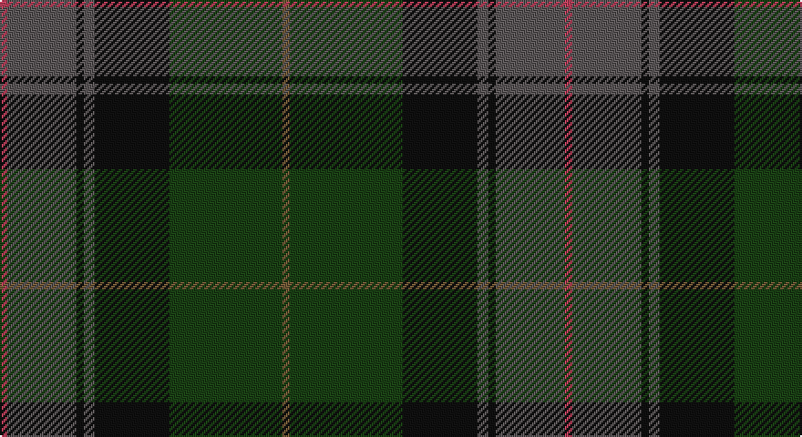

This page is one **sett** — a single exact thread-count. It belongs to the [tartan](/setts/r4n38k4n6k41dg62y4/)
(the same proportion at any scale), whose colour order is pattern [GGKBKBR](/stripes/ggkbkbr/).

Part of the [Bennett, John Paul](/tartans/bennett-john-paul/) tartan — the named design grouping this sett with its other cloths.

Sourced from register-of-tartans.  It is a [7 stripe tartan](/stripes/stripes7/).

Original link https://www.tartanregister.gov.uk/tartanDetails.aspx?ref=10222

## Also known as

This cloth is also recorded under:

- Bennett, J P.
- Bennett, John Paul Personal

## Register references

External register numbers recorded for this tartan.

- Scottish Register of Tartans: [10222](https://www.tartanregister.gov.uk/tartanDetails.aspx?ref=10222)

## Thread count
R/4 N38 K4 N6 K41 DG62 G/4

One full sett is **310 threads**.

## Palette

Palette: <strong>Logan (The Scottish Gael, 1831)</strong> <small style="color:#888">(1 of 6 colours)</small>
<table><thead><tr><th>Colour</th><th>Threads</th><th>Shade</th><th>Base</th><th>OKLCh</th></tr></thead><tbody><tr><td>R/</td><td style="text-align:right;font-variant-numeric:tabular-nums">4</td><td><code style="background-color:#B93E5A;">#B93E5A</code> <small style="color:#888">#B93E5A</small></td><td>R <code style="background-color:#CC0000;">#CC0000</code></td><td><small style="color:#888">oklch(54.6% 0.159 10.5)</small></td></tr><tr><td>N</td><td style="text-align:right;font-variant-numeric:tabular-nums">38</td><td><code style="background-color:#5B5758;">#5B5758</code> <small style="color:#888">#5B5758</small></td><td>B <code style="background-color:#2A418A;">#2A418A</code></td><td><small style="color:#888">oklch(46.1% 0.005 0.2)</small></td></tr><tr><td>K</td><td style="text-align:right;font-variant-numeric:tabular-nums">4</td><td><code style="background-color:#101010;">#101010</code> <small style="color:#888">#101010</small></td><td>K <code style="background-color:#000000;">#000000</code></td><td><small style="color:#888">oklch(17.3% 0.000 89.9)</small></td></tr><tr><td>N</td><td style="text-align:right;font-variant-numeric:tabular-nums">6</td><td><code style="background-color:#5B5758;">#5B5758</code> <small style="color:#888">#5B5758</small></td><td>B <code style="background-color:#2A418A;">#2A418A</code></td><td><small style="color:#888">oklch(46.1% 0.005 0.2)</small></td></tr><tr><td>K</td><td style="text-align:right;font-variant-numeric:tabular-nums">41</td><td><code style="background-color:#101010;">#101010</code> <small style="color:#888">#101010</small></td><td>K <code style="background-color:#000000;">#000000</code></td><td><small style="color:#888">oklch(17.3% 0.000 89.9)</small></td></tr><tr><td>DG</td><td style="text-align:right;font-variant-numeric:tabular-nums">62</td><td><code style="background-color:#1A4014;">#1A4014</code> <small style="color:#888">#1A4014</small></td><td>G <code style="background-color:#006100;">#006100</code></td><td><small style="color:#888">oklch(33.2% 0.083 141.0)</small></td></tr><tr><td>G/</td><td style="text-align:right;font-variant-numeric:tabular-nums">4</td><td><code style="background-color:#715937;">#715937</code> <small style="color:#888">#715937</small></td><td>G <code style="background-color:#006100;">#006100</code></td><td><small style="color:#888">oklch(48.0% 0.058 75.3)</small></td></tr></tbody></table>

# Sample pattern

## Nearest tartans

The nearest existing variants by ΔTartan distance, with this tartan at the top so the swatches line up against it.

ΔTartan

Tartan

Sett

—

<a href="/ttd/edit/#slug=r4n38k4n6k41dg62y4">Bennett, John Paul (Personal)</a> <a class="nn-out" href="/variants/s7/r4n38k4n6k41dg62y4/" title="open its dictionary page">↗</a>

1.05

<a href="/ttd/edit/#slug=r4g46r10db10dy33db5dy4lo3~x2&amp;base=r4n38k4n6k41dg62y4">State Seal of Minnesota (Fashion)</a> <a class="nn-out" href="/variants/s8/r4g46r10db10dy33db5dy4lo3~x2/" title="open its dictionary page">↗</a>

1.11

<a href="/ttd/edit/#slug=dy35dg19r3g8r3dg8r3db3~x2&amp;base=r4n38k4n6k41dg62y4">John Muir Way</a> <a class="nn-out" href="/variants/s8/dy35dg19r3g8r3dg8r3db3~x2/" title="open its dictionary page">↗</a>

1.15

<a href="/ttd/edit/#slug=dy28g2dy4db18g23db2g3lo4~x2&amp;base=r4n38k4n6k41dg62y4">Eastern Western Motor Group, Dalbraith</a> <a class="nn-out" href="/variants/s8/dy28g2dy4db18g23db2g3lo4~x2/" title="open its dictionary page">↗</a>

1.18

<a href="/ttd/edit/#slug=y27dr2y4o15db26k2db6~x2&amp;base=r4n38k4n6k41dg62y4">Bailies of Bennachie Corporate Tartan</a> <a class="nn-out" href="/variants/s7/y27dr2y4o15db26k2db6~x2/" title="open its dictionary page">↗</a>

1.24

<a href="/ttd/edit/#slug=dbi4db4dg16dgi16dbi4db4ly1~x4&amp;base=r4n38k4n6k41dg62y4">Unidentified Waistcoat</a> <a class="nn-out" href="/variants/s7/dbi4db4dg16dgi16dbi4db4ly1~x4/" title="open its dictionary page">↗</a>

1.25

<a href="/ttd/edit/#slug=dt14k5dp5k5dt14dg32r4~x2&amp;base=r4n38k4n6k41dg62y4">Bennachie (Whisky)</a> <a class="nn-out" href="/variants/s7/dt14k5dp5k5dt14dg32r4~x2/" title="open its dictionary page">↗</a>

1.26

<a href="/variants/s5/n8o3ni34k34dp3~x2/">Passion of Scotland, Pewter (Fashion</a>

1.27

<a href="/ttd/edit/#slug=r1dy2dt12dy8db16lo1~x2&amp;base=r4n38k4n6k41dg62y4">Bobby Jones (Personal)</a> <a class="nn-out" href="/variants/s6/r1dy2dt12dy8db16lo1~x2/" title="open its dictionary page">↗</a>

1.29

<a href="/ttd/edit/#slug=dgi3r3dgi31dg18dgi4k22lo3&amp;base=r4n38k4n6k41dg62y4">MacSween Hunting (Lochs, Isle of Lewis) (Personal)</a> <a class="nn-out" href="/variants/s7/dgi3r3dgi31dg18dgi4k22lo3/" title="open its dictionary page">↗</a>

1.30

<a href="/ttd/edit/#slug=dg42lo2y16db7do16r5~x2&amp;base=r4n38k4n6k41dg62y4">Waterford, County</a> <a class="nn-out" href="/variants/s6/dg42lo2y16db7do16r5~x2/" title="open its dictionary page">↗</a>

## Neighbour map

Every grey dot is one of 14360 variants placed by the first two principal components of the ΔTartan feature space (44% of its variance). Red is this tartan; blue dots are its nearest — click one to open its page.

<svg viewBox="0 0 640 380" role="img" style="max-width:100%;height:auto;border:1px solid #e0e0e0;border-radius:4px;display:block" xmlns="http://www.w3.org/2000/svg"><image href="/nn/cloud.v1.png" width="640" height="380"/><a href="/variants/s8/r4g46r10db10dy33db5dy4lo3~x2/"><circle cx="289.3" cy="195.3" r="4" fill="#3465a4"><title>State Seal of Minnesota (Fashion)</title></circle></a><a href="/variants/s8/dy35dg19r3g8r3dg8r3db3~x2/"><circle cx="300.3" cy="205.9" r="4" fill="#3465a4"><title>John Muir Way</title></circle></a><a href="/variants/s8/dy28g2dy4db18g23db2g3lo4~x2/"><circle cx="289.5" cy="219.4" r="4" fill="#3465a4"><title>Eastern Western Motor Group, Dalbraith</title></circle></a><a href="/variants/s7/y27dr2y4o15db26k2db6~x2/"><circle cx="261.2" cy="207.7" r="4" fill="#3465a4"><title>Bailies of Bennachie Corporate Tartan</title></circle></a><a href="/variants/s7/dbi4db4dg16dgi16dbi4db4ly1~x4/"><circle cx="233.7" cy="223.9" r="4" fill="#3465a4"><title>Unidentified Waistcoat</title></circle></a><a href="/variants/s7/dt14k5dp5k5dt14dg32r4~x2/"><circle cx="252.8" cy="243.6" r="4" fill="#3465a4"><title>Bennachie (Whisky)</title></circle></a><a href="/variants/s5/n8o3ni34k34dp3~x2/"><circle cx="314.1" cy="247.1" r="4" fill="#3465a4"><title>Passion of Scotland, Pewter (Fashion</title></circle></a><a href="/variants/s6/r1dy2dt12dy8db16lo1~x2/"><circle cx="306.2" cy="229.7" r="4" fill="#3465a4"><title>Bobby Jones (Personal)</title></circle></a><a href="/variants/s7/dgi3r3dgi31dg18dgi4k22lo3/"><circle cx="277.6" cy="230.0" r="4" fill="#3465a4"><title>MacSween Hunting (Lochs, Isle of Lewis) (Personal)</title></circle></a><a href="/variants/s6/dg42lo2y16db7do16r5~x2/"><circle cx="302.3" cy="191.8" r="4" fill="#3465a4"><title>Waterford, County</title></circle></a><circle cx="291.6" cy="212.1" r="5" fill="#c00000"/></svg>

ID: /variants/s7/r4n38k4n6k41dg62y4/
