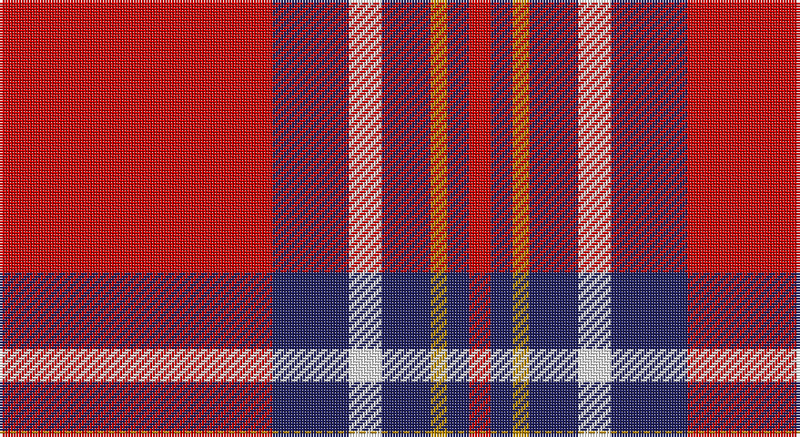

This page is one **sett** — a single exact thread-count. It belongs to the [tartan](/setts/r50db14w6db9lo3db4r4/)
(the same proportion at any scale), whose colour order is pattern [RBWBYBR](/stripes/rbwbybr/).

Sourced from tartans-authority.  It is a [7 stripe tartan](/stripes/stripes7/).

Original link http://www.tartansauthority.com/tartan-ferret/display/10726/

## Register references

External register numbers recorded for this tartan.

- Scottish Register of Tartans: [10726](https://www.tartanregister.gov.uk/tartanDetails?ref=10726)
- Scottish Tartans Authority (ITI): 10726

## Thread count
R/100 DB28 W12 DB18 DY6 DB8 R/8

One full sett is **252 threads**.

## Palette

Palette: <strong>Tartan Register</strong>
<table><thead><tr><th>Colour</th><th>Threads</th><th>Shade</th><th>Base</th><th>OKLCh</th></tr></thead><tbody><tr><td>R/</td><td style="text-align:right;font-variant-numeric:tabular-nums">100</td><td><code style="background-color:#C80000;">#C80000</code> <small style="color:#888">#C80000</small></td><td>R <code style="background-color:#CC0000;">#CC0000</code></td><td><small style="color:#888">oklch(52.3% 0.215 29.2)</small></td></tr><tr><td>DB</td><td style="text-align:right;font-variant-numeric:tabular-nums">28</td><td><code style="background-color:#202060;">#202060</code> <small style="color:#888">#202060</small></td><td>B <code style="background-color:#2A418A;">#2A418A</code></td><td><small style="color:#888">oklch(28.9% 0.111 276.9)</small></td></tr><tr><td>W</td><td style="text-align:right;font-variant-numeric:tabular-nums">12</td><td><code style="background-color:#FCFCFC;">#FCFCFC</code> <small style="color:#888">#FCFCFC</small></td><td>W <code style="background-color:#F7F7F7;">#F7F7F7</code></td><td><small style="color:#888">oklch(99.1% 0.000 89.9)</small></td></tr><tr><td>DB</td><td style="text-align:right;font-variant-numeric:tabular-nums">18</td><td><code style="background-color:#202060;">#202060</code> <small style="color:#888">#202060</small></td><td>B <code style="background-color:#2A418A;">#2A418A</code></td><td><small style="color:#888">oklch(28.9% 0.111 276.9)</small></td></tr><tr><td>DY</td><td style="text-align:right;font-variant-numeric:tabular-nums">6</td><td><code style="background-color:#BC8C00;">#BC8C00</code> <small style="color:#888">#BC8C00</small></td><td>Y <code style="background-color:#F2BF00;">#F2BF00</code></td><td><small style="color:#888">oklch(66.8% 0.137 84.1)</small></td></tr><tr><td>DB</td><td style="text-align:right;font-variant-numeric:tabular-nums">8</td><td><code style="background-color:#202060;">#202060</code> <small style="color:#888">#202060</small></td><td>B <code style="background-color:#2A418A;">#2A418A</code></td><td><small style="color:#888">oklch(28.9% 0.111 276.9)</small></td></tr><tr><td>R/</td><td style="text-align:right;font-variant-numeric:tabular-nums">8</td><td><code style="background-color:#C80000;">#C80000</code> <small style="color:#888">#C80000</small></td><td>R <code style="background-color:#CC0000;">#CC0000</code></td><td><small style="color:#888">oklch(52.3% 0.215 29.2)</small></td></tr></tbody></table>

# Sample pattern

## Nearest tartans

The nearest existing variants by ΔTartan distance, with this tartan at the top so the swatches line up against it.

ΔTartan

Tartan

Sett

—

<a href="/ttd/edit/#slug=r50db14w6db9lo3db4r4~x2">Texas Lone Star (Fashion)</a> <a class="nn-out" href="/variants/s7/r50db14w6db9lo3db4r4~x2/" title="open its dictionary page">↗</a>

0.83

<a href="/ttd/edit/#slug=m8w4m50k12m4k15mi5~x2&amp;base=r50db14w6db9lo3db4r4~x2">Instakilt, Pink (Fashion)</a> <a class="nn-out" href="/variants/s7/m8w4m50k12m4k15mi5~x2/" title="open its dictionary page">↗</a>

0.96

<a href="/ttd/edit/#slug=r50db14w6db9ly3db4r4~x2&amp;base=r50db14w6db9lo3db4r4~x2">Texas Lone Star</a> <a class="nn-out" href="/variants/s7/r50db14w6db9ly3db4r4~x2/" title="open its dictionary page">↗</a>

0.96

<a href="/ttd/edit/#slug=r52lo2db16lo2db3w5~x2&amp;base=r50db14w6db9lo3db4r4~x2">Brock University Alumni Association</a> <a class="nn-out" href="/variants/s6/r52lo2db16lo2db3w5~x2/" title="open its dictionary page">↗</a>

1.03

<a href="/ttd/edit/#slug=r2k3ly1k3r2db8r16k1~x4&amp;base=r50db14w6db9lo3db4r4~x2">Leslie Red (VS) (Clan)</a> <a class="nn-out" href="/variants/s8/r2k3ly1k3r2db8r16k1~x4/" title="open its dictionary page">↗</a>

1.06

<a href="/ttd/edit/#slug=r48k12o7k5w3~x2&amp;base=r50db14w6db9lo3db4r4~x2">Turner (Personal)</a> <a class="nn-out" href="/variants/s5/r48k12o7k5w3~x2/" title="open its dictionary page">↗</a>

1.08

<a href="/ttd/edit/#slug=r7w2r36db6dg3db3dg3db3dg12r4~x2&amp;base=r50db14w6db9lo3db4r4~x2">Chisholm of Strathglass</a> <a class="nn-out" href="/variants/s10/r7w2r36db6dg3db3dg3db3dg12r4~x2/" title="open its dictionary page">↗</a>

1.10

<a href="/ttd/edit/#slug=lb6k2r32lo2k6lo2r4k2lb3~x2&amp;base=r50db14w6db9lo3db4r4~x2">Lantern, The</a> <a class="nn-out" href="/variants/s9/lb6k2r32lo2k6lo2r4k2lb3~x2/" title="open its dictionary page">↗</a>

1.11

<a href="/ttd/edit/#slug=r8w4r50k12r4k15g5~x2&amp;base=r50db14w6db9lo3db4r4~x2">Instakilt, Red (Fashion)</a> <a class="nn-out" href="/variants/s7/r8w4r50k12r4k15g5~x2/" title="open its dictionary page">↗</a>

1.12

<a href="/ttd/edit/#slug=r155lb16k34db48r18ly6r9&amp;base=r50db14w6db9lo3db4r4~x2">Solberg-Wormald (Personal)</a> <a class="nn-out" href="/variants/s7/r155lb16k34db48r18ly6r9/" title="open its dictionary page">↗</a>

1.20

<a href="/ttd/edit/#slug=ly27k4w4r64w4r4k4r4k12~x2&amp;base=r50db14w6db9lo3db4r4~x2">O'Meehan (Name)</a> <a class="nn-out" href="/variants/s9/ly27k4w4r64w4r4k4r4k12~x2/" title="open its dictionary page">↗</a>

## Neighbour map

Every grey dot is one of 14360 variants placed by the first two principal components of the ΔTartan feature space (44% of its variance). Red is this tartan; blue dots are its nearest — click one to open its page.

<svg viewBox="0 0 640 380" role="img" style="max-width:100%;height:auto;border:1px solid #e0e0e0;border-radius:4px;display:block" xmlns="http://www.w3.org/2000/svg"><image href="/nn/cloud.v1.png" width="640" height="380"/><a href="/variants/s7/m8w4m50k12m4k15mi5~x2/"><circle cx="364.5" cy="154.3" r="4" fill="#3465a4"><title>Instakilt, Pink (Fashion)</title></circle></a><a href="/variants/s7/r50db14w6db9ly3db4r4~x2/"><circle cx="348.6" cy="124.0" r="4" fill="#3465a4"><title>Texas Lone Star</title></circle></a><a href="/variants/s6/r52lo2db16lo2db3w5~x2/"><circle cx="419.0" cy="119.9" r="4" fill="#3465a4"><title>Brock University Alumni Association</title></circle></a><a href="/variants/s8/r2k3ly1k3r2db8r16k1~x4/"><circle cx="332.2" cy="151.6" r="4" fill="#3465a4"><title>Leslie Red (VS) (Clan)</title></circle></a><a href="/variants/s5/r48k12o7k5w3~x2/"><circle cx="393.7" cy="161.5" r="4" fill="#3465a4"><title>Turner (Personal)</title></circle></a><a href="/variants/s10/r7w2r36db6dg3db3dg3db3dg12r4~x2/"><circle cx="371.6" cy="130.8" r="4" fill="#3465a4"><title>Chisholm of Strathglass</title></circle></a><a href="/variants/s9/lb6k2r32lo2k6lo2r4k2lb3~x2/"><circle cx="368.4" cy="117.2" r="4" fill="#3465a4"><title>Lantern, The</title></circle></a><a href="/variants/s7/r8w4r50k12r4k15g5~x2/"><circle cx="364.9" cy="150.8" r="4" fill="#3465a4"><title>Instakilt, Red (Fashion)</title></circle></a><a href="/variants/s7/r155lb16k34db48r18ly6r9/"><circle cx="381.1" cy="111.2" r="4" fill="#3465a4"><title>Solberg-Wormald (Personal)</title></circle></a><a href="/variants/s9/ly27k4w4r64w4r4k4r4k12~x2/"><circle cx="325.6" cy="110.0" r="4" fill="#3465a4"><title>O'Meehan (Name)</title></circle></a><circle cx="371.1" cy="139.4" r="5" fill="#c00000"/></svg>

ID: /variants/s7/r50db14w6db9lo3db4r4~x2/
