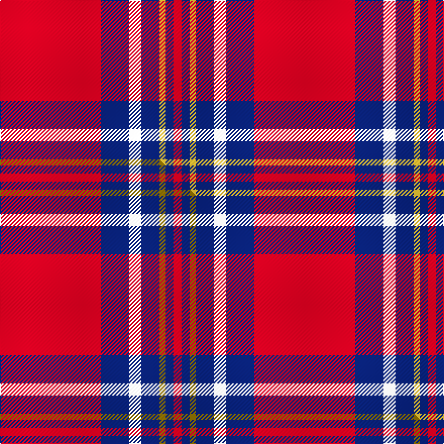

This is one **variant** — a specific cloth: this exact thread count and colourway, with its own
provenance below. It is one weaving of the [sett](/setts/r50db14w6db9ly3db4r4/) (the scale-free proportion — the
same cloth at any scale or shade), whose colour order is pattern [RBWBYBR](/stripes/rbwbybr/).

Part of the [Texas Lone Star](/tartans/texas-lone-star/) tartan — the named design grouping this sett with its other cloths.

Sourced from tartans-authority.  It is a [7 stripe tartan](/stripes/stripes7/).

Original link [https://www.tartanregister.gov.uk/tartanDetails.aspx?ref=10726](https://www.tartanregister.gov.uk/tartanDetails.aspx?ref=10726)

Dataset <small>— provenance for this record, inherited from the source manifest</small>

<dl class="dataset-prov">
<dt>source</dt><dd><a href="/sources/tartans-authority/">Scottish Tartans Authority</a></dd>
<dt>data captured from</dt><dd><a href="https://github.com/thetartan/tartan-database/blob/master/data/tartans-authority/data.csv">https://github.com/thetartan/tartan-database/blob/master/data/tartans-authority/data.csv</a></dd>
<dt>data date</dt><dd>8th Aug. 2012 <small>(this record)</small></dd>
<dt>licence</dt><dd><a href="https://creativecommons.org/licenses/by-nc-nd/4.0/">CC BY-NC-ND 4.0</a></dd>
</dl>

Capture chain <small>— the hands this data passed through, oldest first; each capture carries its own licence</small>

<ol class="capture-chain">
<li><a href="https://www.tartansauthority.com/">Scottish Tartans Authority</a> <small>the heritage body's archive — its tartan-ferret record browser is retired (links repaired to the SRT, above)</small></li>
<li><a href="https://github.com/thetartan/tartan-database">thetartan/tartan-database</a> <small>2016-2017</small> · <a href="https://creativecommons.org/licenses/by-nc-nd/4.0/">CC BY-NC-ND 4.0</a> <small>Levko Kravets's frozen compilation — the capture we vendored, and where its CC licence text came from</small></li>
<li>this dictionary <small>captured 2026-06-10 · commit 5bf86c7566</small> <small>each re-capture is a git commit to data/sources</small></li>
</ol>

## Register references

External register numbers recorded for this tartan.

- Scottish Register of Tartans: [10726](https://www.tartanregister.gov.uk/tartanDetails?ref=10726)
- Scottish Tartans Authority (ITI): 10726

## Thread count
R/100 DB28 W12 DB18 LY6 DB8 R/8

One full sett is **252 threads**.

## Palette
<table><thead><tr><th>Colour</th><th>Shade</th><th>OKLCh</th></tr></thead><tbody><tr><td>DB</td><td><code style="background-color:#082077;">#082077</code> <small style="color:#888">#082077</small></td><td><small style="color:#888">oklch(30.0% 0.149 265.1)</small></td></tr><tr><td>LY</td><td><code style="background-color:#DCBC32;">#DCBC32</code> <small style="color:#888">#DCBC32</small></td><td><small style="color:#888">oklch(80.0% 0.150 95.2)</small></td></tr><tr><td>R</td><td><code style="background-color:#D60020;">#D60020</code> <small style="color:#888">#D60020</small></td><td><small style="color:#888">oklch(55.2% 0.224 25.5)</small></td></tr><tr><td>W</td><td><code style="background-color:#F7F7F7;">#F7F7F7</code> <small style="color:#888">#F7F7F7</small></td><td><small style="color:#888">oklch(97.6% 0.000 89.9)</small></td></tr></tbody></table>

# Sample pattern

## Compared to the master

This cloth is one sett of its design; the master sett (the exemplar the design is anchored on) is below for comparison.

Its **ΔTartan distance** from the master is **0.02** — the same measure the nearest-tartans table ranks by (0 is identical; a re-scale of the same cloth is near 0, a recolour or a different proportion further).

<figure class="master-compare" style="margin:0">

this sett
master sett ★

<figcaption style="color:#888;font-size:smaller">One weave of this sett against the <a href="/setts/r50db14w6db9y3db4r4/">master sett ★</a>, split on the diagonal: a shared proportion runs seamlessly across it with only the shades shifting; a different proportion breaks on it.</figcaption>
</figure>

## Nearest tartan variants

The nearest existing variants by ΔTartan distance, with this cloth at the top so the swatches line up against it.

ΔTartan

Threads

Variant

Sett

—

252

<a href="/variants/s7/r50db14w6db9ly3db4r4~x2/">Texas Lone Star (Fashion)</a>

<a href="/ttd/edit/#slug=r50db14w6db9y3db4r4~x2&amp;base=r50db14w6db9ly3db4r4~x2" title="compare in the TTD">0.02</a>

252

<a href="/variants/s7/r50db14w6db9y3db4r4~x2/">Texas Lone Star</a>

<a href="/ttd/edit/#slug=db1r16db6y4db6w1~x4&amp;base=r50db14w6db9ly3db4r4~x2" title="compare in the TTD">1.76</a>

264

<a href="/variants/s6/db1r16db6y4db6w1~x4/">Superfast Ferries (Corporate)</a>

<a href="/ttd/edit/#slug=r60b15r4db10w2db10w2db10r4~x2&amp;base=r50db14w6db9ly3db4r4~x2" title="compare in the TTD">2.22</a>

340

<a href="/variants/s9/r60b15r4db10w2db10w2db10r4~x2/">Robberstad</a>

<a href="/ttd/edit/#slug=r52y2db16y2db3w5~x2&amp;base=r50db14w6db9ly3db4r4~x2" title="compare in the TTD">2.54</a>

206

<a href="/variants/s6/r52y2db16y2db3w5~x2/">Brock University Alumni Association</a>

<a href="/ttd/edit/#slug=r6y1r24g6db2k1db2k1db12r1~x2&amp;base=r50db14w6db9ly3db4r4~x2" title="compare in the TTD">2.59</a>

210

<a href="/variants/s10/r6y1r24g6db2k1db2k1db12r1~x2/">MacEdward</a>

<a href="/ttd/edit/#slug=r11w1r32k8db6k1db16k1~x2&amp;base=r50db14w6db9ly3db4r4~x2" title="compare in the TTD">2.63</a>

280

<a href="/variants/s8/r11w1r32k8db6k1db16k1~x2/">Ostermeier (2015)</a>

<a href="/ttd/edit/#slug=db3ly2db32r28w2r2w2r2w3~x2&amp;base=r50db14w6db9ly3db4r4~x2" title="compare in the TTD">2.88</a>

292

<a href="/variants/s9/db3ly2db32r28w2r2w2r2w3~x2/">Sea Dog Bamse, Pride of Norway</a>

<a href="/ttd/edit/#slug=r7w2r36db6g3db3g3db3g12r4~x2&amp;base=r50db14w6db9ly3db4r4~x2" title="compare in the TTD">2.91</a>

294

<a href="/variants/s10/r7w2r36db6g3db3g3db3g12r4~x2/">Chisholm of Strathglass Clan Tartan</a>

<a href="/ttd/edit/#slug=dg2r2db1r24lb1db6r3dg12r4db1~x2&amp;base=r50db14w6db9ly3db4r4~x2" title="compare in the TTD">2.97</a>

218

<a href="/variants/s10/dg2r2db1r24lb1db6r3dg12r4db1~x2/">MacDonell of Keppoch</a>

<a href="/ttd/edit/#slug=r2db10r2g10r25w2~x2&amp;base=r50db14w6db9ly3db4r4~x2" title="compare in the TTD">2.97</a>

196

<a href="/variants/s6/r2db10r2g10r25w2~x2/">Grant of Lurg</a>

## Neighbour map

Every grey dot is one of 13621 variants placed by the first two principal components of the ΔTartan feature space (42% of its variance). Red is this tartan; blue dots are its nearest — click one to open its page.

<svg viewBox="0 0 640 380" role="img" style="max-width:100%;height:auto;border:1px solid #e0e0e0;border-radius:4px;display:block" xmlns="http://www.w3.org/2000/svg"><image href="/nn/cloud.v1.png" width="640" height="380"/><a href="/variants/s7/r50db14w6db9y3db4r4~x2/"><circle cx="362.4" cy="144.1" r="4" fill="#3465a4"><title>Texas Lone Star</title></circle></a><a href="/variants/s6/db1r16db6y4db6w1~x4/"><circle cx="295.3" cy="186.1" r="4" fill="#3465a4"><title>Superfast Ferries (Corporate)</title></circle></a><a href="/variants/s9/r60b15r4db10w2db10w2db10r4~x2/"><circle cx="371.8" cy="111.1" r="4" fill="#3465a4"><title>Robberstad</title></circle></a><a href="/variants/s6/r52y2db16y2db3w5~x2/"><circle cx="422.1" cy="128.5" r="4" fill="#3465a4"><title>Brock University Alumni Association</title></circle></a><a href="/variants/s10/r6y1r24g6db2k1db2k1db12r1~x2/"><circle cx="305.5" cy="95.5" r="4" fill="#3465a4"><title>MacEdward</title></circle></a><a href="/variants/s8/r11w1r32k8db6k1db16k1~x2/"><circle cx="317.6" cy="110.2" r="4" fill="#3465a4"><title>Ostermeier (2015)</title></circle></a><a href="/variants/s9/db3ly2db32r28w2r2w2r2w3~x2/"><circle cx="291.5" cy="134.6" r="4" fill="#3465a4"><title>Sea Dog Bamse, Pride of Norway</title></circle></a><a href="/variants/s10/r7w2r36db6g3db3g3db3g12r4~x2/"><circle cx="356.9" cy="132.7" r="4" fill="#3465a4"><title>Chisholm of Strathglass Clan Tartan</title></circle></a><a href="/variants/s10/dg2r2db1r24lb1db6r3dg12r4db1~x2/"><circle cx="375.5" cy="124.8" r="4" fill="#3465a4"><title>MacDonell of Keppoch</title></circle></a><a href="/variants/s6/r2db10r2g10r25w2~x2/"><circle cx="321.6" cy="184.4" r="4" fill="#3465a4"><title>Grant of Lurg</title></circle></a><circle cx="358.6" cy="143.1" r="5" fill="#c00000"/><text x="320" y="376" text-anchor="middle" font-size="11" fill="#999">ground</text><text x="11" y="190" text-anchor="middle" font-size="11" fill="#999" transform="rotate(-90 11 190)">complexity</text></svg>

ID: /variants/s7/r50db14w6db9ly3db4r4~x2/
