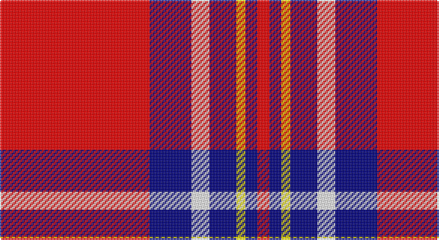

This page is one **sett** — a single exact thread-count. It belongs to the [tartan](/setts/r50db14w6db9ly3db4r4/)
(the same proportion at any scale), whose colour order is pattern [RBWBYBR](/stripes/rbwbybr/).

Sourced from register-of-tartans.  It is a [7 stripe tartan](/stripes/stripes7/).

Original link https://www.tartanregister.gov.uk/tartanDetails.aspx?ref=10726

## Register references

External register numbers recorded for this tartan.

- Scottish Register of Tartans: [10726](https://www.tartanregister.gov.uk/tartanDetails.aspx?ref=10726)

## Thread count
R/100 DB28 W12 DB18 Y6 DB8 R/8

One full sett is **252 threads**.

## Palette

Palette: <strong>Tartan Register</strong> <small style="color:#888">(3 of 4 colours)</small>
<table><thead><tr><th>Colour</th><th>Threads</th><th>Shade</th><th>Base</th><th>OKLCh</th></tr></thead><tbody><tr><td>R/</td><td style="text-align:right;font-variant-numeric:tabular-nums">100</td><td><code style="background-color:#FF0000;">#FF0000</code> <small style="color:#888">#FF0000</small></td><td>R <code style="background-color:#CC0000;">#CC0000</code></td><td><small style="color:#888">oklch(62.8% 0.258 29.2)</small></td></tr><tr><td>DB</td><td style="text-align:right;font-variant-numeric:tabular-nums">28</td><td><code style="background-color:#000080;">#000080</code> <small style="color:#888">#000080</small></td><td>B <code style="background-color:#2A418A;">#2A418A</code></td><td><small style="color:#888">oklch(27.1% 0.188 264.1)</small></td></tr><tr><td>W</td><td style="text-align:right;font-variant-numeric:tabular-nums">12</td><td><code style="background-color:#FFFFFF;">#FFFFFF</code> <small style="color:#888">#FFFFFF</small></td><td>W <code style="background-color:#F7F7F7;">#F7F7F7</code></td><td><small style="color:#888">oklch(100.0% 0.000 89.9)</small></td></tr><tr><td>DB</td><td style="text-align:right;font-variant-numeric:tabular-nums">18</td><td><code style="background-color:#000080;">#000080</code> <small style="color:#888">#000080</small></td><td>B <code style="background-color:#2A418A;">#2A418A</code></td><td><small style="color:#888">oklch(27.1% 0.188 264.1)</small></td></tr><tr><td>Y</td><td style="text-align:right;font-variant-numeric:tabular-nums">6</td><td><code style="background-color:#FFE600;">#FFE600</code> <small style="color:#888">#FFE600</small></td><td>Y <code style="background-color:#F2BF00;">#F2BF00</code></td><td><small style="color:#888">oklch(91.7% 0.192 101.4)</small></td></tr><tr><td>DB</td><td style="text-align:right;font-variant-numeric:tabular-nums">8</td><td><code style="background-color:#000080;">#000080</code> <small style="color:#888">#000080</small></td><td>B <code style="background-color:#2A418A;">#2A418A</code></td><td><small style="color:#888">oklch(27.1% 0.188 264.1)</small></td></tr><tr><td>R/</td><td style="text-align:right;font-variant-numeric:tabular-nums">8</td><td><code style="background-color:#FF0000;">#FF0000</code> <small style="color:#888">#FF0000</small></td><td>R <code style="background-color:#CC0000;">#CC0000</code></td><td><small style="color:#888">oklch(62.8% 0.258 29.2)</small></td></tr></tbody></table>

# Sample pattern

## Nearest tartans

The nearest existing variants by ΔTartan distance, with this tartan at the top so the swatches line up against it.

ΔTartan

Tartan

Sett

—

<a href="/ttd/edit/#slug=r50db14w6db9ly3db4r4~x2">Texas Lone Star</a> <a class="nn-out" href="/variants/s7/r50db14w6db9ly3db4r4~x2/" title="open its dictionary page">↗</a>

0.95

<a href="/ttd/edit/#slug=m8w4m50k12m4k15mi5~x2&amp;base=r50db14w6db9ly3db4r4~x2">Instakilt, Pink (Fashion)</a> <a class="nn-out" href="/variants/s7/m8w4m50k12m4k15mi5~x2/" title="open its dictionary page">↗</a>

0.96

<a href="/ttd/edit/#slug=r50db14w6db9lo3db4r4~x2&amp;base=r50db14w6db9ly3db4r4~x2">Texas Lone Star (Fashion)</a> <a class="nn-out" href="/variants/s7/r50db14w6db9lo3db4r4~x2/" title="open its dictionary page">↗</a>

1.15

<a href="/ttd/edit/#slug=ly27k4w4r64w4r4k4r4k12~x2&amp;base=r50db14w6db9ly3db4r4~x2">O'Meehan (Name)</a> <a class="nn-out" href="/variants/s9/ly27k4w4r64w4r4k4r4k12~x2/" title="open its dictionary page">↗</a>

1.18

<a href="/ttd/edit/#slug=r52lo2db16lo2db3w5~x2&amp;base=r50db14w6db9ly3db4r4~x2">Brock University Alumni Association</a> <a class="nn-out" href="/variants/s6/r52lo2db16lo2db3w5~x2/" title="open its dictionary page">↗</a>

1.33

<a href="/ttd/edit/#slug=rii42r2w2r2rii5ri12w32rii4~x2&amp;base=r50db14w6db9ly3db4r4~x2">Longniddry, dress Burgundy</a> <a class="nn-out" href="/variants/s8/rii42r2w2r2rii5ri12w32rii4~x2/" title="open its dictionary page">↗</a>

1.37

<a href="/ttd/edit/#slug=r11w1r32k8db6k1db16k1~x2&amp;base=r50db14w6db9ly3db4r4~x2">Ostermeier (2015)</a> <a class="nn-out" href="/variants/s8/r11w1r32k8db6k1db16k1~x2/" title="open its dictionary page">↗</a>

1.38

<a href="/ttd/edit/#slug=r8w4r50k12r4k15g5~x2&amp;base=r50db14w6db9ly3db4r4~x2">Instakilt, Red (Fashion)</a> <a class="nn-out" href="/variants/s7/r8w4r50k12r4k15g5~x2/" title="open its dictionary page">↗</a>

1.39

<a href="/ttd/edit/#slug=w26dri2w3dri15dri26dr2dri3~x2&amp;base=r50db14w6db9ly3db4r4~x2">Gavin (Personal)</a> <a class="nn-out" href="/variants/s7/w26dri2w3dri15dri26dr2dri3~x2/" title="open its dictionary page">↗</a>

1.46

<a href="/ttd/edit/#slug=r35db2w2db2r4ri10w25r3~x2&amp;base=r50db14w6db9ly3db4r4~x2">Longniddry Dress, Red (Dance)</a> <a class="nn-out" href="/variants/s8/r35db2w2db2r4ri10w25r3~x2/" title="open its dictionary page">↗</a>

1.49

<a href="/ttd/edit/#slug=ri42rii2w2rii2ri5r12w32ri4~x2&amp;base=r50db14w6db9ly3db4r4~x2">Longniddry Burgundy (Dance)</a> <a class="nn-out" href="/variants/s8/ri42rii2w2rii2ri5r12w32ri4~x2/" title="open its dictionary page">↗</a>

## Neighbour map

Every grey dot is one of 14360 variants placed by the first two principal components of the ΔTartan feature space (44% of its variance). Red is this tartan; blue dots are its nearest — click one to open its page.

<svg viewBox="0 0 640 380" role="img" style="max-width:100%;height:auto;border:1px solid #e0e0e0;border-radius:4px;display:block" xmlns="http://www.w3.org/2000/svg"><image href="/nn/cloud.v1.png" width="640" height="380"/><a href="/variants/s7/m8w4m50k12m4k15mi5~x2/"><circle cx="364.5" cy="154.3" r="4" fill="#3465a4"><title>Instakilt, Pink (Fashion)</title></circle></a><a href="/variants/s7/r50db14w6db9lo3db4r4~x2/"><circle cx="371.1" cy="139.4" r="4" fill="#3465a4"><title>Texas Lone Star (Fashion)</title></circle></a><a href="/variants/s9/ly27k4w4r64w4r4k4r4k12~x2/"><circle cx="325.6" cy="110.0" r="4" fill="#3465a4"><title>O'Meehan (Name)</title></circle></a><a href="/variants/s6/r52lo2db16lo2db3w5~x2/"><circle cx="419.0" cy="119.9" r="4" fill="#3465a4"><title>Brock University Alumni Association</title></circle></a><a href="/variants/s8/rii42r2w2r2rii5ri12w32rii4~x2/"><circle cx="304.6" cy="117.4" r="4" fill="#3465a4"><title>Longniddry, dress Burgundy</title></circle></a><a href="/variants/s8/r11w1r32k8db6k1db16k1~x2/"><circle cx="351.3" cy="114.3" r="4" fill="#3465a4"><title>Ostermeier (2015)</title></circle></a><a href="/variants/s7/r8w4r50k12r4k15g5~x2/"><circle cx="364.9" cy="150.8" r="4" fill="#3465a4"><title>Instakilt, Red (Fashion)</title></circle></a><a href="/variants/s7/w26dri2w3dri15dri26dr2dri3~x2/"><circle cx="303.6" cy="152.3" r="4" fill="#3465a4"><title>Gavin (Personal)</title></circle></a><a href="/variants/s8/r35db2w2db2r4ri10w25r3~x2/"><circle cx="296.5" cy="122.6" r="4" fill="#3465a4"><title>Longniddry Dress, Red (Dance)</title></circle></a><a href="/variants/s8/ri42rii2w2rii2ri5r12w32ri4~x2/"><circle cx="300.3" cy="116.6" r="4" fill="#3465a4"><title>Longniddry Burgundy (Dance)</title></circle></a><circle cx="348.6" cy="124.0" r="5" fill="#c00000"/></svg>

ID: /variants/s7/r50db14w6db9ly3db4r4~x2/
