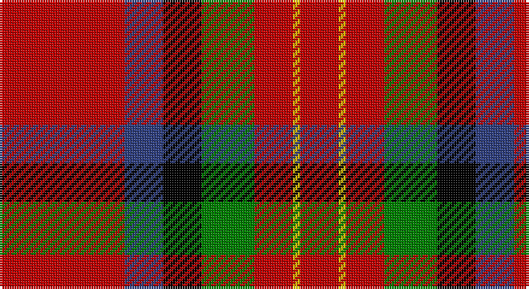

This page is one **sett** — a single exact thread-count. It belongs to the [tartan](/setts/r52db16k16g22r16ly3r16/)
(the same proportion at any scale), whose colour order is pattern [RBKGRYR](/stripes/rbkgryr/).

Part of the [Sturrock](/tartans/sturrock/) tartan — the named design grouping this sett with its other cloths.

Sourced from weddslist.  It is a [7 stripe tartan](/stripes/stripes7/).

Original link http://www.weddslist.com/cgi-bin/tartans/pg.pl?source=sts

## Provenance

Earliest known date: From collection dating 1930-5 The thread count of the cloth sample has been divided by two for display. The Register contains two Sturrock counts. In this version blue replaces part of the black stripe, making a small change to the appearance that could easily go unnoticed. It is likely that the second pattern came about by the use of a very dark blue that was later mistaken for black.

## Also known as

This cloth is also recorded under:

- Sturrock, Blue/Black

2 attestations — the source records this cloth was collapsed from (oldest owns this page)

<ul>
<li>undated — Sturrock (weddslist, <a href="http://www.weddslist.com/cgi-bin/tartans/pg.pl?source=sts">record</a>)</li>
<li>undated — Sturrock Family Tartan (house-of-tartan, <a href="http://www.house-of-tartan.scotland.net/house/TartanViewjs.asp?colr=Def&tnam=1359">record</a>)</li>
</ul>

## Thread count
R/52 B16 K16 G22 R16 Y3 R/16

One full sett is **214 threads**.

## Palette

Palette: <strong>Ingles Buchan</strong> <small style="color:#888">(1 of 5 colours)</small>
<table><thead><tr><th>Colour</th><th>Threads</th><th>Shade</th><th>Base</th><th>OKLCh</th></tr></thead><tbody><tr><td>R/</td><td style="text-align:right;font-variant-numeric:tabular-nums">52</td><td><code style="background-color:#C00000;">#C00000</code> <small style="color:#888">#C00000</small></td><td>R <code style="background-color:#CC0000;">#CC0000</code></td><td><small style="color:#888">oklch(50.7% 0.208 29.2)</small></td></tr><tr><td>B</td><td style="text-align:right;font-variant-numeric:tabular-nums">16</td><td><code style="background-color:#304080;">#304080</code> <small style="color:#888">#304080</small></td><td>B <code style="background-color:#2A418A;">#2A418A</code></td><td><small style="color:#888">oklch(39.4% 0.109 270.2)</small></td></tr><tr><td>K</td><td style="text-align:right;font-variant-numeric:tabular-nums">16</td><td><code style="background-color:#000000;">#000000</code> <small style="color:#888">#000000</small></td><td>K <code style="background-color:#000000;">#000000</code></td><td><small style="color:#888">oklch(0.0% 0.000 0.0)</small></td></tr><tr><td>G</td><td style="text-align:right;font-variant-numeric:tabular-nums">22</td><td><code style="background-color:#008000;">#008000</code> <small style="color:#888">#008000</small></td><td>G <code style="background-color:#006100;">#006100</code></td><td><small style="color:#888">oklch(52.0% 0.177 142.5)</small></td></tr><tr><td>R</td><td style="text-align:right;font-variant-numeric:tabular-nums">16</td><td><code style="background-color:#C00000;">#C00000</code> <small style="color:#888">#C00000</small></td><td>R <code style="background-color:#CC0000;">#CC0000</code></td><td><small style="color:#888">oklch(50.7% 0.208 29.2)</small></td></tr><tr><td>Y</td><td style="text-align:right;font-variant-numeric:tabular-nums">3</td><td><code style="background-color:#F0C000;">#F0C000</code> <small style="color:#888">#F0C000</small></td><td>Y <code style="background-color:#F2BF00;">#F2BF00</code></td><td><small style="color:#888">oklch(82.7% 0.169 90.5)</small></td></tr><tr><td>R/</td><td style="text-align:right;font-variant-numeric:tabular-nums">16</td><td><code style="background-color:#C00000;">#C00000</code> <small style="color:#888">#C00000</small></td><td>R <code style="background-color:#CC0000;">#CC0000</code></td><td><small style="color:#888">oklch(50.7% 0.208 29.2)</small></td></tr></tbody></table>

# Sample pattern

## Compared to the master

This cloth is one sett of its design; the master sett (the exemplar the design is anchored on) is below for comparison.

<figure style="margin:0"><figcaption style="color:#888;font-size:smaller">this sett</figcaption></figure>
<figure style="margin:0"><figcaption style="color:#888;font-size:smaller"><a href="/setts/r52b16k16g22r16lo3r16/">master sett →</a></figcaption></figure>

## Nearest tartans

The nearest existing variants by ΔTartan distance, with this tartan at the top so the swatches line up against it.

ΔTartan

Tartan

Sett

—

<a href="/ttd/edit/#slug=r52db16k16g22r16ly3r16">Sturrock</a> <a class="nn-out" href="/variants/s7/r52db16k16g22r16ly3r16/" title="open its dictionary page">↗</a>

0.78

<a href="/ttd/edit/#slug=r52b16k16g22r16lo3r16~x2&amp;base=r52db16k16g22r16ly3r16">Sturrock, Blue/Black (Clan)</a> <a class="nn-out" href="/variants/s7/r52b16k16g22r16lo3r16~x2/" title="open its dictionary page">↗</a>

0.83

<a href="/ttd/edit/#slug=r40t11w2k12dg36r32~x2&amp;base=r52db16k16g22r16ly3r16">Thompson/Thomson/MacTavish (Mackinlay)</a> <a class="nn-out" href="/variants/s6/r40t11w2k12dg36r32~x2/" title="open its dictionary page">↗</a>

1.05

<a href="/ttd/edit/#slug=b4r1k11r20k20r20g4ly1~x2&amp;base=r52db16k16g22r16ly3r16">Templeton (Name?)</a> <a class="nn-out" href="/variants/s8/b4r1k11r20k20r20g4ly1~x2/" title="open its dictionary page">↗</a>

1.05

<a href="/ttd/edit/#slug=r33k8dr12g12r8dr2r8~x2&amp;base=r52db16k16g22r16ly3r16">Tipperary</a> <a class="nn-out" href="/variants/s7/r33k8dr12g12r8dr2r8~x2/" title="open its dictionary page">↗</a>

1.07

<a href="/ttd/edit/#slug=r52k32dg22r16ly3r16&amp;base=r52db16k16g22r16ly3r16">Sturrock</a> <a class="nn-out" href="/variants/s6/r52k32dg22r16ly3r16/" title="open its dictionary page">↗</a>

1.08

<a href="/ttd/edit/#slug=r36lt9k12g17r10k3r10~x2&amp;base=r52db16k16g22r16ly3r16">MacDuff #6</a> <a class="nn-out" href="/variants/s7/r36lt9k12g17r10k3r10~x2/" title="open its dictionary page">↗</a>

1.09

<a href="/ttd/edit/#slug=r96db16dg34dgi48r18k6r9&amp;base=r52db16k16g22r16ly3r16">MacDuff</a> <a class="nn-out" href="/variants/s7/r96db16dg34dgi48r18k6r9/" title="open its dictionary page">↗</a>

1.15

<a href="/ttd/edit/#slug=r52k32g22r16ly3r16&amp;base=r52db16k16g22r16ly3r16">Sturrock</a> <a class="nn-out" href="/variants/s6/r52k32g22r16ly3r16/" title="open its dictionary page">↗</a>

1.16

<a href="/ttd/edit/#slug=r5w2r28k12dg16r3~x2&amp;base=r52db16k16g22r16ly3r16">MacKintosh #4</a> <a class="nn-out" href="/variants/s6/r5w2r28k12dg16r3~x2/" title="open its dictionary page">↗</a>

1.20

<a href="/ttd/edit/#slug=r36db9k12g17r10k3r10~x2&amp;base=r52db16k16g22r16ly3r16">MacDuff - 1819 (Clan)</a> <a class="nn-out" href="/variants/s7/r36db9k12g17r10k3r10~x2/" title="open its dictionary page">↗</a>

## Neighbour map

Every grey dot is one of 14360 variants placed by the first two principal components of the ΔTartan feature space (44% of its variance). Red is this tartan; blue dots are its nearest — click one to open its page.

<svg viewBox="0 0 640 380" role="img" style="max-width:100%;height:auto;border:1px solid #e0e0e0;border-radius:4px;display:block" xmlns="http://www.w3.org/2000/svg"><image href="/nn/cloud.v1.png" width="640" height="380"/><a href="/variants/s7/r52b16k16g22r16lo3r16~x2/"><circle cx="315.9" cy="173.4" r="4" fill="#3465a4"><title>Sturrock, Blue/Black (Clan)</title></circle></a><a href="/variants/s6/r40t11w2k12dg36r32~x2/"><circle cx="281.8" cy="174.3" r="4" fill="#3465a4"><title>Thompson/Thomson/MacTavish (Mackinlay)</title></circle></a><a href="/variants/s8/b4r1k11r20k20r20g4ly1~x2/"><circle cx="285.4" cy="149.6" r="4" fill="#3465a4"><title>Templeton (Name?)</title></circle></a><a href="/variants/s7/r33k8dr12g12r8dr2r8~x2/"><circle cx="327.9" cy="178.7" r="4" fill="#3465a4"><title>Tipperary</title></circle></a><a href="/variants/s6/r52k32dg22r16ly3r16/"><circle cx="327.4" cy="190.4" r="4" fill="#3465a4"><title>Sturrock</title></circle></a><a href="/variants/s7/r36lt9k12g17r10k3r10~x2/"><circle cx="291.5" cy="190.9" r="4" fill="#3465a4"><title>MacDuff #6</title></circle></a><a href="/variants/s7/r96db16dg34dgi48r18k6r9/"><circle cx="293.0" cy="156.4" r="4" fill="#3465a4"><title>MacDuff</title></circle></a><a href="/variants/s6/r52k32g22r16ly3r16/"><circle cx="309.8" cy="187.5" r="4" fill="#3465a4"><title>Sturrock</title></circle></a><a href="/variants/s6/r5w2r28k12dg16r3~x2/"><circle cx="300.2" cy="181.9" r="4" fill="#3465a4"><title>MacKintosh #4</title></circle></a><a href="/variants/s7/r36db9k12g17r10k3r10~x2/"><circle cx="308.8" cy="200.4" r="4" fill="#3465a4"><title>MacDuff - 1819 (Clan)</title></circle></a><circle cx="295.3" cy="164.7" r="5" fill="#c00000"/></svg>

ID: /variants/s7/r52db16k16g22r16ly3r16/
