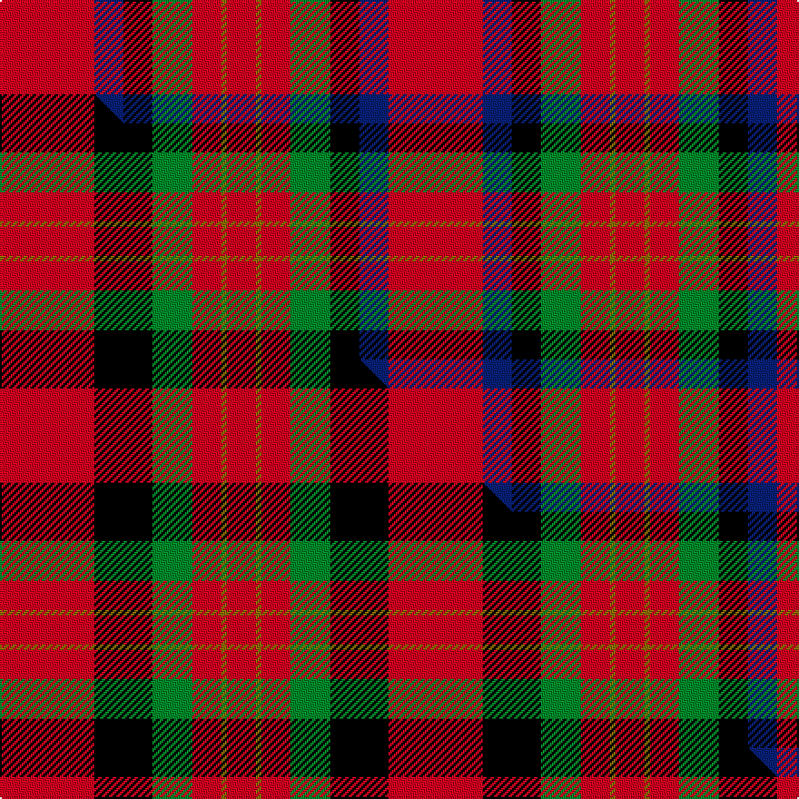

This page is one **sett** — a single exact thread-count. It belongs to the [tartan](/setts/r52db16k16g22r16y3r16/)
(the same proportion at any scale), whose colour order is pattern [RBKGRGR](/stripes/rbkgrgr/).

Part of the [Sturrock](/tartans/sturrock/) tartan — the named design grouping this sett with its other cloths.

Sourced from weddslist.  It is a [7 stripe tartan](/stripes/stripes7/).

Original link http://www.weddslist.com/cgi-bin/tartans/pg.pl?source=sts

## Provenance

Earliest known date: From collection dating 1930-5 The thread count of the cloth sample has been divided by two for display. The Register contains two Sturrock counts. In this version blue replaces part of the black stripe, making a small change to the appearance that could easily go unnoticed. It is likely that the second pattern came about by the use of a very dark blue that was later mistaken for black.

2 attestations — the source records this cloth was collapsed from (oldest owns this page)

<ul>
<li>undated — Sturrock (weddslist, <a href="http://www.weddslist.com/cgi-bin/tartans/pg.pl?source=sts">record</a>) </li>
<li>undated — Sturrock Family Tartan (house-of-tartan, <a href="http://www.house-of-tartan.scotland.net/house/TartanViewjs.asp?colr=Def&tnam=1359">record</a>) </li>
</ul>

## Thread count
R/52 DB16 K16 G22 R16 Y3 R/16

One full sett is **214 threads**.

## Palette
<table><thead><tr><th>Colour</th><th>Shade</th><th>OKLCh</th></tr></thead><tbody><tr><td>DB</td><td><code style="background-color:#082077;">#082077</code> <small style="color:#888">#082077</small></td><td><small style="color:#888">oklch(30.0% 0.149 265.1)</small></td></tr><tr><td>G</td><td><code style="background-color:#008B2A;">#008B2A</code> <small style="color:#888">#008B2A</small></td><td><small style="color:#888">oklch(55.4% 0.170 145.9)</small></td></tr><tr><td>K</td><td><code style="background-color:#000000;">#000000</code> <small style="color:#888">#000000</small></td><td><small style="color:#888">oklch(0.0% 0.000 0.0)</small></td></tr><tr><td>R</td><td><code style="background-color:#D60020;">#D60020</code> <small style="color:#888">#D60020</small></td><td><small style="color:#888">oklch(55.2% 0.224 25.5)</small></td></tr><tr><td>Y</td><td><code style="background-color:#8B6E00;">#8B6E00</code> <small style="color:#888">#8B6E00</small></td><td><small style="color:#888">oklch(55.1% 0.113 90.4)</small></td></tr></tbody></table>

# Sample pattern

## Compared to the master

This cloth is one sett of its design; the master sett (the exemplar the design is anchored on) is below for comparison.

Its **ΔTartan distance** from the master is **1.12** — the same measure the nearest-tartans table ranks by (0 is identical; a re-scale of the same cloth is near 0, a recolour or a different proportion further).

<figure class="master-compare" style="margin:0">

this sett
master sett ★

<figcaption style="color:#888;font-size:smaller">One weave of this sett against the <a href="/setts/r52k32g22r16y3r16/">master sett ★</a>, split on the diagonal: a shared proportion runs seamlessly across it with only the shades shifting; a different proportion breaks on it.</figcaption>
</figure>

## Nearest variants

The nearest existing variants by ΔTartan distance, with this cloth at the top so the swatches line up against it.

ΔTartan

Threads

Variant

Sett

—

214

<a href="/variants/s7/r52db16k16g22r16y3r16/">Sturrock</a>

<a href="/ttd/edit/#slug=r52k32g22r16y3r16&amp;base=r52db16k16g22r16y3r16" title="compare in the TTD">0.42</a>

214

<a href="/variants/s6/r52k32g22r16y3r16/">Sturrock</a>

<a href="/ttd/edit/#slug=r22lb8k9g14r10lb2r10~x2&amp;base=r52db16k16g22r16y3r16" title="compare in the TTD">0.70</a>

236

<a href="/variants/s7/r22lb8k9g14r10lb2r10~x2/">MacDuff #2</a>

<a href="/ttd/edit/#slug=r36db9k12g17r10k3r10~x2&amp;base=r52db16k16g22r16y3r16" title="compare in the TTD">1.45</a>

296

<a href="/variants/s7/r36db9k12g17r10k3r10~x2/">MacDuff #6</a>

<a href="/ttd/edit/#slug=r36db9k12dg17r10k3r10~x2&amp;base=r52db16k16g22r16y3r16" title="compare in the TTD">1.45</a>

296

<a href="/variants/s7/r36db9k12dg17r10k3r10~x2/">MacDuff - 1819 (Clan)</a>

<a href="/ttd/edit/#slug=r33k8dy12g12r8dy2r8~x2&amp;base=r52db16k16g22r16y3r16" title="compare in the TTD">1.52</a>

250

<a href="/variants/s7/r33k8dy12g12r8dy2r8~x2/">Tipperary, County</a>

<a href="/ttd/edit/#slug=r5w2r28k12g16r3~x2&amp;base=r52db16k16g22r16y3r16" title="compare in the TTD">1.54</a>

248

<a href="/variants/s6/r5w2r28k12g16r3~x2/">MacKintosh #4</a>

<a href="/ttd/edit/#slug=r6g14r6db12r31lb2r4ly3~x2&amp;base=r52db16k16g22r16y3r16" title="compare in the TTD">1.67</a>

294

<a href="/variants/s8/r6g14r6db12r31lb2r4ly3~x2/">Loch Lochy (District)</a>

<a href="/ttd/edit/#slug=r10g24k10r28lb3r6~x2&amp;base=r52db16k16g22r16y3r16" title="compare in the TTD">1.71</a>

292

<a href="/variants/s6/r10g24k10r28lb3r6~x2/">Nisbet</a>

<a href="/ttd/edit/#slug=dy3r10g7db10r15k1w2~x2&amp;base=r52db16k16g22r16y3r16" title="compare in the TTD">1.95</a>

182

<a href="/variants/s7/dy3r10g7db10r15k1w2~x2/">East Kilbride</a>

<a href="/ttd/edit/#slug=y3r10g7db10r15k1w2~x2&amp;base=r52db16k16g22r16y3r16" title="compare in the TTD">1.95</a>

182

<a href="/variants/s7/y3r10g7db10r15k1w2~x2/">East Kilbride</a>

## Neighbour map

Every grey dot is one of 13620 variants placed by the first two principal components of the ΔTartan feature space (42% of its variance). Red is this tartan; blue dots are its nearest — click one to open its page.

<svg viewBox="0 0 640 380" role="img" style="max-width:100%;height:auto;border:1px solid #e0e0e0;border-radius:4px;display:block" xmlns="http://www.w3.org/2000/svg"><image href="/nn/cloud.v1.png" width="640" height="380"/><a href="/variants/s6/r52k32g22r16y3r16/"><circle cx="281.3" cy="173.3" r="4" fill="#3465a4"><title>Sturrock</title></circle></a><a href="/variants/s7/r22lb8k9g14r10lb2r10~x2/"><circle cx="232.9" cy="205.5" r="4" fill="#3465a4"><title>MacDuff #2</title></circle></a><a href="/variants/s7/r36db9k12g17r10k3r10~x2/"><circle cx="258.1" cy="178.3" r="4" fill="#3465a4"><title>MacDuff #6</title></circle></a><a href="/variants/s7/r36db9k12dg17r10k3r10~x2/"><circle cx="265.0" cy="178.6" r="4" fill="#3465a4"><title>MacDuff - 1819 (Clan)</title></circle></a><a href="/variants/s7/r33k8dy12g12r8dy2r8~x2/"><circle cx="298.9" cy="165.2" r="4" fill="#3465a4"><title>Tipperary, County</title></circle></a><a href="/variants/s6/r5w2r28k12g16r3~x2/"><circle cx="257.2" cy="169.1" r="4" fill="#3465a4"><title>MacKintosh #4</title></circle></a><a href="/variants/s8/r6g14r6db12r31lb2r4ly3~x2/"><circle cx="330.3" cy="157.0" r="4" fill="#3465a4"><title>Loch Lochy (District)</title></circle></a><a href="/variants/s6/r10g24k10r28lb3r6~x2/"><circle cx="246.7" cy="201.9" r="4" fill="#3465a4"><title>Nisbet</title></circle></a><a href="/variants/s7/dy3r10g7db10r15k1w2~x2/"><circle cx="208.0" cy="152.2" r="4" fill="#3465a4"><title>East Kilbride</title></circle></a><a href="/variants/s7/y3r10g7db10r15k1w2~x2/"><circle cx="210.6" cy="153.4" r="4" fill="#3465a4"><title>East Kilbride</title></circle></a><circle cx="271.5" cy="156.3" r="5" fill="#c00000"/><text x="320" y="376" text-anchor="middle" font-size="11" fill="#999">ground</text><text x="11" y="190" text-anchor="middle" font-size="11" fill="#999" transform="rotate(-90 11 190)">complexity</text></svg>

ID: /variants/s7/r52db16k16g22r16y3r16/
