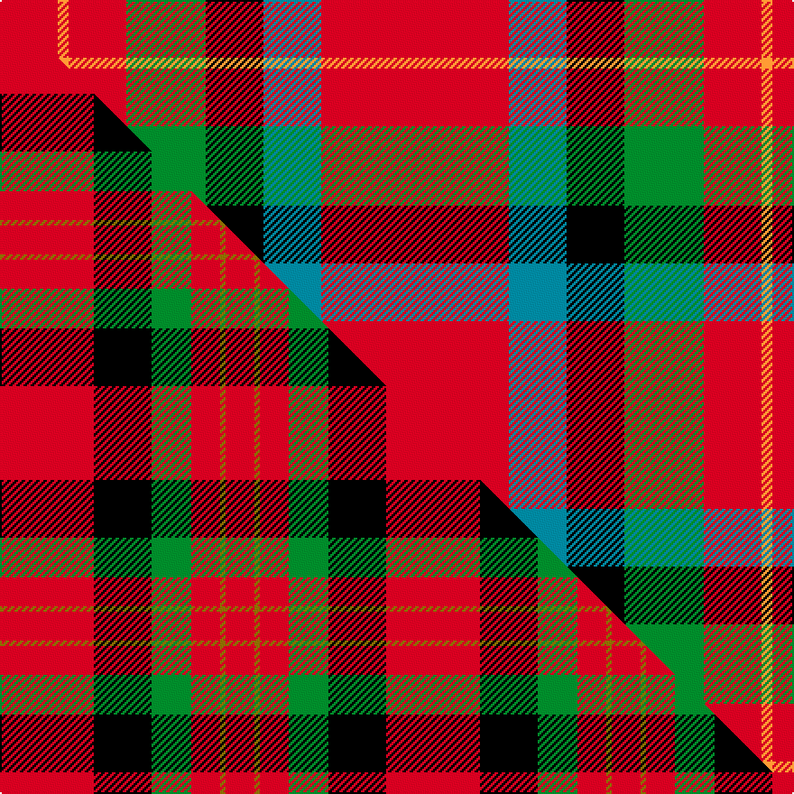

This is one **variant** — a specific cloth: this exact thread count and colourway, with its own
provenance below. It is one weaving of the [sett](/tartans/s/st/sturrock/) (the scale-free proportion — the
same cloth at any scale or shade), whose colour order is pattern [RBKGRYR](/stripes/rbkgryr/).

Part of the [Sturrock](/tartans/s/st/sturrock/) tartan — the named design grouping this sett with its other cloths.

Sourced from register-of-tartans.  It is a [7 stripe tartan](/stripes/stripes7/).

Original link [https://www.tartanregister.gov.uk/tartanDetails.aspx?ref=4033](https://www.tartanregister.gov.uk/tartanDetails.aspx?ref=4033)

2 attestations — the source records this cloth was collapsed from (oldest owns this page)

<ul>
<li>01/01/1947 — Sturrock (Blue/Black) (register-of-tartans, <a href="https://www.tartanregister.gov.uk/tartanDetails.aspx?ref=4033">record</a>)  <em>The thread count of the cloth sample has been divided by two for display. The Register contains two Sturrock counts. In this version blue replaces part of the black stripe, making a small change to the appearance that could easily go unnoticed. It is likely that the second pattern came about by the use of a very dark blue that was later mistaken for black. This collection is in the Scottish Tartans Society archive.</em></li>
<li>pre 1947 — Sturrock, Blue/Black (Clan) (tartans-authority, <a href="https://web.archive.org/web/*/http://www.tartansauthority.com/tartan-ferret/display/1359/*">record</a>)  <em>From M'Gregor Hastie Collection via Tony Murray. Apparently first seen in the Wm Anderson collection in 1947. Count is accurate against STS paper. Samples of 3230 (Dalgliesh weave) in STA Dalgety Collections.</em></li>
</ul>

Dataset <small>— provenance for this record, inherited from the source manifest</small>

<dl class="dataset-prov">
<dt>source</dt><dd><a href="/sources/register-of-tartans/">Scottish Register of Tartans</a></dd>
<dt>data captured from</dt><dd><a href="https://github.com/thetartan/tartan-database/blob/master/data/register-of-tartans/data.csv">https://github.com/thetartan/tartan-database/blob/master/data/register-of-tartans/data.csv</a></dd>
<dt>data date</dt><dd>1947 <small>(this record)</small></dd>
<dt>licence</dt><dd><a href="https://www.tartanregister.gov.uk/copyright">Crown copyright</a></dd>
</dl>

Capture chain <small>— the hands this data passed through, oldest first; each capture carries its own licence</small>

<ol class="capture-chain">
<li><a href="https://www.tartanregister.gov.uk/">Scottish Register of Tartans</a> · <a href="https://www.tartanregister.gov.uk/copyright">Crown copyright</a> <small>the living register — still published by National Records of Scotland</small></li>
<li><a href="https://github.com/thetartan/tartan-database">thetartan/tartan-database</a> <small>2016-2017</small> · <a href="https://creativecommons.org/licenses/by-nc-nd/4.0/">CC BY-NC-ND 4.0</a> <small>Levko Kravets's frozen compilation — the capture we vendored, and where its CC licence text came from</small></li>
<li>this dictionary <small>captured 2026-06-10 · commit 5bf86c7566</small> <small>each re-capture is a git commit to data/sources</small></li>
</ol>

## Register references

External register numbers recorded for this tartan.

- Scottish Register of Tartans: [4033](https://www.tartanregister.gov.uk/tartanDetails.aspx?ref=4033)
- Scottish Tartans Authority (ITI): 1359
- Scottish Tartans World Register: 1359

## Thread count
R/104 T32 K32 G44 R32 LO6 R/32

One full sett is **428 threads**.

The source recorded this cloth as R/32 LO6 R32 G44 K32 T32 R104 T32 K32 G44 R32 LO/6 — 818 threads; it folds to the canonical 428-thread sett above.

## Palette
<table><thead><tr><th>Colour</th><th>Shade</th><th>OKLCh</th></tr></thead><tbody><tr><td>T</td><td><code style="background-color:#00879F;">#00879F</code> <small style="color:#888">#00879F</small></td><td><small style="color:#888">oklch(57.4% 0.102 216.1)</small></td></tr><tr><td>DB</td><td><code style="background-color:#082077;">#082077</code> <small style="color:#888">#082077</small></td><td><small style="color:#888">oklch(30.0% 0.149 265.1)</small></td></tr><tr><td>DR</td><td><code style="background-color:#55120C;">#55120C</code> <small style="color:#888">#55120C</small></td><td><small style="color:#888">oklch(30.0% 0.099 29.3)</small></td></tr><tr><td>LO</td><td><code style="background-color:#FF9C34;">#FF9C34</code> <small style="color:#888">#FF9C34</small></td><td><small style="color:#888">oklch(77.9% 0.161 61.8)</small></td></tr><tr><td>G</td><td><code style="background-color:#008B2A;">#008B2A</code> <small style="color:#888">#008B2A</small></td><td><small style="color:#888">oklch(55.4% 0.170 145.9)</small></td></tr><tr><td>K</td><td><code style="background-color:#000000;">#000000</code> <small style="color:#888">#000000</small></td><td><small style="color:#888">oklch(0.0% 0.000 0.0)</small></td></tr><tr><td>R</td><td><code style="background-color:#D60020;">#D60020</code> <small style="color:#888">#D60020</small></td><td><small style="color:#888">oklch(55.2% 0.224 25.5)</small></td></tr></tbody></table>

# Sample pattern

[Sample sheet (PDF)](swatch.pdf) — the woven sample, thread count and palette on one printable A4, rendered on demand (the same sheet the TTD print page downloads).

## Compared to the master

This cloth is one sett of its design; the master sett (the exemplar the design is anchored on) is below for comparison.

Its **ΔTartan distance** from the master is **0.93** — the same measure the nearest-tartans table ranks by (0 is identical; a re-scale of the same cloth is near 0, a recolour or a different proportion further).

<figure class="master-compare" style="margin:0">

this sett
master sett ★

<figcaption style="color:#888;font-size:smaller">One weave of this sett against the <a href="/setts/r52k32g22r16y3r16/">master sett ★</a>, split on the diagonal: a shared proportion runs seamlessly across it with only the shades shifting; a different proportion breaks on it.</figcaption>
</figure>

## Nearest tartan variants

The nearest existing variants by ΔTartan distance, with this cloth at the top so the swatches line up against it.

ΔTartan

Threads

Variant

Sett

—

818

<a href="/variants/s7/r52t16k16g22r16lo3r16~x2/">Sturrock (Blue/Black)</a>

<a href="/ttd/edit/#slug=db8y1g12r10ly2r6ly2r4~x4&amp;base=r52t16k16g22r16lo3r16~x2" title="compare in the TTD">1.79</a>

312

<a href="/variants/s8/db8y1g12r10ly2r6ly2r4~x4/">Indiana &quot;Cardinal&quot;</a>

<a href="/ttd/edit/#slug=db2r11g2r11g21r2k9lb2db11r11g2r11db2~x2&amp;base=r52t16k16g22r16lo3r16~x2" title="compare in the TTD">2.05</a>

380

<a href="/variants/s13/db2r11g2r11g21r2k9lb2db11r11g2r11db2~x2/">Nicholson Clan Tartan</a>

<a href="/ttd/edit/#slug=k5r7ly23r23dg3r11dg3r23dg18r2k18r5y5&amp;base=r52t16k16g22r16lo3r16~x2" title="compare in the TTD">2.27</a>

282

<a href="/variants/s13/k5r7ly23r23dg3r11dg3r23dg18r2k18r5y5/">Bonnie Prince Charlie (Vyella)</a>

<a href="/ttd/edit/#slug=r30g12k5w2db6r30db12w2k5g12~x2&amp;base=r52t16k16g22r16lo3r16~x2" title="compare in the TTD">2.50</a>

380

<a href="/variants/s10/r30g12k5w2db6r30db12w2k5g12~x2/">Sinclair</a>

<a href="/ttd/edit/#slug=dy3r10g7db10r15k1w2~x2&amp;base=r52t16k16g22r16lo3r16~x2" title="compare in the TTD">2.57</a>

182

<a href="/variants/s7/dy3r10g7db10r15k1w2~x2/">East Kilbride (Original) District Tartan</a>

<a href="/ttd/edit/#slug=y3r10g7db10r15k1w2~x2&amp;base=r52t16k16g22r16lo3r16~x2" title="compare in the TTD">2.57</a>

182

<a href="/variants/s7/y3r10g7db10r15k1w2~x2/">East Kilbride</a>

<a href="/ttd/edit/#slug=w4k1db12k1g8w2r8w2k8r16k4r8w2r1~x2&amp;base=r52t16k16g22r16lo3r16~x2" title="compare in the TTD">2.64</a>

298

<a href="/variants/s14/w4k1db12k1g8w2r8w2k8r16k4r8w2r1~x2/">Kenya</a>

<a href="/ttd/edit/#slug=k2r8g2r8k8t1k4r2g12r8g2~x4&amp;base=r52t16k16g22r16lo3r16~x2" title="compare in the TTD">2.69</a>

440

<a href="/variants/s11/k2r8g2r8k8t1k4r2g12r8g2~x4/">MacNicol Dress (Clan) (Smiths)</a>

<a href="/ttd/edit/#slug=lb2k2r27g27k12lb12r27k2lb2~x2&amp;base=r52t16k16g22r16lo3r16~x2" title="compare in the TTD">2.70</a>

444

<a href="/variants/s9/lb2k2r27g27k12lb12r27k2lb2~x2/">MacNaughton</a>

<a href="/ttd/edit/#slug=k2r8g2r8k8db1k4r2g12r8g2~x2&amp;base=r52t16k16g22r16lo3r16~x2" title="compare in the TTD">2.71</a>

220

<a href="/variants/s11/k2r8g2r8k8db1k4r2g12r8g2~x2/">MacNichol Clan Tartan</a>

## Neighbour map

Every grey dot is one of 13662 variants placed by the first two principal components of the ΔTartan feature space (42% of its variance). Red is this tartan; blue dots are its nearest — click one to open its page. The map is a flat projection of a many-dimensional space — [how to read it](/posts/neighbourhood-maps/).

<svg viewBox="0 0 640 380" role="img" style="max-width:100%;height:auto;border:1px solid #e0e0e0;border-radius:4px;display:block" xmlns="http://www.w3.org/2000/svg"><image href="/nn/cloud.v1.png" width="640" height="380"/><a href="/variants/s8/db8y1g12r10ly2r6ly2r4~x4/"><circle cx="209.7" cy="194.3" r="4" fill="#3465a4"><title>Indiana &quot;Cardinal&quot;</title></circle></a><a href="/variants/s13/db2r11g2r11g21r2k9lb2db11r11g2r11db2~x2/"><circle cx="174.3" cy="147.4" r="4" fill="#3465a4"><title>Nicholson Clan Tartan</title></circle></a><a href="/variants/s13/k5r7ly23r23dg3r11dg3r23dg18r2k18r5y5/"><circle cx="165.9" cy="141.5" r="4" fill="#3465a4"><title>Bonnie Prince Charlie (Vyella)</title></circle></a><a href="/variants/s10/r30g12k5w2db6r30db12w2k5g12~x2/"><circle cx="217.5" cy="135.3" r="4" fill="#3465a4"><title>Sinclair</title></circle></a><a href="/variants/s7/dy3r10g7db10r15k1w2~x2/"><circle cx="208.1" cy="151.7" r="4" fill="#3465a4"><title>East Kilbride (Original) District Tartan</title></circle></a><a href="/variants/s7/y3r10g7db10r15k1w2~x2/"><circle cx="210.7" cy="152.8" r="4" fill="#3465a4"><title>East Kilbride</title></circle></a><a href="/variants/s14/w4k1db12k1g8w2r8w2k8r16k4r8w2r1~x2/"><circle cx="132.8" cy="117.0" r="4" fill="#3465a4"><title>Kenya</title></circle></a><a href="/variants/s11/k2r8g2r8k8t1k4r2g12r8g2~x4/"><circle cx="180.4" cy="166.5" r="4" fill="#3465a4"><title>MacNicol Dress (Clan) (Smiths)</title></circle></a><a href="/variants/s9/lb2k2r27g27k12lb12r27k2lb2~x2/"><circle cx="207.0" cy="153.5" r="4" fill="#3465a4"><title>MacNaughton</title></circle></a><a href="/variants/s11/k2r8g2r8k8db1k4r2g12r8g2~x2/"><circle cx="180.4" cy="166.3" r="4" fill="#3465a4"><title>MacNichol Clan Tartan</title></circle></a><circle cx="174.1" cy="144.2" r="5" fill="#c00000"/><text x="320" y="376" text-anchor="middle" font-size="11" fill="#999">ground</text><text x="11" y="190" text-anchor="middle" font-size="11" fill="#999" transform="rotate(-90 11 190)">complexity</text></svg>

ID: /variants/s7/r52t16k16g22r16lo3r16~x2/
