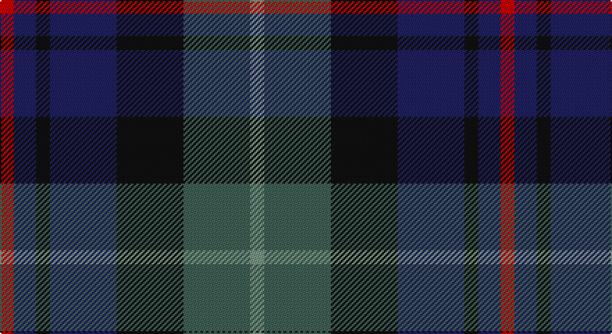

This page is one **sett** — a single exact thread-count. It belongs to the [tartan](/setts/r5db8k5db24k24yi24y5/)
(the same proportion at any scale), whose colour order is pattern [GGKBKBR](/stripes/ggkbkbr/).

Part of the [Heritage](/tartans/heritage/) tartan — the named design grouping this sett with its other cloths.

Sourced from tartans-authority.  It is a [7 stripe tartan](/stripes/stripes7/).

Original link http://www.tartansauthority.com/tartan-ferret/display/6014/

## Also known as

This cloth is also recorded under:

- Heritage #2
- Heritage Plaid

## Register references

External register numbers recorded for this tartan.

- Scottish Tartans Authority (ITI): 6014

## Thread count
R/10 DB16 K10 DB48 K48 N48 LG/10

One full sett is **360 threads**.

## Palette

Palette: <strong>Tartan Register</strong> <small style="color:#888">(4 of 5 colours)</small>
<table><thead><tr><th>Colour</th><th>Threads</th><th>Shade</th><th>Base</th><th>OKLCh</th></tr></thead><tbody><tr><td>R/</td><td style="text-align:right;font-variant-numeric:tabular-nums">10</td><td><code style="background-color:#C80000;">#C80000</code> <small style="color:#888">#C80000</small></td><td>R <code style="background-color:#CC0000;">#CC0000</code></td><td><small style="color:#888">oklch(52.3% 0.215 29.2)</small></td></tr><tr><td>DB</td><td style="text-align:right;font-variant-numeric:tabular-nums">16</td><td><code style="background-color:#202060;">#202060</code> <small style="color:#888">#202060</small></td><td>B <code style="background-color:#2A418A;">#2A418A</code></td><td><small style="color:#888">oklch(28.9% 0.111 276.9)</small></td></tr><tr><td>K</td><td style="text-align:right;font-variant-numeric:tabular-nums">10</td><td><code style="background-color:#101010;">#101010</code> <small style="color:#888">#101010</small></td><td>K <code style="background-color:#000000;">#000000</code></td><td><small style="color:#888">oklch(17.3% 0.000 89.9)</small></td></tr><tr><td>DB</td><td style="text-align:right;font-variant-numeric:tabular-nums">48</td><td><code style="background-color:#202060;">#202060</code> <small style="color:#888">#202060</small></td><td>B <code style="background-color:#2A418A;">#2A418A</code></td><td><small style="color:#888">oklch(28.9% 0.111 276.9)</small></td></tr><tr><td>K</td><td style="text-align:right;font-variant-numeric:tabular-nums">48</td><td><code style="background-color:#101010;">#101010</code> <small style="color:#888">#101010</small></td><td>K <code style="background-color:#000000;">#000000</code></td><td><small style="color:#888">oklch(17.3% 0.000 89.9)</small></td></tr><tr><td>N</td><td style="text-align:right;font-variant-numeric:tabular-nums">48</td><td><code style="background-color:#406054;">#406054</code> <small style="color:#888">#406054</small></td><td>G <code style="background-color:#006100;">#006100</code></td><td><small style="color:#888">oklch(46.0% 0.042 169.0)</small></td></tr><tr><td>LG/</td><td style="text-align:right;font-variant-numeric:tabular-nums">10</td><td><code style="background-color:#789484;">#789484</code> <small style="color:#888">#789484</small></td><td>G <code style="background-color:#006100;">#006100</code></td><td><small style="color:#888">oklch(64.0% 0.040 160.0)</small></td></tr></tbody></table>

# Sample pattern

## Compared to the master

This cloth is one sett of its design; the master sett (the exemplar the design is anchored on) is below for comparison.

<figure style="margin:0"><figcaption style="color:#888;font-size:smaller">this sett</figcaption></figure>
<figure style="margin:0"><figcaption style="color:#888;font-size:smaller"><a href="/setts/dg20w2dg9w2ly5w7dg10/">master sett →</a></figcaption></figure>

## Nearest tartans

The nearest existing variants by ΔTartan distance, with this tartan at the top so the swatches line up against it.

ΔTartan

Tartan

Sett

—

<a href="/ttd/edit/#slug=r5db8k5db24k24yi24y5~x2">Heritage (Corporate)</a> <a class="nn-out" href="/variants/s7/r5db8k5db24k24yi24y5~x2/" title="open its dictionary page">↗</a>

0.92

<a href="/ttd/edit/#slug=db10r7db31k25dg23k8db7r8ly5~x2&amp;base=r5db8k5db24k24yi24y5~x2">MacAllum of Berwick (Clan?)</a> <a class="nn-out" href="/variants/s9/db10r7db31k25dg23k8db7r8ly5~x2/" title="open its dictionary page">↗</a>

0.99

<a href="/ttd/edit/#slug=dp2dg6k2db6k1r2~x4&amp;base=r5db8k5db24k24yi24y5~x2">MacCaughan or MacEachain (Personal)</a> <a class="nn-out" href="/variants/s6/dp2dg6k2db6k1r2~x4/" title="open its dictionary page">↗</a>

1.04

<a href="/ttd/edit/#slug=db4k2db10k10g10k2r3~x2&amp;base=r5db8k5db24k24yi24y5~x2">MacKinlay (Clan)</a> <a class="nn-out" href="/variants/s7/db4k2db10k10g10k2r3~x2/" title="open its dictionary page">↗</a>

1.06

<a href="/ttd/edit/#slug=lb4dg17k10dt3k3dt17r3dt3~x2&amp;base=r5db8k5db24k24yi24y5~x2">Royal Highland</a> <a class="nn-out" href="/variants/s8/lb4dg17k10dt3k3dt17r3dt3~x2/" title="open its dictionary page">↗</a>

1.08

<a href="/ttd/edit/#slug=k2dg10y2k9dp8dg2~x2&amp;base=r5db8k5db24k24yi24y5~x2">Lennie</a> <a class="nn-out" href="/variants/s6/k2dg10y2k9dp8dg2~x2/" title="open its dictionary page">↗</a>

1.11

<a href="/ttd/edit/#slug=r4dg16k16db4dg3db12lo2~x2&amp;base=r5db8k5db24k24yi24y5~x2">Junior Chamber International (Corp)</a> <a class="nn-out" href="/variants/s7/r4dg16k16db4dg3db12lo2~x2/" title="open its dictionary page">↗</a>

1.11

<a href="/ttd/edit/#slug=r2k1db6k2g6m2~x4&amp;base=r5db8k5db24k24yi24y5~x2">MacEachain (Clan)</a> <a class="nn-out" href="/variants/s6/r2k1db6k2g6m2~x4/" title="open its dictionary page">↗</a>

1.12

<a href="/ttd/edit/#slug=db1r1db6k6dg6w1~x2&amp;base=r5db8k5db24k24yi24y5~x2">Wellington</a> <a class="nn-out" href="/variants/s6/db1r1db6k6dg6w1~x2/" title="open its dictionary page">↗</a>

1.13

<a href="/ttd/edit/#slug=dg12k14db11r3db3r3db11k14dg12y3~x2&amp;base=r5db8k5db24k24yi24y5~x2">Wilson's No.112 (Blue)</a> <a class="nn-out" href="/variants/s10/dg12k14db11r3db3r3db11k14dg12y3~x2/" title="open its dictionary page">↗</a>

1.14

<a href="/ttd/edit/#slug=k6t2db12g8r5k2g3~x4&amp;base=r5db8k5db24k24yi24y5~x2">Cooke (Personal)</a> <a class="nn-out" href="/variants/s7/k6t2db12g8r5k2g3~x4/" title="open its dictionary page">↗</a>

## Neighbour map

Every grey dot is one of 14360 variants placed by the first two principal components of the ΔTartan feature space (44% of its variance). Red is this tartan; blue dots are its nearest — click one to open its page.

<svg viewBox="0 0 640 380" role="img" style="max-width:100%;height:auto;border:1px solid #e0e0e0;border-radius:4px;display:block" xmlns="http://www.w3.org/2000/svg"><image href="/nn/cloud.v1.png" width="640" height="380"/><a href="/variants/s9/db10r7db31k25dg23k8db7r8ly5~x2/"><circle cx="165.1" cy="231.2" r="4" fill="#3465a4"><title>MacAllum of Berwick (Clan?)</title></circle></a><a href="/variants/s6/dp2dg6k2db6k1r2~x4/"><circle cx="165.7" cy="265.0" r="4" fill="#3465a4"><title>MacCaughan or MacEachain (Personal)</title></circle></a><a href="/variants/s7/db4k2db10k10g10k2r3~x2/"><circle cx="172.0" cy="276.2" r="4" fill="#3465a4"><title>MacKinlay (Clan)</title></circle></a><a href="/variants/s8/lb4dg17k10dt3k3dt17r3dt3~x2/"><circle cx="189.0" cy="241.6" r="4" fill="#3465a4"><title>Royal Highland</title></circle></a><a href="/variants/s6/k2dg10y2k9dp8dg2~x2/"><circle cx="201.0" cy="282.3" r="4" fill="#3465a4"><title>Lennie</title></circle></a><a href="/variants/s7/r4dg16k16db4dg3db12lo2~x2/"><circle cx="161.7" cy="228.1" r="4" fill="#3465a4"><title>Junior Chamber International (Corp)</title></circle></a><a href="/variants/s6/r2k1db6k2g6m2~x4/"><circle cx="118.6" cy="242.0" r="4" fill="#3465a4"><title>MacEachain (Clan)</title></circle></a><a href="/variants/s6/db1r1db6k6dg6w1~x2/"><circle cx="142.2" cy="237.6" r="4" fill="#3465a4"><title>Wellington</title></circle></a><a href="/variants/s10/dg12k14db11r3db3r3db11k14dg12y3~x2/"><circle cx="124.2" cy="254.7" r="4" fill="#3465a4"><title>Wilson's No.112 (Blue)</title></circle></a><a href="/variants/s7/k6t2db12g8r5k2g3~x4/"><circle cx="114.2" cy="236.5" r="4" fill="#3465a4"><title>Cooke (Personal)</title></circle></a><circle cx="154.6" cy="256.1" r="5" fill="#c00000"/></svg>

ID: /variants/s7/r5db8k5db24k24yi24y5~x2/
